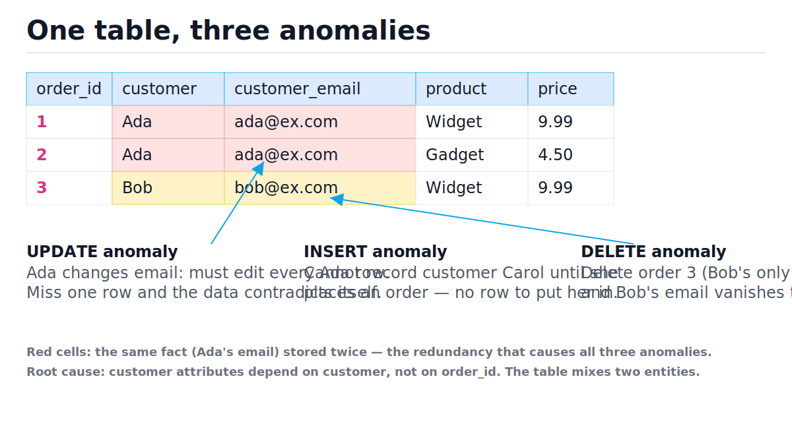
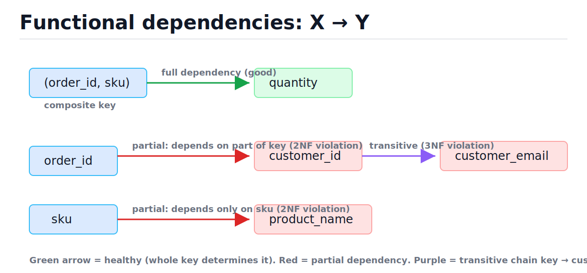
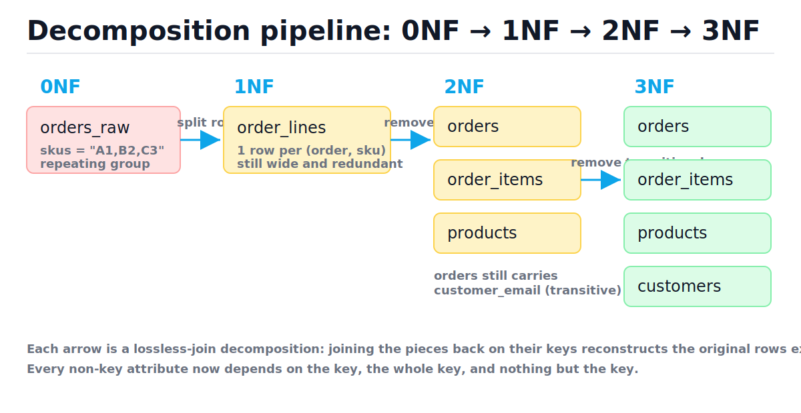

# Normalization

[toc]

> **TL;DR:** Normalization removes redundancy by decomposing tables so every fact is stored exactly once, killing update, insert, and delete anomalies. The tool is the functional dependency; the ladder is 1NF → 2NF → 3NF → BCNF; the practical resting point for OLTP is 3NF. Denormalize later, deliberately, with measurements — never by accident.

## Vocabulary

**Functional dependency (FD)**

```math
X \rightarrow Y
```

Read "X determines Y": for any two rows that agree on attribute set X, they must also agree on Y. Example: `customer_id → customer_email`. FDs are facts about the business domain, not about the data you happen to have today.

**Candidate key**

```math
K \rightarrow R \quad \text{and no proper subset } K' \subset K \text{ satisfies } K' \rightarrow R
```

A minimal attribute set that determines every attribute of relation R. A table can have several candidate keys; one is chosen as the primary key.

**Partial dependency**

```math
\{A, B\} \text{ is the key}, \quad A \rightarrow C
```

A non-key attribute depends on only part of a composite key. The 2NF violation.

**Transitive dependency**

```math
K \rightarrow X \rightarrow Y \quad (X \text{ not a key})
```

A non-key attribute depends on the key only through another non-key attribute. The 3NF violation.

**Determinant**

```math
X \text{ in } X \rightarrow Y
```

The left-hand side of a non-trivial FD. BCNF demands every determinant be a candidate key.

**Lossless-join decomposition**

```math
R = R_1 \bowtie R_2
```

A split of table R into R₁ and R₂ such that the natural join of the pieces returns exactly the original rows — no rows lost, no spurious rows invented. Guaranteed when the shared columns form a key of at least one piece.

**Update / insert / delete anomaly** — the three failure modes of redundant storage: a fact stored N times can be updated inconsistently, cannot be inserted without an unrelated fact, and disappears when the last row carrying it is deleted.

## Intuition

Think of a table as a statement of facts. A normalized table states each fact once; a denormalized table repeats facts across rows. Repetition is not just wasted space — it is an invitation for the copies to disagree. Normalization is the discipline of asking, for each column, "what does this value actually depend on?" and moving it to a table whose key is exactly that thing.

Look at the figure: Ada's email appears in every row of her orders. Updating it requires touching every copy; a new customer cannot exist without an order; deleting Bob's only order deletes Bob.



> [!IMPORTANT]
> The slogan compresses the whole ladder: every non-key attribute must depend on **the key (1NF/2NF context), the whole key (2NF), and nothing but the key (3NF)** — "so help me Codd."

## How it works

The procedure is mechanical: list the FDs, find the candidate keys, then check each normal form's condition and decompose when it fails. We walk one messy spreadsheet-style table down the whole ladder, with runnable SQLite DDL at every rung. The FD diagram below is the map we follow.



### The starting point: a spreadsheet pretending to be a table

Someone exported orders from a spreadsheet. One row per order, products as a comma-separated list, customer data and product names copy-pasted into every row. This is "0NF" — not even first normal form.

```sql
CREATE TABLE orders_raw (
    order_id        INTEGER,
    customer_id     INTEGER,
    customer_email  TEXT,
    skus            TEXT,   -- 'A1,B2'  <- the comma-separated-list sin
    product_names   TEXT,   -- 'Widget,Gadget'
    quantities      TEXT    -- '2,1'
);
```

The FDs we know from the business:

```math
\begin{aligned}
\text{order\_id} &\rightarrow \text{customer\_id} \\
\text{customer\_id} &\rightarrow \text{customer\_email} \\
\text{sku} &\rightarrow \text{product\_name} \\
(\text{order\_id}, \text{sku}) &\rightarrow \text{quantity}
\end{aligned}
```

### 1NF — atomic values, no repeating groups

1NF requires every cell to hold one atomic value and every row to be uniquely identifiable. The comma-separated `skus` column violates it: you cannot index it, join on it, or constrain it; `WHERE skus LIKE '%A1%'` is an O(n) full scan that also matches sku `A11`. The fix: one row per (order, sku) pair.

```sql
CREATE TABLE order_lines (        -- 1NF
    order_id        INTEGER NOT NULL,
    sku             TEXT    NOT NULL,
    customer_id     INTEGER NOT NULL,
    customer_email  TEXT    NOT NULL,
    product_name    TEXT    NOT NULL,
    quantity        INTEGER NOT NULL,
    PRIMARY KEY (order_id, sku)
);
```

> [!WARNING]
> Storing a list in one column (CSV string, or JSON array used relationally) compiles and runs but silently forfeits indexes, foreign keys, and type checking. It is the most common 1NF violation in production schemas.

### 2NF — no partial dependency on part of a composite key

The key is `(order_id, sku)`, but `customer_id` and `customer_email` depend on `order_id` alone, and `product_name` depends on `sku` alone. Those facts are duplicated once per order line — the redundancy the figure marks in red. The fix: pull each partially dependent attribute into a table keyed by exactly the part it depends on.

```sql
CREATE TABLE orders_2nf (         -- key: order_id
    order_id        INTEGER PRIMARY KEY,
    customer_id     INTEGER NOT NULL,
    customer_email  TEXT    NOT NULL      -- still smells: transitive
);

CREATE TABLE products (           -- key: sku
    sku             TEXT PRIMARY KEY,
    product_name    TEXT NOT NULL
);

CREATE TABLE order_items (        -- key: (order_id, sku)
    order_id  INTEGER NOT NULL REFERENCES orders_2nf(order_id),
    sku       TEXT    NOT NULL REFERENCES products(sku),
    quantity  INTEGER NOT NULL,
    PRIMARY KEY (order_id, sku)
);
```

### 3NF — no transitive dependencies

In `orders_2nf`, `customer_email` depends on `order_id` only through `customer_id`: a key → non-key → non-key chain. Every customer's email is still copied into each of their orders. The fix: a `customers` table; orders keep only the foreign key.

```sql
CREATE TABLE customers (
    customer_id     INTEGER PRIMARY KEY,
    customer_email  TEXT NOT NULL UNIQUE
);

CREATE TABLE orders (
    order_id     INTEGER PRIMARY KEY,
    customer_id  INTEGER NOT NULL REFERENCES customers(customer_id)
);
```

The full pipeline, end to end:



A trace of the whole walk:

| Step | Table(s) | Violation found | Decision |
| :--- | :--- | :--- | :--- |
| 0 | orders_raw | CSV list in `skus` | Split into one row per (order, sku) → 1NF |
| 1 | order_lines | `customer_*` depends on `order_id` only; `product_name` on `sku` only | Extract orders and products tables → 2NF |
| 2 | orders_2nf | `customer_email` transitively via `customer_id` | Extract customers table → 3NF |
| 3 | orders, order_items, products, customers | Every determinant is a key | Stop — 3NF and BCNF; ship it |

### BCNF — every determinant is a candidate key

3NF still permits one subtle redundancy: an FD whose left side is a non-key attribute, as long as its right side is part of *some* candidate key. The classic case: students enroll in courses; each course has several instructors; each instructor teaches exactly one course. FDs: `(student, course) → instructor` and `instructor → course`. The table `(student, course, instructor)` is in 3NF (course is part of a candidate key), but `instructor` is a determinant and not a candidate key — so the instructor's course assignment repeats per student, and BCNF fails.

```sql
-- BCNF fix: split on the offending FD instructor -> course
CREATE TABLE instructor_course (
    instructor TEXT PRIMARY KEY,
    course     TEXT NOT NULL
);
CREATE TABLE student_instructor (
    student    TEXT NOT NULL,
    instructor TEXT NOT NULL REFERENCES instructor_course(instructor),
    PRIMARY KEY (student, instructor)
);
```

> [!NOTE]
> The BCNF decomposition above is lossless but *not dependency-preserving*: the FD (student, course) → instructor can no longer be enforced by a key constraint in either table alone. This trade-off is exactly why 3NF — which is always achievable losslessly *and* dependency-preservingly — is the standard target.

### Verifying the decomposition is lossless

A decomposition is safe only if joining the pieces reconstructs the original exactly. We can check this mechanically: load the 0NF data, decompose it, join back, compare. This runnable script (Python stdlib `sqlite3`, no installs) is the proof.

```python
import sqlite3

con = sqlite3.connect(":memory:")
cur = con.cursor()
cur.executescript("""
CREATE TABLE customers (customer_id INTEGER PRIMARY KEY, email TEXT NOT NULL);
CREATE TABLE products  (sku TEXT PRIMARY KEY, name TEXT NOT NULL);
CREATE TABLE orders    (order_id INTEGER PRIMARY KEY,
                        customer_id INTEGER NOT NULL REFERENCES customers);
CREATE TABLE order_items (order_id INTEGER NOT NULL REFERENCES orders,
                          sku TEXT NOT NULL REFERENCES products,
                          quantity INTEGER NOT NULL,
                          PRIMARY KEY (order_id, sku));
INSERT INTO customers VALUES (10, 'ada@ex.com'), (11, 'bob@ex.com');
INSERT INTO products  VALUES ('A1', 'Widget'), ('B2', 'Gadget');
INSERT INTO orders    VALUES (1, 10), (2, 10), (3, 11);
INSERT INTO order_items VALUES (1,'A1',2), (1,'B2',1), (2,'B2',5), (3,'A1',1);
""")

# Join the 3NF pieces back into the original wide rows.
wide = cur.execute("""
    SELECT o.order_id, c.customer_id, c.email, oi.sku, p.name, oi.quantity
    FROM orders o
    JOIN customers c   ON c.customer_id = o.customer_id
    JOIN order_items oi ON oi.order_id = o.order_id
    JOIN products p    ON p.sku = oi.sku
    ORDER BY o.order_id, oi.sku
""").fetchall()
assert len(wide) == 4                                   # no spurious rows
assert wide[0] == (1, 10, 'ada@ex.com', 'A1', 'Widget', 2)

# Update anomaly is gone: one UPDATE fixes every order's view of Ada.
cur.execute("UPDATE customers SET email='ada@new.com' WHERE customer_id=10")
emails = {r[2] for r in cur.execute("""
    SELECT o.order_id, o.customer_id, c.email FROM orders o
    JOIN customers c ON c.customer_id = o.customer_id
    WHERE o.customer_id = 10""")}
assert emails == {'ada@new.com'}                        # consistent everywhere

# Insert anomaly gone: a customer can exist with zero orders.
cur.execute("INSERT INTO customers VALUES (12, 'carol@ex.com')")
assert cur.execute("SELECT COUNT(*) FROM customers").fetchone()[0] == 3

# Delete anomaly gone: dropping Bob's only order keeps Bob.
cur.execute("DELETE FROM order_items WHERE order_id=3")
cur.execute("DELETE FROM orders WHERE order_id=3")
assert cur.execute(
    "SELECT email FROM customers WHERE customer_id=11").fetchone() == ('bob@ex.com',)
print("all anomalies eliminated")
```

## Complexity

Normalization trades read-side join work for write-side simplicity and storage minimality. The costs below assume B-tree indexes on all keys; n is total rows, k is rows returned, t is tables joined.

| Operation | Best | Average | Worst | Space |
| :--- | :---: | :---: | :---: | :---: |
| Point update of a fact (3NF) | O(log n) | O(log n) | O(log n) | O(1) |
| Point update of a fact (denormalized, fact copied r times) | O(log n) | O(r log n) | O(n) full scan | O(1) |
| Read one order with details (3NF, t indexed joins) | O(t log n) | O(t log n + k) | O(t log n + k) | O(k) |
| Read one order (denormalized, single table) | O(log n) | O(log n + k) | O(log n + k) | O(k) |
| `LIKE '%A1%'` on a CSV column (1NF violation) | O(n) | O(n) | O(n) | O(1) |
| Lossless-join check (join pieces, compare) | O(n log n) | O(n log n) | O(n²) without indexes | O(n) |

The key bound is the write amplification a denormalized schema imposes. If a fact (one customer's email) is copied into r order rows, updating it costs:

```math
T_{\text{denorm}}(r) = r \cdot O(\log n) \quad \text{vs.} \quad T_{\text{3NF}} = O(\log n)
```

The factor r is unbounded — it grows with the customer's order count — so a denormalized update is O(r log n) and, when no index covers the copies, degrades to an O(n) scan. Normalization makes r = 1 by construction: that is the whole theorem in one line. The read-side price is the reverse: 3NF pays t − 1 extra index probes per row, each O(log n) — see [indexes and query performance](./05-indexes-and-query-performance.md) for why those probes are usually cheap.

## In production

On disk, the trade is about pages, not rows. A normalized `customers` row lives on one page and is updated in place; a denormalized email copied into 10,000 order rows dirties thousands of pages, bloats the WAL, and (in PostgreSQL) creates dead tuples that vacuum must reclaim. Narrow normalized tables also pack more rows per 8 KB page, so the buffer cache holds more of the hot set.

- **OLTP defaults to 3NF.** Transaction systems are write-heavy and correctness-critical; 3NF makes every business fact a single-row update inside one transaction. See [transactions, ACID, and isolation levels](./06-transactions-acid-and-isolation-levels.md).
- **Joins are cheaper than people fear.** A 3-table join on indexed keys is a handful of B-tree probes against cached pages. Measure before denormalizing; the optimizer's join plans are covered in [relational database internals](./07-relational-database-internals.md).
- **Analytics inverts the trade.** Star schemas deliberately denormalize dimensions because OLAP is read-dominated and scans columns — the counterpoint lives in [OLAP and dimensional modeling](./10-olap-and-dimensional-modeling.md).

### Denormalization as a deliberate act

When profiling shows reads dominate and a hot join genuinely hurts, denormalize — but treat each copy as a cache with an explicit consistency mechanism. There are three ways to pay the consistency price, in rough order of preference.

```sql
-- 1. Rebuild job / materialized summary: recompute periodically.
--    (PostgreSQL: CREATE MATERIALIZED VIEW ... + REFRESH; emulated here as a table.)
CREATE TABLE customer_order_counts AS
SELECT customer_id, COUNT(*) AS order_count
FROM orders GROUP BY customer_id;

-- 2. Trigger: the database keeps the copy in sync synchronously.
CREATE TRIGGER bump_count AFTER INSERT ON orders
BEGIN
    UPDATE customer_order_counts
    SET order_count = order_count + 1
    WHERE customer_id = NEW.customer_id;
END;
```

The third option is application discipline: every code path that writes the source also writes the copy, ideally in one transaction. It is the cheapest to build and the first to drift — one forgotten code path and the copy silently rots.

> [!TIP]
> The production idiom: normalize the system of record to 3NF, then add denormalized read models *derived* from it (materialized views, summary tables, caches, search indexes). Derived data can always be rebuilt from the normalized truth; the reverse is not true. [Caching strategies](../System-Design/05-caching-strategies.md) is the same pattern one layer up.

> [!CAUTION]
> Denormalizing the system of record itself — rather than deriving read models from it — means an application bug can corrupt the *only* copy of the truth with no way to rebuild. That is a data-loss-class decision; require measurements and a rebuild story before approving it.

## Real-world example

An e-commerce dashboard shows each customer's lifetime order count. The naive query does a `COUNT(*)` join per page load; at scale the team denormalizes into a trigger-maintained summary table. This script builds the 3NF schema, adds the summary, and proves the trigger keeps it consistent.

```python
import sqlite3
from typing import Optional

def order_count(cur: sqlite3.Cursor, customer_id: int) -> Optional[int]:
    row = cur.execute(
        "SELECT order_count FROM customer_order_counts WHERE customer_id=?",
        (customer_id,)).fetchone()
    return None if row is None else row[0]

con = sqlite3.connect(":memory:")
cur = con.cursor()
cur.executescript("""
CREATE TABLE customers (customer_id INTEGER PRIMARY KEY, email TEXT NOT NULL);
CREATE TABLE orders (order_id INTEGER PRIMARY KEY,
                     customer_id INTEGER NOT NULL REFERENCES customers);
INSERT INTO customers VALUES (10,'ada@ex.com'), (11,'bob@ex.com');
INSERT INTO orders VALUES (1,10),(2,10),(3,11);

-- Deliberate denormalization: a derived summary, rebuildable from orders.
CREATE TABLE customer_order_counts AS
SELECT customer_id, COUNT(*) AS order_count FROM orders GROUP BY customer_id;

-- Pay the consistency price with a trigger.
CREATE TRIGGER bump AFTER INSERT ON orders
BEGIN
    UPDATE customer_order_counts SET order_count = order_count + 1
    WHERE customer_id = NEW.customer_id;
END;
""")

assert order_count(cur, 10) == 2 and order_count(cur, 11) == 1
cur.execute("INSERT INTO orders VALUES (4, 10)")        # new order for Ada
assert order_count(cur, 10) == 3                        # trigger kept it true

# The rebuild story: the summary is derived, so it can always be recomputed.
rebuilt = dict(cur.execute(
    "SELECT customer_id, COUNT(*) FROM orders GROUP BY customer_id"))
live = dict(cur.execute("SELECT customer_id, order_count FROM customer_order_counts"))
assert rebuilt == live == {10: 3, 11: 1}
print("summary consistent with source of truth")
```

> [!NOTE]
> `CREATE TABLE ... AS SELECT` and the trigger syntax above are SQLite. PostgreSQL would use `CREATE MATERIALIZED VIEW` with `REFRESH MATERIALIZED VIEW CONCURRENTLY`, or a `plpgsql` trigger function — same design, different spelling.

## When to use / When NOT to use

Normalize to 3NF when:

- The schema is a **system of record** for an OLTP workload — orders, accounts, inventory.
- Writes are frequent and correctness matters more than read latency.
- You are designing fresh — 3NF is the cheapest starting point to change later.
- Multiple applications write the same data; constraints must live in the schema.

Stop at lower forms or denormalize when:

- **Analytics / OLAP** — star schemas and wide fact tables win; see [OLAP and dimensional modeling](./10-olap-and-dimensional-modeling.md).
- A **measured** hot read path joins too many tables — add a derived read model, keep the normalized truth.
- Data is **immutable history** (event logs, snapshots): no updates means no update anomalies, so duplication is cheap.
- Going to BCNF would break dependency preservation (the student–course–instructor case) — stay at 3NF.

## Common mistakes

- **"Normalization means more normal forms is always better"** — past 3NF, BCNF can sacrifice dependency preservation, and 4NF/5NF matter only for rare multi-valued cases. 3NF is the engineering default, not a compromise.
- **"A JSON array column is fine, it's not a CSV string"** — relationally it is the same 1NF sin: no foreign keys, no per-element constraints, and element lookups need scans or special indexes.
- **"Joins are slow, so denormalize up front"** — indexed OLTP joins cost O(log n) probes per table on cached pages. Premature denormalization buys unmeasured speed with guaranteed anomalies.
- **"My table has a single-column primary key, so 2NF can't be violated"** — true by definition, but 3NF still can be: transitive dependencies (`order → customer_id → email`) are the common smell in single-key tables.
- **"The decomposition kept all the columns, so it's safe"** — keeping columns is not enough; splitting on a non-key shared column produces spurious rows on re-join. Losslessness requires the shared columns to be a key of one piece.
- **"Application code keeps the copies in sync, we don't need triggers"** — every new code path is a new chance to drift. If you accept application discipline, schedule a reconciliation/rebuild job that detects drift.

## Interview questions and answers

1. **What problems does normalization solve, concretely?**
   **Answer:** Redundancy and its three anomalies. If a customer's email is copied into every order row, an update must touch every copy or the data contradicts itself; you can't insert a customer with no orders; deleting a customer's last order deletes the customer. Normalizing stores each fact once, so each anomaly becomes structurally impossible.

2. **Define a functional dependency and explain its role.**
   **Answer:** X → Y means any two rows agreeing on X must agree on Y — it's a business rule, like customer_id determining email. FDs are the formal input to normalization: candidate keys are derived from them, and each normal form is defined as "no FDs of a certain bad shape exist."

3. **Walk me through 1NF, 2NF, and 3NF with one example each.**
   **Answer:** 1NF: atomic cells — a `skus = 'A1,B2'` column violates it; fix with one row per (order, sku). 2NF: no non-key attribute depending on part of a composite key — `product_name` depending only on `sku` in an (order_id, sku)-keyed table; fix with a products table. 3NF: no transitive dependencies — `email` depending on the key via `customer_id`; fix with a customers table.

4. **When is a table in 3NF but not BCNF?**
   **Answer:** When a determinant isn't a candidate key but its dependent is part of one. Classic case: (student, course, instructor) with instructor → course and instructor teaching one course. Course is part of a candidate key so 3NF passes, but instructor isn't a candidate key so BCNF fails, and the instructor-course fact repeats per student.

5. **Why don't we always decompose to BCNF then?**
   **Answer:** Because BCNF decomposition can lose dependency preservation — after splitting the student example, no single table can enforce (student, course) → instructor with a key constraint. 3NF is always achievable both losslessly and dependency-preservingly, which is why it's the standard target.

6. **What makes a decomposition lossless, and what goes wrong otherwise?**
   **Answer:** Joining the pieces must return exactly the original rows; that's guaranteed when the shared columns form a key of at least one piece. Split on a non-key column and the join manufactures spurious rows — combinations that were never facts — which is worse than redundancy because it's silently wrong data.

7. **Your reads are slow because of joins. Do you denormalize?**
   **Answer:** First I measure — usually the fix is an index or a better query, since an indexed join is a few O(log n) probes. If the join genuinely dominates, I keep the normalized system of record and add a derived read model: a materialized view or trigger-maintained summary, with a rebuild job as the safety net. I don't denormalize the source of truth itself.

8. **How do you pay the consistency price of a denormalized copy?**
   **Answer:** Three ways, strongest first: database triggers or materialized views, so sync is transactional and automatic; application discipline with every write path updating both, ideally in one transaction; and periodic rebuild jobs that recompute the copy from the normalized truth. In practice you combine the first or second with the third, because drift detection is what saves you when a code path is missed.

9. **Why is 3NF the default for OLTP but not for analytics?**
   **Answer:** OLTP is write-heavy: 3NF makes each business fact a one-row update, and write amplification is the killer there. Analytics is read-dominated over append-mostly data — no updates means no update anomalies — so star schemas denormalize dimensions to avoid joins across billions of rows. Same theory, opposite workload, opposite answer.

## Practice path

1. Take the `orders_raw` DDL above, load three orders with CSV `skus`, and write the `LIKE` query that demonstrates the false-match bug (sku `A1` vs `A11`).
2. Decompose it to 1NF, then 2NF, then 3NF in a SQLite session, re-running the lossless-join check script after each step.
3. Write down the FDs for a schema you own at work; find one partial or transitive dependency and sketch the fix.
4. Build the student–course–instructor table, populate it, and show the row that repeats; perform the BCNF split and identify which FD became unenforceable.
5. Add the trigger-maintained summary from the real-world example, then deliberately break it with a raw `UPDATE`, and write the reconciliation query that detects the drift.
6. Read one star-schema design and articulate, in two sentences, why each of its denormalizations is safe for that workload.

## Copyable takeaways

- Redundancy causes the anomaly trio: inconsistent updates, blocked inserts, destructive deletes.
- An FD X → Y is a business rule; normalization is decomposing until every non-key attribute depends on the key, the whole key, and nothing but the key.
- 1NF: atomic values. 2NF: no partial dependencies on a composite key. 3NF: no transitive dependencies. BCNF: every determinant is a candidate key.
- 3NF is the OLTP resting point — always lossless *and* dependency-preserving; BCNF sometimes isn't.
- Decompositions must be lossless: shared columns must be a key of one piece, or joins invent spurious rows.
- Write amplification of a fact copied r times is O(r log n) vs O(log n) normalized — that factor is the whole argument.
- Denormalize derived read models, never the system of record; pay the consistency price with triggers, transactional discipline, or rebuild jobs — and always keep a rebuild story.

## Sources

- E. F. Codd, "A Relational Model of Data for Large Shared Data Banks," CACM 13(6), 1970 — and "Further Normalization of the Data Base Relational Model," 1971 (1NF–3NF).
- R. F. Boyce and E. F. Codd, BCNF: Codd, "Recent Investigations into Relational Data Base Systems," IFIP 1974.
- M. Kleppmann, *Designing Data-Intensive Applications*, ch. 2 (relational model) and ch. 3 (derived data trade-offs).
- SQLite documentation — language reference for triggers and DDL: https://sqlite.org/lang.html
- PostgreSQL documentation — materialized views: https://www.postgresql.org/docs/current/rules-materializedviews.html

## Related

- [The relational model](./01-the-relational-model.md)
- [ER modeling and schema design](./03-er-modeling-and-schema-design.md)
- [Indexes and query performance](./05-indexes-and-query-performance.md)
- [Transactions, ACID, and isolation levels](./06-transactions-acid-and-isolation-levels.md)
- [OLAP and dimensional modeling](./10-olap-and-dimensional-modeling.md)
- [Caching strategies](../System-Design/05-caching-strategies.md)
