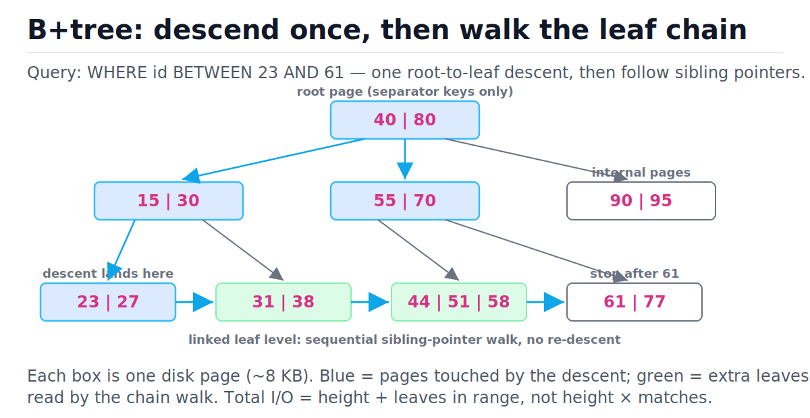
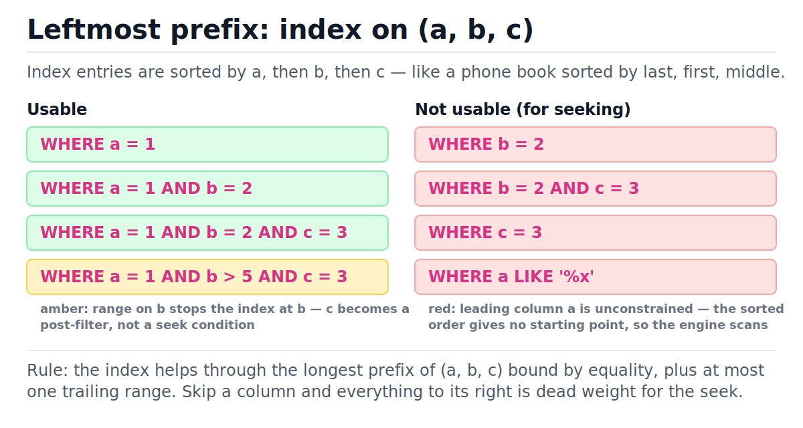

# Indexes and Query Performance

[toc]

> **TL;DR:** A database index is a B+tree whose nodes are disk pages, so finding one row in a billion costs 3–4 page reads instead of a full scan. You exploit it by matching your WHERE clauses to the index's sorted order (the leftmost-prefix rule), keeping queries sargable, and remembering that every index taxes every write.

## Vocabulary

**B+tree**

```math
h \approx \lceil \log_f N \rceil
```

A balanced tree where internal nodes hold only separator keys and all values live in leaf pages linked left-to-right. Fanout f is the number of children per node; height h stays tiny because f is in the hundreds.

**Page**

```math
\text{page} = 8\,\text{KB (PostgreSQL)}, \; 4\,\text{KB default (SQLite)}, \; 16\,\text{KB (InnoDB)}
```

The fixed-size unit of disk I/O. One B+tree node is sized to fill exactly one page, so each tree level costs exactly one read.

**Clustered index**

```math
\text{table order} = \text{index order}
```

An index whose leaves *are* the table rows, stored in key order. One per table (InnoDB's primary key; SQLite's rowid tree). Range scans on the cluster key are sequential disk reads.

**Secondary index**

```math
\text{key} \rightarrow \text{PK or rowid} \rightarrow \text{row}
```

A separate B+tree whose leaves hold the indexed column plus a pointer (primary key or rowid) back to the row. Reading via it costs a double lookup: one descent in the index, one in the table.

**Composite index**

```math
\text{sort order: } (a, b, c) \;\Rightarrow\; a \text{ first, then } b, \text{ then } c
```

One index over several columns, sorted lexicographically. Usable only through a leftmost prefix of its columns.

**Covering index**

```math
\text{index-only scan: } 0 \text{ table page reads}
```

An index containing every column the query touches, so the engine answers from index leaves alone and skips the table visit entirely.

**Selectivity**

```math
s = \frac{\text{distinct values}}{\text{rows}}
```

How well a predicate narrows the result. High selectivity (email, UUID) makes an index worth using; low selectivity (a boolean flag) makes the planner ignore it.

**Sargable predicate**

```math
\text{col} \;\theta\; \text{constant}, \quad \theta \in \{=, <, >, \text{BETWEEN}, \text{LIKE 'x\%'}\}
```

"Search-ARGument-able": a WHERE shape that can seek into a sorted index. Wrapping the column in a function or a leading wildcard destroys sargability.

## Intuition

Disks and SSDs do not hand you bytes; they hand you pages of roughly 4–16 KB, and each page fetch is the expensive unit. The genius of the B+tree is to make a tree node exactly one page wide, cramming hundreds of separator keys into it, so the tree is wide and shallow rather than tall like an in-memory [binary search tree](../Data-Structures-and-Algorithms/07-binary-search-trees-and-balanced-trees.md). A billion-row table is reachable in 3–4 page reads.

The second trick is at the bottom: all the data sits in leaf pages chained together with sibling pointers. A range query descends once to the first matching leaf, then just walks right along the chain. Trace the blue path below — that is `WHERE id BETWEEN 23 AND 61`.



> [!NOTE]
> A hash index gives O(1) point lookups but cannot answer range or prefix queries, and most engines default to B+trees for everything. Compare with [hash tables](../Data-Structures-and-Algorithms/05-hash-tables.md): same equality speed, no ordering.

## How it works

### Why fanout keeps the tree at height 3–4

An internal node is one page filled with (key, child-pointer) pairs. With an 8 KB page and ~20-byte entries, fanout is around 400. Height grows logarithmically in the row count with that enormous base, which is why "logarithmic" here means almost constant.

```math
N = 10^9,\; f = 400 \;\Rightarrow\; h = \lceil \log_{400} 10^9 \rceil = \left\lceil \frac{9 \ln 10}{\ln 400} \right\rceil = 4
```

And the top of the tree is hot: the root and most internal pages live permanently in the buffer pool, so a point lookup often costs one or two *actual* disk reads, not four.

> [!TIP]
> Production rule of thumb: a point lookup on any sane table is 1–2 real I/Os because the upper levels are cached. Range scans are bounded by the number of *leaf* pages in the range, not by row count.

### Point lookup, step by step

A lookup compares the search key against separator keys to pick a child, repeats per level, then binary-searches the leaf. Here is `id = 51` against the figure above.

| Step | Page read | State | Decision |
| :--- | :--- | :--- | :--- |
| 1 | root `[40 \| 80]` | 51 ≥ 40, 51 < 80 | take middle child |
| 2 | internal `[55 \| 70]` | 51 < 55 | take leftmost child |
| 3 | leaf `[44 \| 51 \| 58]` | binary search in page | found 51, fetch row pointer |
| 4 | table page (secondary index only) | rowid → heap/cluster | return row |

Step 4 is the **double lookup**: a secondary index leaf stores the primary key or rowid, not the row, so the engine descends a second structure to get the actual tuple. A clustered index skips it — the leaf *is* the row.

### Clustered vs secondary

The clustered index defines physical table order; you get exactly one. Every other index is secondary and pays the indirection. This is why fat primary keys hurt: in InnoDB every secondary leaf carries a full copy of the PK.

```sql
-- InnoDB / SQLite-flavored mental model
CREATE TABLE orders (
  id         INTEGER PRIMARY KEY,   -- clustered: rows stored in id order
  user_id    INTEGER NOT NULL,
  created_at TEXT NOT NULL,
  status     TEXT NOT NULL
);
CREATE INDEX idx_orders_user ON orders(user_id);  -- secondary: (user_id) -> id
```

### Composite indexes and the leftmost-prefix rule

A composite index on (a, b, c) sorts entries by a, ties broken by b, then c — a phone book sorted last/first/middle name. You can seek only through a contiguous leftmost prefix: constrain a, or a and b, or all three. Constrain only b and the sorted order gives you no entry point.



| WHERE shape | Index on `(a, b, c)` usable? | Why |
| :--- | :---: | :--- |
| `a = 1` | yes | prefix of length 1 |
| `a = 1 AND b = 2` | yes | prefix of length 2 |
| `a = 1 AND b = 2 AND c = 3` | yes | full key seek |
| `a = 1 AND c = 3` | partial | seek on a; c filtered while scanning |
| `a = 1 AND b > 5 AND c = 3` | partial | range on b ends the seek; c is post-filter |
| `b = 2` / `b = 2 AND C = 3` | no | leading column unconstrained |
| `a = 1 ORDER BY b` | yes | index order = output order, no sort step |

> [!IMPORTANT]
> Column order in a composite index is a design decision, not cosmetics: equality columns first, the range column last. `(user_id, created_at)` serves "this user's recent orders"; `(created_at, user_id)` does not.

### Covering indexes: skip the table entirely

If the index leaves already contain every column the query reads, the engine never touches the table — an index-only scan. PostgreSQL spells this `INCLUDE (col)`; SQLite and MySQL just add the column to the key.

```sql
-- Query: SELECT status FROM orders WHERE user_id = ?
CREATE INDEX idx_user_status ON orders(user_id, status);
-- Leaf entry: (user_id, status, rowid) -> query answered in the index.
-- PostgreSQL equivalent: CREATE INDEX ... ON orders(user_id) INCLUDE (status);
```

### Selectivity: why the planner ignores your index

Reading via a secondary index is random I/O (one heap hop per match); a full scan is sequential. If a predicate matches more than a few percent of rows, the scan wins, so planners ignore indexes on low-cardinality columns (`status`, booleans, gender) and on tiny tables that fit in one or two pages anyway.

```math
\text{cost}_{\text{index}} \approx h + m \cdot c_{\text{rand}}, \qquad \text{cost}_{\text{scan}} \approx P \cdot c_{\text{seq}}
```

With m matching rows, P table pages, and random reads several times pricier than sequential ones, the crossover sits at m around 1–10% of the table. Statistics (histograms, distinct counts) feed this estimate — stale stats mean wrong plans.

### What breaks index usage

These all run, return correct rows, and silently scan the whole table:

- **Leading wildcard**: `LIKE '%gmail.com'` — no prefix, no entry point. `LIKE 'pat%'` is fine.
- **Function on the column**: `WHERE lower(email) = ?` — the index stores `email`, not `lower(email)`. Fix: an expression index `CREATE INDEX ... ON users(lower(email))`, or a generated column.
- **Implicit casts**: comparing a string column to an integer (`phone = 5551234`) forces a per-row cast, which is a function on the column in disguise.
- **OR across different columns** (often), and `!=` / `NOT IN` (low selectivity by nature).

> [!WARNING]
> These are the classic production footguns: the query is correct, tests pass on 1 000 rows, and at 100 M rows it scans for 40 seconds. Always check the plan, not just the result.

## Complexity

Every cost here counts page reads, the unit that matters on disk. N is row count, f fanout, m matched rows, L leaf pages in a range, P total table pages, k the number of indexes on the table.

| Operation | Best | Average | Worst | Space |
| :--- | :--- | :--- | :--- | :--- |
| Point lookup (clustered) | O(1) cached | O(log_f N) | O(log_f N) | — |
| Point lookup (secondary) | O(1) cached | O(log_f N) + 1 heap hop | O(log_f N) × 2 | — |
| Range scan of m rows | O(log_f N + L) | O(log_f N + L) | O(log_f N + L) | — |
| Index-only (covering) scan | O(log_f N + L) | O(log_f N + L) | O(log_f N + L) | extra leaf width |
| Full table scan | O(P) | O(P) | O(P) | — |
| INSERT / DELETE row | O(log_f N) per index | O(k · log_f N) | O(k · log_f N) + splits | O(N/f) pages per index |
| UPDATE of indexed column | O(log_f N) | O(k · log_f N) | delete + insert in each affected index | — |
| CREATE INDEX | — | O(N log N) sort + O(N) write | same | O(N) leaf entries |

The key bound is the height. With node capacity f, every level multiplies reachable leaves by at least f/2 (B-tree minimum occupancy), so:

```math
N \le f^{h} \;\Rightarrow\; h \ge \log_f N, \qquad h \le \log_{f/2} N = \frac{\ln N}{\ln f - \ln 2}
```

Because f ≈ 100–1000, the base of the logarithm is huge: height 3 covers tens of millions of rows, height 4 covers billions. Contrast a balanced binary tree (f = 2), where a billion rows means ~30 levels — 30 page reads if each node were a page. The B+tree is exactly the [BST](../Data-Structures-and-Algorithms/07-binary-search-trees-and-balanced-trees.md) idea re-derived for a world where the cost unit is the page, not the comparison.

## In production

On real hardware the story is the buffer pool. PostgreSQL caches pages in `shared_buffers` plus the OS page cache; InnoDB in its buffer pool. The root and internal levels of every hot index are effectively pinned in RAM, so the marginal cost of an index lookup is the leaf read and (for secondary indexes) the heap read. SSDs shrank the random-vs-sequential gap from ~100× (spinning disks) to ~3–10×, which moved the planner's index-vs-scan crossover but did not remove it.

The write side is where teams get hurt. Every `INSERT` updates the table **and every one of its k indexes** — k extra B+tree descents, k extra dirty pages, k extra entries in the WAL. Page splits cause write amplification and fragmentation; PostgreSQL updates additionally create dead tuples that vacuum must reclaim, and an index on a frequently-updated column defeats HOT (heap-only tuple) optimization.

> [!CAUTION]
> Do not index everything. A table with 12 indexes turns every insert into 13 B+tree writes and can halve ingest throughput. Audit with `pg_stat_user_indexes` (PostgreSQL) and drop indexes with zero scans.

> [!TIP]
> Build big indexes without blocking writes: `CREATE INDEX CONCURRENTLY` in PostgreSQL (it is the production default; the non-concurrent form takes a lock that stalls writes for the whole build).

Operational checklist:

- Check plans with `EXPLAIN (ANALYZE, BUFFERS)` (PostgreSQL) or `EXPLAIN QUERY PLAN` (SQLite) before and after adding an index.
- Keep statistics fresh: `ANALYZE` after bulk loads; autovacuum/auto-analyze in steady state.
- Watch for index bloat after heavy churn; `REINDEX CONCURRENTLY` when needed.
- Index foreign-key columns — joins and cascading deletes scan without them. See [database scaling](../System-Design/06-database-scaling-replication-and-sharding.md) for what happens when even good indexes are not enough.

## Real-world example

Scenario: an `orders` table queried by "recent orders for one user". We watch SQLite's planner switch from `SCAN` (full table) to `SEARCH` (index seek) the moment the right composite index exists, and we assert on the plan text so this is a regression test, not a vibe. Runs anywhere with Python 3.9.

```python
import sqlite3

conn = sqlite3.connect(":memory:")
cur = conn.cursor()
cur.execute("""
    CREATE TABLE orders (
        id INTEGER PRIMARY KEY,
        user_id INTEGER NOT NULL,
        created_at TEXT NOT NULL,
        status TEXT NOT NULL
    )
""")
rows = [
    (i, i % 1000, "2026-06-%02d" % (i % 28 + 1), "shipped" if i % 3 else "open")
    for i in range(10_000)
]
cur.executemany("INSERT INTO orders VALUES (?, ?, ?, ?)", rows)

QUERY = """
    SELECT id, status FROM orders
    WHERE user_id = 42 AND created_at >= '2026-06-10'
"""

def plan(sql: str) -> str:
    return " | ".join(r[3] for r in cur.execute("EXPLAIN QUERY PLAN " + sql))

# 1. No index: full table scan.
before = plan(QUERY)
assert "SCAN orders" in before, before

# 2. Composite index, equality column first, range column second.
cur.execute("CREATE INDEX idx_user_created ON orders(user_id, created_at)")
after = plan(QUERY)
assert "SEARCH orders USING INDEX idx_user_created" in after, after
assert "user_id=?" in after and "created_at>?" in after, after

# 3. Leftmost-prefix rule: constraining only created_at cannot SEEK this
#    index. SQLite may still SCAN the whole index (it covers id), but the
#    plan is a SCAN, never a SEARCH with a created_at constraint.
skip_leading = plan("SELECT id FROM orders WHERE created_at >= '2026-06-10'")
assert "SEARCH" not in skip_leading, skip_leading
assert skip_leading.startswith("SCAN"), skip_leading

# 4. Covering index: add status so the query never touches the table.
cur.execute(
    "CREATE INDEX idx_user_created_status "
    "ON orders(user_id, created_at, status)"
)
covered = plan(QUERY)
assert "COVERING INDEX idx_user_created_status" in covered, covered

# 5. Sargability: a function on the column kills the seek...
fn_plan = plan("SELECT id FROM orders WHERE lower(status) = 'open'")
assert "SCAN orders" in fn_plan, fn_plan
# ...and an expression index restores it.
cur.execute("CREATE INDEX idx_status_lower ON orders(lower(status))")
expr_plan = plan("SELECT id FROM orders WHERE lower(status) = 'open'")
assert "idx_status_lower" in expr_plan, expr_plan

print("all plans verified")
```

The same experiment in PostgreSQL uses `EXPLAIN ANALYZE` and you would see `Seq Scan` flip to `Index Scan` / `Index Only Scan`; the `INCLUDE` clause and `CREATE INDEX CONCURRENTLY` shown earlier are PostgreSQL-only syntax.

## When to use / When NOT to use

Index when reads dominate and the predicate is selective; hold back when writes dominate or the planner would ignore it anyway.

**Index it when:**

- The column appears in WHERE/JOIN/ORDER BY of hot queries and has high cardinality (emails, foreign keys, timestamps).
- A composite index can serve filter + sort in one structure (`(user_id, created_at)`).
- A covering index can turn a hot query into an index-only scan.
- It is a foreign-key column (joins, cascades).

**Do NOT index when:**

- Cardinality is tiny (booleans, status enums) — the planner will scan anyway.
- The table is small (a few pages) — a scan is one or two reads.
- The table is write-heavy and the index serves no measured query.
- You are tempted to index "every column just in case" — that is k-fold write amplification for zero read benefit.

## Common mistakes

- **"An index on (a, b, c) covers queries on b"** — it does not; without the leading column the sorted order gives no seek point. Create a separate index on b, or reorder.
- **"The index exists, so the database uses it"** — the planner costs it against a scan; low selectivity, tiny tables, stale statistics, or a non-sargable predicate all produce a scan.
- **"`LIKE '%foo%'` is fine, I indexed the column"** — leading wildcards cannot seek a B+tree. You need full-text search or trigram indexes.
- **"`WHERE date(created_at) = '2026-06-10'` uses my created_at index"** — wrapping the column in a function blinds the index; rewrite as a half-open range `created_at >= X AND created_at < Y` or build an expression index.
- **"Indexes are free reads"** — every index is maintained on every INSERT/UPDATE/DELETE and consumes cache memory that could hold table pages.
- **"One index per column is the same as a composite"** — engines can sometimes bitmap-AND single-column indexes, but a composite index matching the query shape is far cheaper and also provides the sort order.
- **"The clustered PK choice doesn't matter"** — a random UUID v4 cluster key scatters inserts across leaves, causing constant page splits; sequential keys append to the rightmost leaf.

## Interview questions and answers

**1. Why do databases use B+trees instead of binary search trees or hash tables?**
**Answer:** Storage is read in pages, so you want each tree node to be one page. A B+tree packs hundreds of keys per node, so the tree is 3–4 levels deep even at a billion rows — 3–4 page reads. A BST would be ~30 levels, meaning ~30 reads. A hash table gives O(1) equality lookups but no range scans, no prefix matches, and no sorted-order traversal, which SQL needs for BETWEEN, ORDER BY, and inequality predicates.

**2. What's the difference between a clustered and a secondary index?**
**Answer:** The clustered index physically stores the table rows in key order — its leaves are the rows, and you get exactly one per table. A secondary index is a separate tree whose leaves hold the indexed value plus a pointer back to the row, usually the primary key. So a secondary-index read is a double lookup: descend the index, then descend the cluster to fetch the row. That's also why a fat primary key bloats every secondary index.

**3. You have an index on (country, city, zip). Which queries can use it?**
**Answer:** Anything constraining a leftmost prefix: country alone; country and city; all three. Country plus zip can seek on country only and filters zip during the scan. City alone or zip alone can't seek at all because the entries are sorted by country first — like looking up someone by first name in a phone book sorted by last name. Also, a range on a middle column stops the seek there; columns to its right become filters.

**4. The query is slow even though the column is indexed. What do you check?**
**Answer:** First, the plan — EXPLAIN, never guess. Then the usual suspects: is the predicate sargable, or is there a function or implicit cast on the column? Is selectivity low enough that the planner correctly prefers a scan? Are statistics stale after a bulk load — run ANALYZE. Is it a composite index being used out of prefix order? And is the slowness actually the heap hops — would a covering index eliminate the table visits?

**5. What is a covering index and when is it worth the cost?**
**Answer:** An index containing every column the query reads, so the engine answers from index leaves alone — an index-only scan with zero table I/O. Worth it for hot, narrow queries like "fetch status for this user's recent orders". The cost is wider leaves (fewer entries per page) and more write maintenance, so you cover your top queries, not everything.

**6. Why does adding indexes slow down writes, and by how much?**
**Answer:** Every INSERT or DELETE must update the table plus every index — each one is a separate B+tree descent, a dirty page, and WAL traffic. An UPDATE touching an indexed column is a delete-plus-insert in that index. So k indexes roughly multiplies write I/O by k+1, and occasionally a leaf fills and splits, adding more. That's why heavy-ingest tables carry as few indexes as possible.

**7. Why would the optimizer ignore an index on a `status` column with 3 values?**
**Answer:** Selectivity. Each status matches ~a third of the table, and fetching a third of the rows through a secondary index means millions of random heap reads, while a sequential full scan reads every page once in order. Sequential beats random well before that point — the crossover is usually a few percent of the table — so the planner correctly chooses the scan.

**8. How would you index `WHERE lower(email) = ?`?**
**Answer:** A plain index on email won't be used because the function transforms the column. Either create an expression index on lower(email) — both PostgreSQL and SQLite support this — or store a normalized generated column and index that, or use a case-insensitive collation. Then the planner matches the expression in the query to the indexed expression and seeks normally.

**9. Estimate the height of a B+tree over 1 billion rows.**
**Answer:** With 8 KB pages and roughly 20-byte key/pointer entries, fanout is about 400. log base 400 of a billion is log(10⁹)/log(400) ≈ 9/2.6 ≈ 3.5, so height 4. And since the root and internal levels are cached, a point lookup is realistically one or two physical reads.

## Practice path

1. Reproduce the SQLite experiment above by hand; read every `EXPLAIN QUERY PLAN` line until SCAN vs SEARCH vs COVERING INDEX is reflexive.
2. Derive the height formula yourself for page sizes 4/8/16 KB and entry sizes 16/32/64 bytes; tabulate max rows at heights 3 and 4.
3. Take an index on (a, b, c) and classify 10 WHERE shapes as full seek / partial seek / scan, then verify each with EXPLAIN.
4. Break an index five ways on purpose — leading wildcard, function on column, implicit cast, OR across columns, low-selectivity predicate — and fix each.
5. Benchmark write cost: time 100 k inserts with 0, 2, and 6 indexes on the table.
6. In PostgreSQL (if available): compare `EXPLAIN (ANALYZE, BUFFERS)` for index scan vs index-only scan vs seq scan on the same query, before and after `VACUUM ANALYZE`.

## Copyable takeaways

- A B+tree node is a disk page; fanout ~400 keeps a billion rows at height 3–4, and the top levels are cached.
- All data lives in linked leaf pages: range scan = one descent + a sibling-chain walk, cost O(log_f N + leaf pages).
- Clustered index = the table itself, one per table. Secondary index = key → PK → row, a double lookup.
- Composite index (a, b, c): usable only through a leftmost prefix; equality columns first, range column last; a range stops the seek.
- Covering index = query answered from leaves alone, zero table I/O.
- Planner ignores indexes when selectivity is low or the table is tiny — random reads lose to a sequential scan past a few percent of rows.
- Sargability killers: leading wildcard, function on the column, implicit cast. Expression indexes fix the function case.
- Every index taxes every write (~k+1 tree writes per insert). Index what your queries need, measure with EXPLAIN, drop what's unused.

## Sources

- PostgreSQL documentation, Chapter 11 "Indexes" — https://www.postgresql.org/docs/current/indexes.html
- PostgreSQL documentation, "Using EXPLAIN" — https://www.postgresql.org/docs/current/using-explain.html
- SQLite, "Query Planning" and "The SQLite Query Optimizer Overview" — https://www.sqlite.org/queryplanner.html, https://www.sqlite.org/optoverview.html
- SQLite, "EXPLAIN QUERY PLAN" — https://www.sqlite.org/eqp.html
- Kleppmann, *Designing Data-Intensive Applications*, Chapter 3 "Storage and Retrieval" (B-trees vs LSM-trees).
- Comer, "The Ubiquitous B-Tree", ACM Computing Surveys 11(2), 1979.

## Related

- [Binary Search Trees and Balanced Trees](../Data-Structures-and-Algorithms/07-binary-search-trees-and-balanced-trees.md) — the in-memory ancestor of the B+tree.
- [Hash Tables](../Data-Structures-and-Algorithms/05-hash-tables.md) — the O(1) equality alternative that can't do ranges.
- [SQL Fundamentals](./02-sql-fundamentals.md) — the queries these indexes serve.
- [Relational Database Internals](./07-relational-database-internals.md) — pages, buffer pool, WAL in depth.
- [Transactions, ACID, and Isolation Levels](./06-transactions-acid-and-isolation-levels.md) — locking interacts with index access paths.
- [Database Scaling: Replication and Sharding](../System-Design/06-database-scaling-replication-and-sharding.md) — what to do when indexing alone is not enough.
