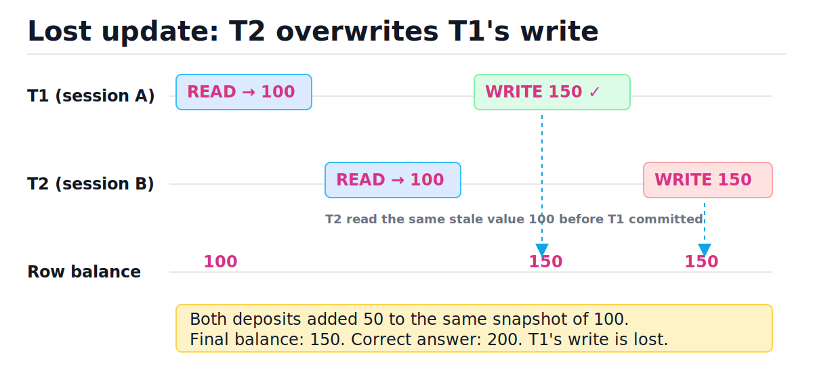
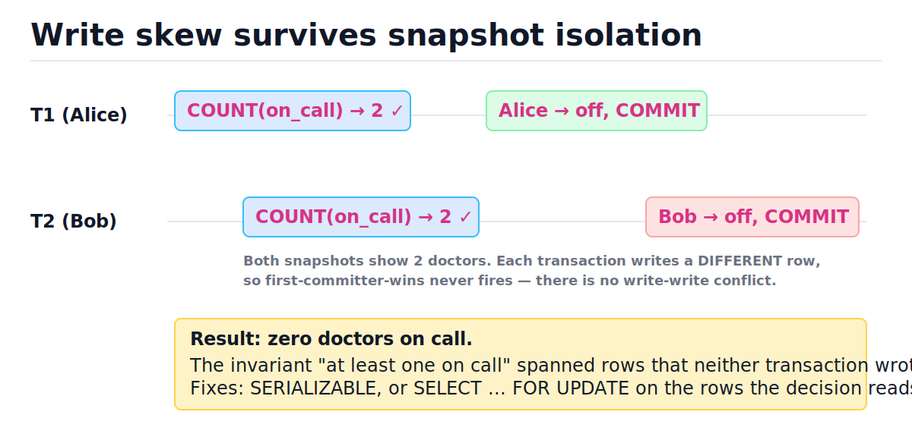
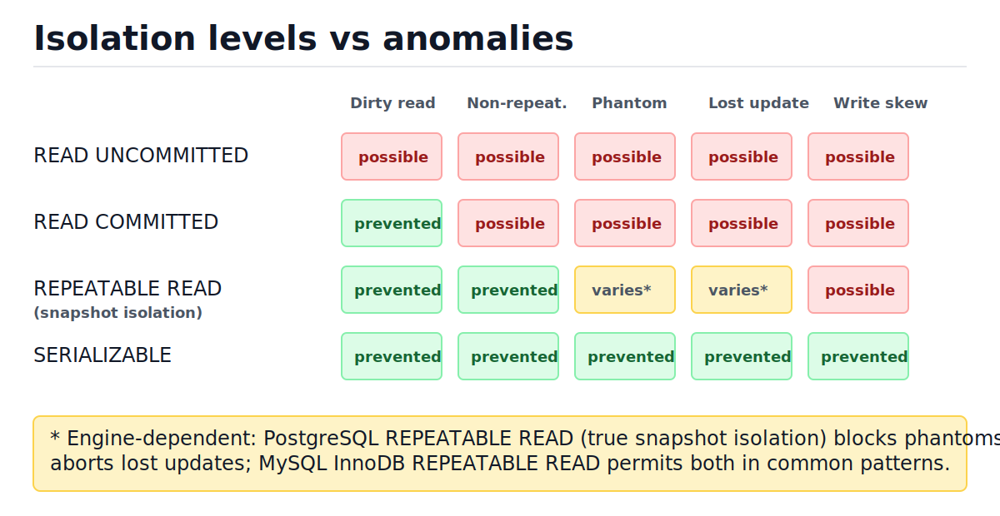
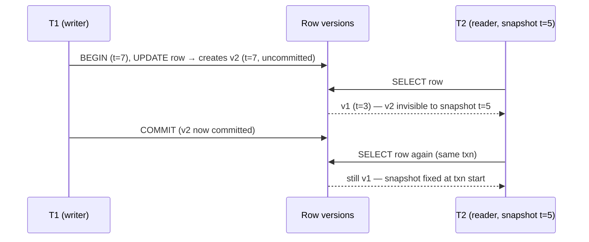
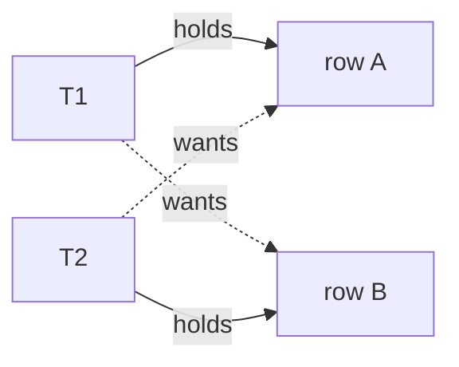

# Transactions, ACID, and Isolation Levels

[toc]

> **TL;DR:** A transaction turns a group of reads and writes into one all-or-nothing unit with ACID guarantees. The "I" (isolation) is negotiable: every database ships weaker-than-serializable defaults, each level permitting a specific zoo of concurrency anomalies. The principal-level insight: snapshot isolation is *not* serializability — write skew survives it — so for cross-row invariants you need explicit locks, a serializable level, or a constraint.

## Vocabulary

**Transaction**

```math
T = \langle r_1, w_1, r_2, \dots, \text{COMMIT} \mid \text{ABORT} \rangle
```

A sequence of reads and writes that the database executes as a single logical unit: either every effect becomes visible (commit) or none does (abort/rollback).

**Serializability**

```math
\exists \text{ serial order } T_{\sigma(1)}, T_{\sigma(2)}, \dots \text{ with the same final state and same reads}
```

The gold-standard correctness condition: the concurrent execution is equivalent to *some* one-at-a-time execution of the same transactions. If each transaction is individually correct, any serial order is correct, so a serializable interleaving is too.

**Isolation level**

```math
\text{READ UNCOMMITTED} \prec \text{READ COMMITTED} \prec \text{REPEATABLE READ} \prec \text{SERIALIZABLE}
```

A named contract about which anomalies a transaction may observe. Lower levels trade correctness guarantees for throughput and fewer aborts.

**Snapshot isolation (SI)**

```math
\text{reads see DB as of } t_{\text{start}}, \quad \text{first committer wins on write-write conflict}
```

Each transaction reads from a consistent snapshot taken at its start. Two transactions that write the *same* row conflict (one aborts); two that write *different* rows never conflict — which is exactly the hole write skew drives through.

**MVCC (multi-version concurrency control)**

```math
\text{row} \to \{(v_1, t_1), (v_2, t_2), \dots\}, \quad \text{visible}(v_i, T) \iff t_i \le t_{\text{snapshot}}(T)
```

The implementation technique behind SI: keep multiple timestamped versions of each row and route each transaction to the version its snapshot is allowed to see. Readers never block writers and writers never block readers.

**Two-phase locking (2PL)**

```math
\text{growing phase: acquire only} \;\rightarrow\; \text{shrinking phase: release only}
```

The classic pessimistic protocol: take shared locks to read, exclusive locks to write, hold everything until commit. Guarantees serializability; pays for it with blocking and deadlocks.

**Write-ahead log (WAL)**

```math
\text{log record durable on disk} \;\Rightarrow\; \text{page write may proceed}
```

The append-only log every change hits before the data pages do. It is what makes durability and crash recovery possible — covered in depth in [Relational Database Internals](./07-relational-database-internals.md).

## Intuition

Think of a transaction as a database promising you a private universe: you do your work as if you were alone, and at commit time the engine merges your universe back into reality. Isolation levels define how leaky that universe is. At READ UNCOMMITTED other people's half-finished edits bleed in; at SERIALIZABLE the merge behaves as if everyone took turns.

The classic failure when the universe leaks is the lost update. Look at the figure: both transactions read balance 100, both compute 150 locally, and the second write silently erases the first.



## ACID, precisely

ACID is four separable guarantees, and only one of them — isolation — is genuinely tunable. Each line below gives the one-sentence definition, then the paragraph of real meaning.

### Atomicity

One sentence: all of a transaction's writes apply, or none do. The mechanism is *abortability*: the engine keeps enough information (undo records, or simply not marking new MVCC versions as committed) to make a half-done transaction vanish. Atomicity is what lets application code retry safely — if the connection dies mid-transfer, you know money was neither half-debited nor half-credited. It says nothing about concurrency; a database could be perfectly atomic and still show you garbage interleavings.

### Consistency

One sentence: a transaction takes the database from one valid state to another valid state. This is the odd one out — "valid" is defined by *your* invariants (constraints, application rules), so consistency is mostly the application's job, with the database enforcing the declarative subset: primary keys, foreign keys, `UNIQUE`, `CHECK`, `NOT NULL`. The database promises only that if every transaction individually preserves your invariants, and atomicity/isolation hold, the invariants survive concurrency.

### Isolation

One sentence: concurrent transactions don't step on each other — ideally, the result is as if they ran serially. In practice almost nobody runs at full serializability by default; engines ship READ COMMITTED (PostgreSQL, Oracle, SQL Server) or REPEATABLE READ (MySQL InnoDB) and let specific anomalies through. The whole middle of this note is about exactly which anomalies leak at which level.

### Durability

One sentence: once `COMMIT` returns, the data survives a crash. The mechanism is the write-ahead log: the commit record is `fsync`'d to the WAL before the client hears "OK", and data pages are rewritten lazily afterward; recovery replays the log. The fine print — group commit, `synchronous_commit`, what `fsync` actually guarantees on consumer SSDs — lives in [Relational Database Internals](./07-relational-database-internals.md). On a replicated system, "durable" may also mean "acknowledged by a quorum" — see [Replication, Failover, and Connection Pooling](./08-replication-failover-and-connection-pooling.md).

> [!IMPORTANT]
> Atomicity is about *crashes and aborts* (all-or-nothing in time). Isolation is about *concurrency* (all-or-nothing as seen by others). Interviewers love conflating them; don't.

## The anomaly zoo

Each anomaly is a specific bad interleaving of two sessions. Read each table top to bottom — time flows down, and each row is one step in one session. Knowing these five cold is what lets you reason about any isolation level.

### Dirty read

T2 reads data T1 has written but not committed. If T1 then rolls back, T2 acted on data that *never existed*. Only READ UNCOMMITTED permits this.

| Step | T1 | T2 | What went wrong |
| :---: | :--- | :--- | :--- |
| 1 | `BEGIN; UPDATE acct SET bal=0 WHERE id=1` | | uncommitted write |
| 2 | | `SELECT bal FROM acct WHERE id=1` → **0** | T2 sees uncommitted 0 |
| 3 | `ROLLBACK` | | the 0 never existed |
| 4 | | T2 declines a purchase based on bal=0 | decision on phantom data |

### Non-repeatable read

T1 reads a row twice and gets different values because T2 committed in between. Each read individually saw committed data — the problem is the *pair* is inconsistent. READ COMMITTED permits this.

| Step | T1 | T2 | What went wrong |
| :---: | :--- | :--- | :--- |
| 1 | `BEGIN; SELECT bal` → **100** | | |
| 2 | | `UPDATE bal=20; COMMIT` | |
| 3 | `SELECT bal` → **20** | | same query, same txn, different answer |

### Phantom read

T1 runs a predicate query twice; T2 commits a row that *matches the predicate* in between, so the second read returns extra (or fewer) rows. Row locks can't stop it — the offending row didn't exist when T1 first read.

| Step | T1 | T2 | What went wrong |
| :---: | :--- | :--- | :--- |
| 1 | `SELECT COUNT(*) WHERE dept='eng'` → **5** | | |
| 2 | | `INSERT (dept='eng'); COMMIT` | new matching row |
| 3 | `SELECT COUNT(*) WHERE dept='eng'` → **6** | | phantom appeared mid-transaction |

### Lost update

Two transactions read-modify-write the same row; the later write clobbers the earlier one. This is the figure in the Intuition section. READ COMMITTED permits it; PostgreSQL REPEATABLE READ aborts the second writer; MySQL REPEATABLE READ still permits it for plain `SELECT` + `UPDATE`.

| Step | T1 | T2 | What went wrong |
| :---: | :--- | :--- | :--- |
| 1 | read bal → **100** | | |
| 2 | | read bal → **100** | stale read |
| 3 | write bal = 100+50; commit | | bal = 150 |
| 4 | | write bal = 100+50; commit | bal = 150, not 200 — T1's deposit lost |

### Write skew

The principal-level anomaly. Two transactions read an overlapping set of rows, make a decision based on what they read, then write to *different* rows. No write-write conflict, so snapshot isolation's first-committer-wins never triggers — yet the combined result violates an invariant neither transaction violated alone.

The canonical example: a hospital requires at least one doctor on call. Alice and Bob are both on call. Each opens a transaction, counts on-call doctors (sees 2 — fine), and removes *themselves*. Both commit. Zero doctors on call.



| Step | T1 (Alice) | T2 (Bob) | What went wrong |
| :---: | :--- | :--- | :--- |
| 1 | `COUNT(on_call)` → **2** ≥ 2 ✓ | | snapshot check passes |
| 2 | | `COUNT(on_call)` → **2** ≥ 2 ✓ | same snapshot check passes |
| 3 | `UPDATE alice SET on_call=false; COMMIT` | | writes row A |
| 4 | | `UPDATE bob SET on_call=false; COMMIT` | writes row B — different row, no conflict |
| 5 | | | invariant "≥ 1 on call" broken; no single write was wrong |

> [!CAUTION]
> Write skew survives snapshot isolation / REPEATABLE READ in PostgreSQL, MySQL, and Oracle. If your invariant spans rows you read but don't write — "at least one on call", "booking doesn't overlap", "username not taken" — snapshot isolation will not save you. You need SERIALIZABLE, `SELECT ... FOR UPDATE` on the rows the decision reads, or a database constraint.

## The isolation ladder

The SQL standard defines four levels by which anomalies they forbid. The figure is the matrix to memorize; the asterisks are where the standard and real engines diverge.



| Level | Dirty read | Non-repeatable read | Phantom | Lost update | Write skew |
| :--- | :---: | :---: | :---: | :---: | :---: |
| READ UNCOMMITTED | possible | possible | possible | possible | possible |
| READ COMMITTED | prevented | possible | possible | possible | possible |
| REPEATABLE READ (SI) | prevented | prevented | varies* | varies* | possible |
| SERIALIZABLE | prevented | prevented | prevented | prevented | prevented |

Reality notes, the parts the standard doesn't tell you:

- **READ COMMITTED is the common default** (PostgreSQL, Oracle, SQL Server). Each *statement* sees a fresh snapshot of committed data. Cheap, rarely aborts, and permits everything except dirty reads.
- **"REPEATABLE READ" usually means snapshot isolation.** PostgreSQL's REPEATABLE READ is true SI: no phantoms, and concurrent updates to the same row abort the second writer (`could not serialize access due to concurrent update`), which kills lost updates. MySQL InnoDB's REPEATABLE READ gives snapshot *reads* but its plain `UPDATE` reads current data, so lost updates and phantom-adjacent surprises still happen.
- **Snapshot isolation is not serializability.** This is the load-bearing point of the whole note: SI prevents every anomaly defined on a *single* row, and write skew is defined across rows. PostgreSQL's SERIALIZABLE closes the gap with Serializable Snapshot Isolation (SSI) — it tracks read/write dependency edges and aborts a transaction when a dangerous cycle could form, so you must be ready to retry on serialization failures.

> [!WARNING]
> Setting `SERIALIZABLE` does not make anomalies impossible *and* free — it converts them into transaction aborts that your application must catch and retry. A serializable system without a retry loop is just a system that throws errors under load.

## How engines implement isolation

There are two big families. Pessimistic (locking) prevents conflicts by making transactions wait; optimistic (versioning) lets everyone proceed and aborts losers at the end. Every mainstream engine today is MVCC at its core, with locks layered on for writes.

### Two-phase locking (2PL)

The pre-MVCC approach, still alive inside SQL Server's default mode and inside every engine's write path. A transaction acquires a shared lock before reading and an exclusive lock before writing, never releases a lock until commit (that's the "two phases": acquire-only, then release-only). Readers block writers and writers block readers, which is exactly why it guarantees serializability and exactly why throughput craters under contention. Lock acquisition is O(1) per row via a lock-table hash; the cost is *waiting*, not computing.

### MVCC: readers never block writers

Instead of locking, keep every version of a row tagged with the transaction that created it. A transaction at snapshot time t sees the newest version committed before t and ignores everything else. PostgreSQL stores old versions in the table heap itself (vacuumed later); MySQL reconstructs them from undo logs; SQLite in WAL mode lets readers read the old database state while one writer appends.



> [!TIP]
> MVCC's superpower is cheap consistent reads: a long analytics query never blocks OLTP writes and never sees a torn state. Its tax is garbage: dead versions accumulate and must be vacuumed/purged, and a long-running transaction pins old versions alive for everyone (PostgreSQL bloat, MySQL history-list growth).

## Practical weapons

You rarely fix concurrency bugs by cranking the isolation level globally. You fix them surgically: a compare-and-swap here, a `FOR UPDATE` there, a unique constraint as the backstop. All demos below run on SQLite; PostgreSQL differences are called out in prose.

### Demonstrate the lost update, then fix it with a version column

First, reproduce the disease: two connections both read balance 100, both write back read+50, and one deposit evaporates. Then the cure — optimistic concurrency: add a `version` column, and make every `UPDATE` a compare-and-swap that only matches if the version is unchanged. Check `rowcount`: 0 rows matched means somebody beat you, so re-read and retry. This works at any isolation level on any engine and costs nothing when there's no conflict.

```python
import sqlite3
import tempfile
import os

path = os.path.join(tempfile.mkdtemp(), "bank.db")
a = sqlite3.connect(path, isolation_level=None)  # autocommit
b = sqlite3.connect(path, isolation_level=None)
a.execute("CREATE TABLE acct (id INTEGER PRIMARY KEY, bal INTEGER, version INTEGER)")
a.execute("INSERT INTO acct VALUES (1, 100, 0)")

# --- The disease: naive read-modify-write from two sessions ---
bal_a = a.execute("SELECT bal FROM acct WHERE id=1").fetchone()[0]  # 100
bal_b = b.execute("SELECT bal FROM acct WHERE id=1").fetchone()[0]  # 100 (stale twin)
a.execute("UPDATE acct SET bal=? WHERE id=1", (bal_a + 50,))        # 150
b.execute("UPDATE acct SET bal=? WHERE id=1", (bal_b + 50,))        # 150 — clobbers A
final = a.execute("SELECT bal FROM acct WHERE id=1").fetchone()[0]
assert final == 150  # two +50 deposits, only one survived: the lost update

# --- The cure: compare-and-swap on a version column ---
a.execute("UPDATE acct SET bal=200, version=1 WHERE id=1")  # reset state

def deposit(conn: sqlite3.Connection, amount: int, retries: int = 5) -> int:
    for _ in range(retries):
        bal, ver = conn.execute(
            "SELECT bal, version FROM acct WHERE id=1").fetchone()
        cur = conn.execute(
            "UPDATE acct SET bal=?, version=? WHERE id=1 AND version=?",
            (bal + amount, ver + 1, ver))
        if cur.rowcount == 1:        # CAS won
            return bal + amount
        # rowcount == 0: someone committed between our read and write; retry
    raise RuntimeError("too much contention")

# Simulate the same interleaving: B's first CAS loses, then retries and wins.
bal_a, ver_a = a.execute("SELECT bal, version FROM acct WHERE id=1").fetchone()
bal_b, ver_b = b.execute("SELECT bal, version FROM acct WHERE id=1").fetchone()
assert (bal_a, ver_a) == (200, 1) and (bal_b, ver_b) == (200, 1)
cur = a.execute("UPDATE acct SET bal=?, version=? WHERE id=1 AND version=?",
                (bal_a + 50, ver_a + 1, ver_a))
assert cur.rowcount == 1            # A wins the race
cur = b.execute("UPDATE acct SET bal=?, version=? WHERE id=1 AND version=?",
                (bal_b + 50, ver_b + 1, ver_b))
assert cur.rowcount == 0            # B's stale CAS correctly fails
assert deposit(b, 50) == 300        # B re-reads (250) and succeeds
assert a.execute("SELECT bal FROM acct WHERE id=1").fetchone()[0] == 300
a.close(); b.close()
```

> [!TIP]
> The `rowcount` check is the whole trick. An `UPDATE ... WHERE version = ?` that matches zero rows is not an error to SQL — *you* must inspect the count and treat 0 as "retry". ORMs call this optimistic locking (Hibernate `@Version`, Django `F()`-expression patterns, SQLAlchemy `version_id_col`).

### Pessimistic locking: SELECT ... FOR UPDATE (PostgreSQL/MySQL)

When contention is high or the read-decide-write window is long, optimistic retries thrash; lock up front instead. `SELECT ... FOR UPDATE` takes an exclusive row lock at read time, so the second transaction *blocks* at its read until the first commits, then sees the fresh value. SQLite has no `FOR UPDATE` (its writers serialize on a whole-database lock anyway), so this snippet is PostgreSQL/MySQL syntax — don't run it through sqlite3.

```sql
-- PostgreSQL / MySQL. Fixes both lost update and the doctors' write skew:
-- lock the rows the DECISION reads, not just the rows you write.
BEGIN;
SELECT * FROM doctors WHERE on_call = true FOR UPDATE;  -- locks both rows
-- count them in the application; if count >= 2, proceed:
UPDATE doctors SET on_call = false WHERE name = 'alice';
COMMIT;
-- Bob's identical transaction blocks at FOR UPDATE, then sees count = 1 and aborts.
```

### Unique constraints: the last line of defense

Some invariants the database can enforce declaratively, and then no isolation level matters — two concurrent "claim this username" transactions cannot both succeed because the unique index arbitrates at write time, below MVCC. Prefer a constraint over any locking scheme whenever the invariant fits one (uniqueness, foreign keys, `CHECK`, PostgreSQL exclusion constraints for "no overlapping bookings").

```python
import sqlite3

conn = sqlite3.connect(":memory:")
conn.execute("CREATE TABLE users (id INTEGER PRIMARY KEY, name TEXT UNIQUE)")
conn.execute("INSERT INTO users(name) VALUES ('kira')")
try:
    conn.execute("INSERT INTO users(name) VALUES ('kira')")
    raised = False
except sqlite3.IntegrityError:
    raised = True
assert raised  # the index arbitrates; no race window exists
conn.close()
```

### Deadlocks

A deadlock is two transactions each holding a lock the other needs: T1 locks row A then wants B; T2 locks row B then wants A. Neither can proceed. Engines detect this by finding a cycle in the waits-for graph (PostgreSQL checks after `deadlock_timeout`, default 1 s; InnoDB checks on every lock wait) and kill one victim with a deadlock error — which, again, your application must retry.



The prevention rule is boring and absolute: **always acquire locks in a consistent global order.** If every transaction touches accounts in ascending-id order, the waits-for graph cannot form a cycle.

```sql
-- Transfer between accounts 7 and 3: lock the LOWER id first, always.
BEGIN;
SELECT bal FROM acct WHERE id = 3 FOR UPDATE;  -- min(3,7) first
SELECT bal FROM acct WHERE id = 7 FOR UPDATE;
UPDATE acct SET bal = bal - 50 WHERE id = 7;
UPDATE acct SET bal = bal + 50 WHERE id = 3;
COMMIT;
```

## Complexity

Concurrency control costs are dominated by waiting and aborting, not by per-operation CPU, but the per-operation costs still matter at scale. Below, n is rows touched per transaction, k is live versions per row, and "abort cost" means wasted work that must be retried.

| Mechanism / operation | Best | Average | Worst | Space |
| :--- | :---: | :---: | :---: | :---: |
| Acquire one row lock (2PL, hash lock table) | O(1) | O(1) | O(1) + unbounded wait | O(locks held) |
| 2PL transaction, n rows | O(n) | O(n) + blocking | deadlock → abort + retry | O(n) lock entries |
| MVCC visibility check per row read | O(1) | O(k) version-chain walk | O(k) | O(k·rows) dead versions |
| Optimistic CAS update (version column) | O(1) | O(retries) | O(r) retries under contention | O(1) extra column |
| Deadlock detection (waits-for cycle) | — | O(V+E) DFS over graph | O(V+E) | O(V+E) |
| SSI (PG SERIALIZABLE) dependency tracking | small constant/read | constant overhead | false-positive aborts | O(read/write sets) |

The number worth deriving is optimistic concurrency's expected retries. If p is the probability that some other transaction commits a conflicting write inside your read-to-write window, retries are geometric:

```math
\mathbb{E}[\text{attempts}] = \sum_{i=1}^{\infty} i\,(1-p)\,p^{\,i-1} = \frac{1}{1-p}
```

Why this matters: at p = 0.1 you average 1.11 attempts — optimistic locking is nearly free. At p = 0.9 (a hot row, e.g. one global counter) you average 10 attempts and the work is O(1/(1−p)) per success, exploding as p → 1. That is the crossover rule: low contention → optimistic CAS, high contention → pessimistic `FOR UPDATE` (you wait once instead of retrying many times), pathological contention → restructure the data (shard the counter).

## In production

The defaults and failure modes that actually page you. PostgreSQL runs READ COMMITTED by default; MySQL InnoDB runs REPEATABLE READ; SQLite serializes writers on a database-level lock (one writer at a time, so most anomalies here require its WAL-mode reader/writer split or are simply impossible). Almost every "the numbers don't add up" bug in a web app is a lost update or write skew at the default level.

- **Long transactions are the silent killer under MVCC.** A transaction (or an idle-in-transaction connection from a leaky pool) pins its snapshot, so vacuum can't reclaim any version newer than it. Tables bloat, index-only scans degrade, and one forgotten `BEGIN` in a console session can balloon a hot table by gigabytes. Pair this with [connection pooling](./08-replication-failover-and-connection-pooling.md) settings like `idle_in_transaction_session_timeout`.
- **Serialization failures are a normal operating condition** at REPEATABLE READ and SERIALIZABLE in PostgreSQL (SQLSTATE `40001`) and on InnoDB deadlocks (error 1213). Wrap transactions in a retry loop with jittered backoff; cap retries and surface the failure.
- **Durability is configurable, and people configure it off.** PostgreSQL `synchronous_commit = off` acknowledges before the WAL fsync (small crash window, no corruption); MySQL `innodb_flush_log_at_trx_commit = 2` similarly. Replication adds another axis: a commit acknowledged only by the primary can vanish in failover — see [Consistency Models, CAP, and Quorums](../System-Design/07-consistency-models-cap-and-quorums.md).
- **Hot rows don't scale at any isolation level.** A single `UPDATE counters SET n = n + 1` row serializes every writer behind one row lock. Fixes: shard into N counter rows and sum, batch increments, or move counting to a queue — see [Message Queues and Event-Driven Architecture](../System-Design/08-message-queues-and-event-driven-architecture.md).
- **Cross-service "transactions" don't exist.** ACID stops at the database boundary; once a workflow spans services you're into sagas, outbox tables, and idempotency keys.

> [!NOTE]
> SQLite's quirk is worth knowing for tests: it is always serializable in rollback-journal mode because there is exactly one writer and writers block readers. WAL mode relaxes this to one writer plus snapshot readers — which is precisely why the lost-update demo above uses autocommit interleaving rather than overlapping write transactions.

## Real-world example: idempotent payment capture

Scenario: a payment webhook can be delivered twice (network retry), and two app servers may process the duplicate concurrently. Capturing the payment twice double-charges a customer. The fix stacks two weapons from this note: a unique constraint on the idempotency key (the backstop) and a CAS state transition (the business rule "only capture a payment that is currently authorized").

```python
import sqlite3
from typing import Optional

conn = sqlite3.connect(":memory:", isolation_level=None)
conn.execute("""
    CREATE TABLE payments (
        id INTEGER PRIMARY KEY,
        state TEXT NOT NULL,                  -- 'authorized' | 'captured'
        amount INTEGER NOT NULL
    )""")
conn.execute("""
    CREATE TABLE captures (
        idempotency_key TEXT PRIMARY KEY,     -- unique constraint = backstop
        payment_id INTEGER NOT NULL
    )""")
conn.execute("INSERT INTO payments VALUES (1, 'authorized', 5000)")

def capture(c: sqlite3.Connection, payment_id: int, key: str) -> Optional[str]:
    """Returns 'captured', 'duplicate', or None (wrong state)."""
    try:
        c.execute("INSERT INTO captures VALUES (?, ?)", (key, payment_id))
    except sqlite3.IntegrityError:
        return "duplicate"                    # backstop fired: already handled
    cur = c.execute(
        "UPDATE payments SET state='captured' WHERE id=? AND state='authorized'",
        (payment_id,))
    if cur.rowcount == 0:                     # CAS on state: not authorized
        return None
    return "captured"

assert capture(conn, 1, "wh_evt_42") == "captured"
assert capture(conn, 1, "wh_evt_42") == "duplicate"   # retry of same webhook
assert conn.execute(
    "SELECT state FROM payments WHERE id=1").fetchone()[0] == "captured"
assert conn.execute("SELECT COUNT(*) FROM captures").fetchone()[0] == 1
conn.close()
```

In PostgreSQL you would wrap both statements in one transaction and rely on the unique index to abort one of two truly concurrent duplicates; the structure is identical.

## When to use what

Choosing a weapon is a contention-and-invariant question, not a dogma question. Default to READ COMMITTED plus surgical fixes; reach for SERIALIZABLE when invariants span rows and the write rate allows retries.

- **Optimistic CAS (version column)** — low contention, short transactions, any engine, works through ORMs and across stateless app servers. Avoid on hot rows (retry storm: expected attempts 1/(1−p)).
- **`SELECT ... FOR UPDATE`** — high contention or long read-decide-write windows; also the targeted fix for write skew (lock what the decision *reads*). Avoid when lock hold time is user-facing (never hold row locks across an HTTP call).
- **Unique / exclusion constraints** — whenever the invariant is expressible declaratively. Always add even if you also lock; it's the only mechanism with zero race window.
- **SERIALIZABLE** — complex cross-row invariants, money-critical correctness, write rates where ~percent-level abort/retry is acceptable. Avoid for bulk loads and hot-row workloads.
- **READ UNCOMMITTED** — essentially never; PostgreSQL doesn't even implement it (it silently behaves as READ COMMITTED).

## Common mistakes

- **"My database is ACID, so my code is race-free"** — ACID's isolation at the default level (READ COMMITTED) permits lost updates, phantoms, and write skew. ACID compliance and your invariants surviving concurrency are different claims.
- **"REPEATABLE READ means serializable"** — it means snapshot isolation (usually): single-row anomalies are gone, cross-row write skew is alive and well.
- **"I'll check first with a SELECT, then INSERT"** — check-then-act is a race at every level below SERIALIZABLE. Use a unique constraint and handle the violation, or `INSERT ... ON CONFLICT`.
- **"FOR UPDATE on the row I'm writing fixes write skew"** — you must lock the rows the *decision reads* (all on-call doctors), not just the row you write (yourself).
- **"Retries are a bug to eliminate"** — under SI/SSI and under deadlock detection, aborts are the mechanism working as designed. The bug is the missing retry loop.
- **"Wrapping everything in one giant transaction is safest"** — long transactions pin MVCC snapshots, bloat tables, hold locks longer, and widen every conflict window. Keep transactions as short as the invariant allows.
- **"SQLite doesn't have these problems"** — single-writer SQLite hides them; the moment you port the same read-modify-write code to PostgreSQL with concurrent app servers, the lost update appears.

## Interview questions and answers

Expect transactions to come up in both database and system-design rounds; the differentiator is knowing the snapshot-isolation-vs-serializability gap.

1. **Walk me through ACID.**
   **Answer:** Atomicity — all writes apply or none, enforced by undo/abortability, so crashes mid-transaction leave no half-state. Consistency — transactions preserve invariants; mostly the app's job plus declared constraints. Isolation — concurrent transactions behave as if alone, tunable via isolation levels. Durability — once COMMIT returns, the data survives a crash, via fsync'd write-ahead logging. I'd flag that A is about crashes and I is about concurrency — different mechanisms.

2. **What's the difference between a non-repeatable read and a phantom read?**
   **Answer:** Non-repeatable read: the *same row* changes value between two reads in one transaction. Phantom: the *set of rows matching a predicate* changes — new rows appear or vanish. The distinction matters for implementation: row locks stop non-repeatable reads, but phantoms need predicate or gap locking, or snapshot reads, because you can't lock a row that doesn't exist yet.

3. **Two requests both read a counter, increment it, and write it back. What happens and how do you fix it?**
   **Answer:** Lost update — one increment vanishes. Three fixes in preference order: make the operation atomic in SQL (`UPDATE c SET n = n + 1`), so the read-modify-write happens inside one statement under the row lock; optimistic CAS with a version column checking rowcount; or `SELECT ... FOR UPDATE` if contention is high.

4. **Explain write skew and why snapshot isolation doesn't prevent it.**
   **Answer:** Two transactions read overlapping rows, decide based on the snapshot, and write *different* rows. SI's conflict detection is first-committer-wins on the *same row* — different rows means no conflict detected, both commit, and a cross-row invariant breaks. The doctors example: both see two on call, both remove themselves, zero remain. Fixes: SERIALIZABLE (SSI tracks read-write dependencies), FOR UPDATE on the rows read, or a constraint that captures the invariant.

5. **How does MVCC let readers avoid blocking writers?**
   **Answer:** Every write creates a new version of the row tagged with its transaction ID; old versions stay around. A reader is assigned a snapshot and only sees versions committed before its snapshot — it never waits for an in-flight writer because it just reads the previous version. The costs: visibility checks per row, and garbage — dead versions need vacuuming, and long transactions block reclamation.

6. **PostgreSQL SERIALIZABLE vs taking locks yourself — when each?**
   **Answer:** SERIALIZABLE (SSI) is optimistic: no extra blocking, but it aborts transactions when dangerous dependency patterns form — including some false positives — so you need a retry loop and a workload where aborting is cheap. Explicit `FOR UPDATE` is pessimistic and surgical: you pay blocking only on the rows you choose, deterministic, no retries, but you must identify every racy code path yourself. I'd use SERIALIZABLE when invariants are complex or diffuse, locks when there's one known hot path.

7. **How do deadlocks form and how do databases handle them?**
   **Answer:** Cyclic waiting: T1 holds A and wants B, T2 holds B and wants A. The engine maintains a waits-for graph and looks for cycles — InnoDB on every lock wait, PostgreSQL after deadlock_timeout — then aborts a victim, which the app should retry. Prevention is ordering: every transaction acquires locks in the same global order (e.g., ascending primary key), which makes cycles impossible.

8. **Your service double-processes webhook deliveries. Design the defense.**
   **Answer:** Idempotency key with a unique constraint: insert the delivery ID into a processed-events table inside the same transaction as the side effect; a duplicate hits the constraint and you return the previous result. The unique index arbitrates below MVCC, so it's correct under any isolation level and any number of app servers. Layer a CAS state machine on the business entity (`WHERE state='authorized'`) for transitions.

9. **Why is READ COMMITTED the default if it allows so many anomalies?**
   **Answer:** Economics. It prevents the truly toxic anomaly (dirty reads) at near-zero cost: per-statement snapshots, minimal aborts, no predicate locking. Most application operations are single-row or already atomic in SQL, so the residual anomalies bite only specific patterns — read-modify-write and cross-row checks — which are cheaper to fix surgically than to pay serializable overhead on every transaction.

## Practice path

1. Run the lost-update demo above; before running, predict the final balance, then explain in one sentence which step makes it 150.
2. Rewrite the naive deposit as a single `UPDATE acct SET bal = bal + 50` and convince yourself why no version column is needed for that form.
3. Implement the doctors' write-skew scenario in SQLite with two connections (simulate snapshots by reading before either writes); verify the broken invariant; fix it with a `CHECK`-style guard query inside the CAS update.
4. In PostgreSQL (if available): set `REPEATABLE READ` in two psql sessions, reproduce the lost update, and observe the `40001` serialization failure — then repeat at `READ COMMITTED` and watch it silently succeed.
5. Write a generic `with_retry(fn)` wrapper that retries on `sqlite3.OperationalError`/serialization failures with jittered backoff, capped at 5 attempts.
6. Take the payment-capture example and break it: remove the unique constraint, run two captures with interleaved reads, and confirm the double charge. Restore the constraint.
7. Memorize the isolation matrix; recite which anomaly each level permits without looking.

## Copyable takeaways

- A transaction = atomic (crash-safe), consistent (your invariants), isolated (tunable!), durable (WAL + fsync).
- Five anomalies: dirty read, non-repeatable read, phantom, lost update, write skew — know each as a two-session interleaving.
- READ COMMITTED is the common default; it permits everything except dirty reads.
- REPEATABLE READ ≈ snapshot isolation ≠ serializability: **write skew survives snapshot isolation.** That sentence is the principal-level point.
- MVCC: versioned rows + snapshots → readers never block writers; the tax is vacuum/garbage and long-transaction bloat.
- Lost update fixes, in order: atomic SQL (`SET n = n + 1`), optimistic CAS via version column + rowcount check, `SELECT ... FOR UPDATE`.
- Write skew fixes: SERIALIZABLE, `FOR UPDATE` on the rows the *decision reads*, or a declarative constraint.
- Unique constraints are the only zero-race-window mechanism; always add one when the invariant fits.
- Deadlocks: cycles in the waits-for graph; prevent by acquiring locks in one global order; always retry the victim.
- Expected optimistic retries = 1/(1−p): cheap at low contention, catastrophic on hot rows.

## Sources

- PostgreSQL docs — Transaction Isolation: https://www.postgresql.org/docs/current/transaction-iso.html
- PostgreSQL docs — Explicit Locking (`FOR UPDATE`, deadlocks): https://www.postgresql.org/docs/current/explicit-locking.html
- MySQL 8.4 Reference — InnoDB Transaction Isolation Levels: https://dev.mysql.com/doc/refman/8.4/en/innodb-transaction-isolation-levels.html
- SQLite docs — Isolation in SQLite: https://www.sqlite.org/isolation.html
- Kleppmann, *Designing Data-Intensive Applications*, Chapter 7 ("Transactions") — source of the on-call doctors write-skew example.
- Berenson et al., "A Critique of ANSI SQL Isolation Levels" (SIGMOD 1995) — defines snapshot isolation and the anomaly taxonomy: https://www.microsoft.com/en-us/research/publication/a-critique-of-ansi-sql-isolation-levels/
- Cahill, Röhm, Fekete, "Serializable Isolation for Snapshot Databases" (SIGMOD 2008) — the SSI algorithm behind PostgreSQL SERIALIZABLE.

## Related

- [Relational Database Internals](./07-relational-database-internals.md) — WAL, fsync, buffer pool: where durability actually lives.
- [Indexes and Query Performance](./05-indexes-and-query-performance.md) — the structures row locks and unique constraints attach to.
- [Replication, Failover, and Connection Pooling](./08-replication-failover-and-connection-pooling.md) — durability and isolation across replicas, pool-induced idle transactions.
- [Consistency Models, CAP, and Quorums](../System-Design/07-consistency-models-cap-and-quorums.md) — the distributed-systems generalization of isolation.
- [Distributed Locks, Leader Election, and Time](../System-Design/11-distributed-locks-leader-election-and-time.md) — when the lock has to live outside the database.
- [SQL Fundamentals](./02-sql-fundamentals.md) — the statement-level building blocks used here.
