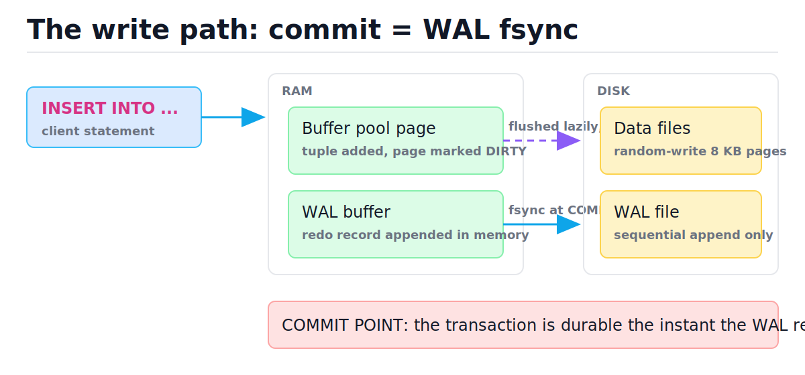
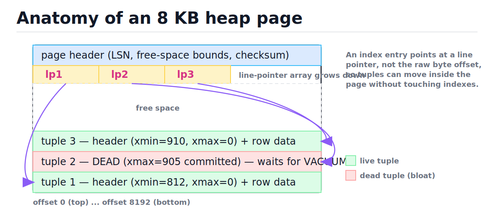
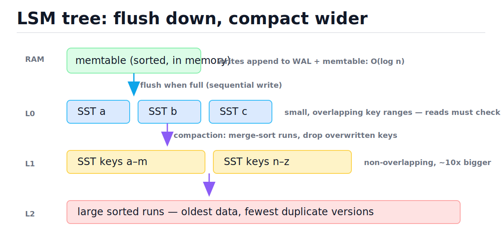
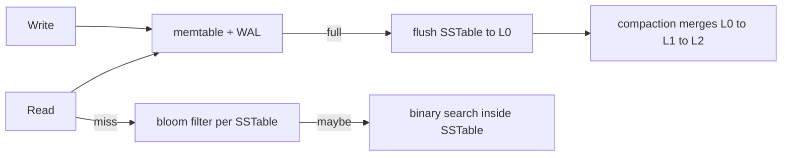

# Relational Database Internals

[toc]

> **TL;DR:** A relational database turns slow random disk writes into one fast sequential append: the write-ahead log. Commit means "the WAL record is fsynced" — data pages stay dirty in RAM and flush lazily, and crash recovery replays the log. MVCC keeps old row versions around so readers never block writers, at the cost of bloat that vacuum must reclaim.

## Vocabulary

**Heap page**

```math
\text{page} \approx 8\,\text{KB} = \text{header} + \text{line pointers} + \text{free space} + \text{tuples}
```

The fixed-size unit of table storage and I/O. PostgreSQL uses 8 KB pages; InnoDB uses 16 KB. Tuples (row versions) sit at the bottom, an array of line pointers at the top, free space in between.

**Buffer pool**

```math
\text{hit ratio} = \frac{\text{reads served from RAM}}{\text{total reads}}
```

The in-RAM cache of disk pages. All reads and writes go through it; a page modified in RAM but not yet written back is **dirty**. A healthy OLTP system serves >99% of reads from the pool.

**Write-ahead log (WAL)**

```math
\text{rule: } \mathrm{LSN}_{\text{log flushed}} \ge \mathrm{LSN}_{\text{page}} \text{ before any dirty page is written}
```

An append-only file of change records. Every modification is logged *before* the data page it touches can reach disk. Commit durability = WAL flush, nothing more.

**LSN (log sequence number)**

```math
\mathrm{LSN} \in \mathbb{N}, \text{ strictly increasing byte offset into the WAL}
```

A monotonically increasing position in the log. Each page header stores the LSN of the last record that modified it, which is how recovery knows whether a page already contains a change.

**Checkpoint**

```math
\text{recovery work} \le \text{WAL written since last checkpoint}
```

A periodic operation that flushes all dirty pages to disk and records "everything before LSN x is on disk." Recovery starts replaying from the last checkpoint, so checkpoint frequency bounds recovery time.

**MVCC (multi-version concurrency control)**

```math
\text{visible}(t, \text{txn}) \iff x_{\min}(t) \text{ committed before snapshot} \land x_{\max}(t) \text{ not committed}
```

Concurrency scheme where updates create new row versions instead of overwriting. Each tuple carries the creating transaction id (xmin) and the deleting/updating one (xmax); each transaction sees the versions visible to its snapshot.

**Vacuum**

```math
\text{bloat} = \frac{\text{dead tuples}}{\text{live} + \text{dead tuples}}
```

The garbage collector for dead row versions. DELETE and UPDATE never free space immediately; vacuum reclaims it so pages can be reused.

**LSM tree (log-structured merge tree)**

```math
\text{write amp} \approx L \cdot f \quad (L = \text{levels},\ f \approx 10 = \text{fanout})
```

A storage engine that buffers writes in a sorted memtable, flushes immutable sorted files (SSTables), and merges them in the background (compaction). Optimizes write throughput at the cost of read and space amplification.

## Intuition

Think of the database as a librarian with a photocopied desk reference (buffer pool) and a dictation tape (WAL). When you change a record, she edits her desk copy and speaks the change onto the tape. She only promises "done" once the tape is safe — refiling the actual book on the shelf (the data file) can wait until she walks past it. If she drops dead mid-shift, her replacement replays the tape from the last "shelf is up to date" marker.

The figure below shows the whole write path. Look for two arrows leaving RAM: the solid one (WAL fsync) happens at COMMIT; the dashed one (data page flush) happens whenever convenient.



> [!IMPORTANT]
> The single load-bearing idea: **commit = WAL flush**. Everything else — buffer pools, checkpoints, recovery — exists to make that one sequential fsync sufficient for durability.

## How it works

### What happens when you INSERT

An `INSERT` never writes your row straight to the table file. The executor finds a heap page with enough free space (via a free-space map), pins that page in the buffer pool, copies the tuple into the page's free region, adds a line pointer, and marks the page dirty. Simultaneously it appends a redo record describing the change to the WAL buffer. At `COMMIT`, the WAL buffer is flushed with fsync — that is the durability point. The dirty 8 KB page may sit in RAM for minutes.

```sql
-- Plain SQL; identical surface behavior in SQLite and PostgreSQL.
CREATE TABLE orders (id INTEGER PRIMARY KEY, customer TEXT, total REAL);
INSERT INTO orders VALUES (1, 'ada', 99.50);
-- COMMIT here = one sequential fsync of the log, not a table-file write.
```

Why this design wins: a random 8 KB write seeks to wherever that page lives; the WAL append always writes at the tail of one file. Sequential I/O is orders of magnitude cheaper than random I/O on spinning disks and still meaningfully cheaper on SSDs (see [back-of-the-envelope estimation](../System-Design/02-back-of-the-envelope-estimation.md) for the latency numbers). One transaction touching ten scattered pages costs ten random writes eventually — but only **one** sequential fsync at commit.

### Page anatomy

A heap page is a small slotted container. The header records the page LSN and free-space bounds. Line pointers grow downward from the header; tuple data grows upward from the end. Indexes point at line pointers (page number + slot), never raw byte offsets, so the page can compact its tuples internally without invalidating any index. The figure shows a page holding two live tuples and one dead one.



Each tuple carries a header (~23 bytes in PostgreSQL) before your data: xmin, xmax, flag bits, and the column null bitmap. That is why a table of tiny rows is much bigger on disk than the raw data suggests.

### The buffer pool

Every read goes: hash the (file, page-number) key, look it up in the buffer pool's page table — an in-memory hash map (see [hash tables](../Data-Structures-and-Algorithms/05-hash-tables.md)) — and on a hit, read from RAM in nanoseconds. On a miss, evict a victim page (clock-sweep or LRU approximation), read the 8 KB page from disk, and pin it. Writes work the same way: modify the cached copy, mark it dirty.

> [!TIP]
> In production you watch the **cache hit ratio** (`pg_stat_database.blks_hit / (blks_hit + blks_read)` in PostgreSQL). OLTP systems should sit above 0.99; a sudden drop usually means a new sequential scan or a working set that outgrew RAM.

### WAL and crash recovery (ARIES intuition)

If the machine dies, RAM is gone: committed transactions may have dirty pages that never flushed, and a half-flushed checkpoint may have written pages from *uncommitted* transactions. Recovery fixes both with two passes over the log, starting from the last checkpoint:

1. **Redo**: replay every logged change whose page LSN shows it never made it to disk. This restores the exact pre-crash state, including uncommitted work.
2. **Undo**: roll back transactions that had no commit record, using the same log.

The page LSN makes redo idempotent: if the page already carries an LSN ≥ the record's LSN, skip it. Here is the recovery decision table for one page and three log records:

| Step | Log record (LSN, txn, change) | Txn committed? | Page LSN on disk | Decision |
| :--- | :--- | :---: | :---: | :--- |
| 1 | (100, T1, set total=99.50) | yes | 100 | Skip — page already has it |
| 2 | (140, T1, insert row 2) | yes | 100 | **Redo** — change lost with RAM |
| 3 | (180, T2, update row 1) | no | 100 | Redo, then **undo** in pass 2 |

Checkpoints bound this work. Without them, recovery replays the log from the beginning of time; with a checkpoint every N megabytes of WAL, recovery cost is O(N).

> [!WARNING]
> fsync only asks the OS to push data to the device — and consumer drives have historically *lied*, acknowledging writes still sitting in their volatile cache. A power cut then loses "durable" commits. Production databases rely on enterprise drives with power-loss-protected caches, or disable the drive write cache. PostgreSQL learned in 2018 ("fsyncgate") that even the kernel can drop a failed fsync's dirty pages silently; it now panics on fsync failure rather than retrying.

### MVCC: readers never block writers

An UPDATE in PostgreSQL is physically an insert: write a new tuple version with `xmin = current txn`, and stamp the old version's `xmax`. A DELETE just stamps xmax. Nothing is erased. Each transaction takes a snapshot — the set of transaction ids committed at that instant — and a tuple is visible if its xmin is in the snapshot and its xmax is not. Readers see a consistent past; writers append new versions; neither waits for the other.

| Step | Action | Tuple versions (xmin, xmax) | What txn 95's snapshot sees |
| :--- | :--- | :--- | :--- |
| 1 | T90 inserts row, commits | v1 (90, –) | v1 |
| 2 | T95 begins, takes snapshot | v1 (90, –) | v1 |
| 3 | T99 updates row, commits | v1 (90, 99); v2 (99, –) | still v1 — T99 not in snapshot |
| 4 | T95 commits; T100 begins | v1 (90, 99); v2 (99, –) | T100 sees v2; v1 is now dead |

The price: dead versions accumulate. A table that updates every row daily doubles in physical size unless vacuum runs. Vacuum scans for tuples whose xmax is committed and older than every active snapshot, removes them, and records the freed space. Long-running transactions are the classic poison — they pin old snapshots, so vacuum cannot remove anything newer, and bloat grows. Isolation semantics built on these snapshots are covered in [transactions, ACID, and isolation levels](./06-transactions-acid-and-isolation-levels.md).

> [!CAUTION]
> A forgotten `BEGIN` left idle-in-transaction for hours blocks vacuum vault-wide in PostgreSQL. Tables and indexes bloat, queries slow down, and in the extreme the system approaches transaction-id wraparound. Alert on long-running transactions.

### B-tree engines vs LSM trees

PostgreSQL, InnoDB, and SQLite store tables and indexes in B-tree-family structures: update-in-place pages, O(log n) point reads, great range scans (the structure itself is the balanced-tree story from [BSTs and balanced trees](../Data-Structures-and-Algorithms/07-binary-search-trees-and-balanced-trees.md)). RocksDB, Cassandra, and LevelDB use LSM trees instead: writes land in a sorted in-memory memtable (plus a WAL), flush as immutable sorted files (SSTables), and background compaction merge-sorts files into larger, non-overlapping runs per level.



Every storage engine sits somewhere in the **amplification triangle** — you cannot minimize all three:

| Engine | Write amplification | Read amplification | Space amplification | Favors |
| :--- | :--- | :--- | :--- | :--- |
| B-tree | Higher (rewrite whole 8 KB page per row touched) | Low — one O(log n) tree descent | Moderate (page fragmentation) | Read-heavy OLTP, range scans, hot updates |
| LSM | Lower per write, but compaction rewrites data ~10x over its life | Higher — check memtable + several levels (bloom filters help) | Higher until compaction drops old versions | Write-heavy ingest, time-series, append-mostly |



## Complexity

Every operation above has a clean asymptotic story; n is rows in the table, P is pages, L is LSM levels, W is WAL bytes since the last checkpoint. The constants — RAM vs disk, sequential vs random — matter more than the exponents, but know both.

| Operation | Best | Average | Worst | Space |
| :--- | :--- | :--- | :--- | :--- |
| Buffer-pool page lookup (hash) | O(1) | O(1) | O(P) degenerate hash | O(P) frames |
| B-tree point read / insert | O(log n) | O(log n) | O(log n) | O(n) |
| WAL append + commit fsync | O(1) | O(1) | O(1) | O(W) log |
| Crash recovery (redo + undo) | O(1) (clean) | O(W) | O(W) | O(active txns) |
| MVCC visibility check per tuple | O(1) | O(1) | O(1) | O(versions) heap |
| Vacuum pass | O(n) | O(n) | O(n) | O(1) extra |
| LSM write (memtable insert) | O(log m) | O(log m) | O(log m) | memtable size m |
| LSM point read | O(log m) | O(L log s) | O(L · s) no blooms | O(n) + duplicates |
| Compaction of one level | O(s log L) merge | O(s) per byte | O(s) | O(s) temp |

The key bound is recovery time. If the checkpoint interval guarantees at most W bytes of WAL accumulate, then:

```math
T_{\text{recovery}} = O(W) = O(\text{checkpoint interval} \times \text{write rate})
```

Why: redo touches each log record once and each record is bounded work (idempotent page apply, skipped if page LSN is newer); undo touches only records of the losing transactions, a subset of the same W bytes. So recovery is linear in WAL volume since the checkpoint — which is exactly why checkpoints exist: they trade steady-state write I/O (flushing dirty pages early) for a hard ceiling on downtime after a crash.

## In production

The clean model above meets messy hardware. fsync durability depends on the full stack telling the truth: the kernel page cache, the filesystem journal, the drive cache. Cloud block stores (EBS, Persistent Disk) honor flushes but add millisecond latencies, which is why commit latency — not throughput — is often the first complaint after a cloud migration; group commit (batching many transactions' WAL records into one fsync) is the standard fix.

- **Checkpoint storms**: a checkpoint flushing gigabytes of dirty pages competes with foreground I/O. PostgreSQL spreads it (`checkpoint_completion_target`); undersized WAL settings cause periodic latency spikes that look like mystery stalls.
- **Bloat in the wild**: a queue-like table (insert, process, delete) can be 95% dead tuples. Autovacuum tuned for the default workload will not keep up; per-table autovacuum settings or partition-and-drop designs fix it.
- **Full-page writes**: after each checkpoint, PostgreSQL logs the entire 8 KB page on first touch to defend against torn pages (a crash mid-way through writing one page). This is why WAL volume spikes right after checkpoints.
- **Replication rides the WAL**: the same log that gives durability gives replication for free — ship WAL records to replicas and replay them. See [replication, failover, and connection pooling](./08-replication-failover-and-connection-pooling.md).
- **LSM ops**: compaction debt is the LSM failure mode — ingest outruns compaction, L0 file count explodes, reads slow 10x, then writes get throttled. Watch pending-compaction-bytes.

> [!NOTE]
> SQLite supports both journaling modes: classic rollback journal and `PRAGMA journal_mode=WAL`. In WAL mode, readers read the main file plus the WAL, writers append to the WAL, and a "checkpoint" copies WAL frames back into the database — the same architecture in miniature.

## Real-world example

Here is the entire WAL idea as a runnable simulation. The "database" keeps a dict in RAM (buffer pool) and a JSON-lines log on disk (WAL). We commit two transactions, crash *before* any data page flushes, and recover by replaying the log from the last checkpoint. The asserts prove that committed data survives and uncommitted data does not.

```python
import json
import os
import tempfile
from typing import Optional


class MiniDB:
    """Toy storage engine: dict = buffer pool, JSONL file = WAL."""

    def __init__(self, wal_path: str):
        self.wal_path = wal_path
        self.pool: dict[str, int] = {}      # "data pages" in RAM
        self.disk: dict[str, int] = {}      # "data files" on disk
        self.txn_writes: list[dict] = []    # current txn, not yet durable

    def put(self, key: str, value: int) -> None:
        self.txn_writes.append({"op": "put", "key": key, "value": value})

    def commit(self) -> None:
        # Durability point: append + fsync the WAL. Data pages NOT flushed.
        with open(self.wal_path, "a") as f:
            for rec in self.txn_writes:
                f.write(json.dumps(rec) + "\n")
            f.write(json.dumps({"op": "commit"}) + "\n")
            f.flush()
            os.fsync(f.fileno())
        for rec in self.txn_writes:          # apply to buffer pool only
            self.pool[rec["key"]] = rec["value"]
        self.txn_writes = []

    def checkpoint(self) -> None:
        self.disk = dict(self.pool)          # flush all dirty pages
        with open(self.wal_path, "a") as f:
            f.write(json.dumps({"op": "checkpoint"}) + "\n")
            f.flush()
            os.fsync(f.fileno())

    def crash(self) -> None:
        self.pool = {}                       # RAM is gone
        self.txn_writes = []

    def recover(self) -> None:
        # Redo from the last checkpoint; undo = drop uncommitted tail.
        records = []
        with open(self.wal_path) as f:
            for line in f:
                records.append(json.loads(line))
        last_ckpt = 0
        for i, rec in enumerate(records):
            if rec["op"] == "checkpoint":
                last_ckpt = i + 1
        self.pool = dict(self.disk)          # state as of the checkpoint
        pending: list[dict] = []
        for rec in records[last_ckpt:]:
            if rec["op"] == "put":
                pending.append(rec)
            elif rec["op"] == "commit":      # redo committed work
                for p in pending:
                    self.pool[p["key"]] = p["value"]
                pending = []
        # 'pending' now holds writes with no commit record: undone by discard.

    def get(self, key: str) -> Optional[int]:
        return self.pool.get(key)


wal_file = os.path.join(tempfile.mkdtemp(), "wal.jsonl")
db = MiniDB(wal_file)

db.put("a", 1)
db.commit()
db.checkpoint()                  # 'a' reaches the data files

db.put("b", 2)
db.commit()                      # durable in WAL, but only in RAM otherwise
assert db.disk.get("b") is None  # data page for 'b' never flushed

db.put("c", 3)                   # written but NEVER committed
db.crash()                       # power cut: RAM wiped

assert db.get("b") is None       # gone from RAM...
db.recover()
assert db.get("a") == 1          # checkpointed data intact
assert db.get("b") == 2          # ...redone from the WAL
assert db.get("c") is None       # uncommitted txn correctly absent
print("recovery ok")
```

This is ARIES in 60 lines: redo restores committed changes the buffer pool lost; "undo" here is simply refusing to apply records that never reached a commit marker.

## When to use / When NOT to use

This knowledge is leverage when you tune, debug, or choose storage — not something you reimplement. Knowing the write path tells you *which knob* maps to *which physical cost*.

- **Use a B-tree engine (PostgreSQL/InnoDB/SQLite)** for read-heavy OLTP, range queries, and workloads with updates to hot rows.
- **Use an LSM engine (RocksDB/Cassandra)** for sustained high write ingest, time-series, and append-mostly data where compaction can run off-peak.
- **Relax durability deliberately** (`synchronous_commit = off`) only when losing the last few hundred milliseconds of commits is acceptable — analytics ingest yes, payments no.
- **Do NOT** disable fsync to "fix" slow commits, run long idle transactions against MVCC databases, or pick an LSM store because it benchmarked faster on a write-only test when your workload is 90% reads.

## Common mistakes

- **"COMMIT writes my row to the table file"** — it writes one log record sequentially; the table page may not touch disk for minutes. Durability lives in the WAL.
- **"DELETE frees disk space"** — it stamps xmax on a tuple version. Space returns only after vacuum, and even then the file rarely shrinks (free space is reused, not released).
- **"fsync returned, therefore the data is on the platter"** — only if the drive's volatile cache is honest or disabled. Cheap consumer SSDs have lost "durable" commits on power cuts.
- **"MVCC means no locks at all"** — readers and writers do not block each other, but two writers updating the same row still serialize on a row lock.
- **"Checkpoints are just background hygiene"** — they are the recovery-time dial. Rare checkpoints = fast steady state, long crash recovery; frequent = the reverse.
- **"LSM trees are simply faster for writes"** — per-write they are, but compaction rewrites each byte ~10x over its lifetime; total disk bandwidth consumed can exceed a B-tree's.

## Interview questions and answers

**1. What exactly makes a transaction durable at COMMIT?**
**Answer:** The WAL record describing the transaction, including a commit marker, is appended and fsynced to the log file. That's it — the actual data pages are dirty in the buffer pool and flush lazily. If we crash, recovery replays the log to reconstruct them.

**2. Why is the WAL faster than just writing the data pages?**
**Answer:** A transaction can dirty pages scattered all over the data files — each one a random write. The WAL is a single append-only file, so commit costs one sequential write plus one fsync regardless of how many pages changed. Sequential I/O is dramatically cheaper than random I/O.

**3. Walk me through crash recovery.**
**Answer:** Start at the last checkpoint. Redo pass: replay every log record whose target page doesn't already contain it — page LSN versus record LSN makes this idempotent — restoring exact pre-crash state including uncommitted work. Undo pass: roll back transactions with no commit record. That's the ARIES shape: redo everything, then undo the losers.

**4. Why doesn't DELETE free space immediately in PostgreSQL?**
**Answer:** MVCC. Other transactions with older snapshots may still need that row version, so DELETE just stamps xmax on the tuple. Vacuum later removes versions invisible to every active snapshot. The side effect is bloat, and a long-running transaction can pin old snapshots and stop vacuum from reclaiming anything.

**5. A read replica is built from the same mechanism as durability. How?**
**Answer:** The WAL is a complete ordered record of every change, so you stream it to another machine and replay it there — physical replication is just continuous crash recovery on a second box. One log, two jobs.

**6. When would you pick an LSM-tree store over a B-tree database?**
**Answer:** Sustained write-heavy workloads — event ingest, time-series, write-mostly key-value — where buffered sequential flushes beat in-place page updates. I'd accept the costs: reads check multiple levels (mitigated by bloom filters), and compaction consumes background I/O. For read-heavy OLTP with range scans, B-trees win.

**7. What does fsync actually guarantee, and where can it lie?**
**Answer:** It guarantees the kernel pushed the data to the storage device and the device acknowledged. The gap is the device's volatile write cache — drives without power-loss protection can ack and then lose the data on power cut. And per fsyncgate, an fsync *error* may mean the kernel already dropped the dirty pages, so retrying succeeds vacuously; PostgreSQL now panics instead.

**8. Why does WAL volume spike right after a checkpoint?**
**Answer:** Full-page writes. To defend against torn pages — a crash midway through writing one 8 KB page — PostgreSQL logs the entire page image the first time it's modified after each checkpoint, instead of just the row delta. More frequent checkpoints mean more full-page images.

**9. What bounds crash-recovery time, and what's the trade-off?**
**Answer:** WAL volume since the last checkpoint — recovery is O(W) in those bytes. Frequent checkpoints cap W and recovery time but cost steady-state I/O flushing dirty pages and extra full-page-write WAL; rare checkpoints give smooth steady state but long recovery. It's an RTO dial.

## Practice path

1. Run the `MiniDB` simulation above; add a second checkpoint after the crash-recovery cycle and assert recovery is still correct.
2. In SQLite, run `PRAGMA journal_mode=WAL;`, insert rows, and watch the `-wal` file grow; run `PRAGMA wal_checkpoint;` and watch it reset.
3. In PostgreSQL (or its docs), inspect `xmin`/`xmax`: `SELECT xmin, xmax, * FROM t;` before and after an UPDATE in a second open transaction.
4. Create a table, UPDATE every row five times, check `pg_stat_user_tables.n_dead_tup`, then `VACUUM VERBOSE` and read the output.
5. Extend `MiniDB` with per-key "page LSNs" and make `recover()` skip records the disk state already contains — true idempotent redo.
6. Sketch the amplification triangle from memory and place B-tree, LSM, and "WAL-less in-place writes" on it.

## Copyable takeaways

- Commit = WAL fsync. Data pages flush lazily; the log is the source of truth.
- One sequential append replaces many random writes — that is the entire economic argument for WAL.
- Recovery = redo from last checkpoint, then undo uncommitted transactions; cost is O(WAL since checkpoint).
- Checkpoints are the dial between steady-state I/O cost and crash-recovery time.
- MVCC: updates create versions, deletes stamp xmax, readers never block writers — and vacuum pays the bill.
- Long-idle transactions pin snapshots, block vacuum, and bloat everything. Alert on them.
- B-tree: read-optimized, in-place. LSM: write-optimized, merge-later. Pick by workload, judged on all three amplifications.
- fsync is a request, not a law: durability is only as honest as the drive cache.

## Sources

- PostgreSQL docs — Chapter 28 "Reliability and the Write-Ahead Log": https://www.postgresql.org/docs/current/wal-intro.html
- PostgreSQL docs — Database Page Layout: https://www.postgresql.org/docs/current/storage-page-layout.html
- PostgreSQL docs — Routine Vacuuming (MVCC and bloat): https://www.postgresql.org/docs/current/routine-vacuuming.html
- SQLite — Write-Ahead Logging: https://www.sqlite.org/wal.html
- Mohan et al., "ARIES: A Transaction Recovery Method" (ACM TODS, 1992).
- O'Neil et al., "The Log-Structured Merge-Tree (LSM-Tree)" (Acta Informatica, 1996).
- Kleppmann, *Designing Data-Intensive Applications*, Chapter 3 (storage engines) and Chapter 7 (transactions).

## Related

- [Transactions, ACID, and isolation levels](./06-transactions-acid-and-isolation-levels.md)
- [Indexes and query performance](./05-indexes-and-query-performance.md)
- [Replication, failover, and connection pooling](./08-replication-failover-and-connection-pooling.md)
- [Binary search trees and balanced trees](../Data-Structures-and-Algorithms/07-binary-search-trees-and-balanced-trees.md)
- [Hash tables](../Data-Structures-and-Algorithms/05-hash-tables.md)
- [Back-of-the-envelope estimation](../System-Design/02-back-of-the-envelope-estimation.md)
