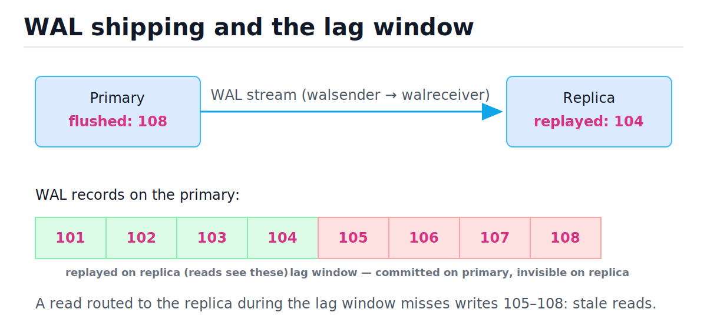
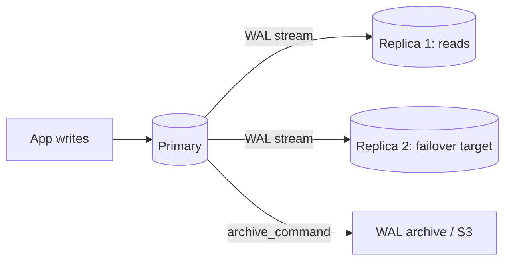
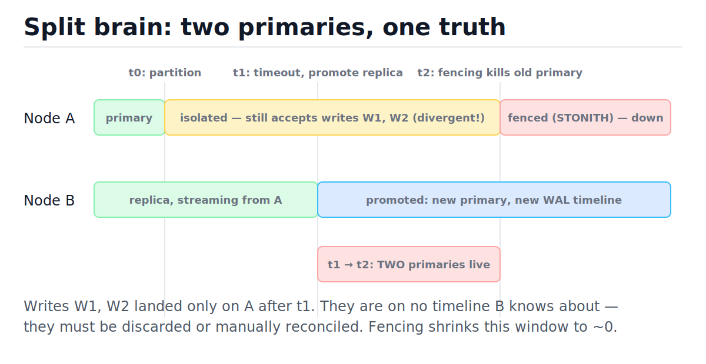
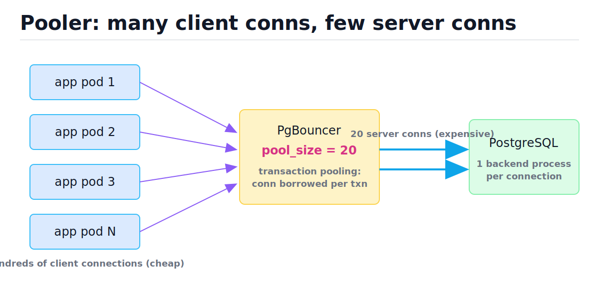

# Replication, Failover, and Connection Pooling

[toc]

> **TL;DR:** One relational database scales further than people think — but only if you ship its WAL to replicas for reads and durability, fail over safely (fencing, not hope) when the primary dies, and put a connection pooler in front so a fleet of app servers doesn't drown Postgres in expensive per-connection processes. Replication lag, split brain, and pool exhaustion are the three failure modes this note teaches you to predict and handle.

## Vocabulary

**WAL (write-ahead log)**

```math
\text{LSN} \in \{0,1,2,\dots\} \quad \text{(monotonically increasing log sequence number)}
```

The append-only redo log every change is written to before any data page. Replication is just shipping this log; each record has a position (LSN in Postgres). See [Relational Database Internals](./07-relational-database-internals.md) for why the WAL exists at all.

**Replication lag**

```math
\text{lag} = \text{LSN}_{\text{primary, flushed}} - \text{LSN}_{\text{replica, replayed}}
```

How far a replica's replayed state trails the primary, measured in bytes of WAL or seconds. Reads on a lagging replica are stale by exactly this window.

**Synchronous replication**

```math
\text{commit latency} \approx t_{\text{local fsync}} + \text{RTT} + t_{\text{replica flush}}
```

The primary withholds the commit acknowledgment until at least one replica confirms it has the WAL. Zero data loss on failover, paid for in latency on every commit.

**RPO / RTO**

```math
\text{RPO} = \text{data you may lose}, \qquad \text{RTO} = \text{time until service returns}
```

Recovery Point Objective and Recovery Time Objective — the two numbers every failover and backup design is actually negotiating.

**Split brain**

```math
|\{\text{nodes accepting writes}\}| > 1
```

Two nodes both believe they are the primary and both accept writes. The histories diverge and cannot be merged automatically.

**Fencing (STONITH)**

```math
P(\text{old primary writes after promotion}) \to 0
```

Forcibly cutting off the old primary (power it off, revoke its storage, block it at the network) before promoting a replica. "Shoot The Other Node In The Head."

**Connection pool**

```math
\text{pool\_size} \approx \text{cores} \times 2 + \text{effective spindles}
```

A small, reused set of open database connections shared by many application requests. The sizing formula is the PostgreSQL wiki heuristic, derived below.

**Partitioning vs sharding**

```math
\text{partitioning: 1 node, } N \text{ tables} \qquad \text{sharding: } N \text{ nodes}
```

Partitioning splits one logical table into pieces inside a single server; sharding splits data across servers and pushes routing into the application or a middleware layer.

## Intuition

Think of the primary database as a court stenographer: every change is dictated into one ordered transcript (the WAL) before it happens. A replica is just another clerk reading that transcript and re-performing each line. Replication is therefore *log shipping*, not "copying tables" — which is why it is cheap, ordered, and exact. The catch: the clerk is always a few lines behind the stenographer, and that gap is the replication lag window.

Look at the figure: records 101–104 exist on both nodes, but 105–108 are committed on the primary and not yet replayed on the replica. Any read routed to the replica during this window simply does not see those writes.





## How it works

### Streaming replication: WAL shipping mechanics

In PostgreSQL, a `walsender` process on the primary reads WAL as it is flushed and streams it over a normal TCP connection to a `walreceiver` on the replica, which writes it to local disk; a startup process then replays it against the replica's data pages. The replica is a byte-identical physical copy — same page layout, same indexes — which is why this is called *physical* replication. Logical replication (`pgoutput` plugin, publications/subscriptions) instead decodes WAL into row-level changes, allowing different schemas, versions, and selective tables, at higher CPU cost.

```sql
-- On the primary: see each replica's progress (PostgreSQL-only syntax).
SELECT client_addr,
       sent_lsn,
       replay_lsn,
       pg_wal_lsn_diff(sent_lsn, replay_lsn) AS replay_lag_bytes
FROM pg_stat_replication;

-- On a replica: lag in seconds.
SELECT now() - pg_last_xact_replay_timestamp() AS replay_lag;
```

> [!NOTE]
> A replica replays WAL with a single process, while the primary generated it with many concurrent backends. A bulk write burst on the primary can therefore lag the replica even on identical hardware — replay is the serial bottleneck.

### Sync vs async vs semi-sync: the durability dial

Asynchronous replication acknowledges commits after the local WAL fsync only; if the primary dies, every committed-but-unshipped transaction is lost (RPO > 0). Synchronous replication (`synchronous_commit = on` plus `synchronous_standby_names`) waits for a replica to confirm the WAL flush, so RPO = 0 — but every commit now pays a network round trip, and if the sync replica dies, **writes stall entirely**. Semi-sync compromises: require any 1 of N replicas to confirm, so one slow or dead replica doesn't halt the primary.

| Mode | RPO | Commit latency | Failure coupling |
| :--- | :---: | :---: | :--- |
| Async | seconds of WAL | local fsync only | none — replica death is invisible |
| Sync (1 named standby) | 0 | + RTT + remote flush | standby death blocks all commits |
| Semi-sync (`ANY 1 (a,b,c)`) | 0 | + fastest replica RTT | tolerant of N−1 replica failures |

> [!IMPORTANT]
> Sync replication guarantees the WAL is *flushed* on the replica, not yet *replayed*. A read on the sync replica immediately after commit can still be stale. Durability and read-visibility are different promises.

### Replication lag: causes, monitoring, read-your-writes

Lag comes from four places: network throughput (a bulk load generates WAL faster than the wire ships it), single-threaded replay, replica disk I/O contention with read queries, and replay conflicts (a long replica query blocks replay of a vacuum cleanup, governed by `max_standby_streaming_delay`). Monitor lag in both bytes (`pg_stat_replication`) and seconds, and alert on it — it is your live RPO. The application-layer problem is **read-your-writes**: a user POSTs a comment (primary), the next GET hits a replica, and their comment is "gone." Fixes, cheapest first:

1. **Pin after write** — route a session to the primary for N seconds after any write (sticky routing in the app or proxy).
2. **LSN tokens** — after a write, capture `pg_current_wal_lsn()`; before a replica read, wait until `pg_last_wal_replay_lsn()` has passed it.
3. **Critical reads to primary** — route reads that feed a decision (balance checks, uniqueness checks) to the primary always.

This is the same consistency menu covered from the distributed-systems side in [Database Scaling: Replication and Sharding](../System-Design/06-database-scaling-replication-and-sharding.md) and [Consistency Models, CAP, and Quorums](../System-Design/07-consistency-models-cap-and-quorums.md).

### Failover: detection, promotion, fencing

Failover has three phases: **detect** (health checks from an orchestrator like Patroni, with a consensus store such as etcd holding the leader lease, so a network blip is distinguished from a dead node), **fence** (cut the old primary off — kill its VM, revoke its block storage, drop its leader lease — *before* anyone else takes over), and **promote** (the most caught-up replica replays its remaining WAL, switches to a new timeline, and starts accepting writes while clients are repointed via DNS, a VIP, or the proxy layer). A *planned switchover* is the calm version: stop writes, wait for lag = 0, promote, repoint — RPO 0, RTO seconds. A *crash failover* with async replication loses the lag window.

The hazard is split brain. Walk the timeline figure: at t0 a partition isolates the primary; at t1 the orchestrator times out and promotes node B; until fencing lands at t2, node A is alive, reachable by *some* clients, and accepting writes that exist on no timeline B knows about.



| Step | Node A state | Node B state | Orchestrator decision |
| :--- | :--- | :--- | :--- |
| t0 | primary, partitioned | replica, stream broken | health checks failing, lease not yet expired |
| t0→t1 | accepting writes W1, W2 | idle, lag frozen | wait out lease TTL (avoid flapping) |
| t1 | still accepting writes | promoted, new timeline | promote B; clients repointed |
| t1→t2 | **second live primary** | primary | split brain — W1, W2 divergent |
| t2 | fenced (storage revoked) | primary | safe; reconcile or discard W1, W2 |

> [!CAUTION]
> Never automate promotion without automating fencing. An orchestrator that promotes on timeout but cannot kill the old primary converts every network partition into potential data divergence — the worst incident class a relational database has.

### Connection pooling: why Postgres connections are expensive

PostgreSQL forks **one OS process per connection**. Each backend costs a fork, an authentication handshake, and several MB of memory, plus per-backend caches (prepared plans, catalog cache) that grow over time; with 5,000 direct connections the server burns gigabytes on idle backends and the scheduler thrashes. A pooler (PgBouncer, or your driver's built-in pool) accepts thousands of cheap client connections and multiplexes them onto a few dozen real server connections — see the figure.



The PostgreSQL wiki's sizing heuristic for the *server-side* pool:

```math
\text{pool\_size} = (\text{core\_count} \times 2) + \text{effective\_spindle\_count}
```

The logic: a connection is either using a CPU core or waiting on disk. With hyperthreading-ish overlap, about 2 runnable connections per core keep the CPUs busy, plus one per independent disk that can serve an I/O concurrently (an SSD/NVMe counts as several "effective spindles"; a fully cached working set counts as ~0). For a 16-core box on NVMe, that lands in the 30–50 range — *not* 500. Beyond saturation, extra connections only add context-switch overhead and **reduce** total throughput.

> [!TIP]
> The production idiom: tiny server-side pool (tens of connections), big client-side limits, and queueing at the pooler. Letting requests wait a few ms for a connection beats letting 1,000 connections fight over 16 cores.

Pooling modes, in PgBouncer's terms:

| Mode | Connection returned to pool... | Breaks |
| :--- | :--- | :--- |
| Session | when the client disconnects | nothing — but barely pools |
| Transaction | at every `COMMIT`/`ROLLBACK` | session state: `SET`, `LISTEN/NOTIFY`, advisory locks, server-side cursors, named prepared statements (pre-1.21) |
| Statement | after every statement | multi-statement transactions entirely |

> [!WARNING]
> Transaction pooling silently breaks anything that assumes "my connection is mine": session-level advisory locks vanish mid-logical-operation, `SET search_path` leaks to the next tenant, and prepared statements hit "prepared statement does not exist". Audit for these before flipping the mode.

### Partitioning (one node) vs sharding (many nodes)

Declarative partitioning splits one table into child tables on a single server — by **range** (time-series: one partition per month), **list** (one per region/tenant class), or **hash** (even spread when no natural key exists). The planner does *partition pruning*: a query with a `WHERE` on the partition key touches only matching partitions, and dropping old data is `DROP TABLE` on one partition instead of a million-row `DELETE`. Sharding is the cross-node version: data is split across independent servers, routing moves into the application or middleware (Citus for Postgres, Vitess for MySQL), and the price is that cross-shard joins, transactions, and unique constraints stop being free — exhaust partitioning, replicas, and vertical scaling first.

```sql
-- PostgreSQL declarative range partitioning (PostgreSQL-only syntax).
CREATE TABLE events (
    id         bigint GENERATED ALWAYS AS IDENTITY,
    created_at timestamptz NOT NULL,
    payload    jsonb
) PARTITION BY RANGE (created_at);

CREATE TABLE events_2026_06 PARTITION OF events
    FOR VALUES FROM ('2026-06-01') TO ('2026-07-01');

-- Pruning: this scans ONLY events_2026_06.
EXPLAIN SELECT count(*) FROM events
WHERE created_at >= '2026-06-10' AND created_at < '2026-06-11';
```

### Backups and point-in-time recovery

Replication is not a backup: a `DROP TABLE` replicates in milliseconds. A **physical** backup (`pg_basebackup`) copies the data directory — fast to restore, version-locked, whole-cluster only. A **logical** backup (`pg_dump`) emits SQL — slow to restore but selective and portable across versions. Point-in-time recovery (PITR) combines a base backup with a continuously archived WAL stream (`archive_command`): restore the base, replay WAL up to `recovery_target_time = '14:31:59'`, one second before the disaster. Your RPO is your WAL-archiving frequency; your RTO is restore + replay time — measure both.

> [!IMPORTANT]
> An untested backup is not a backup; it is a hope. Restore into a scratch instance on a schedule, run integrity checks, and time it — that timing *is* your real RTO.

## Complexity

Pooling and replication trade constant factors, not asymptotics, but the queueing behavior has clean bounds worth knowing. Costs below are per-operation as seen by the application.

| Operation | Best | Average | Worst | Space |
| :--- | :---: | :---: | :---: | :--- |
| Async commit (local) | O(1) fsync | O(1) | O(1) | WAL bytes |
| Sync commit | O(1) + 1 RTT | O(1) + RTT | unbounded (standby down) | WAL ×2 |
| Replica replay of N records | O(N) | O(N) | O(N), serial | data pages |
| Failover (detect+promote) | O(lag) replay | O(lag) | O(lag) + fencing timeout | — |
| Pool checkout (conn idle) | O(1) | O(1) | — | O(pool_size) conns |
| Pool checkout (exhausted) | O(1) after free | wait W_q | timeout → error | queue depth |
| New direct PG connection | fork + auth, ~ms | ~ms | — | MBs per backend |
| Partition-pruned query | O(1 partition) | O(k matched) | O(P) all partitions | catalog per partition |
| Cross-shard join | O(1 shard) | O(shards) fan-out | full scatter-gather | network buffers |

The key bound is pool wait time. Model the pool as a queue with c connections, arrival rate λ requests/sec, and mean service (query) time s. The pool saturates when offered load reaches capacity:

```math
\rho = \frac{\lambda \cdot s}{c} \quad ; \quad \text{stable iff } \rho < 1, \qquad \text{e.g. } \lambda = 2000/\text{s},\; s = 5\,\text{ms} \Rightarrow \lambda s = 10 \text{ busy conns}
```

Why this matters: by Little's law the number of busy connections is λ·s regardless of pool size. If λ·s = 10, a pool of 40 is mostly idle and a pool of 12 is fine; if a slow query pushes s from 5 ms to 500 ms, λ·s jumps to 1000, every pool exhausts, and queue wait grows without bound (ρ > 1). Pool exhaustion is almost always a *latency* regression upstream, not "too few connections."

## In production

The physical reality behind each layer. WAL streaming is sequential I/O on both ends — the primary appends, the replica appends then replays with random page writes; put `pg_wal` on fast storage and watch replica I/O saturation during vacuum storms. Each Postgres backend is a real OS process: ~1–3 MB base, growing with catalog and plan caches, so `max_connections = 5000` means the kernel scheduler juggles 5,000 processes for 16 cores — this, not memory alone, is why poolers exist. Failover orchestration in practice is Patroni + etcd (lease-based leadership), or a managed service (RDS Multi-AZ, Cloud SQL HA) doing the same dance with block-storage fencing.

Real failure modes seen in incident reviews:

- **Lag-driven correctness bugs**: a job reads "latest" state from a replica and re-issues work the primary already recorded. Idempotency keys or LSN waits fix it.
- **Promotion to a stale replica**: with async replication and multiple replicas, promote the one with the highest replayed LSN or you widen data loss; orchestrators compare LSNs for exactly this reason.
- **Connection storm after failover**: every app server reconnects simultaneously, the new primary forks thousands of backends, and the database falls over *again*. Poolers plus jittered reconnect backoff prevent the thundering herd.
- **Pool deadlock**: a request holds connection 1 and synchronously waits for work that needs connection 2 from the same exhausted pool. Never nest checkouts.
- **WAL archive disk fill**: a dead replica with a replication slot pins WAL forever; the primary's disk fills and it stops accepting writes. Monitor slot retention.

> [!NOTE]
> Kubernetes deployments push the same pattern one layer up: a PgBouncer Deployment behind a Service, with readiness probes gating failover repointing — the routing mechanics rhyme with [Services, Endpoints, and kube-proxy](../Infrastructure-DevOps/Kubernetes/5-services-endpoints-and-kube-proxy.md).

## Real-world example

You run a checkout service. Load tests show direct connections collapsing the database at 800 concurrent requests, so you put a pool in front. Here is a minimal but honest connection pool — checkout/checkin, exhaustion handling with a timeout, and a guard against double-checkin — runnable as-is (the "connection" is a stub standing in for a real driver handle).

```python
import threading
import time
from collections import deque
from typing import Callable, Optional


class PoolExhaustedError(Exception):
    """No connection became free within the timeout."""


class FakeConnection:
    """Stand-in for a real DB connection (e.g. psycopg)."""

    _counter = 0

    def __init__(self) -> None:
        FakeConnection._counter += 1
        self.conn_id = FakeConnection._counter
        self.closed = False

    def execute(self, sql: str) -> str:
        if self.closed:
            raise RuntimeError("connection is closed")
        return "ok:" + sql

    def close(self) -> None:
        self.closed = True


class ConnectionPool:
    """Fixed-size pool: O(1) checkout/checkin, FIFO reuse."""

    def __init__(
        self,
        factory: Callable[[], FakeConnection],
        size: int,
        checkout_timeout: float = 1.0,
    ) -> None:
        self._factory = factory
        self._size = size
        self._timeout = checkout_timeout
        self._idle: deque = deque(factory() for _ in range(size))
        self._checked_out: set = set()
        self._lock = threading.Lock()
        self._available = threading.Condition(self._lock)

    def checkout(self) -> FakeConnection:
        deadline = time.monotonic() + self._timeout
        with self._available:
            while not self._idle:
                remaining = deadline - time.monotonic()
                if remaining <= 0:
                    raise PoolExhaustedError(
                        "no connection free after %.2fs" % self._timeout
                    )
                self._available.wait(remaining)
            conn = self._idle.popleft()
            self._checked_out.add(conn.conn_id)
            return conn

    def checkin(self, conn: FakeConnection) -> None:
        with self._available:
            if conn.conn_id not in self._checked_out:
                raise ValueError("connection was not checked out")
            self._checked_out.discard(conn.conn_id)
            self._idle.append(conn)
            self._available.notify()

    def stats(self) -> dict:
        with self._lock:
            return {"idle": len(self._idle), "busy": len(self._checked_out)}


# --- Behavior checks -------------------------------------------------
pool = ConnectionPool(FakeConnection, size=2, checkout_timeout=0.05)

c1 = pool.checkout()
c2 = pool.checkout()
assert pool.stats() == {"idle": 0, "busy": 2}
assert c1.execute("SELECT 1") == "ok:SELECT 1"

# Exhaustion: third checkout times out instead of hanging forever.
try:
    pool.checkout()
    raise AssertionError("expected PoolExhaustedError")
except PoolExhaustedError:
    pass

# Checkin frees a slot; FIFO reuse hands back the same connection.
pool.checkin(c1)
assert pool.stats() == {"idle": 1, "busy": 1}
c3 = pool.checkout()
assert c3.conn_id == c1.conn_id  # reused, not re-created

# Double checkin is rejected.
maybe_err: Optional[ValueError] = None
try:
    pool.checkin(c3)
    pool.checkin(c3)
except ValueError as exc:
    maybe_err = exc
assert maybe_err is not None

# A blocked waiter wakes when another thread checks in.
result: list = []

def waiter() -> None:
    conn = pool.checkout()
    result.append(conn.conn_id)
    pool.checkin(conn)

t = threading.Thread(target=waiter)
t.start()
time.sleep(0.01)
pool.checkin(c2)
t.join()
assert result, "waiter should have acquired a connection"
print("all pool assertions passed")
```

Real pools (SQLAlchemy's `QueuePool`, psycopg's `ConnectionPool`, HikariCP) add what this omits: health checks on checkout (`SELECT 1`), max connection lifetime to recycle stale TCP sessions through failovers, and overflow connections. The thread-coordination machinery here is plain `threading.Condition` — background in [The GIL, Threads, Multiprocessing](../Programming-Languages/Python/8-the-gil-threads-multiprocessing.md).

## When to use / When NOT to use

**Use read replicas** when read QPS dominates and staleness measured in tens of milliseconds is acceptable (feeds, catalogs, dashboards). **Don't** route read-after-write or decision-feeding reads to replicas without an LSN or stickiness scheme. **Use sync replication** when losing a single committed transaction is unacceptable (payments, ledgers) and you can afford the RTT. **Use a pooler** whenever connection count exceeds ~2× cores — i.e., almost always with Postgres and any horizontally scaled app tier; skip the transaction-pooling mode if you depend on session state. **Use partitioning** for time-series retention and very large tables with a hot recent range; **reach for sharding** only after replicas + partitioning + bigger hardware are exhausted, because cross-shard joins and transactions are a permanent tax.

## Common mistakes

- **"Replication is my backup"** — replication replicates your mistakes at wire speed; only base backup + WAL archive (PITR) rewinds a `DROP TABLE`.
- **"Sync replication means replicas serve fresh reads"** — sync guarantees the replica *flushed* the WAL, not that it *replayed* it; reads can still be stale.
- **"More connections = more throughput"** — past ~2×cores + spindles, throughput *falls*; busy connections are λ·s by Little's law, independent of pool size.
- **"Failover automation is enough"** — promotion without fencing turns partitions into split brain; the old primary must be provably dead first.
- **"Transaction pooling is a drop-in flag"** — it breaks advisory locks, `SET` session state, and prepared statements; audit before enabling.
- **"Lag is a network problem"** — single-threaded replay and replica I/O contention dominate as often as the wire does.
- **"We have backups"** — untested backups fail at restore time with surprising regularity; restoring on a schedule is the only proof.

## Interview questions and answers

**1. Walk me through what happens when a write commits on a primary with one async replica.**
**Answer:** The backend writes the change to the WAL buffer, fsyncs the WAL to local disk, and acknowledges the client — that's the commit. Separately, the walsender streams those WAL bytes to the replica's walreceiver, which fsyncs them and replays them onto its data pages. The client never waits for the replica, which is why a primary crash can lose the in-flight tail of the WAL.

**2. Your users complain that items they just created disappear on refresh. Diagnose it.**
**Answer:** Classic read-your-writes violation: the POST hit the primary, the refresh GET was load-balanced to a lagging replica. Fixes in cost order — pin the session to the primary for a few seconds after a write, or capture the commit LSN and have the replica read wait until replay passes it, or send those specific reads to the primary.

**3. What is split brain and how do you actually prevent it?**
**Answer:** It's two nodes both accepting writes after a partition — the old primary never learned it was deposed. Prevention is fencing: before promoting, you make the old primary provably unable to write — kill its VM, revoke its storage, or expire a consensus-backed leader lease it must hold to accept writes. Detection timeouts alone just shrink the window; fencing closes it.

**4. Why does PostgreSQL need an external pooler when MySQL often doesn't?**
**Answer:** Postgres forks one OS process per connection, each with megabytes of memory and its own caches, so thousands of connections crush the scheduler and RAM. MySQL uses a thread per connection, which is lighter. PgBouncer turns thousands of cheap client sockets into a few dozen real backends, which is roughly cores×2 plus effective spindles — the saturation point of the machine.

**5. How would you size a connection pool for a 16-core NVMe database server?**
**Answer:** Start from the wiki heuristic, cores×2 plus effective spindles — call it 35–50. Then sanity-check with Little's law: busy connections equal arrival rate times mean query time, so 2,000 qps at 5 ms is only 10 busy connections. Size for that plus headroom, queue the rest at the pooler, and alert on pool wait time, because exhaustion almost always means a query got slow, not that the pool got small.

**6. Sync vs async replication — when do you pick which?**
**Answer:** It's an RPO-versus-latency dial. Async loses the lag window on a crash but keeps commits at local-fsync speed — fine for most products. Sync gives RPO zero but adds an RTT to every commit and stalls writes if the standby dies, so in practice you run semi-sync — any one of N replicas must confirm — for money-movement systems.

**7. What does transaction pooling break, concretely?**
**Answer:** Anything that assumes the session outlives a transaction, because your next transaction may run on a different server connection. Session-level advisory locks, SET variables like search_path, LISTEN/NOTIFY, server-side cursors held across commits, and traditionally named prepared statements. You either avoid those features, scope them inside one transaction, or stay in session mode.

**8. Difference between partitioning and sharding, and which do you do first?**
**Answer:** Partitioning splits a table inside one server — the planner prunes partitions and retention becomes a partition drop; transactions and joins still just work. Sharding splits across servers, so routing moves into the app or a layer like Citus or Vitess, and cross-shard joins, transactions, and unique constraints become your problem. Partition first; shard when one node genuinely can't hold the writes or working set.

**9. Design a backup strategy with a 5-minute RPO and 1-hour RTO.**
**Answer:** Nightly physical base backup plus continuous WAL archiving with the archive interval well under 5 minutes — that bounds RPO. For RTO, keep a restore runbook and pre-provisioned hardware, and actually rehearse the restore monthly, timing base-restore plus WAL replay; if replay of a day's WAL exceeds the hour, take base backups more often. An untested backup doesn't count as one.

## Practice path

1. Run two local Postgres instances; configure streaming replication with `pg_basebackup` and confirm rows appear on the replica.
2. Query `pg_stat_replication` during a bulk `INSERT` and watch lag grow in bytes; explain which bottleneck you hit.
3. Promote the replica with `pg_ctl promote`; observe the timeline switch in the WAL filenames.
4. Reproduce read-your-writes: write to primary, immediately read replica; then fix it with `pg_current_wal_lsn()` / `pg_last_wal_replay_lsn()` waiting.
5. Extend the Python pool above with a max-lifetime recycle and a health check on checkout; add asserts.
6. Put PgBouncer in transaction mode in front of a toy app and find one thing it breaks (try an advisory lock).
7. Create a range-partitioned table, run `EXPLAIN` with and without the partition key in the predicate, and confirm pruning.
8. Take a base backup + WAL archive, drop a table, and PITR to one second before the drop.

## Copyable takeaways

- Replication is WAL shipping: an ordered redo log replayed elsewhere; the replica trails by the lag window, which is your live RPO under async.
- Sync/semi-sync trades commit latency for RPO = 0; sync to one standby couples your write availability to that standby.
- Read-your-writes fixes: sticky-to-primary after writes, LSN wait tokens, or primary-only critical reads.
- Failover = detect + **fence** + promote. Promotion without fencing is a split-brain generator.
- Postgres connections are processes: pool_size ≈ cores×2 + effective spindles; busy conns = λ·s (Little's law); exhaustion usually means a query got slow.
- Transaction pooling breaks session state (advisory locks, SET, prepared statements) — audit first.
- Partition within a node (range/list/hash, pruning, cheap retention) before sharding across nodes (routing tax, no cross-shard joins).
- PITR = base backup + WAL archive; replication is not a backup; an untested backup is not a backup.

## Sources

- PostgreSQL docs — High Availability, Load Balancing, and Replication: https://www.postgresql.org/docs/current/high-availability.html
- PostgreSQL docs — Continuous Archiving and Point-in-Time Recovery: https://www.postgresql.org/docs/current/continuous-archiving.html
- PostgreSQL wiki — Number Of Database Connections (pool sizing heuristic): https://wiki.postgresql.org/wiki/Number_Of_Database_Connections
- PgBouncer docs — pooling modes and feature matrix: https://www.pgbouncer.org/features.html
- PostgreSQL docs — Table Partitioning: https://www.postgresql.org/docs/current/ddl-partitioning.html
- Kleppmann, *Designing Data-Intensive Applications*, Ch. 5 (Replication) and Ch. 6 (Partitioning).
- Google SRE Book, Ch. 26 — Data Integrity: https://sre.google/sre-book/data-integrity/

## Related

- [Relational Database Internals](./07-relational-database-internals.md) — the WAL, buffer pool, and fsync mechanics replication is built on.
- [Transactions, ACID, and Isolation Levels](./06-transactions-acid-and-isolation-levels.md) — what "committed" means before it gets shipped.
- [Database Scaling: Replication and Sharding](../System-Design/06-database-scaling-replication-and-sharding.md) — the same topics from the system-design altitude.
- [Consistency Models, CAP, and Quorums](../System-Design/07-consistency-models-cap-and-quorums.md) — the theory behind stale reads and split brain.
- [Distributed Locks, Leader Election, and Time](../System-Design/11-distributed-locks-leader-election-and-time.md) — leases and fencing tokens in general form.
- [TCP and UDP](../Computer-Networking/5-tcp-and-udp.md) — the transport under the WAL stream and every pooled connection.
