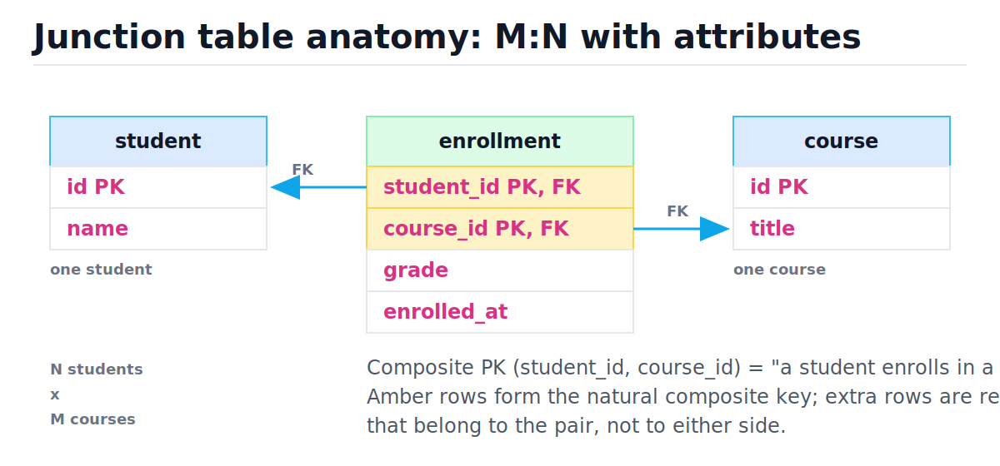
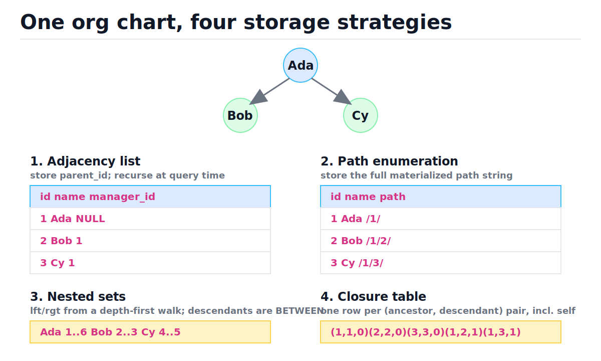
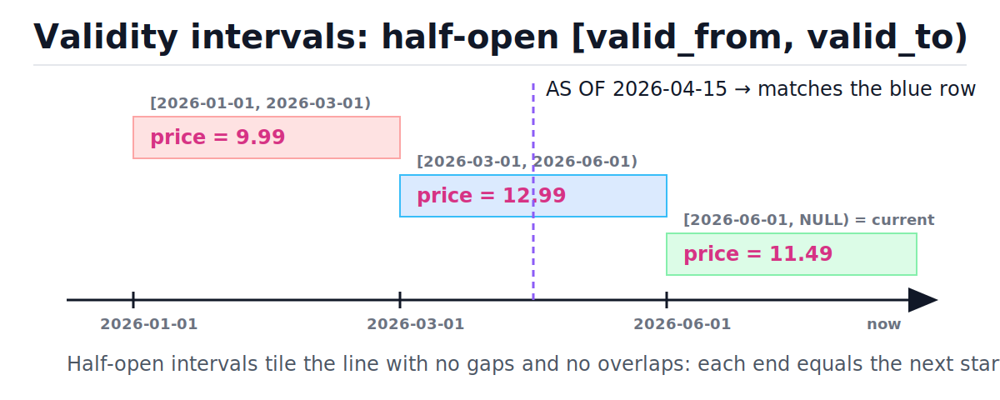

# Relational Data Modeling Patterns

[toc]

> **TL;DR:** A handful of structural patterns cover most schema-review feedback: junction tables for M:N, self-referencing FKs and the four tree strategies, polymorphic associations done safely, soft deletes with partial unique indexes, audit/temporal columns with validity intervals, UUID-vs-serial keys, and enums via CHECK or lookup table. Each pattern trades write cost, read cost, and integrity guarantees — know the trade before you pick.

## Vocabulary

**Junction table**

```math
R \subseteq A \times B
```

A table whose rows represent a many-to-many relationship between two entities; each row is one (a, b) pair, optionally with attributes that belong to the pair itself.

**Composite primary key**

```math
\text{PK} = (\text{col}_1, \text{col}_2)
```

A primary key spanning multiple columns. On a junction table, the pair of FKs is a natural composite key that also enforces "at most one link per pair".

**Surrogate key**

```math
\text{id} \in \mathbb{Z}^{+} \quad \text{or} \quad \text{id} \in \text{UUID}
```

A meaningless generated identifier (serial integer or UUID) used as PK instead of natural attributes. Stable under business-rule changes; carries no uniqueness semantics of its own.

**Self-referencing FK**

```math
\text{employee.manager\_id} \rightarrow \text{employee.id}
```

A foreign key pointing back into its own table. The standard way to store hierarchies (employee/manager, comment threads, categories).

**Recursive CTE**

```math
T = T_{\text{base}} \cup f(T)
```

A `WITH RECURSIVE` query that starts from anchor rows and repeatedly joins back into the table until no new rows appear — a fixed-point computation, like BFS over FK edges.

**Closure table**

```math
C = \{(a, d, \text{depth}) : a \text{ is an ancestor of } d\}
```

A separate table storing every ancestor–descendant pair, including each node paired with itself at depth 0. Trades O(n · depth) storage for O(1)-join subtree and ancestor queries.

**Polymorphic association**

```math
\text{comment} \rightarrow \{\text{post} \mid \text{photo} \mid \text{video}\}
```

A row that may reference one of several parent tables. Dangerous when modeled as bare `(type, id)` columns because the database cannot enforce the FK.

**Soft delete**

```math
\text{deleted\_at} \in \{\text{NULL}, \text{timestamp}\}
```

Marking a row deleted instead of removing it. NULL means alive. Preserves history and FK targets, at the cost of filtering every query.

**Validity interval**

```math
[\text{valid\_from}, \text{valid\_to})
```

A half-open time range during which a row version is true. Half-open intervals tile time with no gaps or overlaps because each `valid_to` equals the next `valid_from`.

## Intuition

Most schema patterns answer one question: *where does this relationship live, and who enforces it?* The relational model only gives you tables, columns, and constraints — so relationships richer than 1:N (many-to-many, hierarchies, "points at one of several tables", "was true during this period") all get encoded as extra tables or extra columns plus constraints. The patterns in this note are the well-worn encodings, and each one has a known cost profile.

The first picture to internalize is the junction table: an M:N relationship is itself a table, and any attribute of the *relationship* (a grade, a join date, a role) lives on that table, not on either entity.



## How it works

### M:N junction tables with relationship attributes

A student takes many courses; a course has many students. Neither table can hold the FK, so the pair becomes its own table. The grade belongs to the *enrollment*, not to the student or the course — putting `grade` on `student` would silently limit each student to one grade ever.

```sql
CREATE TABLE student (id INTEGER PRIMARY KEY, name TEXT NOT NULL);
CREATE TABLE course  (id INTEGER PRIMARY KEY, title TEXT NOT NULL);

CREATE TABLE enrollment (
  student_id  INTEGER NOT NULL REFERENCES student(id),
  course_id   INTEGER NOT NULL REFERENCES course(id),
  grade       TEXT,
  enrolled_at TEXT NOT NULL,
  PRIMARY KEY (student_id, course_id)
);
-- reverse-direction lookups need their own index:
CREATE INDEX idx_enrollment_course ON enrollment(course_id, student_id);
```

Composite vs surrogate PK on the junction:

| Choice | Pros | Cons |
| :--- | :--- | :--- |
| `PRIMARY KEY (student_id, course_id)` | Enforces one-link-per-pair for free; PK index serves student→courses lookups | Other tables referencing an enrollment must carry both columns |
| Surrogate `id` PK + `UNIQUE (student_id, course_id)` | Single-column FK target for child tables (e.g. `assignment_submission`) | One extra index; you must remember the UNIQUE constraint or duplicates appear |

> [!TIP]
> Default to the composite PK. Add a surrogate `id` only when another table needs to reference enrollment rows — and keep the UNIQUE pair constraint either way.

### Self-referencing FKs: employee/manager

A hierarchy inside one entity type is a column pointing at the same table's PK. The root has `manager_id NULL`. Direct reports are one self-join; whole subtrees need recursion (next section). This runnable demo builds the org chart and queries one level.

```python
import sqlite3

conn = sqlite3.connect(":memory:")
conn.executescript("""
CREATE TABLE employee (
  id         INTEGER PRIMARY KEY,
  name       TEXT NOT NULL,
  manager_id INTEGER REFERENCES employee(id)
);
INSERT INTO employee VALUES
  (1,'Ada',NULL),(2,'Bob',1),(3,'Cy',1),(4,'Dee',2),(5,'Eli',2);
""")

# direct reports of Ada: a plain self-join, O(n) scan or O(log n + k) with an index
rows = conn.execute("""
  SELECT e.name FROM employee e
  JOIN employee m ON e.manager_id = m.id
  WHERE m.name = 'Ada' ORDER BY e.name
""").fetchall()
assert [r[0] for r in rows] == ["Bob", "Cy"]
```

> [!WARNING]
> Index `manager_id`. Without it, every "who reports to X" query and every recursive step is a full table scan, and `ON DELETE` checks on the parent scan too.

### Trees in SQL: the four strategies

This is the big one. There are four standard encodings of a tree, and a reviewer expects you to name the trade-offs. The figure shows the same three-node org chart stored each way; n is node count, d is tree depth, k is result size.



| Strategy | Descendants query | Ancestors query | Move subtree | Referential integrity |
| :--- | :--- | :--- | :--- | :--- |
| Adjacency list | Recursive CTE, O(k) rows over d iterations | Recursive CTE, O(d) | O(1) — update one `parent_id` | Full — real FK |
| Path enumeration | `LIKE 'prefix%'` prefix scan, O(k) with index | Parse path in app, O(d) | O(k) string rewrites | None — path is a string, DB can't check it |
| Nested sets | `BETWEEN lft AND rgt`, O(k) range scan | `lft < x AND rgt > x`, O(d) | O(n) — renumber large fractions of the table | Weak — numbers, no FK on structure |
| Closure table | One join on ancestor, O(k) | One join on descendant, O(d) | O(subtree × d) row rewrites | Full — both columns are FKs |

#### Adjacency list + recursive CTE (the default)

Store `parent_id`, recurse at query time. Since SQLite 3.8.3 and PostgreSQL 8.4, `WITH RECURSIVE` makes the old "can't get a subtree in one query" objection obsolete. Walk the query like the engine does: (1) the anchor `SELECT` seeds the working set with Ada; (2) each iteration joins the previous iteration's rows against `employee` on `manager_id`, finding the next level; (3) iteration stops when a level produces zero rows. It is BFS over FK edges.

```python
import sqlite3

conn = sqlite3.connect(":memory:")
conn.executescript("""
CREATE TABLE employee (
  id INTEGER PRIMARY KEY, name TEXT NOT NULL,
  manager_id INTEGER REFERENCES employee(id)
);
CREATE INDEX idx_emp_mgr ON employee(manager_id);
INSERT INTO employee VALUES
  (1,'Ada',NULL),(2,'Bob',1),(3,'Cy',1),(4,'Dee',2),(5,'Eli',2);
""")

subtree = conn.execute("""
WITH RECURSIVE sub(id, name, depth) AS (
  SELECT id, name, 0 FROM employee WHERE name = 'Bob'   -- anchor
  UNION ALL
  SELECT e.id, e.name, sub.depth + 1                    -- recursive step
  FROM employee e JOIN sub ON e.manager_id = sub.id
)
SELECT name, depth FROM sub ORDER BY depth, name
""").fetchall()
assert subtree == [("Bob", 0), ("Dee", 1), ("Eli", 1)]

# ancestors: same shape, follow manager_id upward instead
chain = conn.execute("""
WITH RECURSIVE up(id, name, manager_id) AS (
  SELECT id, name, manager_id FROM employee WHERE name = 'Dee'
  UNION ALL
  SELECT e.id, e.name, e.manager_id
  FROM employee e JOIN up ON up.manager_id = e.id
)
SELECT name FROM up
""").fetchall()
assert [r[0] for r in chain] == ["Dee", "Bob", "Ada"]
```

| Step | Working set (sub) | Decision |
| :--- | :--- | :--- |
| 0 (anchor) | (Bob, depth 0) | Seed; continue |
| 1 | (Dee, 1), (Eli, 1) | New rows found; recurse again |
| 2 | ∅ | Empty level → stop; emit union of all levels |

#### Path enumeration

Store the full ancestor path as a delimited string (`/1/2/4/`). Descendants are a prefix match; ancestors come from splitting the path in the application. It is fast to read and easy to sort, but the database cannot verify the string, so paths drift out of sync with reality unless every write goes through disciplined code.

```sql
-- descendants of Bob (path '/1/2/'):
SELECT * FROM employee WHERE path LIKE '/1/2/%';
-- needs a text index; the trailing % keeps it a prefix range scan
```

#### Nested sets

Number nodes by a depth-first walk: each node gets `lft` on entry and `rgt` on exit. A node's subtree is exactly the rows with `lft BETWEEN parent.lft AND parent.rgt` — one indexed range scan, no recursion. The catastrophic cost is writes: inserting or moving a node renumbers, on average, half the table. Use only for read-overwhelmingly-dominant trees (published taxonomies, CMS menus).

```sql
-- subtree of Ada (lft=1, rgt=6 in the figure):
SELECT * FROM tree WHERE lft BETWEEN 1 AND 6;
```

#### Closure table

Materialize every ancestor–descendant pair. Reads become plain joins, integrity is real FKs, and depth is stored explicitly. Cost: O(n · d) rows of storage and multi-row maintenance on insert/move.

```python
import sqlite3

conn = sqlite3.connect(":memory:")
conn.executescript("""
CREATE TABLE node (id INTEGER PRIMARY KEY, name TEXT NOT NULL);
CREATE TABLE node_closure (
  ancestor   INTEGER NOT NULL REFERENCES node(id),
  descendant INTEGER NOT NULL REFERENCES node(id),
  depth      INTEGER NOT NULL,
  PRIMARY KEY (ancestor, descendant)
);
INSERT INTO node VALUES (1,'Ada'),(2,'Bob'),(3,'Cy'),(4,'Dee');
-- self rows (depth 0) + every ancestor pair:
INSERT INTO node_closure VALUES
  (1,1,0),(2,2,0),(3,3,0),(4,4,0),
  (1,2,1),(1,3,1),(2,4,1),(1,4,2);
""")

# whole subtree of Ada: a single join, no recursion
sub = conn.execute("""
  SELECT n.name FROM node_closure c JOIN node n ON n.id = c.descendant
  WHERE c.ancestor = 1 AND c.depth > 0 ORDER BY n.name
""").fetchall()
assert [r[0] for r in sub] == ["Bob", "Cy", "Dee"]

# inserting Eli under Dee: self row + copy Dee's ancestor rows with depth+1
conn.execute("INSERT INTO node VALUES (5,'Eli')")
conn.execute("INSERT INTO node_closure VALUES (5,5,0)")
conn.execute("""
  INSERT INTO node_closure (ancestor, descendant, depth)
  SELECT ancestor, 5, depth + 1 FROM node_closure WHERE descendant = 4
""")
depth = conn.execute(
    "SELECT depth FROM node_closure WHERE ancestor=1 AND descendant=5"
).fetchone()[0]
assert depth == 3
```

> [!IMPORTANT]
> Default to adjacency list + recursive CTE. Reach for a closure table when subtree queries are hot and you need real FK integrity; reach for nested sets only when the tree is effectively read-only.

### Polymorphic associations, three ways

A `comment` may attach to a post, a photo, or a video. The tempting encoding — `commentable_type TEXT, commentable_id INTEGER` — is the anti-pattern: no FK can target "one of several tables", so the database will happily keep comments pointing at deleted or never-existing parents. Three legitimate alternatives:

```sql
-- (1) Exclusive nullable FKs + CHECK exactly one is set. Real FKs, real CASCADE.
CREATE TABLE comment (
  id       INTEGER PRIMARY KEY,
  body     TEXT NOT NULL,
  post_id  INTEGER REFERENCES post(id),
  photo_id INTEGER REFERENCES photo(id),
  video_id INTEGER REFERENCES video(id),
  CHECK (
    (post_id IS NOT NULL) + (photo_id IS NOT NULL) + (video_id IS NOT NULL) = 1
  )
);

-- (2) Single-table inheritance: merge the parents into one table with a type tag.
CREATE TABLE media (
  id   INTEGER PRIMARY KEY,
  kind TEXT NOT NULL CHECK (kind IN ('post','photo','video')),
  -- union of all columns; irrelevant ones stay NULL
  body TEXT, url TEXT, duration_s INTEGER
);
-- comment now has one ordinary FK: media_id REFERENCES media(id)
```

| Approach | Integrity | Query ergonomics | Cost |
| :--- | :--- | :--- | :--- |
| Nullable FKs + CHECK | Full | One COALESCE-y join per parent type | One column per parent type; adding a type is a migration |
| Single-table inheritance | Full | Trivial — one parent table | Wide sparse table; per-type NOT NULL rules need CHECKs |
| Bare `(type, id)` | **None** | Looks clean in the ORM | Orphans accumulate silently; joins can't use FK metadata |

> [!CAUTION]
> The bare `(type, id)` pattern (Rails `polymorphic: true` without DB constraints) means deleting a post leaves its comments pointing at nothing, and nothing errors. The corruption is discovered months later by a report, not by the write that caused it.

### Soft deletes and the unique-email problem

Soft delete keeps history and keeps FK targets valid, but it levies a tax: *every* query against the table must add `WHERE deleted_at IS NULL`, forever, including the join paths through it. The subtle break is uniqueness — a plain `UNIQUE(email)` blocks a new signup from reusing a deleted account's email. The fix is a **partial unique index**: uniqueness only among living rows. PostgreSQL and SQLite both support `CREATE UNIQUE INDEX ... WHERE`; this demo runs on SQLite.

```python
import sqlite3

conn = sqlite3.connect(":memory:")
conn.executescript("""
CREATE TABLE app_user (
  id         INTEGER PRIMARY KEY,
  email      TEXT NOT NULL,
  deleted_at TEXT  -- NULL = alive
);
CREATE UNIQUE INDEX uq_user_email_alive
  ON app_user(email) WHERE deleted_at IS NULL;
""")
conn.execute("INSERT INTO app_user (email) VALUES ('a@x.com')")
conn.execute("UPDATE app_user SET deleted_at = '2026-06-01' WHERE email='a@x.com'")
# same email can sign up again because the dead row is outside the index:
conn.execute("INSERT INTO app_user (email) VALUES ('a@x.com')")

# but two LIVING rows with the same email are rejected:
try:
    conn.execute("INSERT INTO app_user (email) VALUES ('a@x.com')")
    raised = False
except sqlite3.IntegrityError:
    raised = True
assert raised
assert conn.execute(
    "SELECT COUNT(*) FROM app_user WHERE deleted_at IS NULL"
).fetchone()[0] == 1
```

On engines without partial indexes (MySQL before 8.0 functional-index workarounds), the common trick is a generated/derived column like `email_alive = IF(deleted_at IS NULL, email, NULL)` with a normal unique index — NULLs don't collide.

> [!TIP]
> Hide the filter tax behind a view (`CREATE VIEW live_user AS SELECT * FROM app_user WHERE deleted_at IS NULL`) or your ORM's default scope, and audit raw-SQL paths for the missing predicate.

### Audit and temporal patterns

Three escalating levels. **Level 1:** `created_at`, `updated_at`, `updated_by` columns on the row — cheap, but each update destroys the previous value. **Level 2:** an append-only audit table (`table_name, row_id, changed_by, changed_at, old_value, new_value`), written by triggers or the application — full history, separate from hot data. **Level 3:** validity intervals, where the *current table itself* stores every version and queries select by time. The figure shows why half-open `[from, to)` intervals are the right shape: they tile time exactly.



```python
import sqlite3

conn = sqlite3.connect(":memory:")
conn.executescript("""
CREATE TABLE price_history (
  product_id INTEGER NOT NULL,
  price_cents INTEGER NOT NULL,
  valid_from TEXT NOT NULL,
  valid_to   TEXT,           -- NULL = current version
  PRIMARY KEY (product_id, valid_from)
);
INSERT INTO price_history VALUES
  (7,  999, '2026-01-01', '2026-03-01'),
  (7, 1299, '2026-03-01', '2026-06-01'),
  (7, 1149, '2026-06-01', NULL);
""")

def price_as_of(day: str) -> int:
    row = conn.execute("""
      SELECT price_cents FROM price_history
      WHERE product_id = 7
        AND valid_from <= ?
        AND (valid_to IS NULL OR valid_to > ?)
    """, (day, day)).fetchone()
    return row[0]

assert price_as_of("2026-04-15") == 1299   # mid-interval
assert price_as_of("2026-03-01") == 1299   # boundary: half-open, new row wins
assert price_as_of("2026-07-01") == 1149   # current row
```

> [!IMPORTANT]
> Always use half-open intervals and make each `valid_to` exactly equal the successor's `valid_from`. Closed intervals (`valid_to = '2026-02-28'`) create gaps or double-matches at boundaries, and the bug only fires on boundary timestamps.

### UUID vs serial keys, honestly

Serial (auto-increment) keys are small (4–8 bytes), monotonic, and append to the right edge of the B-tree — new rows land on the same hot leaf page, so inserts are cache-friendly and page splits are rare. Random UUIDs (v4) are 16 bytes and land on a *random* leaf page every insert: every page is hot, the working set is the whole index, and page splits scatter free space everywhere. The honest trade:

| Property | Serial / BIGSERIAL | UUIDv4 | UUIDv7 |
| :--- | :--- | :--- | :--- |
| Size | 8 B | 16 B | 16 B |
| Index locality | Excellent (right-edge appends) | Terrible (random leaf per insert) | Good (time-ordered prefix) |
| Generate without DB round-trip | No | Yes | Yes |
| Safe across shards/regions | No (coordination needed) | Yes | Yes |
| Leaks row count / creation order | Yes | No | Order yes, count no |

UUIDv7 (RFC 9562, 2024) is the modern compromise: a 48-bit millisecond timestamp prefix, then random bits. Generation stays decentralized, but consecutive inserts cluster on adjacent B-tree pages like serials do.

```python
import os, time, uuid

def uuid7() -> uuid.UUID:
    """Minimal RFC 9562 UUIDv7: 48-bit ms timestamp + version/variant + random."""
    ms = int(time.time() * 1000)
    b = ms.to_bytes(6, "big") + os.urandom(10)
    ba = bytearray(b)
    ba[6] = (ba[6] & 0x0F) | 0x70   # version 7
    ba[8] = (ba[8] & 0x3F) | 0x80   # RFC variant
    return uuid.UUID(bytes=bytes(ba))

a = uuid7()
time.sleep(0.002)
b2 = uuid7()
assert a.version == 7
assert a.bytes < b2.bytes   # time-ordered: later UUID sorts after earlier one
```

### Enums: CHECK constraint vs lookup table

Two ways to constrain a column to a closed set of values. A CHECK constraint is zero-join and self-documenting but changing the set is a schema migration; a lookup table makes the set data (insert a row to add a value) and gives you a place for display names and ordering, at the cost of a join or app-side cache.

```sql
-- CHECK: best for sets that change about as often as the code does
CREATE TABLE ticket (
  id INTEGER PRIMARY KEY,
  status TEXT NOT NULL CHECK (status IN ('open','triaged','closed'))
);

-- Lookup table: best when values carry metadata or are user-extensible
CREATE TABLE ticket_status (
  code TEXT PRIMARY KEY, label TEXT NOT NULL, sort_order INTEGER NOT NULL
);
CREATE TABLE ticket2 (
  id INTEGER PRIMARY KEY,
  status TEXT NOT NULL REFERENCES ticket_status(code)
);
```

> [!NOTE]
> PostgreSQL's native `CREATE TYPE ... AS ENUM` is a third option: compact storage and ordering, but removing a value requires a type rebuild. Many teams prefer CHECK or lookup tables for that reason.

## Complexity

Costs below use n = table rows, d = tree depth, k = result rows, s = subtree size. All indexed lookups carry the usual B-tree O(log n) factor per probe, which the table omits for readability.

| Operation | Time | Space overhead |
| :--- | :--- | :--- |
| Junction pair insert / lookup | O(log n) | 2 FK indexes |
| Adjacency list: subtree | O(d) iterations emitting O(k) rows | none |
| Adjacency list: ancestors | O(d) | none |
| Adjacency list: move subtree | O(1) | none |
| Path enumeration: subtree | O(k) prefix scan | path string per row |
| Path enumeration: move subtree | O(s) string rewrites | — |
| Nested sets: subtree | O(k) range scan | 2 ints per row |
| Nested sets: insert/move | O(n) renumbering | — |
| Closure table: subtree / ancestors | O(k) / O(d) single join | O(n · d) rows |
| Closure table: insert leaf | O(d) row copies | — |
| Soft-delete partial unique check | O(log m), m = live rows | smaller-than-full index |
| As-of temporal lookup | O(log v), v = versions, with (id, valid_from) index | one row per version |

The closure-table storage bound is the one worth deriving. Each node stores one row per ancestor plus its self row, so total rows are:

```math
|C| = \sum_{v \in V} (\text{depth}(v) + 1) \le n \cdot (d + 1) = O(n \cdot d)
```

For a balanced tree d ≈ log n, so closure storage is O(n log n) — cheap. For a degenerate chain d = n and storage is O(n²) — this is why closure tables are wrong for unbounded comment threads but fine for org charts and category trees.

## In production

The pattern choice shows up on disk. A B-tree index page (8 KB in PostgreSQL, default 4 KB in SQLite) holds hundreds of serial keys; UUIDv4 PKs roughly double key bytes *and* randomize which page each insert touches, so a bulk load that fit in cache with serials starts thrashing the buffer pool with v4 — this is the single most common "the DB got slow after we switched to UUIDs" incident. UUIDv7 restores the append-mostly write pattern.

Recursive CTEs are evaluated breadth-first, level by level, materializing each level into a work table; PostgreSQL will not push outer predicates into the recursion, so filter inside the CTE body, not after it. Soft-deleted rows still occupy heap pages and index entries — a table that is 90% tombstones scans 10× more pages than its live data needs; schedule a hard-purge job (delete or archive rows dead longer than the retention window). Audit tables grow without bound by design: partition them by month (PostgreSQL declarative partitioning) so old partitions can be detached and shipped to cold storage instead of bloating the hot database. See [Indexes and Query Performance](./05-indexes-and-query-performance.md) and [Relational Database Internals](./07-relational-database-internals.md) for the page-level mechanics.

> [!WARNING]
> Forgetting the `deleted_at IS NULL` predicate doesn't just return wrong rows — it also changes plans: the planner sizes scans for the whole table, and a partial index it would have used becomes ineligible.

## Real-world example

A learning platform needs courses, students, graded enrollments, and a category tree for the catalog — three patterns composed in one schema. The whole thing runs on the sqlite3 module from the standard library.

```python
import sqlite3

conn = sqlite3.connect(":memory:")
conn.executescript("""
CREATE TABLE category (
  id INTEGER PRIMARY KEY, name TEXT NOT NULL,
  parent_id INTEGER REFERENCES category(id)
);
CREATE TABLE course (
  id INTEGER PRIMARY KEY, title TEXT NOT NULL,
  category_id INTEGER NOT NULL REFERENCES category(id),
  deleted_at TEXT
);
CREATE TABLE student (id INTEGER PRIMARY KEY, email TEXT NOT NULL);
CREATE UNIQUE INDEX uq_student_email ON student(email);
CREATE TABLE enrollment (
  student_id INTEGER NOT NULL REFERENCES student(id),
  course_id  INTEGER NOT NULL REFERENCES course(id),
  grade TEXT,
  PRIMARY KEY (student_id, course_id)
);

INSERT INTO category VALUES (1,'Engineering',NULL),(2,'Databases',1),(3,'SQL',2);
INSERT INTO course VALUES (10,'Modeling Patterns',3,NULL),(11,'Old SQL 101',3,'2026-01-01');
INSERT INTO student VALUES (100,'pat@example.com');
INSERT INTO enrollment VALUES (100,10,'A');
""")

# "all live courses anywhere under Engineering" = tree pattern + soft-delete filter
rows = conn.execute("""
WITH RECURSIVE cat(id) AS (
  SELECT id FROM category WHERE name='Engineering'
  UNION ALL
  SELECT c.id FROM category c JOIN cat ON c.parent_id = cat.id
)
SELECT co.title FROM course co
JOIN cat ON co.category_id = cat.id
WHERE co.deleted_at IS NULL
""").fetchall()
assert rows == [("Modeling Patterns",)]

# the relationship attribute lives on the junction row:
g = conn.execute(
    "SELECT grade FROM enrollment WHERE student_id=100 AND course_id=10"
).fetchone()[0]
assert g == "A"
```

## When to use / When NOT to use

- **Junction table:** any true M:N. NOT for 1:N — a plain FK is simpler and faster.
- **Adjacency list + recursive CTE:** default for hierarchies of any churn level. NOT when one query must fetch million-node subtrees at low latency — use a closure table.
- **Nested sets:** read-only or rarely-changing trees with heavy subtree reads. NOT for anything with frequent inserts.
- **Closure table:** hot subtree/ancestor reads with real integrity needs and bounded depth. NOT for very deep or unbounded trees (O(n · d) storage).
- **Polymorphic via CHECK'd nullable FKs:** when parent types are few and stable. NOT bare `(type, id)` — ever, unless you accept app-only integrity and audit for orphans.
- **Soft delete:** regulatory retention, undo features, FK-target preservation. NOT as a reflex on every table — most tables are fine with hard deletes plus an audit log.
- **UUIDv7:** multi-writer or client-side ID generation. Serial: single-writer systems where 8-byte keys and locality matter most. UUIDv4 as PK: avoid for high-insert tables.

## Common mistakes

- **"Put the grade on the student table"** — relationship attributes belong on the junction table; on either entity they cap the relationship at one instance.
- **"A surrogate id on the junction means I can drop the pair constraint"** — without `UNIQUE (a_id, b_id)` you get duplicate links and double-counted joins.
- **"Polymorphic `(type, id)` is fine, the ORM handles it"** — the ORM enforces nothing at the database; concurrent writes and raw SQL create orphans.
- **"UNIQUE(email) plus soft delete just works"** — a deleted user's email blocks re-signup; you need a partial unique index over `deleted_at IS NULL`.
- **"Closed intervals are clearer than half-open"** — `[from, to]` either gaps or double-matches at boundaries; half-open `[from, to)` tiles time exactly.
- **"Recursive CTEs are slow, so I need nested sets"** — with an index on `parent_id`, a recursive CTE does O(d) index probes; benchmark before adopting an O(n)-write structure.
- **"UUIDs are always fine as PKs"** — v4 randomizes B-tree insert locations and bloats the buffer pool; use v7 or keep a serial PK with a UUID as a secondary unique column.

## Interview questions and answers

**1. Why does a many-to-many relationship require a third table?**
**Answer:** A foreign key column can hold one value per row, so either side could only point at one partner. The relationship is a set of pairs, and sets of pairs are tables — each row is one link, and the composite key of the two FKs enforces at most one link per pair.

**2. Composite PK or surrogate id on a junction table?**
**Answer:** Composite by default — it gives you the uniqueness constraint and a useful index for free. I add a surrogate id only when another table has to reference the junction rows, and I keep the UNIQUE pair constraint alongside it.

**3. Walk me through how WITH RECURSIVE finds a subtree.**
**Answer:** The anchor SELECT seeds a working set with the root. Each iteration joins the previous level against the table on parent_id, producing the next level, and UNION ALL accumulates everything. It stops when an iteration yields zero rows. It's breadth-first search over the FK edges, costing about one index probe per node found.

**4. Compare adjacency list and closure table.**
**Answer:** Adjacency list stores one parent_id per row — O(1) moves, real FK, but reads recurse. Closure table stores every ancestor–descendant pair — subtree and ancestor reads are single joins, integrity is still real FKs, but storage is O(n times depth) and moves rewrite many rows. Adjacency is my default; closure when subtree reads are hot.

**5. What's wrong with `commentable_type` + `commentable_id`?**
**Answer:** No foreign key can target "one of several tables", so the database can't stop a comment from pointing at a deleted or nonexistent parent. I'd use one nullable FK per parent type with a CHECK that exactly one is set, or merge the parents into a single table with a type tag.

**6. Soft deletes broke unique emails — how do you fix it?**
**Answer:** Replace the plain unique constraint with a partial unique index: `CREATE UNIQUE INDEX ... ON users(email) WHERE deleted_at IS NULL`. Dead rows fall out of the index, so the email is reusable, but two living rows still can't share it. Postgres and SQLite support this directly; on MySQL you'd use a generated column that's NULL for deleted rows.

**7. Why half-open validity intervals?**
**Answer:** Because each version's valid_to equals its successor's valid_from, the intervals tile time with no gaps and no overlaps — an as-of query at any boundary timestamp matches exactly one row. Closed intervals force you to invent "one second before midnight" endpoints, and boundary queries either miss or double-match.

**8. Serial vs UUIDv4 vs UUIDv7 for primary keys?**
**Answer:** Serial: 8 bytes, appends to the right edge of the B-tree, great locality, but needs the database to generate it and leaks counts. UUIDv4: generate anywhere, but random insert positions thrash the buffer pool and split pages everywhere. UUIDv7 keeps decentralized generation while a millisecond timestamp prefix restores near-sequential inserts — it's the default I'd pick for distributed systems today.

**9. CHECK constraint or lookup table for a status column?**
**Answer:** CHECK when the value set changes only with code deploys — it's zero-join and self-documenting. Lookup table when values carry metadata like labels or sort order, or when operators add values at runtime, because then the set is data, not schema.

## Practice path

1. Build the student/course/enrollment schema in sqlite3; prove the composite PK rejects a duplicate enrollment with an IntegrityError.
2. Insert a 4-level org chart and write the descendant CTE from memory; then flip it to the ancestor direction.
3. Convert that same tree to a closure table by hand; verify subtree queries match the CTE's output, then implement leaf insert as the "copy ancestors with depth+1" statement.
4. Add `deleted_at` to a users table, reproduce the unique-email failure, fix it with a partial unique index.
5. Build the `price_history` table and write the as-of query; test the boundary timestamps deliberately.
6. Implement `uuid7()` and confirm 1,000 sequential calls produce byte-sorted output.
7. Code-review a schema (yours or open source) hunting specifically for bare polymorphic `(type, id)` columns and missing junction UNIQUE constraints.

## Copyable takeaways

- M:N → junction table; relationship attributes live on the junction; composite PK by default.
- Trees: adjacency list + recursive CTE is the default; closure table for hot reads with integrity; nested sets only for read-only trees; path enumeration trades integrity for simple prefix queries.
- A recursive CTE is BFS: anchor seeds, each iteration joins the previous level, stops on an empty level.
- Polymorphic refs: nullable FK per type + CHECK(exactly one), or single-table inheritance — never bare `(type, id)`.
- Soft delete = every query filters `deleted_at IS NULL` + partial unique indexes for live-row uniqueness + a purge job.
- Temporal versions use half-open `[valid_from, valid_to)`; `valid_to IS NULL` marks current.
- Keys: serial for locality, UUIDv7 for distributed generation with locality, UUIDv4 PKs cause buffer-pool thrash on hot tables.
- Enums: CHECK when the set changes with deploys; lookup table when values are data.

## Sources

- SQLite, "The WITH Clause" (recursive CTEs) — sqlite.org/lang_with.html
- SQLite, "Partial Indexes" — sqlite.org/partialindex.html
- PostgreSQL docs: WITH Queries (Recursive), Partial Indexes, CREATE TYPE ... AS ENUM — postgresql.org/docs/current/
- RFC 9562 — Universally Unique IDentifiers (UUIDv7)
- Bill Karwin, *SQL Antipatterns* (Pragmatic Bookshelf, 2010) — naive trees, polymorphic associations
- Joe Celko, *Trees and Hierarchies in SQL for Smarties* — nested sets
- Martin Kleppmann, *Designing Data-Intensive Applications*, ch. 2 (data models)

## Related

- [ER Modeling and Schema Design](./03-er-modeling-and-schema-design.md)
- [Normalization](./04-normalization.md)
- [Indexes and Query Performance](./05-indexes-and-query-performance.md)
- [Relational Database Internals](./07-relational-database-internals.md)
- [Database Scaling: Replication and Sharding](../System-Design/06-database-scaling-replication-and-sharding.md)
- [Trees and Binary Trees](../Data-Structures-and-Algorithms/06-trees-and-binary-trees.md)
