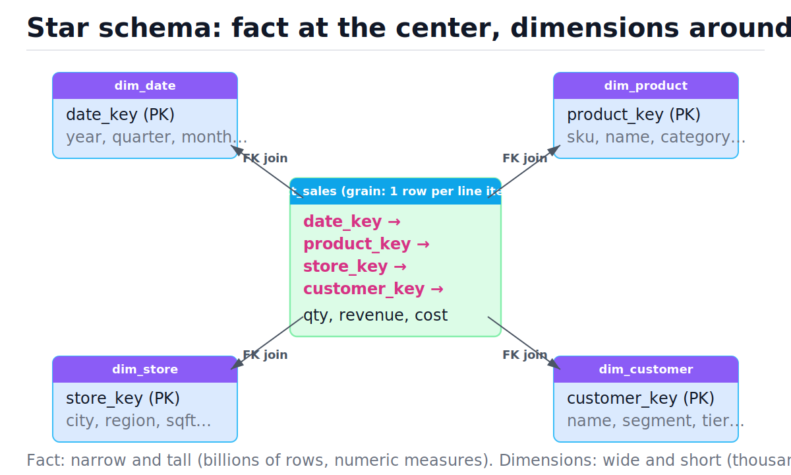
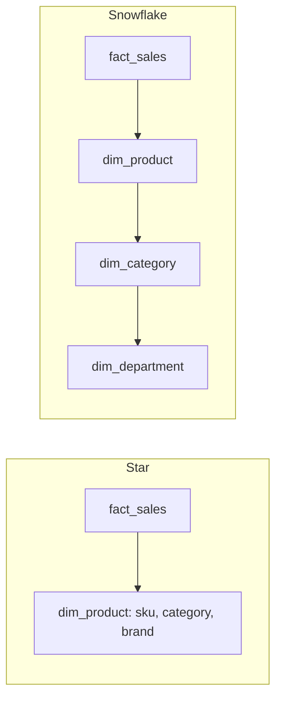
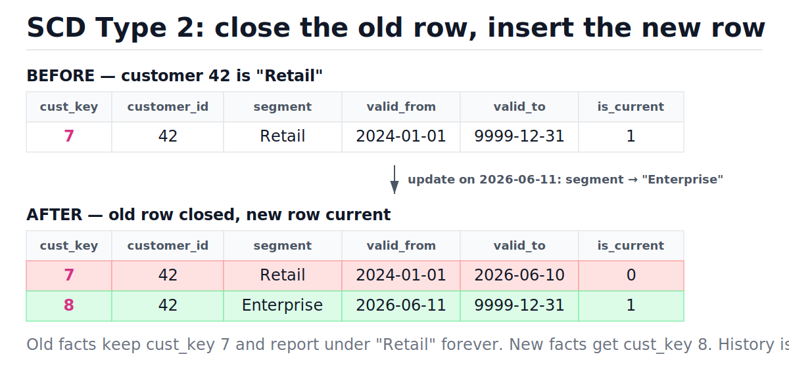

# OLAP and Dimensional Modeling

[toc]

> **TL;DR:** OLTP schemas are normalized for fast, correct point writes; OLAP schemas are denormalized for fast full-column scans over history. Dimensional modeling splits the world into facts (narrow, tall tables of events with additive numeric measures) and dimensions (wide, short tables of context), joined in a star schema. The single most important decision is the grain — "one row per what?" — declared before any column is added.

## Vocabulary

**OLTP (online transaction processing)**

```math
\text{work} \approx \text{many small reads/writes of a few rows by key}
```

The workload of an application database: insert an order, update a balance, fetch one user. Normalized schemas, B-tree indexes, row storage.

**OLAP (online analytical processing)**

```math
\text{work} \approx \text{few large scans aggregating millions of rows over a few columns}
```

The workload of analytics: "revenue by region by month for the last 3 years." Denormalized schemas, columnar storage, scan-and-aggregate execution.

**Fact table**

```math
\text{fact\_sales}(\underbrace{date\_key, product\_key, \dots}_{\text{FKs}},\ \underbrace{qty, revenue}_{\text{measures}})
```

A table of events or measurements. Narrow (few columns) and tall (billions of rows). Almost every column is a foreign key or a numeric measure.

**Dimension table**

```math
\text{dim\_product}(product\_key, sku, name, category, brand, \dots)
```

A table of context — the who, what, where, when of an event. Wide (many descriptive columns) and short (thousands to millions of rows).

**Grain**

```math
\text{grain} = \text{the real-world thing one fact row represents}
```

The declared meaning of a single fact row, e.g. "one row per order line item per day." Every measure and dimension must be true at exactly this grain.

**Additive measure**

```math
\sum_{\text{any subset of rows}} m \text{ is meaningful}
```

A numeric column you can sum across all dimensions (revenue, quantity). Semi-additive measures (account balance) sum across some dimensions but not time; non-additive ones (unit price, ratios) cannot be summed at all.

**Surrogate key**

```math
key \in \{1, 2, 3, \dots\} \quad \text{(meaningless integer, warehouse-assigned)}
```

An integer the warehouse generates, distinct from the source system's natural key (SKU, email). It decouples the warehouse from source-system key changes and is required for versioned dimension history.

**Slowly changing dimension (SCD)**

```math
\text{SCD type} \in \{1: \text{overwrite},\ 2: \text{version rows},\ 3: \text{previous-value column}\}
```

A strategy for handling dimension attributes that change over time, such as a customer moving to a new segment.

## Intuition

Your application database answers "what is the state of order 9182 right now?" Your warehouse answers "how did Q3 revenue trend by category across two years?" Those are different sports: the first touches 5 rows by primary key, the second touches 50 million rows but only 3 of their 40 columns. Dimensional modeling reshapes data so the second question is cheap *and* understandable by an analyst writing SQL by hand.

The picture to hold in your head: one big fact table of events at the center, with a small constellation of descriptive dimension tables around it — a star.



| Property | OLTP | OLAP |
| :--- | :--- | :--- |
| Typical operation | Point read/write by key | Full-column scan + aggregate |
| Rows touched per query | 1–100 | 10⁶–10⁹ |
| Columns touched | Most of the row | 2–5 of 40 |
| Schema style | Normalized (3NF) | Denormalized (star) |
| Optimized for | Write correctness, low latency | Read throughput, compression |
| Storage layout | Row-oriented pages | Column-oriented files |
| Examples | PostgreSQL, MySQL | BigQuery, Snowflake, Redshift, DuckDB |

> [!NOTE]
> Normalization (see [Normalization](./04-normalization.md)) eliminates redundancy so a fact is stored once and updates can't disagree. Warehouses deliberately *reintroduce* redundancy: data is loaded in batches by pipelines, not edited by users, so update anomalies are not a real risk — but join depth and query complexity are.

## How it works

### Why columnar storage wins for analytics

A row store puts all 40 columns of a sale next to each other on a disk page; a column store puts all values of `revenue` next to each other. Three effects compound. First, a query reading 3 columns of 40 does roughly 3/40 of the I/O. Second, a column is homogeneous — a million `category` values or sorted dates compress brutally well with run-length and dictionary encoding, often 10x. Third, the engine can process a column as a dense array with vectorized (SIMD) loops instead of interpreting one row at a time.

```text
Row store page:      [id|date|sku|store|qty|rev] [id|date|sku|store|qty|rev] ...
Column store files:  dates: [d1 d2 d3 d4 ...]   (sorted -> run-length encodes)
                     revs:  [r1 r2 r3 r4 ...]   (dense float array -> SIMD sum)
```

Scan cost is still O(n) in rows, but the constant collapses: fewer bytes read, fewer bytes after compression, more values per CPU instruction.

> [!TIP]
> You can feel this locally: DuckDB (columnar) aggregates a 100M-row Parquet file in seconds on a laptop, where PostgreSQL (row store) on the same data is orders of magnitude slower. Same SQL, different storage layout.

### Facts vs dimensions

The modeling move is to split every domain into *measurements* and *context*. Facts record that something happened, with numbers attached: a sale, a click, a sensor reading. Dimensions describe the participants: the product sold, the store, the customer, the date. Facts grow forever and stay narrow; dimensions change slowly and stay wide. Analysts filter and group by dimension attributes, then aggregate fact measures — every query has the same shape, which is exactly why BI tools can generate SQL against a star automatically.

Prefer additive measures in the fact. Store `qty` and `revenue`, not `unit_price` — you can derive average price as `SUM(revenue)/SUM(qty)` at any grouping level, but you cannot meaningfully sum a stored average.

### Grain: the one decision that makes or breaks the model

Before adding a single column, declare the grain out loud: "one row per order line item," not "one row per order" and definitely not "sales data." Everything follows from it — which dimensions can attach (a line item has a product; an order does not have *a* product), which measures are additive, and whether two analysts get the same number. The classic failure is mixing grains: putting order-level shipping cost on line-item rows, so summing it double-counts.

| Step | Question | Decision |
| :--- | :--- | :--- |
| 1 | What business process? | Retail sales |
| 2 | What is the grain? | One row per product per order line |
| 3 | What dimensions exist at that grain? | date, product, store, customer |
| 4 | What measures are true at that grain? | qty, revenue, cost (all additive) |

> [!IMPORTANT]
> Declare the grain first and write it in the table's documentation and DDL comments. Every later argument about "why don't these two dashboards match" is usually a grain violation: someone summed a measure that wasn't additive at the grain they grouped by.

### Star vs snowflake

A star keeps each dimension as one flat, denormalized table: `dim_product` carries `category` and `brand` as plain text columns, repeated on every product row. A snowflake normalizes dimensions into sub-tables (`dim_product` → `dim_category` → `dim_department`), saving a little space at the cost of extra joins in every query. Modern practice strongly prefers the star: dimension tables are tiny relative to facts, columnar compression makes the repeated strings nearly free, and analysts reliably get joins wrong when each query needs five of them.



### Surrogate keys

Warehouse dimensions get their own integer surrogate key instead of reusing the source system's natural key. Three reasons. Natural keys change and get recycled when source systems migrate; a surrogate insulates the warehouse. Integer joins are smaller and faster than joining on a 20-char SKU across a billion fact rows. And SCD type 2 *requires* surrogates: the same customer needs multiple rows, so `customer_id` alone can't be the join key — each version gets its own `customer_key`.

### Slowly changing dimensions

Dimension attributes drift: a customer changes segment, a product changes category. The question is whether history should reflect the world *as it was* or *as it is now*. Three canonical answers:

- **Type 1 — overwrite.** `UPDATE dim_customer SET segment = 'Enterprise'`. Simple; history is rewritten. All past sales now report under the new segment. Use for corrections (typo in a name).
- **Type 2 — versioned rows.** Close the current row (`valid_to`, `is_current = 0`), insert a new row with a new surrogate key. Facts loaded before the change keep pointing at the old version. Use whenever "as it was at the time" matters — almost always for segment, region, pricing tier.
- **Type 3 — previous-value column.** Add `previous_segment`. Holds exactly one prior value; useful only for a planned one-time reorganization where reports need "old vs new" side by side.

The type 2 update is a two-step transaction, walked row by row in the figure below: the old version gets closed (red), the new version is inserted as current (green), and historical facts are untouched.



| Step | dim_customer state | Decision |
| :--- | :--- | :--- |
| 0 | (7, 42, Retail, 2024-01-01 → 9999-12-31, current=1) | Customer 42 changes segment on 2026-06-11 |
| 1 | (7, 42, Retail, 2024-01-01 → 2026-06-10, current=0) | Close old row: set valid_to to day before, clear is_current |
| 2 | + (8, 42, Enterprise, 2026-06-11 → 9999-12-31, current=1) | Insert new version with NEW surrogate key 8 |
| 3 | New facts join to key 8; old facts still join to key 7 | History preserved at the fact level automatically |

### The date dimension

Always build a physical `dim_date` table — one row per calendar day, pre-populated for the full range you'll ever need — instead of computing `EXTRACT(quarter FROM ...)` in every query. A date table carries attributes no function can compute: fiscal periods, holidays, promo weeks, "is_business_day." It makes every date filter an indexed equi-join, keeps the logic in one place, and at ~365 rows per year it costs nothing.

### Aggregate tables

When the same rollup is computed constantly (daily revenue per store), precompute it into an aggregate (summary) fact table at a coarser grain and refresh it on each load. This trades storage and pipeline complexity for query latency — the same idea as a materialized view or a cache, with the same staleness caveat. See [Caching strategies](../System-Design/05-caching-strategies.md) for the general pattern.

> [!WARNING]
> An aggregate table is only correct for measures additive at its grain. Never pre-aggregate ratios or distinct counts naively: `COUNT(DISTINCT customer)` per day cannot be summed into a monthly distinct count.

## Complexity

There's no single data-structure Big-O here, but each operation has a dominant cost shape, and the entire point of the design is shrinking the constants and exponents of the scan.

| Operation | Time | Space | Notes |
| :--- | :--- | :--- | :--- |
| OLTP point read (B-tree) | O(log n) | — | The workload stars schemas are NOT for |
| Full fact scan + aggregate | O(n) rows | O(g) groups | n = fact rows; columnar shrinks the constant |
| Star join (fact × k dims) | O(n · k) hash probes | O(d) hash tables | d = dimension rows; dims fit in memory |
| SCD2 lookup of current row | O(log d) / O(1) | — | Index on (natural_key, is_current) |
| SCD2 update (close + insert) | O(log d) | +1 row per change | Two statements, one transaction |
| Aggregate-table query | O(a) | O(a) extra storage | a = aggregate rows, a ≪ n |

The key bound is bytes scanned, not rows scanned. For a query touching c of C columns with compression ratio r:

```math
\text{bytes read} \approx \frac{c}{C} \cdot \frac{1}{r} \cdot n \cdot \bar{w}
```

where n is row count and w̄ the average row width. With c/C = 3/40 and r = 8, the scan reads about 1% of the bytes a row store would — a 100x constant-factor win on the same O(n) algorithm. Star joins stay cheap because each dimension hash table is built once in O(d) and probed in O(1) per fact row, and d is tiny next to n.

## In production

In a real warehouse the star schema meets columnar engines and batch pipelines, and a few physical realities dominate. Engines like BigQuery and Snowflake prune work in two stages: column pruning (only read referenced columns) and partition/cluster pruning (skip files whose min/max metadata excludes the filter). Fact tables are almost always partitioned by date — which is another reason the date key matters.

- **ELT, not ETL.** The modern stack lands raw source data in the warehouse first (Fivetran/Airbyte loaders), then transforms it *inside* the warehouse with SQL managed by dbt: raw → staging → dimensional marts, version-controlled and tested like code.
- **Late-arriving data.** Facts can arrive before their dimension row exists. Pipelines insert a placeholder ("unknown") dimension member with surrogate key −1 or 0 rather than dropping or blocking the fact.
- **SCD2 at scale** is done with `MERGE` statements or dbt snapshots, not hand-written updates — but the mechanics are exactly the close-old-insert-new pattern shown above.
- **Failure mode: silent fan-out.** A duplicate row in a dimension (two `is_current = 1` versions) silently multiplies fact rows on join, inflating every metric. Test uniqueness of `(natural_key, is_current)` on every load.

> [!CAUTION]
> The fan-out bug is the classic production incident of dimensional modeling: revenue jumps 2x overnight, dashboards all agree with each other, and nothing errored. Uniqueness tests on dimension current-rows are not optional.

## Real-world example

A retail chain wants revenue analytics over orders flowing in from its OLTP system. Below is the full star — fact plus four dimensions — with SCD2 plumbing on `dim_customer`, runnable end to end in Python's bundled `sqlite3`. The analytical queries use window functions for month-over-month growth and per-category ranking. (The SQL is portable; in PostgreSQL or Snowflake you'd use `GENERATED ALWAYS AS IDENTITY` or a sequence instead of SQLite's implicit rowid-based `INTEGER PRIMARY KEY`.)

```python
import sqlite3

conn = sqlite3.connect(":memory:")
conn.executescript("""
CREATE TABLE dim_date (
  date_key     INTEGER PRIMARY KEY,   -- yyyymmdd smart-ish surrogate
  full_date    TEXT NOT NULL,
  year         INTEGER NOT NULL,
  quarter      INTEGER NOT NULL,
  month        INTEGER NOT NULL,
  month_name   TEXT NOT NULL,
  is_weekend   INTEGER NOT NULL
);
CREATE TABLE dim_product (
  product_key  INTEGER PRIMARY KEY,   -- surrogate
  sku          TEXT NOT NULL,         -- natural key from source
  name         TEXT NOT NULL,
  category     TEXT NOT NULL,
  brand        TEXT NOT NULL
);
CREATE TABLE dim_store (
  store_key    INTEGER PRIMARY KEY,
  store_code   TEXT NOT NULL,
  city         TEXT NOT NULL,
  region       TEXT NOT NULL
);
CREATE TABLE dim_customer (            -- SCD type 2
  customer_key INTEGER PRIMARY KEY,    -- surrogate: one per VERSION
  customer_id  INTEGER NOT NULL,       -- natural key: one per person
  name         TEXT NOT NULL,
  segment      TEXT NOT NULL,
  valid_from   TEXT NOT NULL,
  valid_to     TEXT NOT NULL DEFAULT '9999-12-31',
  is_current   INTEGER NOT NULL DEFAULT 1
);
CREATE TABLE fact_sales (              -- grain: 1 row per product per order line
  date_key     INTEGER NOT NULL REFERENCES dim_date(date_key),
  product_key  INTEGER NOT NULL REFERENCES dim_product(product_key),
  store_key    INTEGER NOT NULL REFERENCES dim_store(store_key),
  customer_key INTEGER NOT NULL REFERENCES dim_customer(customer_key),
  qty          INTEGER NOT NULL,
  revenue      REAL NOT NULL,
  cost         REAL NOT NULL
);
""")

conn.executescript("""
INSERT INTO dim_date VALUES
  (20260110,'2026-01-10',2026,1,1,'January',1),
  (20260215,'2026-02-15',2026,1,2,'February',1),
  (20260320,'2026-03-20',2026,1,3,'March',0),
  (20260611,'2026-06-11',2026,2,6,'June',0);
INSERT INTO dim_product VALUES
  (1,'SKU-001','Espresso Beans 1kg','Coffee','RoastCo'),
  (2,'SKU-002','Cold Brew Bottle','Coffee','RoastCo'),
  (3,'SKU-003','Ceramic Mug','Drinkware','ClayWorks');
INSERT INTO dim_store VALUES
  (1,'NYC-01','New York','East'),(2,'SF-01','San Francisco','West');
INSERT INTO dim_customer
  (customer_key, customer_id, name, segment, valid_from) VALUES
  (7, 42, 'Acme Corp', 'Retail', '2024-01-01');
INSERT INTO fact_sales VALUES
  (20260110,1,1,7,10,180.0,90.0),
  (20260110,3,1,7, 4, 60.0,20.0),
  (20260215,1,2,7,20,360.0,180.0),
  (20260320,2,2,7,30,150.0,75.0);
""")

# Query 1: monthly revenue with month-over-month growth (window function)
mom = conn.execute("""
  SELECT d.month_name,
         SUM(f.revenue)                                        AS revenue,
         SUM(f.revenue) - LAG(SUM(f.revenue)) OVER (ORDER BY d.month) AS mom_change
  FROM fact_sales f JOIN dim_date d ON f.date_key = d.date_key
  GROUP BY d.month, d.month_name ORDER BY d.month
""").fetchall()
assert mom[0] == ("January", 240.0, None)
assert mom[1] == ("February", 360.0, 120.0)
assert mom[2] == ("March", 150.0, -210.0)

# Query 2: rank products by revenue within category
ranked = conn.execute("""
  SELECT p.category, p.name, SUM(f.revenue) AS revenue,
         RANK() OVER (PARTITION BY p.category ORDER BY SUM(f.revenue) DESC) AS rnk
  FROM fact_sales f JOIN dim_product p ON f.product_key = p.product_key
  GROUP BY p.category, p.name
""").fetchall()
assert ("Coffee", "Espresso Beans 1kg", 540.0, 1) in ranked
assert ("Coffee", "Cold Brew Bottle", 150.0, 2) in ranked

# SCD type 2: customer 42 moves Retail -> Enterprise on 2026-06-11.
# Canonical close-old-insert-new, in one transaction:
with conn:
    conn.execute("""
      UPDATE dim_customer
      SET valid_to = '2026-06-10', is_current = 0
      WHERE customer_id = 42 AND is_current = 1
    """)
    conn.execute("""
      INSERT INTO dim_customer
        (customer_key, customer_id, name, segment, valid_from)
      VALUES (8, 42, 'Acme Corp', 'Enterprise', '2026-06-11')
    """)

# A new sale today references the NEW version (key 8):
conn.execute("INSERT INTO fact_sales VALUES (20260611,1,1,8,5,90.0,45.0)")

# Historical revenue by segment-AS-IT-WAS: old facts stay 'Retail'.
by_seg = dict(conn.execute("""
  SELECT c.segment, SUM(f.revenue)
  FROM fact_sales f JOIN dim_customer c ON f.customer_key = c.customer_key
  GROUP BY c.segment
""").fetchall())
assert by_seg == {"Retail": 750.0, "Enterprise": 90.0}

# Exactly one current version per customer (the fan-out guard):
(n_current,) = conn.execute(
    "SELECT COUNT(*) FROM dim_customer WHERE customer_id = 42 AND is_current = 1"
).fetchone()
assert n_current == 1
print("all checks passed")
```

> [!TIP]
> Run the SCD2 close-and-insert in a single transaction (the `with conn:` block above). If the close succeeds and the insert fails, the customer temporarily has *no* current row and every join against them silently drops facts.

## When to use / When NOT to use

Dimensional modeling is a tool for a specific job, not a default. Reach for it when the workload is analytical and shared; skip it when the data is small or the questions are operational.

**Use it when:**

- Queries aggregate large histories ("by month, by region") and are read by many people/tools.
- BI dashboards need a schema non-engineers can navigate.
- You need point-in-time-correct history (SCD2).
- Fact volume is large enough that scan cost and compression matter.

**Don't use it when:**

- The system of record needs transactional integrity — keep the normalized OLTP schema ([Normalization](./04-normalization.md)).
- Data is small (millions of rows): query the OLTP replica or a flat table; a star is ceremony.
- The data is genuinely non-relational event soup with wildly variable shape — land it raw first, model later.

## Common mistakes

- **"Denormalized means no design"** — a star is *more* disciplined than ad-hoc wide tables: explicit grain, conformed dimensions, additive measures. Denormalization is a deliberate trade, not laziness.
- **Skipping the grain declaration** — mixed-grain facts (order-level shipping cost on line-item rows) double-count on every SUM. Declare the grain first; reject columns that aren't true at it.
- **Storing ratios or averages as measures** — averages don't re-aggregate. Store numerator and denominator (`revenue`, `qty`) and divide at query time.
- **Reusing natural keys as join keys** — breaks the moment you need SCD2 versioning, and ties the warehouse to source-system key hygiene.
- **SCD2 without a uniqueness test** — two `is_current = 1` rows fan out every fact join and inflate all metrics silently.
- **Using date functions instead of dim_date** — fiscal calendars, holidays, and promo weeks can't be computed by `EXTRACT`; logic gets copy-pasted and drifts across queries.
- **Snowflaking to "save space"** — dimension storage is a rounding error next to the fact table; the extra joins cost analyst correctness daily.

## Interview questions and answers

**Q1. What's the difference between OLTP and OLAP, and why do they need different schemas?**
**Answer:** OLTP is many tiny reads and writes of individual rows by key — an app inserting orders — so you normalize for write correctness and index with B-trees. OLAP is a few huge queries aggregating millions of rows over a handful of columns, so you denormalize into a star and store columns contiguously so scans read only what they need and compress well. Same data, opposite access patterns, so opposite physical and logical designs.

**Q2. Why does columnar storage beat row storage for analytics?**
**Answer:** Three compounding wins. You only read the columns the query touches — 3 of 40 columns is ~7% of the I/O. Each column is homogeneous, so dictionary and run-length encoding compress it far better than mixed rows. And the engine can run vectorized loops over dense arrays instead of interpreting row by row. The algorithm is still O(n), but the constant drops by one to two orders of magnitude.

**Q3. What is the grain of a fact table and why is it the first decision?**
**Answer:** The grain is what one row means — "one row per order line item per day." It's first because everything else depends on it: which dimensions can attach, which measures are additive, and whether SUMs are even valid. Most "the dashboards don't match" bugs are grain violations, like an order-level fee stored on line-item rows getting double-counted.

**Q4. Star vs snowflake — which would you pick and why?**
**Answer:** Star, almost always. Snowflake normalizes dimensions into sub-tables to remove redundancy, but dimensions are tiny relative to facts and columnar compression makes repeated strings nearly free — so you pay extra joins in every query for negligible savings. Stars keep queries simple enough that analysts and BI tools generate them correctly.

**Q5. Why surrogate keys in a warehouse instead of the source system's natural keys?**
**Answer:** Three reasons. Natural keys change and get recycled when source systems migrate, and a surrogate insulates you. Integer joins across billion-row facts are cheaper than string joins. And SCD type 2 makes surrogates mandatory: one customer has multiple version rows, so the natural key alone can't be the fact's join key — each version needs its own surrogate.

**Q6. Walk me through an SCD type 2 update.**
**Answer:** Customer 42 moves from Retail to Enterprise. In one transaction: update their current row to set `valid_to` to yesterday and `is_current` to 0, then insert a new row with a fresh surrogate key, `valid_from` today, `valid_to` 9999-12-31, `is_current` 1. Old facts still join to the old surrogate and report as Retail; new facts join to the new one. History is preserved, never overwritten.

**Q7. When is SCD type 1 acceptable?**
**Answer:** When the change is a correction rather than a real-world change — fixing a typo in a product name — or when the business explicitly never wants point-in-time reporting on that attribute. Type 1 is simpler and saves rows, but it rewrites history, so it's wrong for anything like segment or region where "as it was at the time" matters.

**Q8. Why build a date dimension instead of using date functions?**
**Answer:** Functions can compute calendar facts like month or quarter, but they can't compute business facts: fiscal periods, holidays, promo weeks, business days. A date table centralizes that logic in one row per day, makes every date filter an equi-join the optimizer can prune partitions with, and costs about 365 rows a year — effectively free.

**Q9. What's the danger of aggregate tables and how do you keep them honest?**
**Answer:** Staleness and non-additivity. They must be refreshed in the same pipeline run as the base fact, or dashboards disagree with detail drill-downs. And they're only valid for measures additive at their grain — you can pre-sum revenue per day, but you can't sum daily distinct-customer counts into a monthly one. Keep ratios and distincts computed at query time or use sketches.

## Practice path

1. Run the star-schema script above; verify all asserts pass, then add a `dim_promotion` and a `discount` measure without breaking the grain.
2. Write the grain statement for three domains (rideshare trips, hospital visits, ad impressions) before drawing any tables.
3. Generate a 10-year `dim_date` in Python (3,653 rows) with year, quarter, month, weekday, and is_weekend, and load it into SQLite.
4. Deliberately insert a second `is_current = 1` row for customer 42 and watch the segment query fan out; then write the SQL test that catches it.
5. Build a daily-revenue-per-store aggregate table, refresh it after inserting new facts, and prove it matches the base-fact rollup.
6. Convert the star to a snowflake (split category out of dim_product), rewrite query 2, and compare the SQL complexity.
7. Install DuckDB and re-run the analytical queries against a 10M-row generated fact table to feel columnar scan speed.

## Copyable takeaways

- OLTP = point reads/writes, normalize; OLAP = scan-and-aggregate, denormalize into a star.
- Columnar wins by reading only needed columns, compressing homogeneous runs, and vectorizing — same O(n), ~100x smaller constant.
- Facts: narrow, tall, additive numeric measures plus FKs. Dimensions: wide, short, descriptive context.
- Declare the grain — "one row per X" — before any column exists; every modeling bug traces back to grain.
- Star over snowflake: dimension redundancy is cheap, analyst join mistakes are not.
- Surrogate keys decouple from source systems and are required for SCD type 2.
- SCD2 = close old row (valid_to, is_current=0) + insert new version, in one transaction; test uniqueness of current rows every load.
- Build a real dim_date; store numerators and denominators, never ratios.
- Modern stack: ELT raw into the warehouse, then dbt-style SQL transforms build staging → star marts, tested and version-controlled.

## Sources

- Ralph Kimball & Margy Ross, *The Data Warehouse Toolkit*, 3rd ed. (Wiley, 2013) — the canonical dimensional-modeling reference (grain, SCDs, conformed dimensions).
- Martin Kleppmann, *Designing Data-Intensive Applications*, ch. 3 "Storage and Retrieval" — OLTP vs OLAP, column-oriented storage, compression.
- Daniel Abadi et al., "Column-Stores vs. Row-Stores: How Different Are They Really?" SIGMOD 2008.
- SQLite window functions: [sqlite.org/windowfunctions.html](https://sqlite.org/windowfunctions.html)
- dbt docs on snapshots (SCD2): [docs.getdbt.com/docs/build/snapshots](https://docs.getdbt.com/docs/build/snapshots)

## Related

- [Normalization](./04-normalization.md) — the OLTP counterpoint: why transactional schemas remove the redundancy stars add back.
- [The relational model](./01-the-relational-model.md)
- [SQL fundamentals](./02-sql-fundamentals.md) — joins, GROUP BY, and window functions used here.
- [Relational database internals](./07-relational-database-internals.md) — pages, row storage, and why scans hurt row stores.
- [Caching strategies](../System-Design/05-caching-strategies.md) — aggregate tables are precomputation with staleness tradeoffs.
- [Database scaling, replication, and sharding](../System-Design/06-database-scaling-replication-and-sharding.md)
