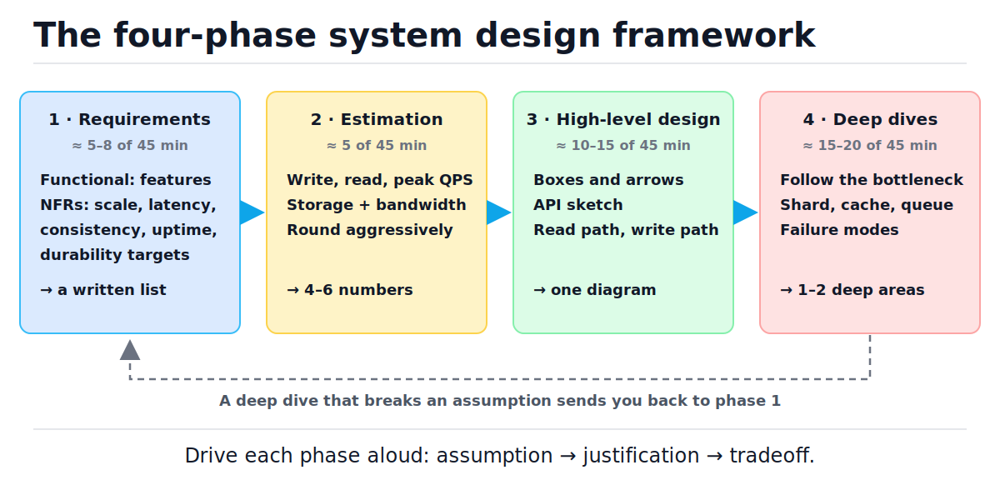
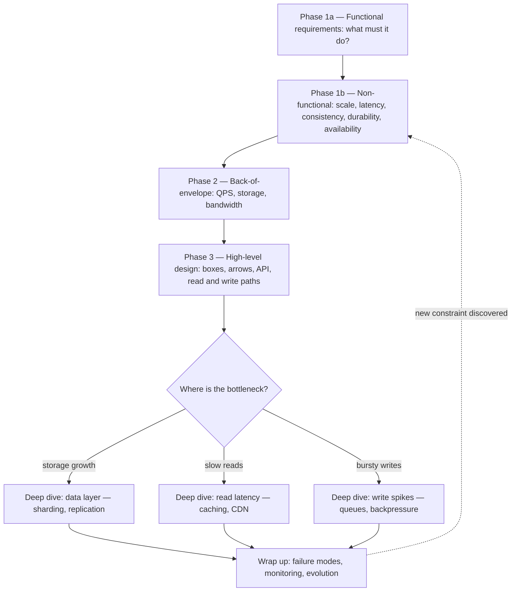
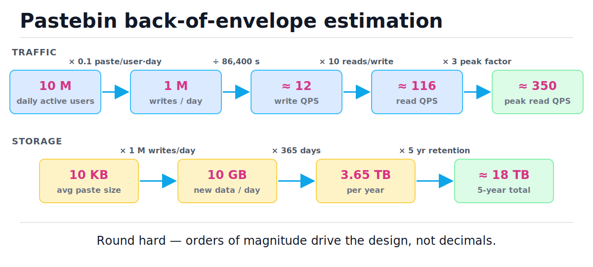
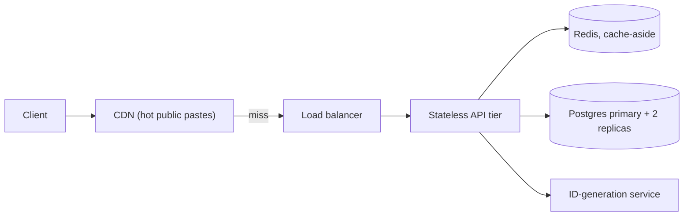

# How to Approach System Design

[toc]

> **TL;DR:** System design — in an interview or a real design doc — is four phases in a fixed order: pin requirements, estimate the numbers, draw the high-level design, then deep-dive into whatever the numbers say is the bottleneck. There is no best design, only a design that fits the requirements, so the skill being graded is how you drive the conversation: state assumptions aloud, justify every component, and name every tradeoff. This note is the framework; it also serves as the reading index for the rest of the System-Design folder.

## Vocabulary

These terms carry the whole note. Each one is a question you must answer in phase 1 or a number you must produce in phase 2. Learn the symbol and the one-line meaning before reading on.

**Functional requirement**

```math
F = \{f_1, f_2, \dots, f_k\}
```

The set of behaviors the system must perform — "create a paste", "fetch a paste by ID". Functional requirements define *what* the system does; they say nothing about how fast or how reliably.

**Non-functional requirement (NFR)**

```math
\text{p99}(L) \le 200\ \text{ms}
```

A measurable constraint on *how well* the system does it: scale, latency, consistency, durability, availability. NFRs, not features, are what force one architecture over another.

**QPS (queries per second)**

```math
\text{QPS} = \frac{\text{requests per day}}{86{,}400}
```

The base unit of traffic. Memorize 86,400 seconds per day and round it to 10⁵ — that single constant converts product-speak ("a million writes a day") into engineering-speak ("about 12 writes per second").

**Read/write ratio**

```math
\rho = \frac{\text{reads}}{\text{writes}}
```

How read-heavy the workload is. ρ ≈ 10–100 for most consumer systems, which is why caching and read replicas show up in almost every design.

**Latency percentile (p99)**

```math
P(L \le \text{p99}) = 0.99
```

The latency that 99% of requests beat. Targets are set on percentiles, never averages, because the slowest 1% of requests hit your most valuable, most active users the most often.

**Availability**

```math
A = \frac{\text{uptime}}{\text{uptime} + \text{downtime}}
```

The fraction of time the system answers. Spoken in "nines": 99.9% ("three nines") allows ≈ 8.7 hours of downtime per year; 99.99% allows ≈ 52 minutes.

**Durability**

```math
D = 1 - P(\text{object lost within one year})
```

The probability that accepted data is never lost. Distinct from availability: a system can be down (unavailable) yet lose nothing (durable). S3 advertises eleven nines of durability but only four nines of availability.

**SLO (service level objective)**

```math
\text{SLO}:\ A \ge 99.9\%\ \text{over a rolling 30-day window}
```

An internal, measurable target on an NFR. SLOs turn vague desires ("it should be fast") into pass/fail engineering contracts and tell you when to stop optimizing.

**Peak factor**

```math
\lambda_{\text{peak}} = k \cdot \lambda_{\text{avg}}, \quad k \approx 2\text{–}5
```

The ratio of peak traffic to average traffic. You provision for peaks, not averages; forgetting the peak factor is the classic way to under-provision by 3×.

**Bottleneck**

```math
\text{utilization} = \frac{\lambda}{\mu}
```

The resource whose arrival rate λ approaches its service rate μ first. The bottleneck — not personal preference — chooses which deep dive you do in phase 4.

## Intuition

Think of system design as constrained optimization, not invention. The requirements are the constraints, the estimation gives you the coefficients, the high-level design is a feasible solution, and the deep dives push the binding constraint — the bottleneck — until it stops binding. Junior engineers start with technology ("I'd use Kafka"); principals start with constraints ("what happens if we lose a write?") because the same product brief with different NFRs yields a completely different system.

The figure below is the whole framework on one line. Notice three things: the time budget is front-loaded toward talking, not drawing; each phase emits a concrete artifact (a list, numbers, a diagram, a deep area); and the dashed arrow back from phase 4 — discovering a broken assumption mid-dive is normal, and looping back is a strength signal, not a failure.



> [!IMPORTANT]
> There is no best design — only fit to requirements. Every component you add must be justified by a requirement or a number, and every choice has a cost you can name. "Postgres, because 18 TB over five years fits one primary plus replicas, and we get transactions for free" is a principal answer. "Cassandra, because it scales" is not.

## How it works

The four phases run in order because each one consumes the previous phase's artifact: estimation needs the requirements list, the high-level design must satisfy the numbers, and the deep dive targets the bottleneck the numbers exposed. The flowchart below shows the control flow, including the branch point — *which* deep dive you do depends entirely on where the bottleneck is.



### Phase 1 — Requirements: functional first, then non-functional

Spend the first five to eight minutes asking questions, and write the answers down where both of you can see them. Functional requirements come first because they bound the feature surface — and *cutting* scope ("URL preview is out of scope, agreed?") is graded as highly as adding it. Then pin the non-functional requirements, because they are the real design inputs. These are the questions a principal asks first:

- **Scale** — how many daily active users? Read-heavy or write-heavy? What is ρ?
- **Latency** — what p99 target, and on which path? Reads and writes rarely share a target.
- **Consistency** — must a reader see a write immediately, or is seconds of lag acceptable?
- **Durability** — can we ever lose an accepted write? (Payments: no. View counters: yes.)
- **Availability** — how many nines, and what degrades first when we miss them?

> [!TIP]
> Quantify every NFR before moving on, even if you have to propose the number yourself: "I'll assume 10 M DAU and p99 read under 200 ms — fair?" Interviewers grade the act of asking and pinning; a proposed-then-confirmed number is as good as a given one.

### Phase 2 — Back-of-the-envelope estimation

Estimation converts the requirements into four to six numbers that the rest of the interview obeys: write QPS, read QPS, peak QPS, storage per year, and (when relevant) bandwidth and cache size. Round aggressively — 86,400 becomes 10⁵, 11.6 becomes "about 12" — because only the order of magnitude changes the design. The full drill lives in [Back-of-the-envelope estimation](./02-back-of-the-envelope-estimation.md); the constants below are the working set.

| Quantity | Rule of thumb |
| :--- | :--- |
| Seconds per day | 86,400 ≈ 10⁵ |
| 1 M requests/day | ≈ 12 QPS average |
| 1 M items × 1 KB | 1 GB |
| Daily volume → yearly | × 365 ≈ × 400 |
| Peak factor | 2–5 × average |
| One commodity server | ~10³–10⁴ simple QPS; ~10–50 K open connections |

> [!CAUTION]
> Under-provisioning from bad capacity math is a production-incident-class hazard, and false precision is how it happens. Carry one significant figure, state the peak factor explicitly, and sanity-check the result against "could one machine do this?" before building a distributed system.

### Phase 3 — High-level design: boxes, arrows, and an API

Now — and only now — draw. Put up the minimum set of boxes that satisfies the requirements (client, edge, stateless service tier, storage), then walk the **write path** and the **read path** as two separate traces, because they almost always have different scaling problems. Sketch the API at the same time; it forces precision about what each arrow carries.

```text
POST /pastes          body: {content, ttl?}    -> 201 {paste_id}   (write path)
GET  /pastes/{id}                              -> 200 {content}    (read path)
```

Every box must earn its place out loud: "stateless API tier so any instance can serve any request, which makes horizontal scaling and failover trivial." If you cannot justify a box with a requirement or a number from phase 2, delete the box.

> [!WARNING]
> Jumping to boxes before requirements is the single most common interview failure. A perfect diagram for the wrong constraints scores below a rough diagram for the right ones — the interviewer cannot tell whether you designed or recited.

### Phase 4 — Deep dives driven by the bottleneck

The numbers from phase 2 tell you where the design will break first; dive there, not into the component you happen to know best. Offer the interviewer a menu and let them steer: "the interesting problems here are hot-key caching and ID generation — preference?" One or two areas covered deeply beats five covered shallowly. The map from bottleneck to deep-dive material:

| Bottleneck the numbers expose | Deep dive | Folder note |
| :--- | :--- | :--- |
| Read latency, hot keys | Cache layers, CDN, invalidation | [Caching strategies](./05-caching-strategies.md) |
| Storage growth, single-node DB limits | Replication, sharding | [Database scaling](./06-database-scaling-replication-and-sharding.md) |
| Write bursts, slow consumers | Queues, event-driven design | [Message queues](./08-message-queues-and-event-driven-architecture.md) |
| Conflicting reads after writes | Consistency models, quorums | [Consistency and CAP](./07-consistency-models-cap-and-quorums.md) |
| Abusive or spiky clients | Rate limiting, load shedding | [Rate limiting](./10-rate-limiting-and-load-shedding.md) |
| "What happens when X dies?" | Redundancy, observability | [Reliability](./12-reliability-and-observability.md) |

### Driving the conversation

The framework is also a communication protocol. Three verbal moves, repeated through all four phases, are what separate levels: **state assumptions aloud** ("I'm assuming pastes are immutable — that makes caching trivial; correct me if not"), **justify every component** (each box maps to a requirement or a number), and **name tradeoffs explicitly** ("cache-aside gives us simple invalidation but a cold-start miss storm; write-through avoids the storm but doubles write latency"). Silence while drawing is the anti-pattern; the diagram is evidence, but the narration is the answer.

## What interviewers grade — junior to principal

Interviewers score the same four phases at every level; what changes is who drives and whether numbers or vibes make the decisions. Use this table as a self-audit after every mock: find the column that describes your last performance, then practice the behaviors one column to the right.

| Signal | Junior | Mid-level | Senior | Staff / Principal |
| :--- | :--- | :--- | :--- | :--- |
| Requirements | Jumps to tech | Asks feature questions | Asks for NFRs | Quantifies NFRs unprompted, cuts scope |
| Estimation | Skips it | Computes QPS if asked | Computes QPS + storage | Uses the numbers to kill design options |
| High-level design | Buzzword boxes | Workable boxes | Justifies each box | Walks read/write paths, sketches API |
| Deep dive | Needs steering | One area, shallow | One area, deep | Picks the bottleneck, offers a menu |
| Tradeoffs | "X is best" | Names one alternative | Names costs of own choice | Frames every choice as fit-to-requirements |
| Communication | Silent drawing | Answers questions | States assumptions | Drives the agenda, manages the clock |

## Complexity

A design defense is a complexity defense: every arrow in your diagram terminates in an operation with a Big-O cost, and the interviewer will probe whether you know them. The table covers the operations this note's example leans on; the derivation after it is the single most useful capacity formula in the field.

| Operation | Best | Average | Worst | Space |
| :--- | :---: | :---: | :---: | :---: |
| Cache / hash-keyed KV point lookup | O(1) | O(1) | O(n) | O(n) |
| B-tree index point read | O(log n) | O(log n) | O(log n) | O(n) |
| Full table scan | O(n) | O(n) | O(n) | O(1) extra |
| Fan-out write to f followers | O(f) | O(f) | O(f) | O(f) |
| Consistent-hash ring lookup (m vnodes) | O(log m) | O(log m) | O(log m) | O(m) |
| Back-of-envelope arithmetic | O(1) | O(1) | O(1) | O(1) |

Capacity planning rests on Little's Law: in any stable system, the average number of requests in flight equals the arrival rate times the time each request spends in the system.

```math
L = \lambda W
```

```math
N_{\text{servers}} = \left\lceil \frac{\lambda_{\text{peak}} \cdot W}{C_{\text{server}}} \right\rceil
                   = \left\lceil \frac{347 \times 0.05}{100} \right\rceil = 1
```

Why this works: at 347 peak QPS with 50 ms of service time, only ≈ 17 requests are ever in flight at once — well inside one server's concurrency budget of 100, so a single app server suffices and you run three for redundancy, not for load. The same one-line formula exposes when a design is over-built ("why six shards for 12 write QPS?") or under-built ("100 K QPS × 200 ms is 20,000 in-flight requests — one box cannot hold that").

The second load-bearing identity is availability composition. Components in series multiply availabilities (each new dependency *subtracts* nines); redundant components in parallel multiply *failure* probabilities (each replica adds nines):

```math
A_{\text{serial}} = \prod_{i=1}^{k} A_i \qquad\qquad A_{\text{parallel}} = 1 - \prod_{i=1}^{k} (1 - A_i)
```

Two 99.9% services in series yield 99.8% — chaining dependencies makes you strictly less available than your worst dependency. Two 99.9% replicas in parallel yield 99.9999% — which is the entire mathematical argument for redundancy, replication, and failover.

## In production — interviews vs. real design docs

The interview is a 45-minute compression of what a real organization does over weeks, and the phases map one-to-one: phase 1 is the PRD plus an SLO negotiation, phase 2 is a capacity-planning spreadsheet, phase 3 is the architecture section of a design doc circulated for review, and phase 4 is the "detailed design" and "alternatives considered" sections. Three things real docs add that interviews skip: **cost** (a column of dollars next to every option), **migration** (how to get from the running system to the proposed one without downtime), and **rollout** (flags, canaries, rollback criteria).

The "alternatives considered" section is the phase-4 tradeoff discussion made permanent — a real design doc that presents one option with no rejected alternatives gets the same failing grade a silent interview does. Production also grades a phase interviews mostly skip: operations. Every component you draw is something a human gets paged for, so real reviews ask who owns it, what its dashboards show, and how it fails.

> [!NOTE]
> The interview rubric and the design-review rubric are the same rubric. Engineers who treat interview prep as "memorizing architectures" plateau; engineers who treat it as "rehearsing the design-review conversation" get better at both simultaneously.

## Real-world example — pastebin in five minutes

Compressing all four phases into five minutes is the best drill for this framework, and pastebin is the canonical vehicle: small feature surface, instructive numbers. Scenario: the interviewer says "design pastebin" and you have 45 minutes — here is the first five, step by step. Read the table as a trace: each row is one spoken move, and the Decision column is what an interviewer writes down.

| Step | Phase | Design state so far | Decision / spoken line |
| :--- | :--- | :--- | :--- |
| 1 | Requirements | blank | "Create a paste, get a short URL, read it back. Anonymous use OK? Edits? — assume immutable." |
| 2 | Requirements | feature list | "NFRs: assume 10 M DAU, reads dominate (ρ ≈ 10), p99 read < 200 ms, 5-year retention, never lose a paste, eventual consistency fine." |
| 3 | Estimation | + NFRs | "0.1 paste/user/day → 1 M writes/day ≈ 12 write QPS; × 10 → ≈ 116 read QPS; × 3 peak → ≈ 350 QPS." |
| 4 | Estimation | + traffic numbers | "10 KB average → 10 GB/day → 3.65 TB/yr → ≈ 18 TB at five years. One Postgres primary + replicas holds this; no sharding needed." |
| 5 | High-level | + storage numbers | "Client → load balancer → stateless API tier → Postgres. Separate ID-generation service for short keys." |
| 6 | High-level | boxes drawn | "Write path: POST /pastes returns the ID. Read path: GET /pastes/{id}." |
| 7 | High-level | + API sketch | "Reads are 10:1 and pastes immutable → cache-aside Redis in front of Postgres; hits never touch the DB." |
| 8 | Deep dive | full diagram | "The bottleneck is read latency, not storage — I'd dive into caching and hot-key handling unless you prefer ID generation." |
| 9 | Deep dive | cache design | "Tradeoff: immutability means long TTLs are safe; the open question is hot pastes — front them with a CDN." |

Steps 3 and 4 are pure arithmetic, and the figure below shows the entire chain — five inputs becoming the six numbers that justified every decision in steps 5–9. Trace each arrow: every operation is a multiply or divide you can do aloud.



The resulting high-level design, as drawn in step 5–7:



The arithmetic itself is mechanical, which means it should be code. This calculator is the phase-2 engine for any read-heavy system: feed it requirements, get the numbers that drive phases 3 and 4. The asserts encode the pastebin walkthrough above.

```python
"""Phase-2 engine: turn product requirements into QPS, storage, and server counts."""
import math
from dataclasses import dataclass

SECONDS_PER_DAY = 86_400
DAYS_PER_YEAR = 365


@dataclass(frozen=True)
class Requirements:
    daily_active_users: int
    writes_per_user_per_day: float  # 0.1 = one write per ten users per day
    read_write_ratio: float         # reads per write (rho)
    item_size_bytes: int            # average stored object size
    peak_factor: float = 3.0        # peak QPS / average QPS
    retention_years: float = 5.0


def writes_per_day(req: Requirements) -> float:
    return req.daily_active_users * req.writes_per_user_per_day


def write_qps(req: Requirements) -> float:
    return writes_per_day(req) / SECONDS_PER_DAY


def read_qps(req: Requirements) -> float:
    return write_qps(req) * req.read_write_ratio


def peak_read_qps(req: Requirements) -> float:
    return read_qps(req) * req.peak_factor


def storage_bytes_per_year(req: Requirements) -> float:
    return writes_per_day(req) * req.item_size_bytes * DAYS_PER_YEAR


def total_storage_bytes(req: Requirements) -> float:
    return storage_bytes_per_year(req) * req.retention_years


def servers_needed(req: Requirements, latency_s: float,
                   per_server_concurrency: int) -> int:
    """Little's law: in-flight requests L = lambda * W."""
    in_flight = peak_read_qps(req) * latency_s
    return max(1, math.ceil(in_flight / per_server_concurrency))


pastebin = Requirements(
    daily_active_users=10_000_000,
    writes_per_user_per_day=0.1,    # -> 1 M new pastes/day
    read_write_ratio=10.0,
    item_size_bytes=10_000,         # ~10 KB per paste
)

assert writes_per_day(pastebin) == 1_000_000
assert 11 < write_qps(pastebin) < 12            # ~11.6 -> say "about 12"
assert 115 < read_qps(pastebin) < 116           # ~115.7 -> "about 116"
assert 345 < peak_read_qps(pastebin) < 350      # ~347  -> "about 350"
assert storage_bytes_per_year(pastebin) == 3.65e12          # 3.65 TB / year
assert math.isclose(total_storage_bytes(pastebin), 18.25e12)  # ~18 TB at 5 yr
# 347 QPS x 50 ms = ~17 in flight; one server's worth -> run 3 for redundancy
assert servers_needed(pastebin, latency_s=0.05, per_server_concurrency=100) == 1
print("pastebin numbers check out")
```

The full 45-minute version of this design — collision-free key generation, custom URLs, analytics, abuse — is worked in [Case study: URL shortener](./14-case-study-url-shortener.md).

## When to use / when NOT to use

The framework earns its overhead when the design space is genuinely open and the cost of a wrong architecture is high. It is ceremony when the answer is already constrained. Use this split:

**Use the four phases when:**

- Any system design interview, at any level — the structure *is* the rubric.
- Writing a design doc or RFC for a new service, a new data flow, or a migration.
- Capacity planning: phase 2 alone answers "do we need to shard next year?"
- Evaluating someone else's proposal — run their design backward through the phases and see which one it skips.

**Skip or compress it when:**

- The feature fits entirely inside an existing service and changes no NFR — a paragraph and a code review suffice.
- Prototypes and internal tools at trivial scale: a monolith plus Postgres is the answer; estimating it is theater.
- The architecture is mandated (org standards, vendor constraints) — phase 3 is fixed, so spend the time on phases 1 and 4.

## Common mistakes

- **"Starting with the architecture saves time"** — it costs the interview. Requirements decide the architecture; reciting one signals you cannot derive one.
- **"More components = more senior"** — inverse. Every box is operational surface someone gets paged for; principals are graded on what they *refuse* to add at the current scale.
- **"Averages are good enough for estimation"** — you provision for peaks and promise percentiles. An average hides the 3× Friday-night spike and the 1% of requests your best users feel.
- **"Estimation must be precise"** — only the order of magnitude changes the design. Spending three minutes on 11.574 vs "about 12" burns deep-dive time for zero information.
- **"Consistency is always worth it"** — strong consistency costs latency and availability (see the serial-availability math above). Pastebin reads can lag a second; a payment ledger cannot. The requirement decides, not the principle.
- **"Silence while drawing is fine"** — the narration is the answer. An interviewer cannot grade a diagram's reasoning, only the reasoning you say.
- **"Looping back means I failed"** — the dashed arrow in figure 1 is a feature. "This cache invalidation problem makes me revisit the consistency requirement" is a strong-hire sentence.

## Interview questions and answers

These are the meta-questions — about the process itself — that show up in real loops alongside the design prompt. Answers are written the way you would say them.

**1. The interviewer says "design Twitter." What do you say in the first five minutes?**

**Answer:** Nothing about architecture. I'd scope features — post, follow, timeline; likes and DMs out of scope unless you want them — then pin the NFRs: how many DAU, what read/write ratio, how fresh must a timeline be, what p99 on timeline load. I'd propose numbers myself if none are given, get a nod, and write them down. The first artifact is a requirements list we both agreed to, because every later decision appeals back to it.

**2. How do you decide between SQL and NoSQL?**

**Answer:** From the requirements, never from fashion. I default to Postgres: transactions, joins, and mature operations cover most systems, and the phase-2 numbers usually show a single primary plus replicas is enough — pastebin's 18 TB over five years is the example. I move off relational only when a number forces it: write QPS beyond a comfortable single primary, or access patterns that are pure key-value at huge scale. Then I name what I'm giving up — cross-row transactions, ad-hoc queries.

**3. Your interviewer pushes back on your design. How do you respond?**

**Answer:** I treat pushback as a new requirement, not an attack. First I restate their concern to confirm I got it, then I check it against the numbers: either my design genuinely breaks — so I loop back, that's the dashed arrow — or the existing tradeoff still holds and I re-justify it with the constraint that drove it. "You're right that cache-aside risks a miss storm; at 350 peak QPS the DB absorbs a full cold cache, so I'll keep the simpler option" is the shape of the answer.

**4. How accurate does back-of-envelope estimation need to be?**

**Answer:** One significant figure. The estimate's job is to pick between design classes — one server vs. a fleet, one DB vs. shards — and those boundaries are orders of magnitude apart. I round 86,400 to 10⁵, carry the peak factor explicitly because it's the term people forget, and sanity-check against "could one machine do this?" If two designs are separated by a factor of 1.5 in my estimate, the estimate can't choose between them and I say so.

**5. What if the deep dive hits a technology you don't know well?**

**Answer:** I reason from properties, not products. I may not know Kafka's configs, but I know what a partitioned, replicated log gives you: ordered delivery per partition, consumer offset replay, decoupled producer/consumer rates. I'd say exactly that — "I'll reason about this as a partitioned log; I'd verify the operational specifics against the docs" — and keep designing. Pretending product-level knowledge I don't have is the only losing move.

**6. How do you choose what to deep dive into?**

**Answer:** The phase-2 numbers choose. Whatever resource hits its limit first — storage growth, read latency, write bursts — is the dive. Then I offer a menu: "the interesting problems are hot-key caching and ID generation; do you have a preference?" That keeps the interviewer steering toward what they want to grade while proving I know where the bodies are buried.

**7. Is there a single best design for these classic problems?**

**Answer:** No, and saying so with evidence is the point. A news feed for 10 K users is a SQL query; for 500 M it's fan-out-on-write with celebrity exceptions. Same feature, different NFRs, opposite designs. So I never argue a design is best — I argue it fits these requirements, and I can name the requirement change that would flip the decision.

**8. How does this interview process differ from a real design doc?**

**Answer:** Same skeleton, three additions. Real docs add cost — dollars next to every option; migration — how to get there from the running system without downtime; and rollout — flags, canaries, rollback criteria. And the tradeoff conversation becomes a written "alternatives considered" section, which reviewers read first. The interview is a rehearsal of the design review, which is why practicing one improves the other.

## Practice path

1. Memorize the phase-2 constants table until 86,400 ≈ 10⁵, "1 M/day ≈ 12 QPS", and "1 M × 1 KB = 1 GB" are reflexive, then work [Back-of-the-envelope estimation](./02-back-of-the-envelope-estimation.md) end to end.
2. Re-derive the pastebin five-minute trace from memory — out loud, with a timer. Check yourself against the trace table and figure 2.
3. Run the Python calculator on three new workloads (chat app, photo sharing, ride hailing) by changing only the `Requirements` fields; predict each output before running.
4. Do [Case study: URL shortener](./14-case-study-url-shortener.md) as a full 45-minute mock, phases timed: 8 / 5 / 15 / 17 minutes.
5. Do [Case study: news feed and chat](./15-case-study-news-feed-and-chat.md) the same way — it forces the fan-out and consistency dives pastebin avoids.
6. Record one mock, then grade yourself against the rubric table row by row; practice the behaviors one column to the right of where you landed.
7. Write a one-page design doc for a real change at work using the four phases plus cost, migration, and rollout sections.

## Copyable takeaways

- Four phases, fixed order: requirements → estimation → high-level design → bottleneck-driven deep dives. Each phase emits an artifact the next phase consumes.
- Functional requirements bound *what*; non-functional requirements (scale, latency, consistency, durability, availability) decide the *architecture*. Quantify all five before drawing.
- Estimation is one-significant-figure arithmetic: 86,400 ≈ 10⁵ s/day, 1 M/day ≈ 12 QPS, multiply by the peak factor (2–5×), sanity-check against one machine.
- Little's Law L = λW sizes everything: in-flight requests = QPS × latency. Serial dependencies multiply availabilities down; parallel replicas multiply failure probabilities down.
- Justify every box with a requirement or a number; delete boxes you cannot justify. Walk read and write paths separately.
- There is no best design, only fit to requirements — and you should be able to name the requirement change that would flip each decision.
- Drive aloud: state assumptions, justify components, name tradeoffs. Looping back when a deep dive breaks an assumption is a strength signal.

## Reading order — System-Design folder index

This note is the framework; the rest of the folder fills in each phase. Notes 02–03 equip phases 2 and 3, notes 04–13 are the deep-dive arsenal for phase 4 (ordered so each builds on the previous), and notes 14–15 are full rehearsals. Read in order:

1. [Back-of-the-envelope estimation](./02-back-of-the-envelope-estimation.md) — the phase-2 toolkit: constants, drills, traffic and storage math.
2. [DNS, load balancers, and CDNs](./03-dns-load-balancers-and-cdns.md) — the edge boxes that appear in every phase-3 diagram.
3. [Scaling fundamentals](./04-scaling-fundamentals.md) — vertical vs. horizontal, stateless tiers, why the database is always the hard part.
4. [Caching strategies](./05-caching-strategies.md) — the first deep dive most designs need: cache-aside, write-through, invalidation, hot keys.
5. [Database scaling: replication and sharding](./06-database-scaling-replication-and-sharding.md) — what to do when one primary stops being enough.
6. [Consistency models, CAP, and quorums](./07-consistency-models-cap-and-quorums.md) — the vocabulary for every "can reads lag writes?" tradeoff.
7. [Message queues and event-driven architecture](./08-message-queues-and-event-driven-architecture.md) — decoupling producers from consumers; the write-burst deep dive.
8. [API design](./09-api-design.md) — the phase-3 sketch done properly: resources, versioning, pagination, idempotency.
9. [Rate limiting and load shedding](./10-rate-limiting-and-load-shedding.md) — protecting the design from its own clients.
10. [Distributed locks, leader election, and time](./11-distributed-locks-leader-election-and-time.md) — the coordination problems hiding inside "just have one writer".
11. [Reliability and observability](./12-reliability-and-observability.md) — failure modes, redundancy math in practice, and how you know it's working.
12. [Security in system design](./13-security-in-system-design.md) — authn/authz, secrets, and the trust boundaries your diagram implies.
13. [Case study: URL shortener](./14-case-study-url-shortener.md) — full four-phase run on the classic prompt.
14. [Case study: news feed and chat](./15-case-study-news-feed-and-chat.md) — full run on fan-out and real-time delivery.

## Sources

- Martin Kleppmann, *Designing Data-Intensive Applications*, Chapter 1 "Reliable, Scalable, and Maintainable Applications" — the canonical treatment of NFRs, percentiles, and load parameters.
- Google SRE Book, "Service Level Objectives" — how SLOs are chosen and enforced in production: https://sre.google/sre-book/service-level-objectives/
- J. D. C. Little, "A Proof for the Queuing Formula: L = λW", *Operations Research* 9(3), 1961 — the original proof of Little's Law.
- Jeff Dean, "Designs, Lessons and Advice from Building Large Distributed Systems" (LADIS 2009 keynote) — source of the "latency numbers every programmer should know" and the estimate-first design style.
- Amazon Builders' Library, "Challenges with distributed systems" — production failure modes that phase-4 deep dives must answer for: https://aws.amazon.com/builders-library/challenges-with-distributed-systems/

## Related

- [Back-of-the-envelope estimation](./02-back-of-the-envelope-estimation.md) — phase 2 in full depth.
- [Big-O notation and complexity analysis](../Data-Structures-and-Algorithms/01-big-o-notation-and-complexity-analysis.md) — the asymptotics behind the complexity table.
- [Math for technical interviews](../Mathematics/Technical-Interview-Math/math-for-technical-interviews.md) — powers of two, logs, and the arithmetic of estimation.
- [Networking performance](../Computer-Networking/8-performance.md) — where the latency in p99 actually comes from.
- [Transactions, ACID, and isolation levels](../Relational-Databases-and-Data-Modeling/06-transactions-acid-and-isolation-levels.md) — what "consistency" costs at the database layer.
