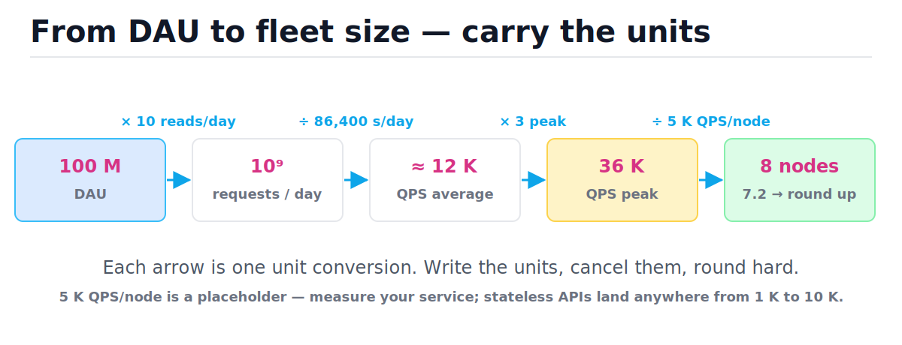
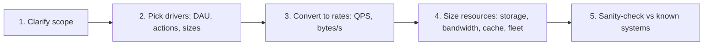
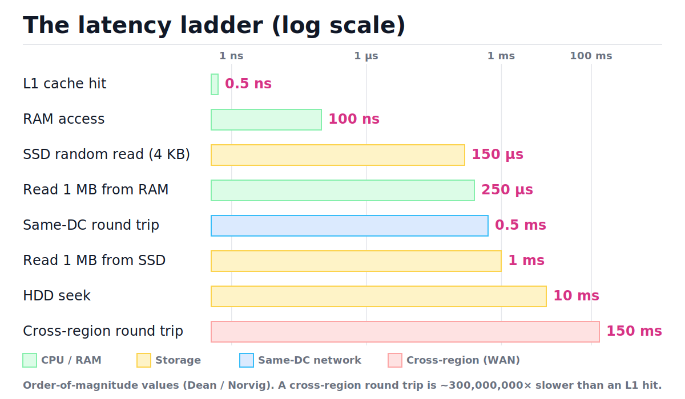
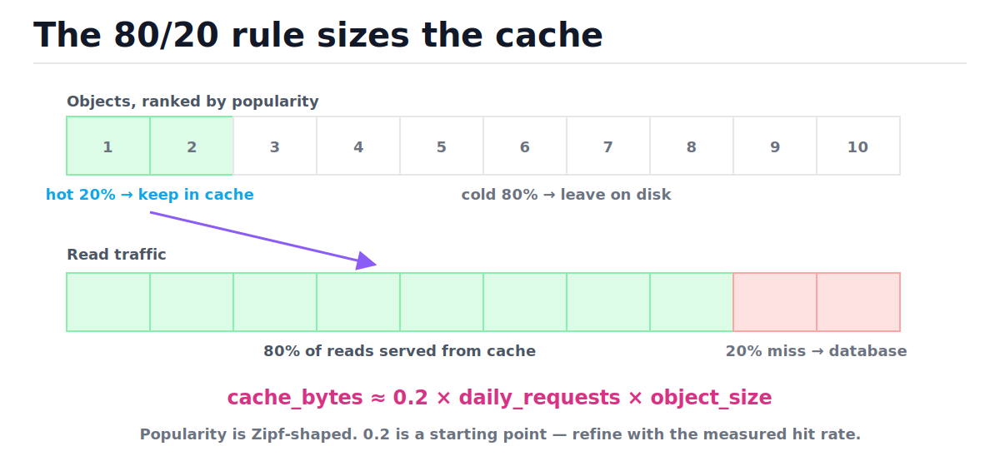

# Back-of-the-Envelope Estimation

[toc]

> **TL;DR:** Back-of-the-envelope estimation turns a vague requirement ("100 M users") into concrete numbers (QPS, bytes, gigabits, node counts) using memorized constants and unit-carrying arithmetic. The goal is the right order of magnitude in under two minutes, not three significant digits. Master five conversions — users → QPS, average → peak, rows → storage, QPS → bandwidth, traffic → cache size — and sanity-check every result against a known system.

## Vocabulary

Every estimate in this note is built from these eight quantities. Learn the symbols once; the formulas reuse them everywhere. Each definition is one sentence on purpose — estimation lives or dies on simple primitives.

**Daily active users (DAU)**

```math
\text{DAU} = \left|\{\text{users with at least one action in 24 h}\}\right|
```

The standard demand driver. Almost every traffic, storage, and bandwidth estimate starts from DAU multiplied by actions per user per day.

**Queries per second (QPS)**

```math
\text{QPS}_{\text{avg}} = \frac{\text{DAU} \times a}{86{,}400}
```

The rate of requests arriving at the system, where a is actions per user per day and 86,400 is seconds per day. QPS is the unit your servers, databases, and load balancers are actually sized in.

**Peak factor**

```math
k = \frac{\text{QPS}_{\text{peak}}}{\text{QPS}_{\text{avg}}}, \qquad k \in [2, 5]
```

The ratio of busiest-second traffic to the daily average. Consumer traffic is diurnal — everyone shows up in the same few evening hours — so the peak is typically 2–5× the average.

**Replication factor**

```math
R \approx 3
```

How many copies of each byte the system stores for durability and availability. Forgetting R is the most common 3× underestimate in storage math.

**Retention**

```math
T_{\text{days}}
```

How long data is kept before deletion or archival. Storage grows linearly with retention; "forever" means unbounded growth.

**Working set (hot set)**

```math
\text{cache} \approx 0.2 \times \text{daily requests} \times \text{object size}
```

The fraction of data that serves most of the traffic. Real access patterns are Zipf-skewed, so a cache holding ~20% of daily objects typically absorbs ~80% of reads.

**Ingress / egress**

```math
\text{egress} = \text{read QPS} \times \text{payload bytes}
```

Bandwidth into the system (writes, uploads) versus out of it (reads, downloads). For read-heavy systems egress dominates — often by 10–100× — and egress is what cloud providers bill for.

**Order of magnitude**

```math
10^k
```

The resolution of envelope math. Two estimates "agree" if they share an exponent; chasing the second significant digit is wasted effort because the inputs are guesses.

## Intuition

Estimation is dimensional analysis with memorized constants. You start from a demand number (DAU), multiply and divide by rates and sizes, and let the units cancel until you land in the unit you need: QPS, bytes, bits per second, or node count. If at any point the units do not cancel cleanly, the estimate is wrong — no exceptions. The figure below shows one full chain; every arrow is a single conversion.



Three habits make this fast and reliable:

- **Round aggressively.** 86,400 becomes 10⁵; 11,574 becomes ~12 K. One significant digit is the working precision.
- **Carry units.** Write "requests/day", "B/s", "QPS" next to every number. Unit mismatches are how estimates silently go 1000× wrong.
- **Sanity-check against known systems.** Google search handles roughly 100 K QPS; if your photo-sharing estimate says 50 M QPS, you slipped a few zeros.

## How it works

A full estimate is a five-step pipeline, and interviews score you on the discipline of the steps more than the final number. State assumptions out loud, convert one unit at a time, and announce the sanity check at the end. The rest of this section walks each conversion with its formula.



### Step 0 — memorize the latency floor

Before any arithmetic, you need physics: how long the underlying operations take. These are the Dean/Norvig "numbers everyone should know," and they set the floor for every design decision — whether a cache helps, whether cross-region sync chat is feasible, how many sequential round trips a request can afford. The figure shows the spread on a log scale; the full table follows.



| Operation | Latency | In perspective |
| :--- | ---: | :--- |
| L1 cache reference | 0.5 ns | the unit of "instant" |
| Branch mispredict | 5 ns | 10× L1 |
| L2 cache reference | 7 ns | 14× L1 |
| Mutex lock/unlock | 25 ns | uncontended |
| Main memory reference | 100 ns | 200× L1 |
| Compress 1 KB (Snappy) | 3 µs | compression is cheap |
| Send 1 KB over 1 Gbps network | 10 µs | |
| SSD random read (4 KB) | 150 µs | ~1,000× RAM |
| Read 1 MB sequentially from RAM | 250 µs | |
| Same-datacenter round trip | 0.5 ms | ≤ 2,000 sequential RTTs/s |
| Read 1 MB sequentially from SSD | 1 ms | 1 GB/s sequential |
| HDD seek | 10 ms | why random I/O on disk dies |
| Read 1 MB sequentially from HDD | 20 ms | |
| Cross-region round trip (CA ↔ EU) | 150 ms | 3 × 10⁸ × L1 |

> [!NOTE]
> These are order-of-magnitude anchors from Dean/Norvig, measured on ~2010 hardware. Modern NVMe random reads are nearer 20–100 µs and cross-region varies 50–150 ms by route — the *ratios between rungs* are what you memorize, not the third digit.

Two derived rules fall straight out of the table. A request that makes sequential same-DC calls can afford at most ~2,000 of them per second (0.5 ms each), so fan out in parallel. And anything interactive across regions pays 50–150 ms per round trip before your code runs at all, so chatty cross-region protocols are dead on arrival.

### Powers of two and ten

Storage math runs on powers of two; envelope math runs on powers of ten. The trick is that they almost coincide: 2¹⁰ = 1,024 ≈ 10³, so you can swap binary and decimal prefixes freely at envelope precision. Memorize this table cold.

| Power of 2 | Exact value | ≈ Power of 10 | Name |
| :--- | ---: | :--- | :--- |
| 2¹⁰ | 1,024 | ~10³ (thousand) | 1 KB |
| 2²⁰ | 1,048,576 | ~10⁶ (million) | 1 MB |
| 2³⁰ | ≈ 1.07 × 10⁹ | ~10⁹ (billion) | 1 GB |
| 2⁴⁰ | ≈ 1.10 × 10¹² | ~10¹² (trillion) | 1 TB |
| 2⁵⁰ | ≈ 1.13 × 10¹⁵ | ~10¹⁵ (quadrillion) | 1 PB |

Time constants matter just as much, because every "per day" number must become "per second":

| Constant | Exact | Envelope value |
| :--- | ---: | :--- |
| Seconds per day | 86,400 | ~10⁵ |
| Seconds per month | ~2.6 × 10⁶ | ~2.5 million |
| Seconds per year | ~3.15 × 10⁷ | ~π × 10⁷ |

### Users to QPS

The single most-used conversion: daily demand to per-second rate. Take DAU, multiply by actions per user per day, divide by seconds per day. The division by 86,400 is where "millions per day" collapses into "tens per second" — the most common surprise for newcomers.

```math
\text{QPS}_{\text{avg}} = \frac{\text{DAU} \times a}{86{,}400 \ \text{s/day}}
```

> [!IMPORTANT]
> The reversible rule: **1 QPS sustained ≈ 10⁵ requests/day ≈ 100 K/day.** So "1 million writes/day" is ~12 QPS — a trivial load for one database — and "1 billion reads/day" is ~12 K QPS — a real fleet. Carry the units and this conversion can never be off by more than rounding.

### Peak factor

Averages hide the shape of the day. Consumer traffic concentrates in a few evening hours, so the busiest second carries 2–5× the daily average, and that peak — not the average — is what you provision for. Pick k = 2 for flat enterprise traffic, k = 3 as the default, k = 5 for spiky consumer or event-driven traffic.

```math
\text{QPS}_{\text{peak}} = k \times \text{QPS}_{\text{avg}}, \qquad k \in [2, 5]
```

> [!WARNING]
> A system sized for average QPS falls over every single evening. Capacity questions are always peak questions; say "average X, peak 3× → Y" in one breath so the interviewer hears you know the difference.

### Storage

Storage is a four-factor product: how many rows arrive per day, how big each row is, how many copies you keep, and for how long. Estimate row size by summing fields (ids ~8 B, timestamps ~8 B, short strings ~100 B, URLs ~500 B, metadata ~1 KB) and round up.

```math
\text{storage} = \text{rows/day} \times \text{bytes/row} \times R \times T_{\text{days}}
```

> [!CAUTION]
> The two silent storage killers: forgetting replication (instant 3× undercount) and unbounded retention (linear growth forever). Always state R and T explicitly — "raw 6 TB, ×3 replication = 18 TB over 10 years" — or the bill and the pager will state them for you.

### Bandwidth in vs out

Bandwidth has a direction. Ingress is what users send you (writes, uploads); egress is what you send them (reads, downloads). For a read-heavy system egress dominates by the read:write ratio, and egress is also the line item cloud providers charge for. Convert bytes to bits (×8) only at the end, because link capacities are quoted in bits per second.

```math
\text{ingress} = \text{write QPS} \times \text{payload}_{\text{in}}, \qquad
\text{egress} = \text{read QPS} \times \text{payload}_{\text{out}}
```

### Cache sizing — the 80/20 rule

Real-world access frequency is Zipf-distributed: a small head of objects gets most of the traffic. The classic starting point is the Pareto split — cache the hottest 20% of a day's requested objects and expect ~80% of reads to hit cache. The figure shows the asymmetry that makes caching pay.



```math
\text{cache bytes} \approx 0.2 \times \text{daily requests} \times \text{object size}
```

> [!TIP]
> This formula deliberately over-counts (it ignores repeated requests to the same object), which makes it a safe upper bound. If the result fits in one Redis box — and it usually does for metadata — stop optimizing and move on.

### End-to-end trace: feed reads to fleet size

Here is the full discipline applied once, slowly: a feed service with 100 M DAU, each reading their feed 10 times a day. Every row carries one number forward and records the decision that produced it — this is the table you should be able to reproduce on a whiteboard in ninety seconds.

| Step | Question | Carried value | Decision |
| :--- | :--- | :--- | :--- |
| 1 | How many users? | 10⁸ DAU | given; keep as a power of ten |
| 2 | Reads per user per day? | 10 | assumption — say it out loud |
| 3 | Requests per day? | 10⁹/day | 10⁸ × 10; units: requests/day |
| 4 | Average QPS? | ≈ 12 K | ÷ 86,400 ≈ ÷ 10⁵; exact 11,574 — round |
| 5 | Peak QPS? | ≈ 36 K | × 3 default peak factor |
| 6 | Fleet size? | 8 nodes | ÷ 5 K QPS/node = 7.2 → round up |
| 7 | Sane? | yes | Google search ≈ 100 K QPS; a top-10 feed at 36 K peak is plausible |

### Python estimation helpers

These six functions encode every conversion above, and the asserts pin the worked numbers so the formulas can't drift. They are deliberately one-liners — the value is the named, unit-documented interface, not the arithmetic. All run on Python 3.9.

```python
SECONDS_PER_DAY = 86_400


def avg_qps(dau: int, actions_per_user_per_day: float) -> float:
    """Average requests/second from daily active users."""
    return dau * actions_per_user_per_day / SECONDS_PER_DAY


def peak_qps(average: float, peak_factor: float = 3.0) -> float:
    """Peak requests/second; peak_factor is 2-5x for diurnal traffic."""
    return average * peak_factor


def storage_bytes(
    rows_per_day: float,
    bytes_per_row: float,
    retention_days: float,
    replication: int = 3,
) -> float:
    """Bytes to keep rows for retention_days, replicated."""
    return rows_per_day * bytes_per_row * retention_days * replication


def bandwidth_bytes_per_sec(qps: float, payload_bytes: float) -> float:
    """Sustained bandwidth for qps requests of payload_bytes each."""
    return qps * payload_bytes


def cache_bytes(
    daily_requests: float,
    object_bytes: float,
    hot_fraction: float = 0.2,
) -> float:
    """80/20 starting point: cache the hot fraction of a day's requests."""
    return daily_requests * hot_fraction * object_bytes


def human(n: float) -> str:
    """Decimal units -- envelope math uses powers of ten, not 1024."""
    units = ("B", "KB", "MB", "GB", "TB", "PB")
    i = 0
    while n >= 1000 and i < len(units) - 1:
        n /= 1000.0
        i += 1
    return f"{n:.1f} {units[i]}"


# 100 M DAU x 10 reads/day: ~12 K QPS average, ~35 K peak.
assert round(avg_qps(100_000_000, 10)) == 11_574
assert round(peak_qps(avg_qps(100_000_000, 10))) == 34_722

# 1 QPS sustained is ~86 K requests/day (the 10^5/day rule).
assert avg_qps(86_400, 1) == 1.0

# 3.33 M rows/day at 500 B, kept 10 years, 3 replicas: ~18 TB.
assert human(storage_bytes(3_333_333, 500, 3650)) == "18.2 TB"

# 2 M uploads/day at 5 MB each: ~116 MB per second sustained ingress.
assert human(bandwidth_bytes_per_sec(avg_qps(2_000_000, 1), 5_000_000)) == "115.7 MB"

# 333 M reads/day of 500 B objects: a ~33 GB cache covers the hot set.
assert human(cache_bytes(333_000_000, 500)) == "33.3 GB"
```

## Complexity and scaling laws

Every helper above is constant-time arithmetic — that is the entire point of the discipline. An estimate must cost O(k) for k input drivers so you can run it live in an interview or a design review; anything slower means you are simulating, not estimating. What is *not* constant is how the estimates themselves grow with demand, summarized in the second table.

| Operation | Best | Average | Worst | Space |
| :--- | :---: | :---: | :---: | :---: |
| `avg_qps`, `peak_qps`, `storage_bytes`, `bandwidth_bytes_per_sec`, `cache_bytes` | O(1) | O(1) | O(1) | O(1) |
| `human(n)` | O(1) | O(log n) | O(log n) | O(1) |
| Full envelope estimate, k drivers | O(k) | O(k) | O(k) | O(k) |

| Estimate | Grows as | Implication |
| :--- | :--- | :--- |
| QPS | O(DAU) | linear: 10× users → 10× fleet |
| Storage | O(DAU × T) | unbounded without TTL/archival |
| Bandwidth | O(QPS × payload) | payload size is the cheapest lever |
| Cache | O(daily hot objects) | sublinear in total data when access is skewed |

The key bound to internalize is the peak-QPS formula and why rounding inside it is free:

```math
\text{QPS}_{\text{peak}} = k \cdot \frac{\text{DAU} \times a}{86{,}400}, \qquad k \in [2, 5]
```

```math
\text{rounding error: } \frac{10^5 - 86{,}400}{86{,}400} \approx 0.157
\qquad \text{vs} \qquad
\text{peak-factor uncertainty: } \frac{k_{\max}}{k_{\min}} - 1 = 1.5
```

Replacing 86,400 with 10⁵ costs ~16% — but k itself is uncertain by 150%, and DAU and a are guesses too. The output's error budget is dominated by the assumptions, so aggressive rounding of the constants changes nothing about the conclusion. This is *why* "round to one significant digit" is correct procedure and not laziness.

## In production

Envelope numbers feed capacity planning, and production adds overheads the clean formulas omit. Real fleets are provisioned at 50–60% utilization at peak so that losing an availability zone (N+1 redundancy) or absorbing a retry storm does not tip them over. Real latency targets are p99, not average — a node at 80% CPU has fine averages and terrible tails. And real growth compounds: a 10%-per-month service doubles every ~7 months, so a 10-year storage estimate is really a statement about year one or two plus a re-evaluation cadence.

The classic production failure modes are exactly the gaps between the envelope and reality:

- **Peak factor was right, the spike was not diurnal.** A push notification, a celebrity post, or a cache flush produces 10–50× spikes; that is what [rate limiting and load shedding](./10-rate-limiting-and-load-shedding.md) is for.
- **Retry amplification.** Clients retrying on timeout multiply QPS exactly when the system is slowest — your 36 K peak becomes 100 K during the incident the estimate was supposed to prevent.
- **Replication and indexes were forgotten.** The 6 TB "raw" estimate ships as 18 TB on disk, plus 20–40% again for indexes and write-ahead logs.
- **Egress was billed, not just served.** Bandwidth out is a recurring cost line; a 20 Gbps egress estimate is a finance conversation, not just a NIC choice.

> [!TIP]
> Production sizing in one line: take peak QPS, divide by *measured* per-node throughput at p99-acceptable load, add one node per failure domain, and cap utilization at ~60%. Then watch the dashboards and re-estimate monthly — the envelope buys the first deploy, telemetry buys the second.

## Real-world examples

Three fully worked estimates, the same three archetypes nearly every design interview draws from: a read-heavy API, write-once storage, and media bandwidth. Work through each by hand first; the Python block at the end re-derives every number and asserts it.

### Example 1 — read-heavy social feed QPS

Scope: 100 M DAU, each opens their feed 10 times/day and posts 0.5 times/day. Reads dominate writes 20:1, which is what makes this a caching problem rather than a database-scaling problem.

```math
\text{read QPS}_{\text{avg}} = \frac{10^8 \times 10}{86{,}400} \approx 11{,}600
\qquad
\text{read QPS}_{\text{peak}} \approx 3 \times 11{,}600 \approx 35{,}000
```

```math
\text{write QPS}_{\text{avg}} = \frac{10^8 \times 0.5}{86{,}400} \approx 580
\qquad
\text{read:write} \approx 20:1
```

Conclusion: ~35 K peak read QPS needs a cache tier and a small stateless fleet; ~600 write QPS fits a modest primary database with replicas.

### Example 2 — URL shortener storage over 10 years

Scope: 100 M new short URLs per month, each row ~500 B (short code, long URL, owner, timestamps), replication factor 3, kept 10 years. Note how small the write QPS is — storage is the only interesting axis in this system.

```math
\text{write QPS} = \frac{10^8}{30 \times 86{,}400} \approx 39
\qquad
\text{rows}_{10\text{y}} = 10^8 \times 12 \times 10 = 1.2 \times 10^{10}
```

```math
\text{storage} = 1.2 \times 10^{10} \times 500 \ \text{B} = 6 \ \text{TB raw}
\ \xrightarrow{\times 3 \ \text{replication}}\ 18 \ \text{TB}
```

Conclusion: 18 TB over a decade is a few large disks — sharding for *storage* is unnecessary; you shard (if at all) for read throughput. With 100:1 reads, read QPS ≈ 3,900, and the 80/20 cache is 0.2 × 333 M reads/day × 500 B ≈ 33 GB — one Redis box. See the [URL shortener case study](./14-case-study-url-shortener.md) for the full design.

### Example 3 — image upload bandwidth

Scope: 10 M DAU photo app; 10% of users upload 2 photos/day at 5 MB average; each photo is viewed 20 times. Bandwidth is the axis where bytes-vs-bits and in-vs-out mistakes hurt most, so carry units pedantically.

```math
\text{uploads/day} = 10^7 \times 0.1 \times 2 = 2 \times 10^6
\qquad
\text{ingress} = \frac{2 \times 10^6 \times 5 \ \text{MB}}{86{,}400 \ \text{s}} \approx 116 \ \text{MB/s} \approx 0.93 \ \text{Gbps}
```

```math
\text{egress} \approx 20 \times \text{ingress} \approx 2.3 \ \text{GB/s} \approx 18.5 \ \text{Gbps avg}
\ \xrightarrow{\times 3 \ \text{peak}}\ \sim 56 \ \text{Gbps}
```

Conclusion: ingress (~1 Gbps average, ~3 Gbps peak) is easy; egress at ~56 Gbps peak is a CDN requirement, not an origin-server requirement — see [DNS, load balancers, and CDNs](./03-dns-load-balancers-and-cdns.md). Storage lands at 2 × 10⁶ × 5 MB = 10 TB/day before replication, which forces a tiering/compression conversation on day one.

### Verified in code

This block re-derives all three examples with the helpers from above. Every assert is a number quoted in the prose — if one fails, the prose is wrong.

```python
# Example 1 -- social feed
feed_read_avg = avg_qps(100_000_000, 10)
feed_write_avg = avg_qps(100_000_000, 0.5)
assert 11_000 < feed_read_avg < 12_000
assert 34_000 < peak_qps(feed_read_avg) < 35_000
assert round(feed_read_avg / feed_write_avg) == 20      # read:write 20:1

# Example 2 -- URL shortener
writes_per_month = 100_000_000
write_qps = writes_per_month / (30 * SECONDS_PER_DAY)
assert 38 < write_qps < 39
rows_10y = writes_per_month * 12 * 10
assert human(rows_10y * 500) == "6.0 TB"                # raw
assert human(rows_10y * 500 * 3) == "18.0 TB"           # x3 replication
reads_per_day = writes_per_month / 30 * 100             # 100:1 read:write
assert human(cache_bytes(reads_per_day, 500)) == "33.3 GB"

# Example 3 -- image uploads
uploads_per_day = 10_000_000 * 0.10 * 2
ingress = uploads_per_day * 5_000_000 / SECONDS_PER_DAY
assert human(ingress) == "115.7 MB"                     # per second
assert 0.9 < ingress * 8 / 1e9 < 1.0                    # ~0.93 Gbps
egress_gbps = ingress * 20 * 8 / 1e9
assert 18 < egress_gbps < 19                            # ~18.5 Gbps avg
assert human(uploads_per_day * 5_000_000) == "10.0 TB"  # per day, raw
```

## When to use / when NOT to use

Estimation is a screening tool: it kills bad designs cheaply and scopes good ones. It is not a substitute for measurement, and knowing which side of that line you are on is part of the skill.

**Use it when:**

- Choosing an architecture — does this need sharding, a cache, a CDN, or just one Postgres box?
- Interviewing — every system design question expects a 2-minute envelope pass before any boxes are drawn.
- Reviewing a design doc — checking someone's QPS or storage claim takes 30 seconds and catches 10× errors.
- Triaging feasibility — "can we sync-replicate across regions?" dies in one latency-table lookup.

**Do NOT use it when:**

- Setting SLOs or autoscaling thresholds — those need measured p99s under real traffic, not arithmetic.
- The answer is within 2–3× of a hard limit — envelope precision is one order of magnitude; at the margin, benchmark.
- Capacity-planning a live system that has telemetry — never estimate what you can query.
- The access pattern is the unknown — the 80/20 rule assumes skew; a uniform-random workload (e.g., full scans) breaks it.

## Common mistakes

- **"86,400 is too crude to round to 10⁵"** — backwards. The 16% rounding error is noise next to the 2–5× peak-factor uncertainty; refusing to round just slows you down without adding accuracy.
- **"Average QPS is what I provision for"** — average-sized systems fall over nightly. Provision for peak (2–5× average) at ~60% utilization.
- **"Storage = rows × bytes"** — missing ×3 replication and ×(indexes, WAL) overhead. Raw bytes is the floor, not the answer.
- **"1 Gbps link, 1 GB/s of traffic, fine"** — bytes vs bits: 1 GB/s is 8 Gbps. The ×8 lives at the very end of bandwidth math, and forgetting it is an 8× error in the dangerous direction.
- **"1 million requests/day is huge"** — it is ~12 QPS. Per-day numbers always sound big; convert to QPS before reacting.
- **"The cache must hold everything"** — it must hold the hot 20%. Working sets are Zipf-skewed; total data size is usually irrelevant to cache sizing.
- **"My estimate said 8 nodes, so deploy 8 nodes"** — the envelope sizes the first deploy ±3×. Deploy, measure per-node throughput at acceptable p99, then re-size.

## Interview questions and answers

These are the forms the estimation question actually takes. Practice answering out loud — the spoken chain of conversions *is* the answer; the final number is almost incidental.

**Q1: Estimate the read QPS for a Twitter-like service with 200 M DAU.**
**Answer:** Assume each user checks their timeline 10 times a day — that's 2 billion reads/day. Divide by roughly 10⁵ seconds per day: ~20 K QPS average. Multiply by 3 for peak: ~60 K QPS. Sanity check: Google search is ~100 K QPS, and a top-tier social timeline being somewhat smaller than search feels right.

**Q2: How much storage does a messaging app with 1 B DAU need per day?**
**Answer:** Say 40 messages per user per day at ~100 bytes each — 4 × 10¹² bytes, so 4 TB/day raw. Times 3 for replication: ~12 TB/day, about 4–5 PB/year. That number says messages are cheap; it's media attachments that would dominate, so I'd ask about attachment rates next.

**Q3: Why multiply average QPS by 2–5 for peak?**
**Answer:** Traffic is diurnal — users concentrate in a few evening hours, so the busiest second carries several times the daily average. Flat enterprise traffic earns a 2, default consumer traffic a 3, spiky or event-driven traffic a 5. And the system must be provisioned for peak, because it falls over at peak, not at average.

**Q4: Your service needs 36 K peak QPS. How many servers?**
**Answer:** Depends on per-node throughput, which I'd measure — but for a stateless API, 5 K QPS per node is a reasonable placeholder. 36 ÷ 5 = 7.2, round up to 8, then add headroom: at 60% target utilization that's ~12 nodes, plus one per failure domain for N+1. So roughly a dozen, refined by load testing.

**Q5: Is 1 million writes per day a lot?**
**Answer:** No — divide by 10⁵ seconds: ~12 QPS average, maybe 40 at peak. A single well-tuned Postgres instance handles that with a wide margin. Per-day numbers sound impressive; per-second numbers tell the truth.

**Q6: How long does it take to read 1 TB sequentially from an SSD?**
**Answer:** The ladder says ~1 ms per MB sequential, i.e. ~1 GB/s. 1 TB is 10⁶ MB, so 10⁶ ms ≈ 1,000 s ≈ 17 minutes on one device. That's why bulk reads get parallelized across disks or shards — and on spinning disk at 20 ms/MB it's ~5.5 hours, which is why HDD-era systems avoided full scans entirely.

**Q7: Why can't a synchronous chat app do a cross-region database write per message?**
**Answer:** A cross-region round trip is 50–150 ms, and a synchronous write needs at least one, often two with commit acknowledgment. That alone eats the entire ~200 ms budget for "feels instant," before queuing or processing. So you write locally and replicate asynchronously, or pin the conversation to one region.

**Q8: Size the cache for a URL shortener doing 333 M redirects/day with 500 B records.**
**Answer:** Apply the 80/20 rule: 0.2 × 333 M × 500 B ≈ 33 GB. That fits in one Redis instance, so the design conversation is over — cache the hot URLs, expect ~80% hit rate, and let the ~20% of misses hit a database that only sees ~800 QPS.

## Practice path

Drill the conversions until each takes under thirty seconds, then chain them. The order below builds from single conversions to full estimates.

1. **Memorize the two tables.** Latency ladder and powers of two/ten. Self-test: write both from memory; check against this note.
2. **Drill the 10⁵ rule.** Convert 20 per-day volumes to QPS in your head (1 M/day, 50 M/day, 2 B/day, ...). Target: instant.
3. **Single-axis estimates.** Storage for 10 M rows/day × 1 KB × 3 years; bandwidth for 5 K QPS × 2 KB responses. Verify each with the Python helpers.
4. **Full pipeline, timed.** Pick a familiar product (Spotify, Maps, Slack) and produce DAU → peak QPS → storage → bandwidth → cache in under five minutes, out loud.
5. **Sanity-check practice.** For each estimate, name the known system you compared against and whether your number is within 10× of it.
6. **Re-derive this note's examples** from the scope lines alone, then check against the `Verified in code` block.

## Copyable takeaways

- Estimation = memorized constants + unit-carrying arithmetic + aggressive rounding. Target: right order of magnitude in two minutes.
- **1 QPS ≈ 10⁵ requests/day.** Seconds per day = 86,400 ≈ 10⁵; seconds per year ≈ 3 × 10⁷.
- Average → peak: ×2–5 (default ×3). Provision for peak at ~60% utilization, plus N+1.
- Storage = rows/day × bytes/row × replication (≈3) × retention days. State R and T out loud.
- Bandwidth: ingress = write QPS × payload; egress = read QPS × payload; ×8 for bits only at the end.
- Cache ≈ 0.2 × daily requests × object size — the Zipf head serves ~80% of reads.
- Latency floor: RAM 100 ns, SSD random 150 µs, same-DC RTT 0.5 ms, cross-region RTT 50–150 ms. Ratios, not digits.
- Rounding 86,400 → 10⁵ costs 16%; your peak factor is uncertain by 150%. Round without guilt.
- Always end with a sanity check against a known system (Google search ≈ 100 K QPS).

## Sources

- Jeff Dean, *Designs, Lessons and Advice from Building Large Distributed Systems*, LADIS 2009 keynote — the original "Numbers Everyone Should Know" slide: https://www.cs.cornell.edu/projects/ladis2009/talks/dean-keynote-ladis2009.pdf
- Peter Norvig, *Teach Yourself Programming in Ten Years* — appendix with approximate operation timings: https://norvig.com/21-days.html#answers
- Colin Scott, *Latency Numbers Every Programmer Should Know* — interactive, year-scaled version of the table: https://colin-scott.github.io/personal_website/research/interactive_latency.html
- Google SRE Workbook, Ch. 12, *Introducing Non-Abstract Large System Design* — estimation as an SRE design discipline: https://sre.google/workbook/non-abstract-design/
- Martin Kleppmann, *Designing Data-Intensive Applications*, Ch. 1 — describing load with numbers, percentiles vs averages.

## Related

- [How to approach system design](./01-how-to-approach-system-design.md) — where the estimation step sits in the full interview/design loop.
- [Scaling fundamentals](./04-scaling-fundamentals.md) — what to do once the envelope says one box is not enough.
- [Caching strategies](./05-caching-strategies.md) — turning the 80/20 cache-size estimate into an actual cache design.
- [Case study: URL shortener](./14-case-study-url-shortener.md) — Example 2 of this note, taken end to end.
- [Network performance](../Computer-Networking/8-performance.md) — where the round-trip and bandwidth numbers come from.
- [Math for technical interviews](../Mathematics/Technical-Interview-Math/math-for-technical-interviews.md) — the arithmetic and logarithm fluency this note leans on.
