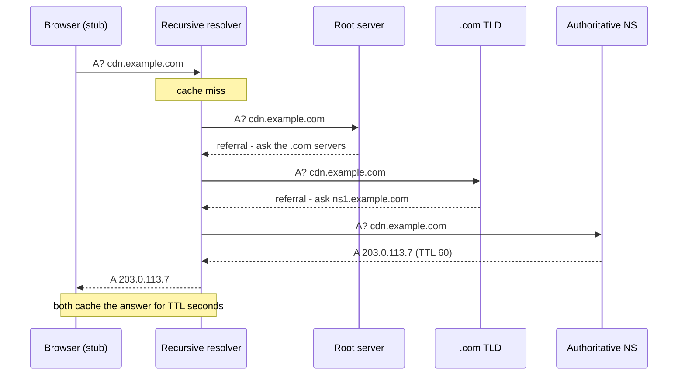
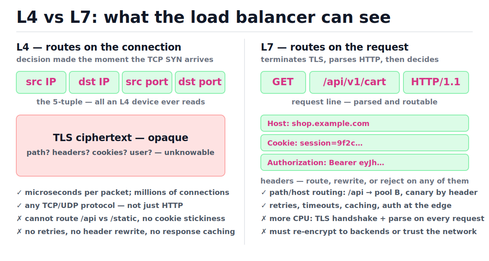
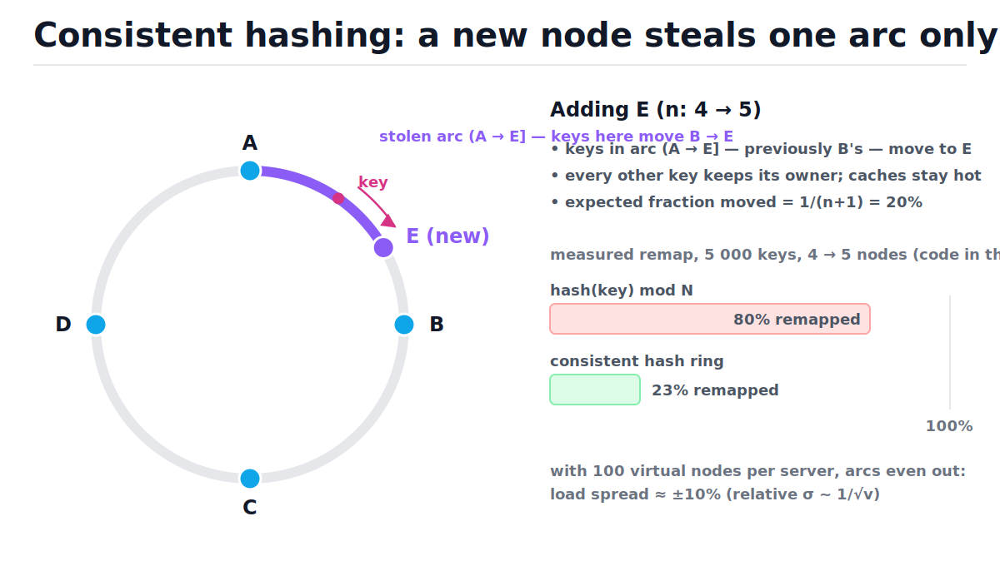
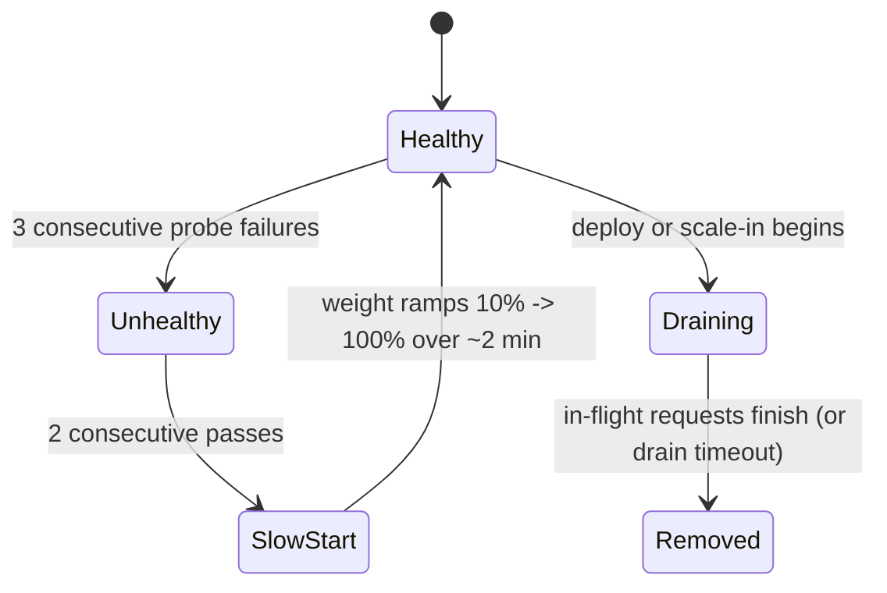
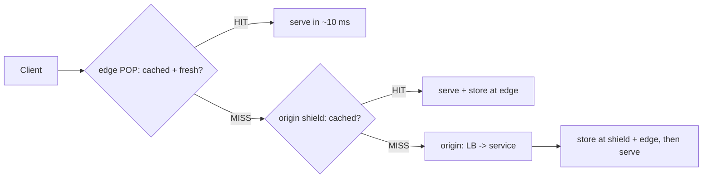

# DNS, Load Balancers, and CDNs

[toc]

> **TL;DR:** Before your code runs, a request survives three gauntlets: DNS turns a name into an IP (and is the bluntest, slowest-to-change routing layer), a load balancer picks which machine answers (L4 sees connections, L7 sees requests), and a CDN tries to answer from an edge cache so your origin never sees the request at all. Every system design answer starts with this path, so know exactly what each layer can and cannot see.

## Vocabulary

These are the load-bearing terms for the entire request path. Each one names a specific component or behavior; interviewers use them precisely, and so should you.

**Recursive resolver**

```math
\text{stub} \rightarrow \text{recursive} \rightarrow \{\text{root},\ \text{TLD},\ \text{authoritative}\}
```

The server (your ISP's, or a public one like 8.8.8.8) that does the full DNS walk on the client's behalf and caches every answer it learns. The client's own stub resolver only knows how to ask the recursive one.

**Authoritative name server**

```math
\text{example.com} \mapsto \text{the server that owns the zone's records}
```

The final source of truth for a domain's records. Root and TLD servers never answer the question directly; they hand out referrals until the resolver reaches the authoritative server.

**TTL (time to live)**

```math
t_{\text{expire}} = t_{\text{cached}} + \text{TTL}
```

How many seconds a DNS answer may be cached. Low TTL means faster failover but more lookups hitting your authoritative servers; it is a hint, not a contract — resolvers clamp and ignore it.

**A / CNAME record**

```math
\text{A}: \text{name} \mapsto \text{IPv4}, \qquad \text{CNAME}: \text{name} \mapsto \text{another name}
```

The two record types you touch most. A (and AAAA for IPv6) maps a name to an address; CNAME aliases one name to another, which is how `www.shop.com` points at `d111.cloudfront.net`.

**L4 load balancer**

```math
\text{route} = f(\text{srcIP},\ \text{dstIP},\ \text{srcPort},\ \text{dstPort},\ \text{proto})
```

Balances at the transport layer: it sees the 5-tuple of a TCP/UDP connection and nothing inside it. Fast (microseconds, often in-kernel or in hardware), protocol-agnostic, content-blind.

**L7 load balancer**

```math
\text{route} = f(\text{method},\ \text{path},\ \text{Host},\ \text{headers},\ \text{cookies})
```

Terminates TLS, parses HTTP, and routes per request. Can rewrite headers, retry failed backends, do cookie stickiness and canary routing — at the cost of CPU per request.

**Consistent hashing**

```math
\text{owner}(k) = \text{first node clockwise from } h(k) \text{ on the ring}
```

A key-to-node mapping where adding or removing a node remaps only the keys in one arc of a hash ring, instead of nearly all keys as `h(k) mod n` does. This is what keeps caches warm during scaling.

**Virtual node (vnode)**

```math
\text{relative load spread} \approx \frac{1}{\sqrt{v}} \quad (v = \text{vnodes per server})
```

Each physical server is hashed onto the ring at v points instead of one. More points means arc sizes average out; with v = 100 the per-server load lands within roughly ±10% of even.

**Edge POP (point of presence)**

```math
\text{RTT}_{\text{edge}} \approx 5\text{–}30\ \text{ms} \ll \text{RTT}_{\text{origin}}
```

A CDN datacenter placed near users. Terminating TLS and serving cache hits there removes whole continental round trips from page loads.

**Cache key**

```math
\text{key} = (\text{host},\ \text{path},\ \text{query?},\ \text{Vary headers})
```

The tuple a CDN uses to decide "have I seen this before?". Every component you add (query strings, cookies, headers) multiplies cardinality and divides your hit rate.

**Origin shield**

```math
N_{\text{POP misses}} \rightarrow 1 \text{ shield miss} \rightarrow \text{origin}
```

A single designated cache layer between all edge POPs and your origin, so 50 POPs missing the same object produce one origin fetch, not 50.

**Connection draining**

```math
\text{new connections} = 0, \qquad \text{in-flight requests run to completion}
```

When removing a backend (deploy, scale-in), the LB stops sending it new work but lets existing requests finish, bounded by a timeout. The difference between zero-downtime deploys and a spike of 502s.

## Intuition

Think of the request path as three questions asked in order: *where is the server?* (DNS), *is the answer already nearby?* (CDN), and *which machine should do the work?* (load balancer). Each layer exists to answer its question as early and as cheaply as possible — DNS once per TTL, the CDN at a datacenter 10 ms from the user, the LB only for requests that truly need the origin. The figure below is the whole note in one picture; everything after this just zooms into one box at a time.


> [!NOTE]
> "Reverse proxy" and "load balancer" are overlapping terms, not rivals. A reverse proxy is any server that accepts requests on behalf of backends (nginx doing TLS + compression for one app counts). A load balancer is a reverse proxy whose defining job is spreading load across *many* backends. Every L7 LB is a reverse proxy; not every reverse proxy balances.

## How it works

### DNS resolution, step by step

DNS is a distributed, hierarchical, aggressively cached database, and a cold lookup is a guided walk down that hierarchy. Your browser asks the OS stub resolver, which asks a recursive resolver, which walks root → TLD → authoritative, caching every referral on the way. The protocol details (UDP port 53, record formats) live in the [application layer note](../Computer-Networking/6-application-layer.md); here we care about the systems behavior. Each network hop is one round trip, so a fully cold lookup costs 3–4 RTTs — which is exactly why every layer caches.



The trace below is the same walk as a state table. Notice that the root and TLD never answer the question — they only narrow who to ask next, and the resolver caches those referrals so the *next* `.com` lookup skips straight to step 3.

| Step | Who → whom | Query / state | Decision |
| :---: | :--- | :--- | :--- |
| 1 | stub → recursive | `A? cdn.example.com`; OS cache empty | forward to recursive |
| 2 | recursive → root | cache miss on name, TLD, and NS | root refers: "ask .com servers" |
| 3 | recursive → .com TLD | knows TLD address now (cached ~48 h) | TLD refers: "ask ns1.example.com" |
| 4 | recursive → authoritative | knows zone NS now | answer: `A 203.0.113.7`, TTL 60 |
| 5 | recursive → stub | answer cached at resolver | client caches too; connects to 203.0.113.7 |

### TTLs and propagation reality

"DNS propagation" is a misnomer — nothing is pushed anywhere. When you change a record, every cached copy simply expires on its own schedule, so the old answer keeps being served until each resolver's TTL runs out. The standard migration play: drop the TTL to 60 s a day ahead (so caches holding the *old long TTL* expire), make the change, watch traffic shift, then raise the TTL back.

> [!WARNING]
> TTL is advisory. Some ISP resolvers clamp very low TTLs up to minutes, some OSes and apps (notably the JVM's default-forever DNS cache, browsers' connection pools) hold answers longer, and long-lived keep-alive connections never re-resolve at all. Plan for a tail of traffic hitting the *old* IP for hours — keep the old server up and draining, never repurpose its IP immediately.

### DNS-based routing

Because DNS chooses an IP before any connection exists, it is the outermost routing layer — the only one that can steer a user to a different *region*. Managed DNS (Route 53, Cloud DNS, NS1) answers the same query differently per policy: weighted (split by percentage — canaries, gradual migration), latency-based (answer with the region measured fastest for that resolver), and geo (answer by the client's location — compliance, localization). Health checks can drop a region from answers entirely, which is how global failover works.

```python
import random

def weighted_dns(records: dict[str, int], rng: random.Random) -> str:
    """Route 53-style weighted routing: pick an answer proportional to weight."""
    names: list[str] = list(records)
    weights: list[int] = list(records.values())
    return rng.choices(names, weights=weights, k=1)[0]

rng = random.Random(42)
picks = [weighted_dns({"us-east": 90, "us-west": 10}, rng) for _ in range(1000)]
east = picks.count("us-east")
assert 850 < east < 950   # ~90% steered east; seeded, so deterministic (892)
```

> [!IMPORTANT]
> DNS balances *resolutions*, not *requests*. One giant ISP resolver caches one answer and pins millions of users behind it to a single IP for the whole TTL, and clients ignore your weights once they have an answer. Use DNS for coarse region steering; do per-request balancing with a real load balancer behind each answer.

### L4 vs L7 load balancing

Once DNS has produced an IP, the load balancer behind that IP decides which actual machine serves each connection or request. The split that matters is what the balancer can *see*, which is set by which layer of the [TCP/UDP stack](../Computer-Networking/5-tcp-and-udp.md) it operates at. An L4 balancer routes when the TCP SYN arrives, using only addresses and ports; an L7 balancer terminates TLS, reads the full HTTP request, and routes on content. Study the visibility split below — every capability difference in the table follows from it.



| Dimension | L4 (AWS NLB, IPVS, Maglev) | L7 (AWS ALB, Envoy, nginx, HAProxy http) |
| :--- | :--- | :--- |
| Sees | 5-tuple only | method, path, host, headers, cookies, body |
| Routing granularity | per connection | per request |
| TLS | usually passthrough | terminates (and can re-encrypt to backends) |
| Latency overhead | microseconds; can do direct server return | ~ms; full proxy, two TCP connections |
| Retries / rewrites / caching | none | all of it |
| Sticky sessions | source-IP hash only | cookie-based |
| Throughput per box | millions of connections | thousands–hundreds of thousands of req/s |
| Non-HTTP traffic (databases, MQTT, game UDP) | yes | no |

Real deployments stack them: DNS → an L4 tier on a stable virtual IP (scaled with ECMP/anycast) → an L7 tier doing the smart routing → services. Google's Maglev and AWS NLB are the L4 tier; Envoy and ALB are the L7 tier. In Kubernetes the same split appears as [Services/kube-proxy](../Infrastructure-DevOps/Kubernetes/5-services-endpoints-and-kube-proxy.md) (L4) versus [Ingress and service mesh](../Infrastructure-DevOps/Kubernetes/6-ingress-gateway-api-and-service-mesh.md) (L7).

### Algorithm: round robin

Round robin hands connections to backends in fixed rotation — the baseline algorithm and the right default when backends are identical and requests are cheap and uniform. It is O(1) per pick with O(1) state: a single cursor. Its weakness is blindness: it sends the next request to a backend that may already be drowning in slow requests.

```python
class RoundRobin:
    """O(1) pick, O(1) extra space."""

    def __init__(self, servers: list[str]) -> None:
        self.servers: list[str] = servers
        self.i: int = 0

    def pick(self) -> str:
        server = self.servers[self.i]
        self.i = (self.i + 1) % len(self.servers)
        return server

rr = RoundRobin(["a", "b", "c"])
assert [rr.pick() for _ in range(6)] == ["a", "b", "c", "a", "b", "c"]
```

### Algorithm: weighted round robin (the smooth variant)

Weights handle heterogeneous backends — a 16-core box should get 4x the traffic of a 4-core box. The naive approach ("send weight-many in a row") produces bursts: `a a a a a b c` hammers `a` then starves it. nginx's *smooth* WRR fixes this with running counters: every pick, each server's counter grows by its weight; the largest counter wins and pays back the total. Cost is O(n) per pick, O(n) state.

```python
class SmoothWeightedRR:
    """nginx's smooth WRR. O(n) per pick, O(n) space."""

    def __init__(self, weights: dict[str, int]) -> None:
        self.weights: dict[str, int] = dict(weights)
        self.current: dict[str, int] = {s: 0 for s in weights}
        self.total: int = sum(weights.values())

    def pick(self) -> str:
        for s in self.current:
            self.current[s] += self.weights[s]
        best = max(self.current, key=lambda s: self.current[s])
        self.current[best] -= self.total
        return best

wrr = SmoothWeightedRR({"a": 5, "b": 1, "c": 1})
seq = [wrr.pick() for _ in range(7)]
assert seq == ["a", "a", "b", "a", "c", "a", "a"]     # interleaved, not bursty
assert all(v == 0 for v in wrr.current.values())      # state resets each cycle
```

Trace the counters for weights a=5, b=1, c=1 (total = 7). The picked server's counter drops by 7; everyone else keeps climbing until they earn a turn. After exactly `total` picks the state returns to all zeros, so the pattern repeats.

| Step | Counters after +weight (a, b, c) | Decision (max) | Counters after −7 |
| :---: | :---: | :---: | :---: |
| 1 | 5, 1, 1 | **a** | −2, 1, 1 |
| 2 | 3, 2, 2 | **a** | −4, 2, 2 |
| 3 | 1, 3, 3 | **b** | 1, −4, 3 |
| 4 | 6, −3, 4 | **a** | −1, −3, 4 |
| 5 | 4, −2, 5 | **c** | 4, −2, −2 |
| 6 | 9, −1, −1 | **a** | 2, −1, −1 |
| 7 | 7, 0, 0 | **a** | 0, 0, 0 |

### Algorithm: least connections

Least connections routes each new request to the backend with the fewest in-flight requests, making it adaptive: a backend bogged down by slow queries naturally accumulates connections and stops receiving new ones. It needs shared mutable state (the live counts), which is why it lives in the LB rather than the client. A linear scan is O(n) per pick; a min-heap gets O(log n) but needs lazy deletion because release decrements arbitrary entries.

```python
class LeastConnections:
    """O(n) scan per pick."""

    def __init__(self, servers: list[str]) -> None:
        self.active: dict[str, int] = {s: 0 for s in servers}

    def acquire(self) -> str:
        best = min(self.active, key=lambda s: self.active[s])
        self.active[best] += 1
        return best

    def release(self, server: str) -> None:
        self.active[server] -= 1

lc = LeastConnections(["a", "b"])
first, second = lc.acquire(), lc.acquire()
assert {first, second} == {"a", "b"}   # spreads across both
lc.release("a")                        # a finishes its request first
assert lc.acquire() == "a"             # the idle server wins the next pick
```

> [!CAUTION]
> Least connections has a famous failure mode: a backend that errors *instantly* (crashed app returning fast 500s) always has the fewest connections, so the LB funnels **all** traffic into the black hole. Pair least-connections with health checks and outlier ejection, or use "least *outstanding requests* among healthy hosts" as real LBs do.

### Algorithm: consistent hashing

The first three algorithms assume any backend can serve any request. That breaks when backends hold per-key state — cache nodes, shard owners, WebSocket session hosts. There you must route key k to the *same* node every time, and `h(k) mod n` does that until n changes: then almost every key remaps and every cache goes cold at once. Consistent hashing places nodes and keys on a ring; a key belongs to the first node clockwise. Adding a node claims one arc and nothing else moves. The same idea partitions databases — see [replication and sharding](./06-database-scaling-replication-and-sharding.md).



```python
import bisect
import hashlib

def h32(key: str) -> int:
    """Stable 32-bit hash. Built-in hash() is salted per process."""
    return int.from_bytes(hashlib.md5(key.encode()).digest()[:4], "big")

class HashRing:
    """owner(): O(log(n*v)) binary search. add(): O(N log N) re-sort, N = n*v."""

    def __init__(self, nodes: list[str], vnodes: int = 100) -> None:
        self.vnodes: int = vnodes
        self.owners: dict[int, str] = {}
        self.points: list[int] = []
        for node in nodes:
            self.add(node)

    def add(self, node: str) -> None:
        for i in range(self.vnodes):
            self.owners[h32(f"{node}#{i}")] = node
        self.points = sorted(self.owners)

    def owner(self, key: str) -> str:
        idx = bisect.bisect_right(self.points, h32(key)) % len(self.points)
        return self.owners[self.points[idx]]

keys = [f"user:{i}" for i in range(2000)]
ring = HashRing(["edge-a", "edge-b", "edge-c"])
before = {k: ring.owner(k) for k in keys}
ring.add("edge-d")
after = {k: ring.owner(k) for k in keys}
moved = [k for k in keys if before[k] != after[k]]

assert all(after[k] == "edge-d" for k in moved)        # movers ONLY go to the new node
assert 0.10 < len(moved) / len(keys) < 0.40            # measured: 24.4% ≈ 1/(n+1) = 25%
```

> [!IMPORTANT]
> Never use Python's built-in `hash()` for placement decisions. It is salted per process (`PYTHONHASHSEED`), so two LB replicas — or the same one after a restart — would disagree about every key's owner. Use a stable hash (MD5/SHA-1 truncated, xxHash, MurmurHash) everywhere a hash crosses a process boundary.

### Health checks, connection draining, slow start

Algorithms pick among backends; this machinery decides who is *eligible*. Active health checks probe each backend (for example HTTP GET `/healthz` every 5 s) and require k consecutive failures to eject and m consecutive passes to readmit — hysteresis that prevents flapping on a single dropped packet. Passive checks watch real traffic for errors and timeouts (outlier ejection). Draining and slow start handle the edges of a backend's lifetime: leaving gracefully, and joining gently while caches, JITs, and connection pools are still cold.



> [!TIP]
> Make `/healthz` cheap and *shallow* — process up, port listening, maybe a local check. If it pings the database, a database blip makes every backend "fail" simultaneously and the LB ejects the entire fleet. Envoy's panic threshold exists precisely for this: when too many hosts look unhealthy at once, it disbelieves the checks and routes to everyone anyway.

### CDNs: edge caching mechanics

A CDN is a globally distributed read-through cache in front of your origin (the general caching patterns are in [caching strategies](./05-caching-strategies.md)). In the dominant *pull-through* model you change your DNS to a CNAME pointing at the CDN, and edges populate themselves on demand: first request for an object misses, gets fetched from origin, is stored at the edge, and every subsequent request within the object's freshness lifetime (RFC 7234 `Cache-Control: max-age`, `s-maxage`) is served in ~10 ms from the POP. *Push* means you upload assets to the CDN ahead of time — used for large pre-known files (video, game patches). An origin shield adds one mid-tier cache so a miss storm from 50 POPs collapses into a single origin fetch.



What belongs on a CDN: static assets always (images, JS/CSS bundles, fonts, video — version the filename, set max-age to a year, never purge). Dynamic content sometimes: anonymous HTML cacheable for seconds (`s-maxage=30` absorbs front-page storms), API responses safe to share briefly, and even uncacheable traffic benefits because the edge terminates TLS near the user and rides a warm, tuned connection to origin. Personalized, authenticated responses stay out of shared caches unless you are very deliberate about keys.

> [!TIP]
> Guard your cache key cardinality. Forwarding all query strings, cookies, or a `Vary: User-Agent` header fragments one object into thousands of cache entries and your hit rate collapses. Normalize aggressively: strip marketing params (`utm_*`), forward only the headers and cookies that genuinely change the response, and prefer `Vary: Accept-Encoding` plus little else.

### Where TLS terminates

Someone has to hold the certificate and do the handshake, and the choice determines who can see plaintext and what each layer can do. Terminating early (CDN edge) gives users the fastest handshakes (the edge is RTT-close, and the [performance note](../Computer-Networking/8-performance.md) shows why handshake RTTs dominate short transfers) and lets edges cache and route on content — but the CDN sees your plaintext. Passthrough keeps end-to-end encryption but blinds every middlebox down to L4 behavior.

| Terminate at | You get | You give up |
| :--- | :--- | :--- |
| CDN edge | fastest handshakes, edge caching, edge rules | CDN sees plaintext; cert lives with a third party |
| L7 load balancer | central cert management, header injection, path routing | LB→backend hop needs re-encryption or a trusted network |
| Backend (passthrough) | true end-to-end encryption | no L7 routing, no shared caching, no header rewrite |

The standard production pattern is *terminate and re-encrypt*: TLS ends at the edge/LB for routing and caching, then a second TLS session (often mTLS, often via a service mesh) carries the request to the backend. "Plaintext inside the perimeter" is the legacy pattern that zero-trust explicitly kills.

## Complexity

Every algorithm above has a cost per routing decision, and at millions of requests per second per LB those constants are the product. n is the number of backends, v the vnodes per backend, N = n·v total ring points, K the number of keys, d the DNS delegation depth (root → TLD → zone, so d ≈ 3).

| Operation | Best | Average | Worst | Space |
| :--- | :---: | :---: | :---: | :---: |
| DNS lookup, warm resolver cache | O(1) | O(1) | O(1) | O(1) |
| DNS lookup, cold (network RTTs) | O(1) (cached referrals) | O(d) | O(d) + retries | O(d) cache entries |
| Round robin pick | O(1) | O(1) | O(1) | O(1) |
| Smooth weighted RR pick | O(n) | O(n) | O(n) | O(n) |
| Least connections pick (scan) | O(n) | O(n) | O(n) | O(n) |
| Least connections pick (heap + lazy delete) | O(log n) | O(log n) | O(log n) | O(n) |
| Ring lookup `owner(k)` | O(log N) | O(log N) | O(log N) | O(N) |
| Ring add/remove node (re-sort) | O(N log N) | O(N log N) | O(N log N) | O(N) |
| Keys remapped on node add — ring | — | K/(n+1) expected | — | — |
| Keys remapped on node add — mod-N | — | K·n/(n+1) expected | — | — |
| CDN edge cache lookup | O(1) | O(1) | O(1) | O(objects) |

The bound worth deriving is the remap gap, because it is the entire argument for consistent hashing. On the ring, the new node's v points land uniformly at random, so in expectation they claim a 1/(n+1) fraction of the circle — and only keys inside that claimed arc change owner:

```math
\mathbb{E}[\text{keys moved}]_{\text{ring}} = K \cdot \frac{\text{arc claimed by new node}}{\text{full circle}} = \frac{K}{n+1}
```

Under mod-N, a key stays put only if its hash gives the same residue mod n and mod n+1. Both residues are determined by the hash mod lcm(n, n+1) = n(n+1), and exactly n of those n(n+1) values agree (the values 0 through n−1):

```math
\Pr[h \bmod n = h \bmod (n+1)] = \frac{n}{n(n+1)} = \frac{1}{n+1}
\quad\Rightarrow\quad
\mathbb{E}[\text{keys moved}]_{\bmod} = K\left(1 - \frac{1}{n+1}\right) = \frac{Kn}{n+1}
```

So the ring moves K/(n+1) keys while mod-N moves n times more — at n = 4, that is 20% versus 80%, exactly what the measured run in the real-world example below shows. Virtual nodes do not change the expectation; they shrink the variance. A server's load is the sum of v independently placed arcs, and the relative spread of a sum of v independent pieces falls like one over the square root of v:

```math
\frac{\sigma_{\text{load}}}{\mu_{\text{load}}} \approx \frac{1}{\sqrt{v}}
\qquad v = 100 \Rightarrow \text{roughly } \pm 10\%
```

## In production

The clean diagrams above meet reality in a few specific ways. These are the behaviors that produce incidents, so they are the ones interviewers and on-call rotations actually care about.

- **The LB itself must not be the SPOF.** Real frontends stack layers: anycast or ECMP spreads packets across an L4 fleet (Maglev-style, with consistent hashing on the 5-tuple so reroutes do not break existing connections), which forwards to an L7 fleet, which proxies to services. Each tier scales horizontally and fails independently.
- **DNS failover is slow and leaky.** Even with TTL 60, clamping resolvers and connection-pooling clients keep hitting a dead region for minutes to hours. Treat DNS failover as the coarse outer loop; do fast failover at the LB tier.
- **Drain before you kill.** Deregistration delays (for example ALB's default 300 s) exist so in-flight requests and long-poll connections finish. Skipping drain converts every deploy into a burst of 502s.
- **Slow start is mandatory for JIT-heavy or cache-heavy services.** A cold JVM instance fed a full share of traffic on arrival will tail-spike; ramping its weight over a minute or two costs nothing.
- **Keep-alive pools between LB and backends matter more than algorithm choice.** Re-doing TCP+TLS per proxied request can double backend CPU; every serious proxy multiplexes requests onto warm upstream connections.
- **Cache invalidation at the CDN: prefer immutable URLs.** Deploys that reuse asset URLs need purges, and purges race with caches worldwide. Hash the content into the filename (`app.3f9c2a.js`, max-age one year) and "invalidation" becomes "deploy new HTML".
- **Miss storms are the CDN's failure mode.** A purge, a new POP, or an expiring hot object can stampede the origin. Defenses: origin shield, request coalescing (one origin fetch per object per POP, other requests wait), and `stale-while-revalidate` to serve old content during refresh.

> [!CAUTION]
> Capacity-plan the origin for *CDN-down*, or accept that risk explicitly. A 95% hit rate means the origin sees 5% of traffic — and a CDN config error or BGP incident can deliver 20x normal origin load in seconds. This is the same load-shedding conversation as [rate limiting](./10-rate-limiting-and-load-shedding.md).

## Real-world example

Your product-image CDN tier runs 4 cache nodes and hit rate is the metric that pays the bills: every miss is an origin fetch at 100x the latency and real egress cost. Traffic grows, you add a fifth node. With mod-N routing the remap wipes ~80% of cached entries — a self-inflicted origin stampede. With a consistent hash ring, ~20% of keys move (the minimum possible: the new node's fair share) and the other 80% of the cache stays hot. This script measures both, using the `HashRing` and `h32` defined above.

```python
def modn_owner(key: str, n: int) -> int:
    return h32(key) % n

cdn_keys = [f"/img/product-{i}.jpg" for i in range(5000)]

# mod-N: scale 4 -> 5 nodes
mod_moved = sum(1 for k in cdn_keys if modn_owner(k, 4) != modn_owner(k, 5))

# ring: same scale-out
ring4 = HashRing([f"pop-{i}" for i in range(4)])
b4 = {k: ring4.owner(k) for k in cdn_keys}
ring4.add("pop-4")
ring_moved = sum(1 for k in cdn_keys if b4[k] != ring4.owner(k))

assert mod_moved / len(cdn_keys) > 0.70   # measured: 80.1% of the cache invalidated
assert ring_moved / len(cdn_keys) < 0.35  # measured: 22.5% moves; the rest stays hot
```

Measured on this exact code: mod-N remaps 80.1%, the ring remaps 22.5%, and the five nodes end up holding between 882 and 1126 of the 5000 keys each (v = 100 vnodes, ±12% spread — matching the 1/√v estimate). This is why nginx, Envoy, and every distributed cache client ship consistent hashing as a first-class balancing mode.

## When to use / when NOT to use

Each layer earns its complexity only under specific conditions. The fastest way to fail a design interview is deploying all of them reflexively; the second fastest is skipping one you clearly need.

- **DNS routing** — use for multi-region steering, gradual migrations, disaster failover. Don't use as your only load balancer (resolver caching defeats weights) or for fast failover (TTLs leak).
- **L4 LB** — use for non-HTTP protocols, extreme connection counts, the stable-VIP tier in front of L7, TLS passthrough requirements. Don't use when routing needs request content.
- **L7 LB** — use for path/host routing, canaries, retries, auth at the edge, cookie stickiness. Don't use for raw TCP workloads or where per-request proxy CPU dominates the request cost.
- **Round robin / WRR** — use for stateless, uniform-cost requests; weights for heterogeneous hardware. Avoid when request costs vary wildly (one slow backend builds a queue RR cannot see).
- **Least connections** — use when request durations vary. Avoid without health checks (fast-fail black hole) and avoid in client-side balancing where no one sees global counts.
- **Consistent hashing** — use when backends hold per-key state: caches, shards, sticky sessions. Skip it for stateless pools — it only buys locality you don't need.
- **CDN** — use for static assets always, brief shared caching of anonymous dynamic content, TLS-at-edge acceleration. Don't shared-cache personalized responses without a deliberate cache-key design.

## Common mistakes

- **"I set TTL to 60, so traffic moves in 60 seconds"** — resolvers clamp TTLs, apps cache resolutions, and keep-alive connections never re-resolve. Expect a long tail on the old IP; drain it, don't kill it.
- **"DNS round robin is my load balancer"** — DNS balances resolutions, not requests; one mega-resolver pins millions of users to one answer. Put a real LB behind each DNS answer.
- **"L7 is strictly better than L4"** — L7 buys visibility with CPU and only speaks HTTP. Databases, gRPC-over-anything-custom, game traffic, and million-connection frontends want L4.
- **"Least connections is always smarter than round robin"** — a fast-failing backend has the fewest connections and becomes a traffic black hole. Adaptive algorithms need health signals.
- **"Consistent hashing balances perfectly"** — with one point per node, arc sizes are wildly uneven. You need ~100 vnodes per node to get within ±10% of even load.
- **"`hash(key) % n` is fine, I'll deal with scaling later"** — later arrives as an origin stampede the day you add node n+1. The remap math (n/(n+1) of all keys) is unforgiving.
- **"The CDN caches everything automatically"** — pull CDNs cache only what response headers permit, keyed by exactly what you forward. Sloppy `Vary`/query-string config silently gives you a 30% hit rate.

## Interview questions and answers

These come up constantly because the request path is shared vocabulary across every system design problem. Practice saying the answers out loud — the phrasing below is deliberately spoken-style.

1. **Walk me through what happens after I type a URL, up to the first byte of HTTP.**
   **Answer:** The browser asks the OS stub resolver for the name; the stub asks a recursive resolver; on a cold cache the resolver walks root, then the TLD, then the authoritative server, caching each referral, and returns an A record with a TTL. The browser opens TCP plus TLS to that IP — which is usually a CDN edge or a load balancer VIP, not the app server — and on a CDN hit the response comes straight from the edge; on a miss it flows edge, maybe origin shield, L7 load balancer, service instance.

2. **When would you pick an L4 load balancer over L7?**
   **Answer:** When I can't or shouldn't read the traffic: non-HTTP protocols like database connections or custom TCP, TLS passthrough for end-to-end encryption, or when I need millions of connections with microsecond overhead. In practice it's both: a small L4 tier holds the stable VIP and spreads across the L7 tier, and the L7 tier does the content-aware work — path routing, retries, stickiness.

3. **Why does adding a cache node hurt with mod-N hashing, and how does consistent hashing fix it?**
   **Answer:** Going from n to n+1 changes the modulus, so about n/(n+1) of all keys — 80% at n=4 — map to a different node, and all those cache entries are effectively gone at once, which stampedes the origin. Consistent hashing puts nodes and keys on a ring where a key belongs to the next node clockwise; a new node steals exactly one arc, so only about 1/(n+1) of keys move, and they all move *to* the new node. Virtual nodes keep the arcs evenly sized.

4. **How do you deploy a new version behind a load balancer without dropping requests?**
   **Answer:** Drain, replace, slow-start. Mark the old instance draining so it gets no new requests but finishes in-flight ones within a deregistration window; only then terminate it. Bring the new instance up, let it pass a few consecutive health checks, then ramp its weight gradually because its caches and JIT are cold. Done one instance at a time, or blue/green by flipping target groups.

5. **Why isn't DNS-based load balancing sufficient on its own?**
   **Answer:** Because DNS decides per *resolution* and the world caches aggressively. A huge ISP resolver gets one answer and pins everyone behind it to one IP for the TTL; clients hold connections and never re-ask. So weights are approximate and failover is slow. DNS is the right tool for steering between regions; per-request balance needs an actual load balancer holding the connection.

6. **What belongs on a CDN, and can you put dynamic content there?**
   **Answer:** Static, versioned assets always — content-hashed filenames, year-long max-age, no purging. Dynamic content selectively: anonymous pages cached for seconds absorb traffic spikes, and even uncacheable APIs benefit because TLS terminates near the user and rides a warm connection to origin. The line I won't cross casually is shared-caching personalized responses — that's how you serve someone else's account page.

7. **Where should TLS terminate, and what's the tradeoff?**
   **Answer:** Wherever it terminates is where plaintext exists and where smart routing becomes possible. Terminating at the CDN edge gives users the fastest handshake and enables edge caching, but the CDN sees the traffic. Terminating at the L7 LB centralizes certs and enables routing on paths and headers. The production default is terminate-and-re-encrypt — TLS to the edge, then fresh TLS, often mutual, to the backend — because plaintext-inside-the-datacenter doesn't survive a zero-trust review.

8. **Your origin fell over right after a CDN purge. What happened and how do you prevent it?**
   **Answer:** A miss storm: the purge emptied every POP at once, so every POP independently fetched the same objects — a thundering herd amplified by POP count. Prevention is layered: an origin shield collapses many POP misses into one fetch, request coalescing makes concurrent requests for the same object share a single origin fetch, stale-while-revalidate serves old content during refresh, and immutable versioned URLs avoid most purges entirely.

9. **What can go wrong with health checks?**
   **Answer:** Two classic failures. Deep checks that ping the database make every instance fail together when the database blips, so the LB ejects the whole fleet — checks should be shallow, with hysteresis, and the LB should have a panic threshold that ignores checks when "everyone" looks down. And fast-failing instances look great to least-connections — they have no connections because they error instantly — so passive outlier detection on error rate has to back up the active probes.

## Practice path

1. Run `dig +trace example.com` and map each line of output to the five-step trace table in this note; identify which steps vanish on the second run (cache).
2. Re-implement `SmoothWeightedRR` from memory for weights {5, 1, 1}; verify you reproduce `a a b a c a a` and explain why the counters return to zero after 7 picks.
3. Extend `HashRing` with a `remove(node)` method; assert that removed keys land only on the removed node's clockwise successors and the moved fraction is ≈ 1/n.
4. Sweep vnodes over {1, 10, 100, 1000} and plot (or just print) max/min keys per node for 5 nodes and 50 000 keys; confirm the spread shrinks roughly like 1/√v.
5. Sketch the full request path for a multi-region deployment from memory: DNS policy, L4 tier, L7 tier, CDN — then annotate where TLS terminates and where each failover decision lives.
6. Pick a real site, open dev tools, and classify each response header: what made it cacheable at the CDN (`cache-control`, `age`, `x-cache`), and what is its effective cache key?

## Copyable takeaways

- The request path is DNS → (CDN edge) → L4 LB → L7 LB → service; each layer answers its question as early and cheaply as possible.
- DNS TTLs are advisory. Plan migrations around a long tail of stale resolutions; drain old IPs, never repurpose them immediately.
- DNS routing steers regions (weighted/latency/geo); it cannot balance requests because resolvers cache one answer for many users.
- L4 sees the 5-tuple and routes connections in microseconds; L7 terminates TLS and routes requests on content. Production stacks both.
- Round robin is O(1) and blind; smooth WRR spreads weights without bursts at O(n); least connections adapts but needs health signals to avoid fast-fail black holes.
- Consistent hashing moves K/(n+1) keys on scale-out versus Kn/(n+1) for mod-N; ~100 vnodes per server gets load within ~±10%.
- Never use a per-process-salted hash (Python's `hash()`) for placement.
- CDN hit rate lives and dies by cache-key discipline: normalize query strings, minimal `Vary`, content-hashed immutable URLs.
- Protect the origin from miss storms: origin shield, request coalescing, stale-while-revalidate.
- TLS terminates where routing intelligence is needed; terminate-and-re-encrypt is the zero-trust default.

## Sources

- RFC 1034 / RFC 1035 — Domain Names: Concepts and Specification — https://www.rfc-editor.org/rfc/rfc1034
- RFC 7234 — HTTP/1.1 Caching (freshness, `Cache-Control`, `Vary`) — https://www.rfc-editor.org/rfc/rfc7234
- Karger et al., "Consistent Hashing and Random Trees" (STOC 1997) — the original consistent hashing paper — https://dl.acm.org/doi/10.1145/258533.258660
- Google SRE Book, ch. 19 "Load Balancing at the Frontend" and ch. 20 "Load Balancing in the Datacenter" — https://sre.google/sre-book/load-balancing-frontend/
- Eisenbud et al., "Maglev: A Fast and Reliable Software Network Load Balancer" (NSDI 2016) — https://research.google/pubs/pub44824/
- nginx source, `ngx_http_upstream_round_robin.c` — the smooth weighted round-robin algorithm comment — https://github.com/nginx/nginx
- Kleppmann, *Designing Data-Intensive Applications*, ch. 6 "Partitioning" — rebalancing strategies and why mod-N hurts.

## Related

- [How to approach system design](./01-how-to-approach-system-design.md)
- [Scaling fundamentals](./04-scaling-fundamentals.md)
- [Caching strategies](./05-caching-strategies.md)
- [Database scaling: replication and sharding](./06-database-scaling-replication-and-sharding.md)
- [Application layer (DNS, HTTP)](../Computer-Networking/6-application-layer.md)
- [TCP and UDP](../Computer-Networking/5-tcp-and-udp.md)
