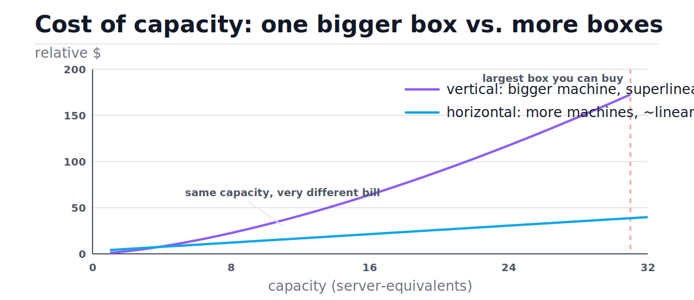
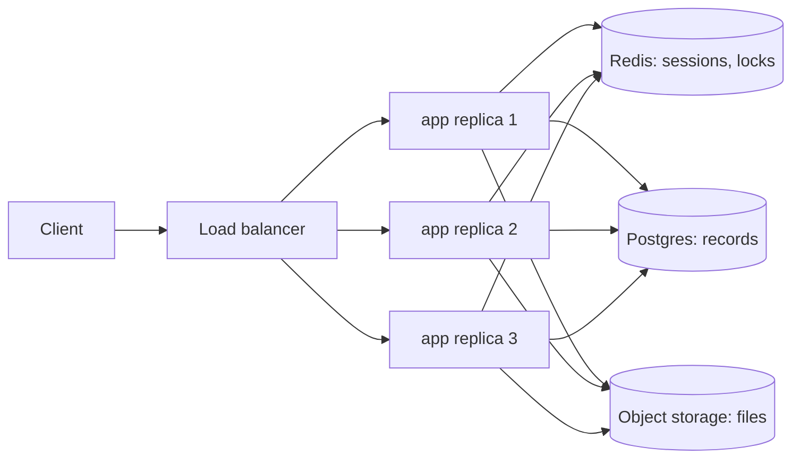
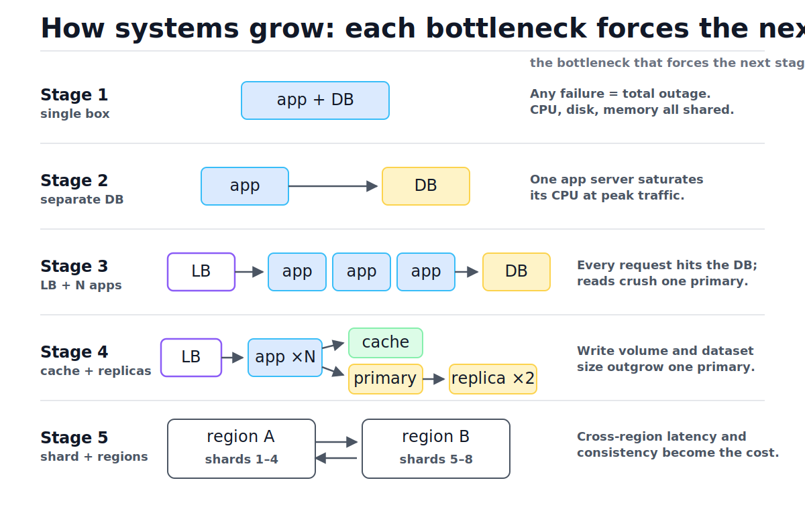
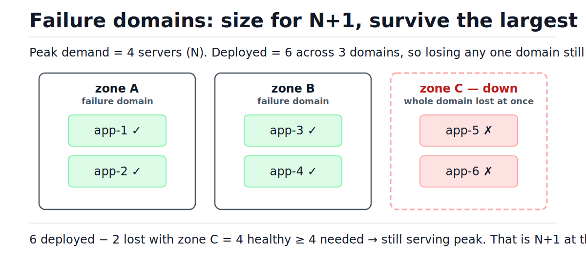
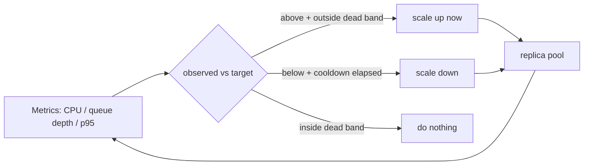

# Scaling Fundamentals

[toc]

> **TL;DR:** You scale a system in two directions: vertically (a bigger box, simple but superlinearly expensive and capped) and horizontally (more boxes, near-linear cost but only if the app is stateless). Every real system walks the same staircase — single server, split the DB, add a load balancer, add caches and replicas, shard, go multi-region — and each step is forced by a specific named bottleneck. Redundancy is sized N+1 across failure domains, and autoscaling automates the horizontal knob if you respect metric lag, cooldowns, and the thundering herd.

## Vocabulary

Ten terms carry this note. Each gets its canonical formula and a one-paragraph definition; everything later builds on these.

**Vertical scaling (scale up)**

```math
C(s) \approx k \cdot s^{\alpha}, \qquad \alpha > 1
```

Replacing a machine with a bigger one: more cores, RAM, faster disks. Capacity grows with size s, but price grows superlinearly — the biggest instances cost disproportionately more per unit of capacity, and there is a hard ceiling: the largest machine money can buy.

**Horizontal scaling (scale out)**

```math
X(N) \approx N \cdot X(1)
```

Adding more identical machines behind a load balancer. Throughput X grows roughly linearly with node count N — until shared state (usually the database) breaks the approximation.

**Statelessness**

```math
\text{response} = f(\text{request}, \text{shared store})
```

A server is stateless when the response depends only on the request plus data in a shared external store — never on what that particular server remembers from earlier requests. Any replica can then serve any request, which is the precondition for horizontal scaling.

**Sticky session (session affinity)**

```math
\text{route}(c) = h(\text{client}_c)
```

The load balancer pins each client c to one fixed backend, usually via a cookie or a hash of the client IP. It lets stateful servers limp behind a load balancer, at the cost of uneven load and lost sessions when that backend dies.

**Failure domain**

```math
F_i = \{ \text{components that fail together from one cause} \}
```

A set of components sharing a single cause of failure: one server, one rack, one availability zone, one region — and also one deploy pipeline or one config file. Redundancy only counts when replicas sit in different failure domains.

**N+1 redundancy**

```math
\text{deployed} = N + 1, \qquad N = \text{capacity needed at peak}
```

Provision one more unit of capacity than peak demand requires, so the largest single failure leaves you still able to serve. Counted per failure domain: surviving an AZ loss means N+1 where the +1 is a whole zone's worth.

**Autoscaling**

```math
\text{desired} = \left\lceil N_{\text{now}} \cdot \frac{\text{observed metric}}{\text{target metric}} \right\rceil
```

A control loop that adjusts replica count to hold a metric (CPU, queue depth, requests per replica) at a target. This is literally the Kubernetes HPA formula.

**Cooldown (stabilization window)**

```math
t_{\text{now}} - t_{\text{last scale}} \ge T_{\text{cooldown}}
```

A minimum quiet period before the autoscaler may act again (in practice: before it may scale *down*). Without it, lagging metrics make the replica count flap up and down.

**Thundering herd**

```math
\lambda_{\text{burst}} \gg N \cdot \mu
```

A synchronized burst of arrivals (rate λ) that exceeds what N servers each serving μ requests/sec can absorb — retries after an outage, cache misses stampeding the DB, or fresh cold replicas all warming up at once.

**Serial fraction (Amdahl's law)**

```math
S(N) = \frac{1}{(1-p) + \dfrac{p}{N}}
```

If only fraction p of the work parallelizes across servers, speedup S is capped at 1/(1−p) no matter how many servers you add. The shared database is usually the serial fraction of a web system.

## Intuition

Think of a kitchen during a dinner rush. Vertical scaling hires one superhuman chef: no coordination needed, but elite chefs get exponentially more expensive, there is exactly one of them (blast radius: the whole restaurant), and eventually no better chef exists. Horizontal scaling hires ten ordinary cooks: nearly linear cost, losing one barely matters — but only if recipes live on a shared board rather than in one cook's head. A cook whose head holds the only copy of table 12's order is *stateful*, and the kitchen cannot redistribute his work.

The figure below shows the economics. The purple curve is vertical scaling: superlinear cost with a hard ceiling at the largest machine available. The blue line is horizontal: a small fixed overhead (the load balancer, the ops work) and then near-linear growth. Look at the gap at equal capacity — that gap is why every large system ends up horizontal.



> [!IMPORTANT]
> Statelessness is the precondition, not an optimization. A load balancer in front of stateful servers does not give you horizontal scaling — it gives you a router for a set of small single points of failure.

## How it works

### Vertical scaling and its ceiling

Vertical scaling is the right *first* move: zero code changes, no distributed-systems problems, and a 4×-bigger box really does serve roughly 4× the traffic for a typical web app. Its three structural limits are what eventually force you off it. Cost: price per unit of capacity rises superlinearly (the cost curve above). Ceiling: at some point the bigger machine does not exist. Blast radius: one machine is one failure domain, so every reboot, kernel panic, or bad deploy is a full outage.

- **Cost curve** — roughly C(s) ≈ k·s^α with α > 1; the last doubling of capacity costs far more than the first.
- **Single point of failure** — availability is the availability of one box; maintenance windows become outages.
- **Hidden ceiling inside the box** — even before the biggest instance, one resource (disk IOPS, memory bandwidth, a single hot CPU core) saturates first.

### Horizontal scaling and its precondition: statelessness

Horizontal scaling adds interchangeable replicas behind a load balancer (see [DNS, load balancers, and CDNs](./03-dns-load-balancers-and-cdns.md)). It only works if any replica can serve any request, which means no request-relevant fact may live only in one server's memory or local disk. The discipline is old and well-codified — the Twelve-Factor App calls it "processes are stateless and share-nothing." Everything a server is tempted to remember must be pushed into a shared store.

| What counts as state | Examples | Where it goes |
| :--- | :--- | :--- |
| Sessions / login state | shopping cart, auth token server-side data | Redis/Memcached, or a signed cookie (JWT) on the client |
| User-uploaded files | avatars, PDFs, video | Object storage (S3, GCS), never local disk |
| In-memory caches | memoized query results, per-process dicts | Shared cache tier ([Caching strategies](./05-caching-strategies.md)) |
| Counters, locks, rate buckets | "5 attempts left", cron leases | Database or Redis with TTLs |
| Durable records | orders, users | The database, always |



Externalizing state is what makes replicas disposable: kill any one, the load balancer routes around it, and the user never notices because their session was never *in* the dead server.

### Sticky sessions: the anti-pattern and when it is tolerable

Sticky sessions make the load balancer pin each client to one backend so that in-memory session state keeps working. This is the canonical anti-pattern because it silently re-couples clients to servers: load skews toward whichever backends accumulated the heavy users, deploys must drain each server's sessions or destroy them, autoscaling down evicts live users, and a backend crash logs everyone on it out. The session *looks* externalized from the client's view, but it is still trapped in one process.

Stickiness is tolerable in three narrow cases: long-lived connections that are inherently per-server (WebSockets — the *connection* is sticky but session **data** should still live in Redis), a legacy stateful app mid-migration where stickiness is the bridge, and short-lived affinity for performance (e.g., reusing a warmed per-user cache) where losing it costs latency, not correctness.

> [!WARNING]
> Sticky sessions plus autoscaling is a footgun: every scale-down event logs out the users pinned to the terminated replica. If you must be sticky, make session loss a latency blip (rebuild from the DB) rather than a correctness failure (data exists only in RAM).

### The canonical evolution: each bottleneck forces the next stage

Systems do not jump to a sharded multi-region architecture; they are dragged there one bottleneck at a time. The narrative below is the single most-asked arc in system design interviews, and the figure shows the same five stages visually — read each row's right-hand column as the reason the next row exists.



| Stage | Architecture | Bottleneck that forces the next stage |
| :---: | :--- | :--- |
| 1 | App + DB on one box | Everything shares one CPU/disk; any failure is a total outage |
| 2 | App box + separate DB box | One app server saturates CPU at peak traffic |
| 3 | Load balancer + N stateless app servers | Every request hits the DB; reads crush the single primary |
| 4 | Add cache tier + DB read replicas | Write volume and dataset size outgrow one primary |
| 5 | Shard the DB; multi-region | Cross-region latency and consistency become the new cost |

Stage 3 is where statelessness must already be true. Stage 4 is covered in [Caching strategies](./05-caching-strategies.md) and stage 5 in [Database scaling: replication and sharding](./06-database-scaling-replication-and-sharding.md) — this note's job is the spine connecting them.

### Failure domains and N+1 redundancy

Counting replicas is meaningless without asking what fails *together*. Two app servers in the same rack share a power strip; six replicas in one availability zone share a flood. Size capacity as N+1 — one more unit than peak demand — where the unit is the *largest failure domain you intend to survive*. In the figure, peak demand needs 4 servers and 6 are deployed across 3 zones: losing all of zone C still leaves 4 healthy servers, exactly enough.



With per-unit availability a and N+1 deployed units needing any N alive, availability is binomial:

```math
\Pr[\text{serving}] = \sum_{k=N}^{N+1} \binom{N+1}{k} \, a^{k} (1-a)^{\,N+1-k}
```

The practical reading: with a = 0.99 per server and N = 4, going from 4 to 5 servers takes you from ≈ 0.961 to ≈ 0.999 availability — one spare buys two nines. But only if the spare is in a different failure domain; five servers on one rack still have rack-level availability.

> [!NOTE]
> Mature teams run N+2 for anything critical: one unit can be down for *planned* maintenance while another fails *unplanned*. AWS calls the stronger version "static stability" — pre-provision enough capacity in the surviving zones that an AZ loss requires no scale-up reaction at all.

### Distributing load: round-robin with health checks

Once you have N replicas, something must spread requests across them and stop sending traffic to dead ones. Round-robin is the baseline algorithm: a cursor walks the backend list, and a periodic health sweep marks backends in or out. Picking is O(1) when all backends are healthy and O(n) worst case (one lap skipping unhealthy entries); the sweep is O(n). The trace below shows failover happening *inside* pick — clients never see backend b's failure. Full runnable code is in the Real-world example.

| Step | Event | Healthy set | Cursor (before) | Decision |
| :---: | :--- | :--- | :---: | :--- |
| 1 | `pick()` | {a, b, c} | 0 | route → **a** |
| 2 | `pick()` | {a, b, c} | 1 | route → **b** |
| 3 | `pick()` | {a, b, c} | 2 | route → **c** |
| 4 | probe of b fails | {a, c} | 3 | mark b unhealthy; nothing routed |
| 5 | `pick()` | {a, c} | 3 | index 0 healthy → route → **a** |
| 6 | `pick()` | {a, c} | 4 | index 1 is b: skip; index 2 → route → **c** |
| 7 | `pick()` | {a, c} | 6 | index 0 → route → **a** |
| 8 | probe of b passes | {a, b, c} | 7 | b rejoins rotation automatically |
| 9 | `pick()` | {a, b, c} | 7 | index 1 → route → **b** |

Real load balancers layer on weights (bigger boxes get more turns), least-connections (route to the emptiest backend, O(n) scan or O(log n) with a heap), and consistent hashing for cache-affine routing — but every one of them keeps this same health-check-and-skip skeleton.

### Autoscaling: signals, cooldowns, and the herd

Autoscaling closes the loop: measure a signal, compute desired replicas, reconcile. Signal choice matters more than the algorithm. CPU is the default but lies for I/O-bound services (a service stuck waiting on the DB shows 15% CPU while its latency burns). Queue depth is the honest signal for async workers — it measures work *waiting*, not work in progress. Custom metrics (requests per replica, p95 latency) fit services where neither applies. The mechanics, formula included, are the Kubernetes HPA — see [Kubernetes scheduling, autoscaling, and resource management](../Infrastructure-DevOps/Kubernetes/11-scheduling-autoscaling-and-resource-management.md) for the platform side.

```math
\text{desired} = \left\lceil N_{\text{now}} \cdot \frac{\text{observed}}{\text{target}} \right\rceil
\quad \text{clamped to } [N_{\min},\, N_{\max}]
```



Two safety devices keep the loop stable. The **dead band** ignores small deviations (observed within ±10% of target) so noise does not trigger scaling. The **cooldown** forces a quiet period before scale-*down*, because metrics lag: the CPU average that triggered scale-up is still draining through the system when the new replicas land, and without a cooldown the scaler immediately scales back down, then up again — flapping.

> [!TIP]
> Asymmetry is the production idiom: scale up aggressively (latency is burning now), scale down slowly (a 5–10 minute stabilization window). Being briefly over-provisioned costs dollars; being briefly under-provisioned costs an outage.

> [!CAUTION]
> The thundering-herd-on-scale-up trap: new replicas boot with cold caches and empty connection pools, so the moment the LB sends them traffic they stampede the database — which slows everything, which raises the scaling signal, which adds *more* cold replicas. Mitigate with slow-start ramping at the LB, cache warming before "ready", capped scale-up steps, and load shedding as the backstop ([Rate limiting and load shedding](./10-rate-limiting-and-load-shedding.md)).

## Complexity

Every operation in this note, costed. The pool operations are from the Real-world example implementation; the system-level rows are the bounds the whole note argues about.

| Operation | Best | Average | Worst | Space |
| :--- | :---: | :---: | :---: | :---: |
| `RoundRobinPool.pick()` | O(1) | O(1) | O(n) — skip n−1 unhealthy | O(1) |
| `health_sweep()` over n backends | O(n) | O(n) | O(n) | O(1) |
| Add / remove a backend (list) | O(1) amortized | O(1) / O(n) | O(n) — remove shifts | O(1) |
| Least-connections pick (for contrast) | O(n) scan | O(n) | O(n); O(log n) with a heap | O(n) heap |
| `desired_replicas()` (HPA formula) | O(1) | O(1) | O(1) | O(1) |
| `CooldownScaler.tick()` | O(1) | O(1) | O(1) | O(1) |
| Ideal horizontal throughput | — | X(N) = N·X(1) | — | O(N) machines |
| Real horizontal speedup (Amdahl) | — | — | capped at 1/(1−p) | — |

The bound that matters most is the last row. Split each request into a parallelizable fraction p (app-server work: templating, JSON, business logic) and a serial fraction 1−p (the shared resource every replica contends on — typically the primary database). With N servers:

```math
S(N) = \frac{1}{(1-p) + \dfrac{p}{N}}
\qquad \Longrightarrow \qquad
\lim_{N \to \infty} S(N) = \frac{1}{1-p}
```

If 95% of request work parallelizes (p = 0.95), infinite servers buy at most a 20× speedup — and you are at 10× already with N = 19. This is *why* the evolution narrative never stops at "add more app servers": each stage attacks the serial fraction itself (cache it in stage 4, shard it in stage 5). The Universal Scalability Law adds a coherence term for crosstalk between nodes, and it predicts throughput eventually *decreases*:

```math
X(N) = \frac{\lambda N}{1 + \sigma (N-1) + \kappa N (N-1)}
```

σ is contention (queueing on the shared resource, the Amdahl effect) and κ is coherence (pairwise coordination: cache invalidation chatter, lock managers, consensus rounds). Because the κ term grows as N², a big-enough cluster gets *slower* when you add nodes — measured systems peak and roll over. Scaling out is not free; it trades machine cost for coordination cost.

## In production

The textbook model meets four recurring realities. First, **scale-out multiplies database connections**: 50 app replicas × a pool of 20 = 1,000 connections, and Postgres degrades well before that — which is why a connection pooler like PgBouncer sits between the tiers ([Replication, failover, and connection pooling](../Relational-Databases-and-Data-Modeling/08-replication-failover-and-connection-pooling.md)). Second, **scale-up is not instant**: VM boot or image pull, runtime warmup (JIT, connection pools), and cache fill add 30 seconds to several minutes between "decided to scale" and "actually absorbing load" — autoscaling handles gradual ramps, not vertical traffic spikes; for spikes you pre-provision or shed load. Third, **metrics lag**: a 60-second CPU average means the scaler is always reacting to the past, which is the root cause of both flapping and late reactions. Fourth, **deploys are a failure domain**: one bad config pushed to all replicas simultaneously takes down all of them — N+1 across zones does nothing against it. Staged rollouts (one replica, one zone, then the fleet) are failure-domain thinking applied to software.

Two production sketches worth keeping:

- **The retry storm.** A 30-second DB blip causes every client to retry; when the DB recovers, it faces 3× normal load from queued retries and goes down again — a self-inflicted thundering herd. Fixes: exponential backoff with jitter on clients, load shedding at the edge.
- **The drain that never ends.** Scale-down terminates a replica holding 10,000 WebSocket connections; "graceful drain" waits for them, so the deploy takes hours. Long-lived connections need an eviction protocol (server-sent "reconnect" + client reconnect through the LB), not a wait.

## Real-world example

A ticket shop expects a flash sale: 9× normal traffic for 30 minutes. The plan is horizontal — stateless app replicas behind a pool, sessions in Redis — plus an autoscaler with a floor of 2 (N+1 at idle) and a ceiling of 20 (protecting the database). Below is the load-distribution half: a round-robin pool with health checks and automatic failover, exactly the trace table from earlier, with asserts proving each behavior. Runs as-is on Python 3.9.

```python
from typing import Callable


class Backend:
    """One app server in the pool."""

    name: str
    healthy: bool
    requests_served: int

    def __init__(self, name: str) -> None:
        self.name = name
        self.healthy = True
        self.requests_served = 0


class RoundRobinPool:
    """Round-robin with health checks and failover.

    pick() is O(1) when every backend is healthy and O(n) worst case,
    because one lap may skip every unhealthy backend. Space is O(n).
    """

    _backends: list[Backend]
    _cursor: int

    def __init__(self, backends: list[Backend]) -> None:
        if not backends:
            raise ValueError("pool needs at least one backend")
        self._backends = list(backends)
        self._cursor = 0

    def pick(self) -> Backend:
        n = len(self._backends)
        for _ in range(n):  # at most one full lap: O(n) worst case
            backend = self._backends[self._cursor % n]
            self._cursor += 1
            if backend.healthy:
                backend.requests_served += 1
                return backend
        raise RuntimeError("no healthy backends: shed load and page a human")

    def health_sweep(self, probe: Callable[[Backend], bool]) -> int:
        """Probe every backend; return the healthy count. O(n)."""
        healthy = 0
        for backend in self._backends:
            backend.healthy = probe(backend)
            healthy += int(backend.healthy)
        return healthy


a, b, c = Backend("app-a"), Backend("app-b"), Backend("app-c")
pool = RoundRobinPool([a, b, c])

# Healthy pool: strict rotation a, b, c, then back to a.
assert [pool.pick().name for _ in range(4)] == ["app-a", "app-b", "app-c", "app-a"]

# app-b fails its probe: pick() fails over around it, clients never see b.
assert pool.health_sweep(lambda backend: backend.name != "app-b") == 2
assert [pool.pick().name for _ in range(4)] == ["app-c", "app-a", "app-c", "app-a"]

# app-b passes its next probe: it rejoins the rotation automatically.
assert pool.health_sweep(lambda backend: True) == 3
assert pool.pick().name == "app-b"

# Whole-pool failure raises immediately instead of spinning forever.
_ = pool.health_sweep(lambda backend: False)
try:
    _ = pool.pick()
    raise AssertionError("expected RuntimeError")
except RuntimeError:
    pass

# Every successful pick was counted exactly once: 4 + 4 + 1 = 9.
assert a.requests_served + b.requests_served + c.requests_served == 9
```

The autoscaling half implements the HPA formula plus the two safety devices — dead band and scale-down cooldown — with asserts demonstrating the asymmetric policy (up instantly, down only after the window).

```python
import math
from typing import Optional


def desired_replicas(current: int, observed: float, target: float,
                     min_replicas: int = 2, max_replicas: int = 20,
                     tolerance: float = 0.1) -> int:
    """Kubernetes HPA formula: desired = ceil(current * observed / target).

    The dead band (tolerance) suppresses flapping when observed is close
    to target. The min/max clamp keeps N+1 at idle and caps blast radius.
    Pure arithmetic: O(1) time, O(1) space.
    """
    ratio = observed / target
    if abs(ratio - 1.0) <= tolerance:
        return current  # inside the dead band: do nothing
    desired = math.ceil(current * ratio)
    return max(min_replicas, min(max_replicas, desired))


# CPU at 90% against a 60% target: 4 -> ceil(4 * 1.5) = 6 replicas.
assert desired_replicas(current=4, observed=0.90, target=0.60) == 6
# 62% vs 60% is inside the 10% dead band: no change, no flapping.
assert desired_replicas(current=4, observed=0.62, target=0.60) == 4
# An idle service still keeps the floor, preserving N+1.
assert desired_replicas(current=4, observed=0.05, target=0.60) == 2
# A spike cannot exceed the ceiling (protects the database behind you).
assert desired_replicas(current=18, observed=3.00, target=0.60) == 20


class CooldownScaler:
    """Scale up immediately; scale down only after a stabilization window."""

    replicas: int
    cooldown_s: int
    _last_scale_ts: Optional[int]

    def __init__(self, replicas: int, scale_down_cooldown_s: int = 300) -> None:
        self.replicas = replicas
        self.cooldown_s = scale_down_cooldown_s
        self._last_scale_ts = None

    def tick(self, now_s: int, desired: int) -> int:
        if desired > self.replicas:  # scale UP: act now, latency is on fire
            self.replicas = desired
            self._last_scale_ts = now_s
        elif desired < self.replicas:  # scale DOWN: wait out the cooldown
            quiet = (self._last_scale_ts is None
                     or now_s - self._last_scale_ts >= self.cooldown_s)
            if quiet:
                self.replicas = desired
                self._last_scale_ts = now_s
        return self.replicas


scaler = CooldownScaler(replicas=4)
assert scaler.tick(now_s=0, desired=8) == 8     # up: instant
assert scaler.tick(now_s=30, desired=4) == 8    # down: blocked by cooldown
assert scaler.tick(now_s=400, desired=4) == 4   # down: window elapsed
```

During the real sale, the missing third piece is the one neither class provides: warm the cache *before* the autoscaler's new replicas go ready, or the herd finds the database.

## When to use / When NOT to use

Choosing a direction is a cost-and-failure-mode decision, not a fashion one. Vertical first while it is cheap; horizontal when statelessness is in reach and the ceiling or blast radius starts to bite; neither until the numbers say so ([Back-of-the-envelope estimation](./02-back-of-the-envelope-estimation.md)).

**Scale vertically when:**

- You are early on the cost curve — the next instance size up is cheap relative to engineering time.
- The workload is inherently single-node for now: a relational primary, a build box, a stateful monolith mid-refactor.
- You need a fix today; resizing a box is an afternoon, making an app stateless is a quarter.

**Scale horizontally when:**

- The app is (or can cheaply become) stateless — sessions, files, and caches externalized.
- You need availability, not just capacity: N+1 across failure domains requires N+1 *machines*.
- Traffic is spiky and you want autoscaling to track it instead of paying for peak 24/7.

**Do NOT scale at all when:**

- The bottleneck is one bad query or a missing index — profile first; a 100-ms query made 1-ms beats ten new servers.
- A single modern box covers projected load 10× over. One server plus a warm standby is a legitimate architecture.
- The "scaling problem" is actually a thundering herd or a retry storm — that is a shedding/backoff problem, not capacity.

## Common mistakes

- **"Horizontal is always better than vertical"** — vertical is cheaper, simpler, and correct until the cost curve, ceiling, or blast radius actually bites. Most systems die with unrealized vertical headroom.
- **"A load balancer makes my app scalable"** — the LB only distributes; if servers hold sessions in memory, you have sticky single points of failure, not scale.
- **"Sticky sessions solved our state problem"** — they hid it. The state still dies with the backend; stickiness just delays the discovery to your next deploy or scale-down.
- **"We have 6 replicas, we're redundant"** — six replicas in one zone is one failure domain. Redundancy counts per domain you intend to survive, and N+1 means one *domain's* worth of spare.
- **"Doubling servers doubles throughput"** — only the parallel fraction doubles. The shared database is the serial fraction; Amdahl caps you at 1/(1−p), and USL's coherence term can make N+1 nodes *slower* than N.
- **"Autoscaling will absorb the launch spike"** — autoscaling reacts in minutes (metric lag + boot + warmup); spikes arrive in seconds. Pre-provision for known events; shed load for unknown ones.
- **"Scaling down is the safe direction"** — scale-down evicts sticky users, drops long-lived connections, and concentrates cache traffic on fewer nodes. It deserves the cooldown that scale-up does not.

## Interview questions and answers

Interviewers use scaling fundamentals as the spine of nearly every design question; these are the recurring probes. Answer in the spoken register below — claim, mechanism, consequence.

**Q1. Vertical vs horizontal scaling — how do you choose?**
**Answer:** Vertical first: it needs no code changes and is cheap early on the cost curve. I switch to horizontal when one of three things bites — the superlinear price of bigger boxes, the hard ceiling on machine size, or blast radius, because one box is one failure domain. Horizontal has a precondition though: the app must be stateless, so I budget for externalizing sessions, files, and caches before adding the second server.

**Q2. What exactly makes a service stateless, and why does horizontal scaling require it?**
**Answer:** Stateless means the response is a function of the request plus shared stores — nothing depends on what this particular server remembers. That's required because the load balancer assumes any replica can serve any request; if server 3 holds your cart in RAM, routing you to server 5 silently empties it. The test I use: kill any single replica mid-traffic — if any user loses data rather than a few milliseconds, state is hiding somewhere.

**Q3. Where do sessions go when you remove them from the app server?**
**Answer:** Two good options. A shared store like Redis: server-side, revocable, adds a ~1 ms lookup per request and a dependency to operate. Or signed cookies like JWTs: zero server storage and lookup, but revocation is hard and size is capped, so they fit short-lived auth claims more than rich session data. The bad option is sticky sessions — that's keeping state in RAM and constraining the router to hide it.

**Q4. Walk me through scaling a web app from one server to millions of users.**
**Answer:** I narrate it bottleneck by bottleneck. One box runs out of shared CPU/disk, so I split the DB onto its own machine. The single app server saturates, so I make the app stateless and put N replicas behind a load balancer. Now every request hits the DB, so I add a cache tier and read replicas. Then writes and dataset size outgrow one primary, so I shard. Finally latency and disaster-recovery push me multi-region, and I pay the consistency tax. The key is naming the bottleneck that forces each step — never adding a tier before its bottleneck exists.

**Q5. What is N+1 redundancy, and what mistake do people make with it?**
**Answer:** If peak load needs N units of capacity, deploy N+1 so the largest single failure leaves you still serving. The classic mistake is counting replicas instead of failure domains — six servers on one rack is one failure away from zero. I place the spare capacity across zones so losing a whole zone still leaves ≥ N, and for critical systems I run N+2 so planned maintenance and an unplanned failure can overlap.

**Q6. Why is CPU a bad autoscaling signal for some services, and what do you use instead?**
**Answer:** CPU only measures compute, and many services are I/O-bound — a worker blocked on the database shows 15% CPU while latency falls apart, so the scaler never fires. For queue consumers I scale on queue depth, which directly measures work waiting. For request services, requests-per-replica or p95 latency tracks the real constraint. The principle: scale on the metric that saturates first, not the one that's easiest to read.

**Q7. What goes wrong at the moment of scale-up, and how do you prevent it?**
**Answer:** The thundering herd: new replicas arrive with cold caches and empty connection pools, so their first traffic stampedes the database, latency rises, the scaling signal climbs, and the loop adds even more cold replicas. I mitigate with slow-start at the load balancer so new replicas ramp from a trickle, warming caches before readiness, capping how many replicas one scaling step adds, and keeping load shedding as the backstop so the database never sees the full burst.

**Q8. You doubled the fleet and got 20% more throughput. What happened?**
**Answer:** Amdahl's law happened — most of each request was already parallel, but the serial fraction, almost certainly the shared database, now dominates. Adding app servers can't help; I have to attack the serial fraction itself: cache reads, batch or queue writes, then shard. If throughput actually *fell*, that's the USL coherence term — the nodes are spending the new capacity coordinating with each other — and the fix is removing crosstalk, not adding nodes.

## Practice path

Work these in order; each drill produces an artifact you can check.

1. Re-derive the five-stage evolution from memory, naming each stage's forcing bottleneck — then check against the figure.
2. Extend `RoundRobinPool` with per-backend weights (a weight-2 backend gets two consecutive turns); keep `pick()` O(1) amortized and write asserts for the rotation order.
3. Add `mark_unhealthy_after(k_failures)` — a consecutive-failure threshold before eviction — and write the trace table for a backend that flaps.
4. Compute the binomial availability for a = 0.99, N = 4 at N, N+1, and N+2 deployed; confirm the "one spare buys two nines" claim with a few lines of Python.
5. Simulate the cooldown scaler against a sawtooth metric (alternating 0.9 and 0.3 CPU every 30 s) and show replica count with and without the cooldown — count the flaps.
6. Take Amdahl's formula and find the N where you hit 80% of the maximum speedup for p = 0.9 and p = 0.99; notice how brutally early it is.
7. Design exercise: your stateful monolith stores sessions in process memory. Write the migration plan to stateless in three deploys, with sticky sessions as the explicit temporary bridge in deploy 2.

## Copyable takeaways

- Vertical scaling: zero code change, superlinear cost C(s) ≈ k·s^α, hard ceiling, blast radius of one. Right answer early; dead end eventually.
- Horizontal scaling needs statelessness first: sessions → Redis or signed cookies, files → object storage, caches → shared tier, records → DB.
- Sticky sessions hide state instead of removing it; tolerable only as a migration bridge or for inherently per-connection protocols, never as the destination.
- The evolution staircase: single box → separate DB → LB + stateless replicas → cache + read replicas → shard → multi-region. Name the bottleneck before adding the tier.
- Redundancy is N+1 *per failure domain you intend to survive*; replicas in one zone count as one. N+2 covers maintenance overlapping a failure.
- Round-robin pick is O(1) healthy / O(n) worst case; health sweeps are O(n); failover should happen inside the pick, invisible to clients.
- Autoscale on the metric that saturates first (queue depth for workers, not CPU); dead band against noise; scale up fast, down slow behind a cooldown.
- Scale-up is the dangerous moment: cold caches + empty pools = thundering herd. Slow-start, warm before ready, cap the step, shed as backstop.
- Speedup is capped at 1/(1−p) by the serial fraction (usually the DB); USL's κN(N−1) coherence term means clusters can get slower as they grow.

## Sources

- Kleppmann, *Designing Data-Intensive Applications*, ch. 1 "Reliable, Scalable, and Maintainable Applications" — scalability, load parameters, and the scale-up/scale-out tradeoff.
- The Twelve-Factor App, factor VI "Processes: execute the app as one or more stateless processes" — https://12factor.net/processes
- Google SRE Book, "Addressing Cascading Failures" — retry storms, load shedding, and why scale-up moments cascade: https://sre.google/sre-book/addressing-cascading-failures/
- AWS Builders Library, "Static stability using Availability Zones" — failure domains and pre-provisioned N+1: https://aws.amazon.com/builders-library/static-stability-using-availability-zones/
- Kubernetes documentation, "Horizontal Pod Autoscaling" — the desired-replicas formula, tolerance, and stabilization windows: https://kubernetes.io/docs/tasks/run-application/horizontal-pod-autoscale/
- Amdahl, "Validity of the Single Processor Approach to Achieving Large Scale Computing Capabilities," AFIPS 1967 — the serial-fraction bound.
- Gunther, "Universal Scalability Law" — contention and coherence terms: http://www.perfdynamics.com/Manifesto/USLscalability.html

## Related

- [How to approach system design](./01-how-to-approach-system-design.md)
- [Back-of-the-envelope estimation](./02-back-of-the-envelope-estimation.md)
- [DNS, load balancers, and CDNs](./03-dns-load-balancers-and-cdns.md)
- [Caching strategies](./05-caching-strategies.md)
- [Database scaling: replication and sharding](./06-database-scaling-replication-and-sharding.md)
- [Kubernetes scheduling, autoscaling, and resource management](../Infrastructure-DevOps/Kubernetes/11-scheduling-autoscaling-and-resource-management.md)
