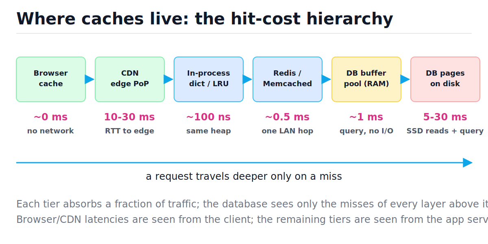
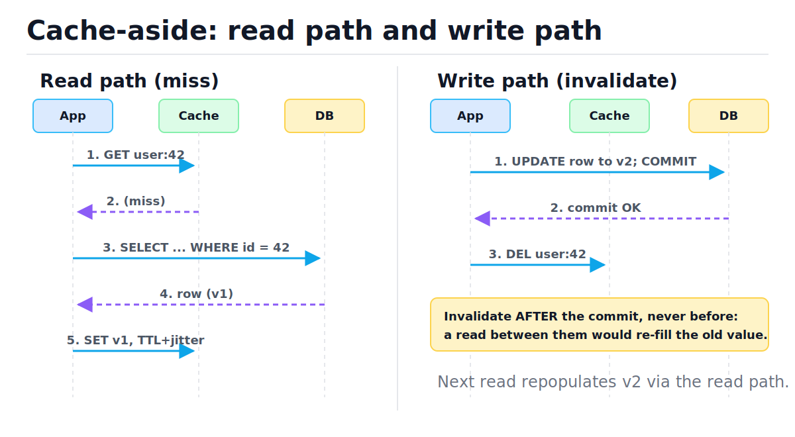
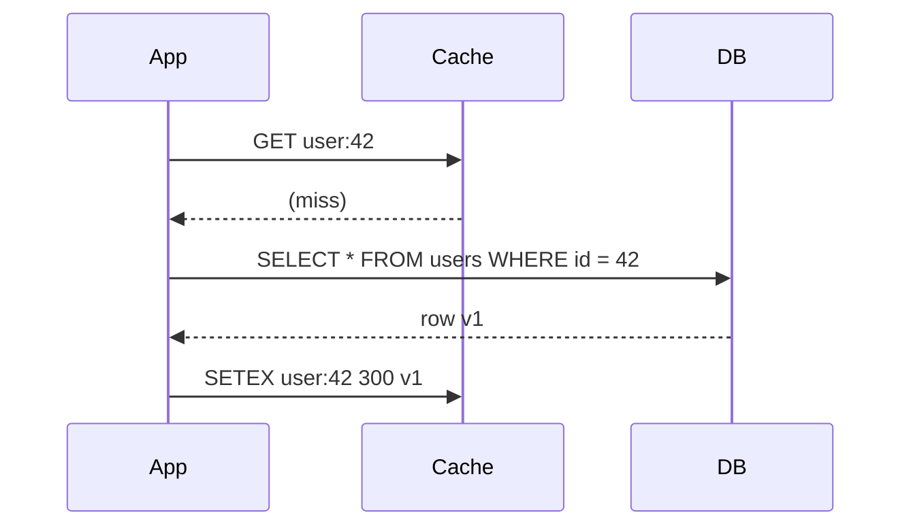
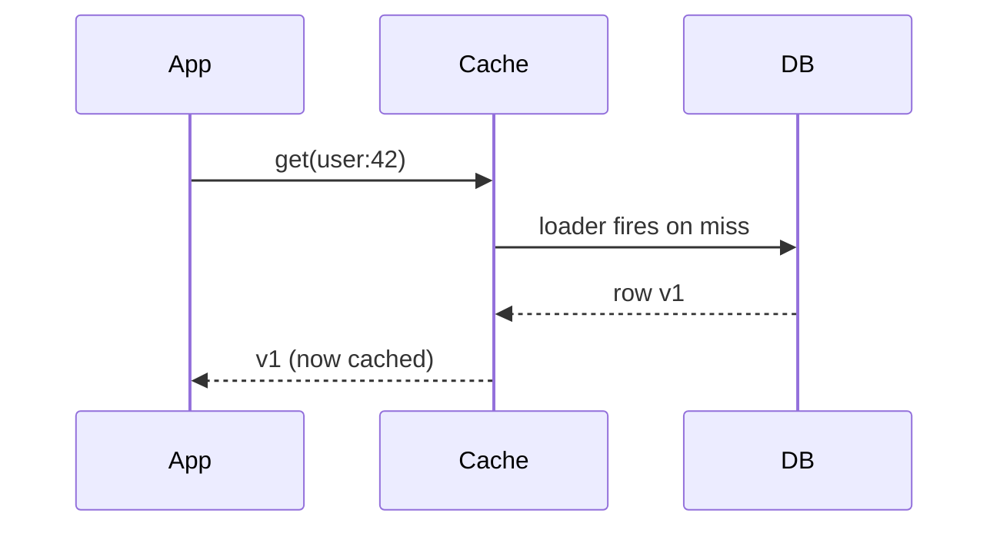
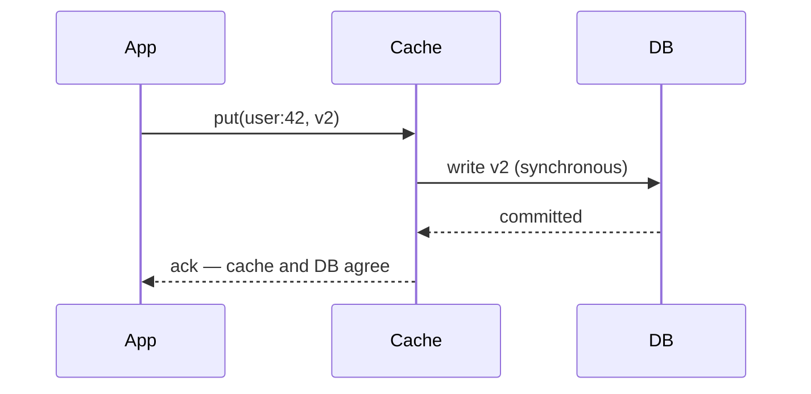
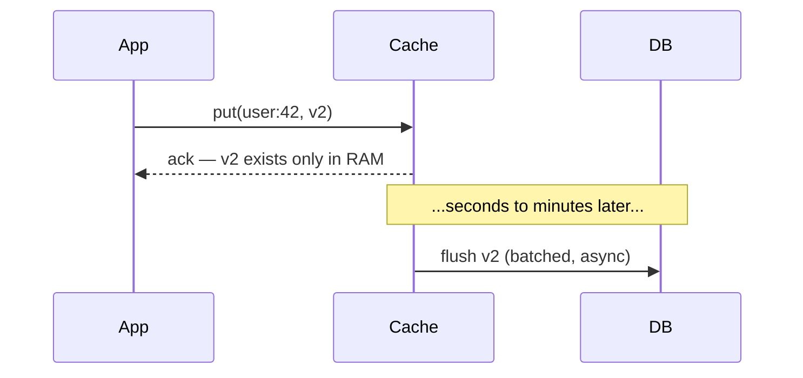
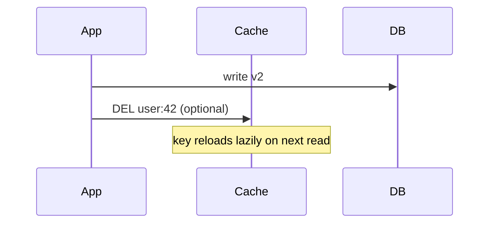
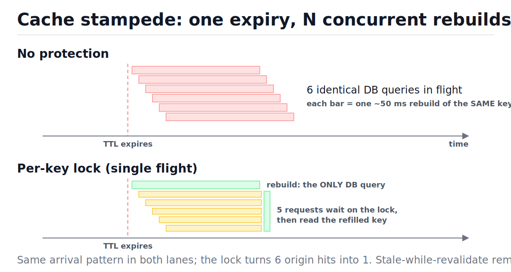

# Caching Strategies

[toc]

> **TL;DR:** A cache trades memory for latency: keep hot data close, let only misses travel to the slow origin. The whole discipline is three problems — choosing a read/write pattern (cache-aside is the default), choosing an eviction policy (LRU is the default), and surviving the failure modes (stampedes, hot keys, penetration, and the cache–DB consistency race). Average latency is governed by the *miss* rate, so going from 90% to 99% hits is a 10× reduction in origin load, not a 9% improvement.

## Vocabulary

Each term below is load-bearing for the rest of the note. The symbol line gives the canonical formula; the prose gives the one-sentence meaning.

**Hit ratio**

```math
h = \frac{N_{\text{hit}}}{N_{\text{hit}} + N_{\text{miss}}}
```

The fraction of lookups answered by the cache. Production systems report it per key-class; a healthy read cache runs 0.90–0.99.

**TTL (time to live)**

```math
t_{\text{expire}} = t_{\text{write}} + \text{TTL}
```

A freshness deadline stamped on each entry at write time. After it passes, the entry is treated as a miss. TTL is the backstop that bounds how long any stale value can survive.

**Eviction policy (LRU)**

```math
\text{victim} = \arg\min_{k \in \text{cache}} \; t_{\text{last-access}}(k)
```

The rule that picks which entry to discard when the cache is full. LRU (least recently used) evicts the entry untouched for the longest time, betting that recent past predicts the near future.

**Cache-aside (lazy loading)**

```math
\text{read}(k) =
\begin{cases}
\text{cache}[k] & \text{hit} \\
\text{cache}[k] \leftarrow \text{db}(k) & \text{miss}
\end{cases}
```

The application owns both sides: read the cache first, fall back to the database on a miss, then populate the cache. The cache itself is a dumb key–value store.

**Write-through**

```math
T_{\text{write}} = T_{\text{cache}} + T_{\text{db}}
```

Every write goes to the cache *and* the database synchronously before acknowledging. Reads are always warm, at the price of slower writes.

**Write-back (write-behind)**

```math
T_{\text{ack}} = T_{\text{cache}}, \qquad \text{DB flushed asynchronously later}
```

Acknowledge once the cache has the value; flush to the database in batches later. Fastest writes, but unflushed data dies with the cache node.

**Cache stampede (thundering herd)**

```math
N_{\text{rebuilds}} = N_{\text{concurrent misses on one key}} \quad \text{(unprotected)}
```

When a popular key expires, every in-flight request sees the same miss and independently rebuilds it, multiplying origin load by the concurrency level.

**Negative cache**

```math
\text{cache}[k] \leftarrow \bot \quad \text{when } \text{db}(k) = \varnothing
```

Caching the *absence* of a row (a sentinel with a short TTL) so repeated lookups of missing keys stop reaching the database.

**Stale-while-revalidate**

```math
\text{serve } v_{\text{stale}} \;\; \text{while} \;\; t \le t_{\text{expire}} + \Delta_{\text{grace}}
```

Serve the expired value immediately and refresh it in the background. Readers never wait on a rebuild; staleness is bounded by the grace window (RFC 5861).

**Working set**

```math
W(t, \tau) = \{\, k : k \text{ accessed in } (t - \tau,\, t] \,\}
```

The set of distinct keys touched in a recent window. A cache only achieves a high hit ratio when its capacity covers the working set — or when access is Zipf-skewed so a small head covers most traffic.

## Intuition: where caches live

A request from a browser to a database crosses five or six potential caches, and each one answers some fraction of traffic so the layer below sees only the leftovers. The figure below shows the tiers in request order with their typical hit cost — note the costs are not monotonic, because the browser and CDN are measured from the client while everything else is measured from the app server. The strategic picture: the deeper a request travels, the more it costs, so push hits as far left as the data's freshness requirements allow.



The same hierarchy as a table, with what each tier is good for:

| Tier | Typical hit cost | Scope | What lives there |
| :--- | ---: | :--- | :--- |
| Browser cache | ~0 ms | one user | static assets, API responses with `Cache-Control` (RFC 7234) |
| CDN edge | 10–30 ms | one region | images, JS bundles, public pages |
| In-process dict / LRU | ~100 ns | one replica | config, feature flags, hottest keys |
| Redis / Memcached | ~0.5 ms | whole service | sessions, rendered fragments, query results |
| DB buffer pool | ~1 ms | database | recently read disk pages, in RAM |
| DB pages on disk | 5–30 ms | database | the source of truth |

> [!NOTE]
> You always have a cache even when you "don't use caching": every serious database keeps hot disk pages in a RAM buffer pool (PostgreSQL `shared_buffers`, InnoDB buffer pool). An application cache exists to skip the query *work* — parsing, planning, B-tree descent, row assembly — not just the disk I/O. See [Relational Database Internals](../Relational-Databases-and-Data-Modeling/07-relational-database-internals.md).

## How it works: the five patterns

A caching pattern answers two questions: who loads data into the cache on a read miss, and how writes keep the cache and database from diverging. Five named answers cover practice. Cache-aside is the default you should reach for; the others trade write latency, consistency, and durability differently.

### Cache-aside (lazy loading)

The application code does everything: check the cache, fall back to the database on a miss, write the value back with a TTL. On writes it updates the database and then *deletes* the cache key, letting the next read repopulate it. The figure shows both paths — note the write path touches the cache only to invalidate, never to store.





> [!IMPORTANT]
> On writes, invalidate the cache *after* the database commit, and prefer `DEL` over `SET`. Deleting after commit means the worst case is an extra miss; the other orderings let stale values get pinned (the race is traced step-by-step in "The cache–DB consistency race" below).

### Read-through

Same read shape as cache-aside, but the *cache layer* owns the loading logic instead of the application: the app asks the cache, and the cache calls the database on a miss. This is how CDNs, ORM second-level caches, and libraries like Caffeine or Guava `LoadingCache` work. It centralizes the loader (one place to add locks and metrics) at the cost of needing a smarter cache.



### Write-through

Every write goes through the cache to the database synchronously; the client gets an ack only after both have the value. Reads are always warm and read-after-write works through the cache, but every write pays the cache hop in latency and the cache fills with keys that may never be read.



### Write-back (write-behind)

The cache acknowledges as soon as it holds the value in RAM and flushes to the database later, batched. Writes become as fast as cache writes and the database sees coalesced bulk updates — this is exactly how CPU caches and OS page caches work. The price is a durability hole between ack and flush.



> [!CAUTION]
> Write-back acknowledges data that exists only in volatile memory. A cache-node crash or restart between ack and flush silently loses committed-looking writes. Use it only for data you can afford to lose (view counters, metrics buffers) or put a durable log (e.g. a [message queue](./08-message-queues-and-event-driven-architecture.md)) in front of the flush.

### Write-around

Writes go straight to the database and skip the cache entirely (optionally deleting the key); the cache fills only from the read path. This avoids polluting the cache with write-once data — bulk imports, logs, cold rows — at the cost of a guaranteed miss on the first read after a write.



### Pattern comparison

One table to choose from. "Consistency" here means how far the cache can drift from the database under concurrency, not formal [consistency models](./07-consistency-models-cap-and-quorums.md).

| Pattern | Read miss handled by | Write path | Cache↔DB drift | Main risk | Reach for it when |
| :--- | :--- | :--- | :--- | :--- | :--- |
| Cache-aside | application | DB write, then `DEL` key | bounded by TTL + rare races | stale fill race | default; read-heavy APIs |
| Read-through | cache layer / library | paired with one of the write patterns | same as cache-aside | cold-start herd | CDN, ORM caches, `LoadingCache` |
| Write-through | (cache always warm) | cache → DB, synchronous | smallest | write latency; cold-key pollution | read-after-write through cache |
| Write-back | (cache always warm) | cache ack, async DB flush | largest until flush | **data loss on crash** | counters, buffers, CPU/page caches |
| Write-around | application | DB only, cache untouched | stale until TTL/`DEL` | first-read miss | write-heavy, rarely re-read data |

### Eviction: LRU with OrderedDict

A bounded cache must pick victims; LRU evicts the entry that has gone unused longest. Python's `OrderedDict` (a hash table fused with a doubly-linked list, see [Hash Tables](../Data-Structures-and-Algorithms/05-hash-tables.md)) makes the textbook implementation eight lines: move a key to one end on every touch, pop from the other end when over capacity. Both operations are O(1) average.

```python
from collections import OrderedDict
from typing import Optional


class LRUCache:
    """LRU cache: get/put in O(1) average via OrderedDict."""

    def __init__(self, capacity: int) -> None:
        self.capacity: int = capacity
        self._data: "OrderedDict[str, int]" = OrderedDict()

    def get(self, key: str) -> Optional[int]:
        if key not in self._data:
            return None
        self._data.move_to_end(key)  # mark as most-recently-used: O(1)
        return self._data[key]

    def put(self, key: str, value: int) -> None:
        if key in self._data:
            self._data.move_to_end(key)
        self._data[key] = value
        if len(self._data) > self.capacity:
            _ = self._data.popitem(last=False)  # evict least-recently-used: O(1)


cache = LRUCache(2)
cache.put("a", 1)
cache.put("b", 2)
assert cache.get("a") == 1  # touch "a": it becomes most-recently-used
cache.put("c", 3)           # capacity exceeded: evicts "b", the LRU entry
assert cache.get("b") is None
assert cache.get("a") == 1
assert cache.get("c") == 3
```

### Eviction: LRU exposing the O(1) machinery

`OrderedDict` hides the trick, so here it is built from parts: a `dict` maps keys to nodes of a doubly-linked list (see [Linked Lists](../Data-Structures-and-Algorithms/03-linked-lists.md)), with sentinel head/tail nodes so no operation has edge cases. The dict gives O(1) *lookup*; the list gives O(1) *reordering* — unlinking a node and re-inserting it at the front rewires exactly four pointers, regardless of cache size. A singly-linked list could not do this: unlinking needs the predecessor in O(1), which is what `prev` buys.

```python
from typing import Optional


class _Node:
    __slots__: tuple[str, ...] = ("key", "value", "prev", "next")

    def __init__(self, key: str, value: int) -> None:
        self.key: str = key
        self.value: int = value
        self.prev: "_Node" = self  # self-linked until inserted
        self.next: "_Node" = self


class LRUCacheDLL:
    """dict gives O(1) lookup; the doubly-linked list gives O(1) reordering."""

    def __init__(self, capacity: int) -> None:
        self.capacity: int = capacity
        self._map: dict[str, _Node] = {}
        self._head: _Node = _Node("", 0)  # sentinel: most-recently-used side
        self._tail: _Node = _Node("", 0)  # sentinel: least-recently-used side
        self._head.next = self._tail
        self._tail.prev = self._head

    def _unlink(self, node: _Node) -> None:  # O(1): rewire two pointers
        node.prev.next = node.next
        node.next.prev = node.prev

    def _push_front(self, node: _Node) -> None:  # O(1): insert after head
        node.prev = self._head
        node.next = self._head.next
        self._head.next.prev = node
        self._head.next = node

    def get(self, key: str) -> Optional[int]:
        node = self._map.get(key)
        if node is None:
            return None
        self._unlink(node)  # move-to-front = unlink + push, both O(1)
        self._push_front(node)
        return node.value

    def put(self, key: str, value: int) -> None:
        node = self._map.get(key)
        if node is not None:
            node.value = value
            self._unlink(node)
            self._push_front(node)
            return
        if len(self._map) >= self.capacity:
            lru = self._tail.prev  # the real LRU node sits next to the tail sentinel
            self._unlink(lru)
            del self._map[lru.key]
        fresh = _Node(key, value)
        self._map[key] = fresh
        self._push_front(fresh)


dll = LRUCacheDLL(2)
dll.put("a", 1)
dll.put("b", 2)
assert dll.get("a") == 1
dll.put("c", 3)  # evicts "b"
assert dll.get("b") is None
assert dll.get("a") == 1
assert dll.get("c") == 3
```

Tracing a capacity-3 LRU through six operations shows the recency list doing the work. "MRU → LRU" reads left to right; the eviction at step 5 picks the rightmost entry.

| Step | Op | Cache (MRU → LRU) | Evicted | Decision |
| :---: | :--- | :--- | :---: | :--- |
| 1 | `put(a,1)` | a | — | insert at front |
| 2 | `put(b,2)` | b, a | — | insert at front |
| 3 | `put(c,3)` | c, b, a | — | at capacity 3 |
| 4 | `get(a)` | a, c, b | — | hit: unlink `a`, push front |
| 5 | `put(d,4)` | d, a, c | **b** | full: evict tail — `b` is LRU |
| 6 | `get(b)` | d, a, c | — | miss: `b` is gone |

### LFU and TTL eviction

LFU (least *frequently* used) evicts the entry with the lowest access count instead of the oldest access time; the O(1) construction keeps a doubly-linked list of frequency buckets, each holding its own LRU list. LFU beats LRU when popularity is stable (a viral post stays hot even if untouched for two seconds), but it needs aging/decay or yesterday's hits pin dead entries forever. TTL is not really an eviction policy but a freshness rule layered on top: entries die at their deadline regardless of popularity. Real systems combine them — Redis lazily checks TTL on each read (O(1)) plus actively *samples* random keys in the background rather than scanning everything.

> [!NOTE]
> Redis does not implement true LRU/LFU either: `maxmemory-policy allkeys-lru` samples a handful of random keys (default 5) and evicts the best candidate among them. Approximate LRU costs O(1) per eviction with no global list maintenance, and at scale the hit-ratio difference from exact LRU is small.

## Complexity

Every operation in this note, with the cache holding C entries out of n possible keys. Hash-backed operations are O(1) *average*; the O(n) worst case is adversarial hash collisions (see [Big-O Notation](../Data-Structures-and-Algorithms/01-big-o-notation-and-complexity-analysis.md) and [Hash Tables](../Data-Structures-and-Algorithms/05-hash-tables.md)).

| Operation | Best | Average | Worst | Space |
| :--- | :---: | :---: | :---: | :---: |
| LRU `get` (OrderedDict or dict+DLL) | O(1) | O(1) | O(n) | O(C) |
| LRU `put` + eviction | O(1) | O(1) amortized | O(n) | O(C) |
| LFU `get`/`put` (frequency buckets) | O(1) | O(1) | O(n) | O(C) |
| Lazy TTL check on read | O(1) | O(1) | O(1) | O(C) |
| Active TTL sweep (Redis-style sampling) | — | O(s) per tick, s samples | O(n) full scan | O(1) |
| Bloom-filter membership probe | O(h) hashes | O(h) | O(h) | O(m) bits |
| Single-flight rebuild (per key) | O(1) acquire | O(1) | blocks ≤ one rebuild | O(K) locks |

The bound that actually runs your pager is not Big-O but expected latency. Condition on hit or miss and take the expectation:

```math
T_{\text{avg}} = h\,T_{\text{cache}} + (1-h)\,\bigl(T_{\text{cache}} + T_{\text{origin}}\bigr) = T_{\text{cache}} + (1-h)\,T_{\text{origin}}
```

The cache cost is paid unconditionally; only the **miss rate** multiplies the expensive origin term. That is why hit-ratio improvements compound near the top: with a 1 ms cache and 50 ms origin, going from 90% to 99% hits cuts misses 10× and average latency 4×:

```math
\frac{T_{\text{avg}}(h=0.90)}{T_{\text{avg}}(h=0.99)} = \frac{1 + 0.10 \times 50}{1 + 0.01 \times 50} = \frac{6.0}{1.5} = 4
```

The same formula as runnable code, with the numbers asserted:

```python
def avg_latency_ms(hit_ratio: float, t_cache_ms: float, t_db_ms: float) -> float:
    miss_ratio = 1.0 - hit_ratio
    return hit_ratio * t_cache_ms + miss_ratio * (t_cache_ms + t_db_ms)


assert avg_latency_ms(0.0, 1.0, 50.0) == 51.0  # all misses: the cache only adds cost
assert avg_latency_ms(1.0, 1.0, 50.0) == 1.0   # all hits
assert round(avg_latency_ms(0.90, 1.0, 50.0), 1) == 6.0
assert round(avg_latency_ms(0.99, 1.0, 50.0), 1) == 1.5  # 90% -> 99% is a 4x cut
```

Sizing follows the same back-of-envelope style as [estimation](./02-back-of-the-envelope-estimation.md): divide memory by per-entry footprint (key + value + allocator/metadata overhead, ~50–100 B in Redis):

```math
N_{\text{entries}} = \frac{M_{\text{cache}}}{\bar{s}_{\text{key}} + \bar{s}_{\text{value}} + s_{\text{overhead}}} \approx \frac{4 \times 2^{30}}{100 + 1024 + 90} \approx 3.5\ \text{million}
```

Whether 3.5 M entries yields a 99% hit ratio depends on the working set, not the total key count. Real traffic is Zipf-skewed — a small head of keys gets most requests — so a cache covering a few percent of keys often catches the large majority of reads. Measure: the hit-ratio-vs-capacity curve flattens hard once capacity exceeds the working set.

## In production: the four hard problems

Phil Karlton's joke — "there are only two hard things in computer science: cache invalidation and naming things" — is half a production runbook. Below are the four failure modes every shared cache eventually hits, each with the concrete fix used at scale.

### Invalidation: explicit delete vs TTL

You have exactly two invalidation tools: explicitly delete keys when the underlying data changes, or let TTLs age everything out. Explicit delete gives near-zero staleness but requires every write path (including the admin script someone runs at 2 a.m.) to know every cache key derived from the row — miss one and the entry is stale forever. TTL needs no bookkeeping and caps staleness at the TTL, but the cap *is* the staleness you accept, and shorter TTLs trade staleness for miss rate. Production answer: do both. Delete on the write paths you control; set a TTL anyway as the backstop for the paths you forgot.

### Thundering herd / stampede

When a hot key expires, every concurrent request sees the same miss and independently rebuilds it — 1,000 in-flight requests become 1,000 identical database queries, which slows the rebuild, which widens the miss window, which admits more requests. In the figure, the top lane is the herd; the bottom lane shows a per-key lock collapsing six rebuilds into one while the other five requests briefly wait and then read the refilled key.



Four fixes, in escalating order of sophistication: **jittered TTLs** (de-synchronize expiry so keys don't die together), **per-key locks / request coalescing** (one rebuild per key per process — Go calls this `singleflight`), **stale-while-revalidate** (serve the old value, refresh in the background, nobody waits), and **external leases** (Memcache hands one client a rebuild token; everyone else backs off — Facebook's NSDI '13 design). The simulation below shows the herd and the lock fix; it uses real threads, which works despite the GIL because `time.sleep` releases it (see [The GIL and Threads](../Programming-Languages/Python/8-the-gil-threads-multiprocessing.md)).

```python
import threading
import time
from typing import Callable

DB_LATENCY = 0.05  # one simulated query takes 50 ms
store: dict[str, str] = {}
db_calls = 0
db_calls_lock = threading.Lock()


def slow_db_read(key: str) -> str:
    global db_calls
    with db_calls_lock:
        db_calls += 1
    time.sleep(DB_LATENCY)
    return "value-for-" + key


def naive_get(key: str) -> str:
    if key in store:
        return store[key]
    value = slow_db_read(key)  # every thread that saw the miss piles onto the DB
    store[key] = value
    return value


def run_threads(target: Callable[[str], str], n: int) -> None:
    barrier = threading.Barrier(n)

    def task() -> None:
        _ = barrier.wait()  # release all n threads at the same instant
        _ = target("user:42")

    threads = [threading.Thread(target=task) for _ in range(n)]
    for t in threads:
        t.start()
    for t in threads:
        t.join()


run_threads(naive_get, 8)
naive_calls = db_calls
assert naive_calls >= 2  # the herd: most of the 8 threads saw the same miss

store.clear()
db_calls = 0
key_locks: dict[str, threading.Lock] = {}
key_locks_guard = threading.Lock()


def get_key_lock(key: str) -> threading.Lock:
    with key_locks_guard:
        if key not in key_locks:
            key_locks[key] = threading.Lock()
        return key_locks[key]


def singleflight_get(key: str) -> str:
    if key in store:
        return store[key]
    with get_key_lock(key):  # only one thread may rebuild this key
        if key in store:  # double-check: a peer may have filled it while we waited
            return store[key]
        value = slow_db_read(key)
        store[key] = value
        return value


run_threads(singleflight_get, 8)
assert db_calls == 1  # exactly one rebuild; the other 7 reused it
print(f"naive: {naive_calls} DB calls -> single-flight: {db_calls} DB call")
```

> [!TIP]
> The cheapest stampede insurance is one line: `ttl = base_ttl * random.uniform(0.9, 1.1)`. Without jitter, a deploy or cache flush synchronizes every key's death clock and you get a herd *per expiry wave*; with jitter the waves smear out. Do this everywhere, always.

### Hot keys

A single celebrity key can exceed what one cache shard can serve — Redis is single-threaded per instance, so one key's traffic lands on one CPU core no matter how big the cluster is. Two fixes: add a **local in-process cache layer** in front of the shared cache for the top-N keys (even a 1-second TTL absorbs nearly all reads of a viral key, since staleness of 1 s is invisible for a like-count), or **split the key** into R replicas (`post:123#0` … `post:123#R-1`), write to all, and have each reader pick one at random — spreading load across R shards at the cost of R× writes. Detect hot keys before they detect you: sample request keys and alert on skew.

### Cache penetration

Requests for keys that do not exist in the database are a cache's blind spot: there is nothing to cache, so *every* such request falls through to the database. The fix is **negative caching** — store a "this key does not exist" sentinel with a short TTL (the real-world example below implements it) — and, when the missing-key space is huge, a **Bloom filter** of all valid IDs in front of the cache: O(h) bit-probes answer "definitely absent" with no false negatives, so requests for nonexistent IDs never touch cache or database.

> [!WARNING]
> Penetration is an attack surface, not just a perf bug: an attacker iterating random nonexistent IDs gets a 0% hit ratio by construction and aims every request at your database. Negative caching plus [rate limiting](./10-rate-limiting-and-load-shedding.md) on high-miss clients closes it.

### The cache–DB consistency race

The cache and the database are two unsynchronized systems, so every write ordering has an interleaving that leaves the cache stale; your job is picking the ordering whose bad case is rarest and TTL-bounded. First, why writers should **delete, not set**: two writers' cache-sets can land in the opposite order of their DB commits, pinning a stale value with no expiry race needed.

| Step | Writer W1 | Writer W2 | DB | Cache |
| :---: | :--- | :--- | :---: | :---: |
| 1 | `UPDATE k → v1` | — | v1 | — |
| 2 | — | `UPDATE k → v2` | v2 | — |
| 3 | — | `SET k = v2` | v2 | v2 |
| 4 | `SET k = v1` (delayed) | — | v2 | **v1 — wrong until next write** |

Second, why **delete-before-write** is wrong: a reader can slip between the delete and the commit, read the old row, and re-fill the cache with it.

| Step | Writer | Reader | DB | Cache |
| :---: | :--- | :--- | :---: | :---: |
| 1 | `DEL k` | — | v1 | — |
| 2 | — | miss → reads DB → v1 | v1 | — |
| 3 | `UPDATE k → v2; COMMIT` | — | v2 | — |
| 4 | — | `SET k = v1` | v2 | **v1 — stale until TTL** |

Even the correct order — **write DB, then delete** — has a residual race, which is why the TTL backstop is non-negotiable: a reader that missed *before* the write can fill the cache *after* the invalidation.

| Step | Reader R | Writer W | DB | Cache |
| :---: | :--- | :--- | :---: | :---: |
| 1 | miss → reads DB → v1 | — | v1 | — |
| 2 | — | `UPDATE k → v2; COMMIT` | v2 | — |
| 3 | — | `DEL k` | v2 | — |
| 4 | `SET k = v1` (slow request) | — | v2 | **v1 — stale until TTL** |

This last interleaving needs a read-miss to straddle an entire write, so it is rare — but at Facebook scale "rare" is "constantly", which is why Memcache leases exist: the cache hands the reader a token at miss time and rejects the `SET` if an invalidation arrived in between. If you cannot run leases, the practical stack is delete-after-commit + TTL backstop + tolerating seconds of staleness.

## Real-world example: product page cache

An e-commerce product page is the canonical cache-aside customer: read-heavy (thousands of views per edit), tolerant of a few seconds of staleness, expensive to assemble (product row + price + inventory join). This helper wraps the whole read path: cache-aside loading, TTL with jitter (stampede insurance), and negative caching so lookups of deleted/nonexistent products stop hitting the database. The injected `clock` makes expiry testable — the asserts advance fake time past the maximum TTL and prove the entry dies.

```python
import random
import time
from typing import Callable, Optional, cast

SENTINEL_MISSING = object()  # negative-cache marker: "the DB has no such row"

Row = dict[str, object]


class TTLCache:
    """Cache-aside helper: TTL with jitter, plus negative caching for absent rows."""

    def __init__(
        self,
        base_ttl: float,
        jitter: float,
        clock: Callable[[], float] = time.monotonic,
    ) -> None:
        self._entries: dict[str, tuple[float, object]] = {}
        self._base_ttl: float = base_ttl
        self._jitter: float = jitter
        self._clock: Callable[[], float] = clock

    def get_or_load(self, key: str, loader: Callable[[], Optional[Row]]) -> Optional[Row]:
        now = self._clock()
        entry = self._entries.get(key)
        if entry is not None and entry[0] > now:  # fresh hit (positive OR negative)
            cached = entry[1]
            if cached is SENTINEL_MISSING:
                return None
            return cast(Row, cached)
        value = loader()  # miss or expired: one trip to the database
        ttl = self._base_ttl + random.uniform(0, self._jitter)  # jitter de-syncs expiry
        stored: object = SENTINEL_MISSING if value is None else value
        self._entries[key] = (now + ttl, stored)
        return value


fake_now = [1000.0]
db_reads = {"count": 0}
PRODUCTS: dict[str, Row] = {
    "p1": {"name": "Mechanical keyboard", "price_cents": 9900},
}


def make_loader(product_id: str) -> Callable[[], Optional[Row]]:
    def loader() -> Optional[Row]:
        db_reads["count"] += 1
        return PRODUCTS.get(product_id)

    return loader


products = TTLCache(base_ttl=30.0, jitter=6.0, clock=lambda: fake_now[0])

assert products.get_or_load("product:p1", make_loader("p1")) == PRODUCTS["p1"]
assert db_reads["count"] == 1
assert products.get_or_load("product:p1", make_loader("p1")) == PRODUCTS["p1"]
assert db_reads["count"] == 1  # served from cache: no second DB read

# Negative caching: a missing product costs ONE DB read, then absence is remembered.
assert products.get_or_load("product:ghost", make_loader("ghost")) is None
assert products.get_or_load("product:ghost", make_loader("ghost")) is None
assert db_reads["count"] == 2  # the second lookup never touched the DB

# Advance past base_ttl + max jitter (30 + 6): the entry expires, the DB is read again.
fake_now[0] += 37.0
assert products.get_or_load("product:p1", make_loader("p1")) == PRODUCTS["p1"]
assert db_reads["count"] == 3
```

In production the `dict` becomes Redis (`SETEX key ttl value`), the sentinel becomes a reserved string like `"__MISSING__"` with a 30–60 s TTL, and the write path adds `DEL product:p1` after each catalog update. The structure of the code does not change.

## When to use / when NOT to use

Caching is not free: it adds a second system to operate, a consistency liability, and a class of outages (cold cache after a flush can take down the database it was protecting). Decide with the workload, not by default.

**Use a cache when:**

- Reads dominate writes (10:1 or more) and the same keys repeat — high *potential* hit ratio.
- The origin work is expensive: multi-join queries, rendered fragments, downstream API calls, ML inference (same shape as a KV cache in LLM serving).
- Bounded staleness is acceptable and you can state the bound ("price may be 60 s old").
- Traffic is Zipf-skewed, so a small cache covers a big share of requests.

**Skip (or scope down) the cache when:**

- Correctness needs the latest committed value — account balances at withdrawal, inventory at checkout. Read the database; let its buffer pool be the cache.
- Write-heavy or low-repeat access: hit ratio stays low, so the cache adds latency, memory cost, and failure modes for nothing.
- The whole working set already fits in the DB buffer pool and queries are cheap — measure before adding a tier.
- You cannot enumerate the invalidation paths and stale data is harmful. A cache you can't invalidate is a bug with a TTL.

## Common mistakes

- **"We delete explicitly, so entries don't need a TTL"** — every cache-aside ordering has a residual race that pins stale data (see the third interleaving above), and someday a write path will forget the delete. TTL is the backstop that turns "stale forever" into "stale for ≤ TTL".
- **"On write, update the cache with the new value — it saves a miss"** — two concurrent writers can land their cache-sets in the opposite order of their DB commits, pinning the older value indefinitely. `DEL` is idempotent and order-insensitive; prefer it.
- **"Invalidate first, then write the DB, to be safe"** — backwards: a reader between your delete and your commit re-fills the old value. Commit first, then delete.
- **"All entries get TTL 300"** — synchronized expiry means synchronized rebuild herds, especially after deploys and cache flushes. Always jitter: 300 × uniform(0.9, 1.1).
- **"Higher hit ratio is always the goal"** — past the working-set knee, more capacity buys nothing; and hit ratio on stale data is worse than a miss when correctness matters. The goal is meeting a latency/cost target at an acceptable staleness bound.
- **"Redis has AOF persistence, so write-back through Redis is durable"** — default `appendfsync everysec` can lose up to a second of acknowledged writes, replica promotion can lose more, and your flush worker is still a single point of data loss. Treat cache-held writes as volatile until the system of record commits.
- **"A miss is harmless — it just falls through"** — a *correlated* miss storm (cold restart, flushed cluster, expired hot key) is how caches take down the databases behind them. Plan for warm-up, jitter, and request coalescing before the incident.

## Interview questions and answers

These come up constantly in system-design rounds; the strong answers name the race or the bound, not just the buzzword.

**1. Cache-aside vs read-through — what's actually different?**
**Answer:** Who owns the loader. In cache-aside my application code checks the cache, queries the DB on a miss, and fills the cache; the cache is a dumb KV store. In read-through the cache layer itself loads from the DB, so the app only ever talks to the cache. Read-through centralizes miss handling — one natural place for coalescing and metrics — but needs a smarter cache or library. Data flow on a miss is otherwise identical.

**2. On a write, should I update the cache key or delete it?**
**Answer:** Delete. Setting the new value races other writers: two cache-sets can arrive in the opposite order of their DB commits and pin the older value forever. Delete is idempotent — any number of deletes in any order converge to "empty", and the next read repopulates from the committed row. The cost is one extra miss per write, which read-heavy workloads barely notice.

**3. A hot key just expired and 10k requests are in flight. What happens, and how do you prevent it?**
**Answer:** A stampede — all 10k see the miss and issue the same rebuild query, and the DB slows, widening the miss window. Prevention stack: jittered TTLs so expiries don't synchronize; single-flight per-key locking so one request rebuilds while peers wait or serve stale; stale-while-revalidate so nobody waits at all; and at large scale, Memcache-style leases where the cache issues one rebuild token per key.

**4. Why is LRU O(1), and what breaks if I use a singly-linked list?**
**Answer:** Two structures share the nodes: a hash map for O(1) key-to-node lookup, and a doubly-linked list for O(1) recency reordering — unlink plus push-front is four pointer writes. With a singly-linked list, unlinking a node needs its predecessor, which is an O(n) walk, so `get` stops being O(1). `OrderedDict` is exactly this pairing built in.

**5. TTL versus explicit invalidation — how do you choose?**
**Answer:** They answer different failure modes, so use both. Explicit delete gives near-zero staleness on the paths you remember to instrument; TTL bounds the damage from the paths you forgot and from the inherent cache-aside races. The TTL value is a business decision: it is the maximum staleness you are signing up for, traded against miss rate.

**6. What is cache penetration and how do you stop it?**
**Answer:** Lookups for keys that don't exist in the DB — nothing gets cached, so every request falls through, and an attacker can exploit it by iterating random IDs. Fix one: negative caching, store a "missing" sentinel with a short TTL. Fix two, for huge ID spaces: a Bloom filter over valid IDs answers "definitely not present" before any backend is touched, with no false negatives.

**7. One Redis shard is at 100% CPU because of a single viral key. Options?**
**Answer:** Scaling the cluster doesn't help — one key hashes to one shard, and Redis serves it on one core. Real options: put a tiny in-process cache (even 1 s TTL) in front, which absorbs almost all reads of that key per app replica; or split the key into N copies (`key#0..N-1`), write all, read one at random, spreading load across shards. Also instrument key-frequency sampling so the next hot key pages you before the shard melts.

**8. When is write-back actually acceptable?**
**Answer:** When losing the unflushed window is survivable or recoverable: view counters, metrics, like tallies — anything aggregated where a crash loses seconds of increments, not money. It's also fine when the "cache" flushes through a durable log first, at which point the queue, not the cache, is the system of record. For anything contractual, write-through or write-around to a durable store.

## Practice path

1. Implement LRU with `OrderedDict` from memory; make the asserts in this note pass. Then re-implement with dict + DLL (LeetCode 146 is exactly this) and make the *same* asserts pass.
2. Add lazy TTL expiry to your DLL version: store `(value, expires_at)`, treat expired entries as misses, and write an assert using an injected fake clock.
3. Run the stampede simulation; vary thread count (8 → 64) and `DB_LATENCY`, and chart naive DB calls vs single-flight. Confirm naive scales with concurrency and single-flight stays at 1.
4. Extend single-flight to stale-while-revalidate: on expiry, return the old value immediately and refresh in a background thread; assert readers never block.
5. Whiteboard all five pattern sequence diagrams from memory, then re-derive the three consistency-race interleavings and say which ordering each one punishes.
6. Size a cache for 10k req/s with a 2 KiB average entry and a 5 M key working set; compute memory needed for h = 0.95 assuming the top 5% of keys serve 95% of traffic.

## Copyable takeaways

- Average latency: T_avg = T_cache + (1 − h) × T_origin — the **miss rate** is the lever; 90% → 99% hits is a 10× cut in origin load.
- Default stack: **cache-aside + DEL-after-commit + jittered TTL backstop**. Deviate only with a reason you can name.
- Write-through buys read-after-write at write-latency cost; **write-back buys speed at durability cost** — acceptable only for loss-tolerant data.
- LRU = hash map (O(1) find) + doubly-linked list (O(1) reorder). Eviction, get, and put are all O(1) average, O(capacity) space.
- Stampede fixes in order: jitter TTLs → single-flight per-key locks → stale-while-revalidate → leases.
- Hot key: local in-process cache or key splitting. Penetration: negative cache + Bloom filter. Invalidation: delete *and* TTL, never just one.
- Never `SET` the cache on write, never invalidate before commit, never ship a key without a TTL.

## Sources

- RFC 7234 — *HTTP/1.1: Caching* (browser/CDN cache semantics): https://www.rfc-editor.org/rfc/rfc7234
- RFC 5861 — *HTTP Cache-Control Extensions for Stale Content* (stale-while-revalidate): https://www.rfc-editor.org/rfc/rfc5861
- Nishtala et al., *Scaling Memcache at Facebook*, NSDI 2013 (leases, stampedes, invalidation at scale): https://www.usenix.org/conference/nsdi13/technical-sessions/presentation/nishtala
- AWS Builders' Library — *Caching challenges and strategies*: https://aws.amazon.com/builders-library/caching-challenges-and-strategies/
- Redis docs — *Key eviction* (approximated LRU/LFU, sampling): https://redis.io/docs/latest/develop/reference/eviction/
- Kleppmann, *Designing Data-Intensive Applications*, Part III intro (caches as derived data) and ch. 1 (load parameters).
- PostgreSQL docs — *Resource Consumption: shared_buffers* (the buffer pool you already have): https://www.postgresql.org/docs/current/runtime-config-resource.html

## Related

- [Back-of-the-Envelope Estimation](./02-back-of-the-envelope-estimation.md) — the sizing math style used here.
- [DNS, Load Balancers, and CDNs](./03-dns-load-balancers-and-cdns.md) — the edge tiers of the cache hierarchy.
- [Scaling Fundamentals](./04-scaling-fundamentals.md) — where caching sits among the scaling levers.
- [Database Scaling: Replication and Sharding](./06-database-scaling-replication-and-sharding.md) — what you scale when the cache can't save you.
- [Hash Tables](../Data-Structures-and-Algorithms/05-hash-tables.md) — the O(1) lookup half of LRU.
- [Linked Lists](../Data-Structures-and-Algorithms/03-linked-lists.md) — the O(1) reordering half of LRU.
