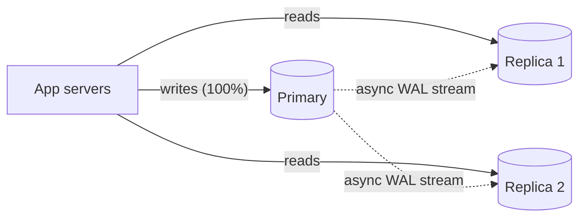
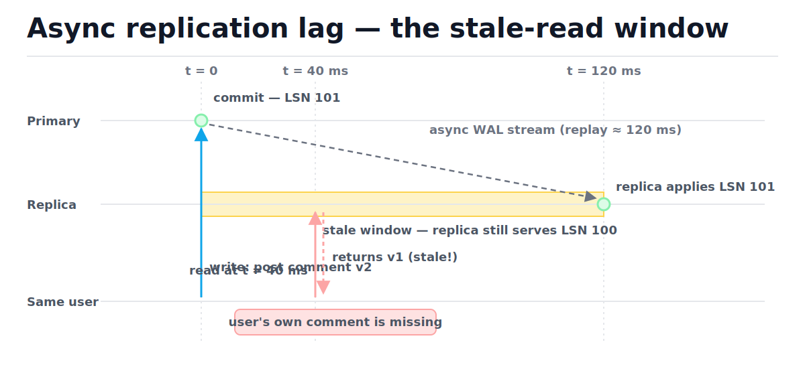
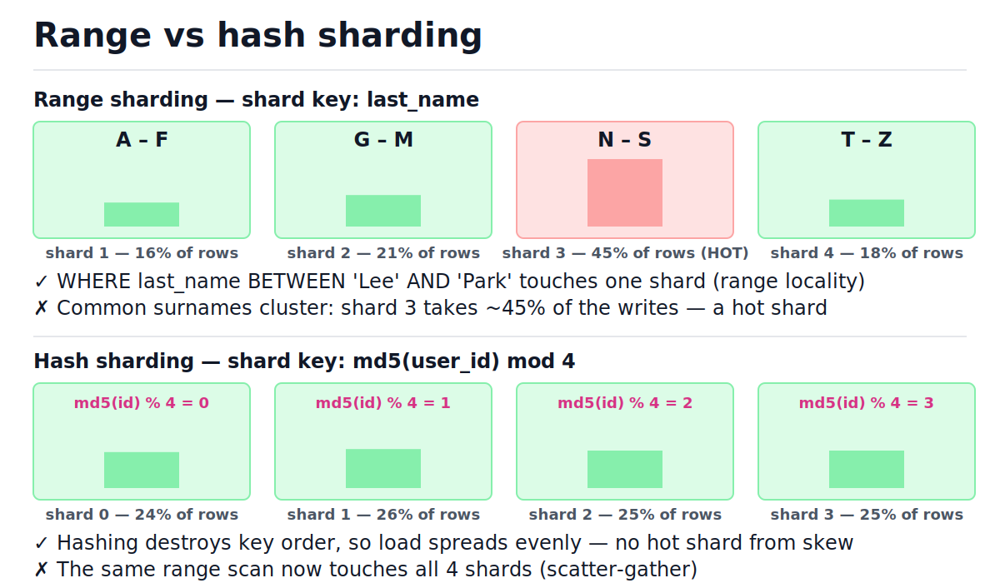
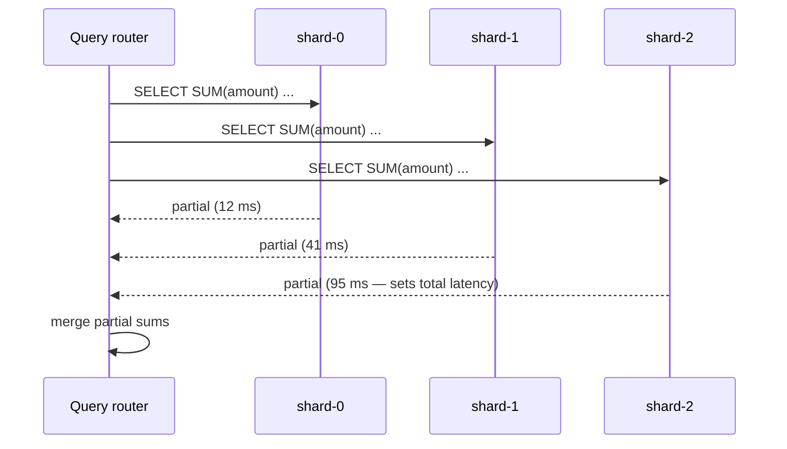
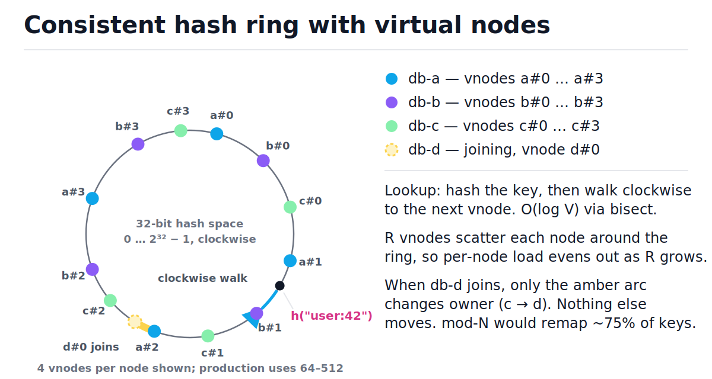

# Database Scaling: Replication and Sharding

[toc]

> **TL;DR:** Replication copies the same data to more machines — it scales **reads** and buys you failover, at the price of replication lag. Sharding splits the data across machines — it scales **writes** and storage, at the price of cross-shard queries, cross-shard transactions, and resharding pain. Exhaust replicas, caching, and indexes first; shard last, and when you do, the shard key decision is the one you will live with for years.

## Vocabulary

These terms carry the whole note. Replication terms describe copies of the *same* data; sharding terms describe *disjoint pieces* of the data. Keep the two axes separate in your head — production systems almost always combine both (each shard is itself a replicated leader–follower group).

**Replication factor**

```math
RF = \text{number of full copies of every row}
```

How many machines hold each row. RF = 3 means a write lands on a primary and is copied to two replicas. Replication multiplies read capacity and survivability, never write capacity — every copy must apply every write.

**Replication lag**

```math
\text{lag} = \text{LSN}_{\text{primary}} - \text{LSN}_{\text{replica}}
```

How far a replica trails the primary, measured in log positions (LSN = log sequence number in PostgreSQL, GTID/binlog position in MySQL) or in seconds. With asynchronous replication, lag is normally milliseconds but spikes to seconds or minutes under bulk writes.

**Read-your-writes consistency**

```math
w \in \text{writes}_s(t_0) \;\Rightarrow\; w \in \text{reads}_s(t_1) \quad \forall\, t_1 > t_0
```

The guarantee that a session s always sees its own earlier writes. Async replicas break this by default: you write to the primary, then read from a replica that hasn't applied your write yet.

**Shard (partition)**

```math
D = S_1 \cup S_2 \cup \cdots \cup S_N, \qquad S_i \cap S_j = \varnothing \;\; (i \neq j)
```

One disjoint horizontal slice of a dataset, holding complete rows for a subset of keys. N shards each take roughly 1/N of the data and 1/N of the write load — that is the entire point of sharding.

**Shard key**

```math
\text{shard}(r) = f(\,k(r)\,)
```

The column (or column tuple) k(r) whose value decides which shard a row r lives on. Every query that includes the shard key routes to one shard; every query that omits it fans out to all of them.

**Hash sharding**

```math
\text{shard}(k) = h(k) \bmod N
```

Apply a hash to the key, take it mod N. Spread is uniform, but key order is destroyed (range scans fan out) and changing N remaps almost every key — which is why real systems use consistent hashing or pre-split ranges instead of raw mod-N.

**Range sharding**

```math
\text{shard}(k) = S_i \iff b_{i-1} \le k < b_i
```

Assign contiguous key ranges to shards using boundary values b₀ < b₁ < … < bₙ. Range scans stay local to one shard, but skewed key popularity creates hot shards.

**Consistent hashing**

```math
\text{owner}(k) = \min\{\, v \in V : \text{pos}(v) \ge h(k) \,\} \quad (\text{wrapping past } 2^{32})
```

Place nodes and keys on the same hash ring; a key belongs to the first node position clockwise from its hash. Adding or removing one node moves only the keys in the arcs adjacent to that node — about K/N keys instead of nearly all of them.

**Virtual node (vnode)**

```math
V = N \cdot R \quad (R \text{ vnodes per physical node})
```

Each physical node is placed on the ring R times under different labels. More vnodes smooth out load imbalance and spread a failed node's keys across all survivors instead of dumping them on one neighbor.

**Hot shard skew**

```math
\text{skew} = \frac{\max_i \text{load}(S_i)}{\tfrac{1}{N}\sum_i \text{load}(S_i)}
```

Ratio of the busiest shard's load to the average. Skew of 1.0 is perfect balance; a celebrity user or a popular key range pushes one shard's skew high enough that adding more shards stops helping.

**Scatter-gather query**

```math
T_{\text{query}} = \max_{i \le S} T_i
```

A query without the shard key fans out to all S shards and waits for the slowest one. Latency is governed by the worst shard, not the average — tail latency amplification.

## Intuition

One database server has three exhaustible resources: read throughput, write throughput, and storage. Replication attacks the first — clone the data, fan reads out to the clones. Sharding attacks the other two — cut the data into disjoint pieces so each machine handles a fraction of the writes and holds a fraction of the bytes. The mental model: **replication = same data, more places; sharding = different data, different places.**



Every scaling conversation should walk this ladder in order: better indexes and queries → caching → read replicas → functional partitioning → sharding. Each rung is roughly 10× more operational pain than the previous one, so you stop at the first rung that holds your load.

## How it works

### Read replicas: async streaming replication

The primary appends every change to its write-ahead log (WAL) and streams that log to replicas, which replay it against their own copy. With asynchronous replication — the default in PostgreSQL and MySQL — the primary commits without waiting for any replica, so commit latency stays low but a replica is always slightly behind. That gap is replication lag, and it is the source of every "where did my data go?" bug in read-replica architectures.

The figure shows the failure concretely: the primary commits at t = 0, the replica finishes replaying at t = 120 ms, and a read landing on the replica inside that amber window returns the old value. Watch the user's own read at t = 40 ms come back stale.



The same scenario as a trace — a user posts a comment, then immediately refreshes the page:

| Step | Action | Primary LSN | Replica LSN | Router decision | Outcome |
| :--- | :--- | :---: | :---: | :--- | :--- |
| 1 | user posts comment v2 | 101 | 100 | write → primary | commit OK |
| 2 | user refreshes (naive routing) | 101 | 100 | read → replica | **stale v1 — comment missing** |
| 3 | user refreshes (pinned session) | 101 | 100 | recent write → primary | fresh v2 |
| 4 | 120 ms later, replica catches up | 101 | 101 | pin expired → replica | fresh v2, cheap read |

> [!WARNING]
> Async replicas violate read-your-writes by default. Any code path that writes and then immediately reads the same entity — post-then-redirect, save-then-render, create-then-list — must be routed deliberately, or it will intermittently show users a world without their own changes.

### Read-your-writes mitigations

Two standard fixes exist, in increasing order of sophistication. **Pin-to-primary after write:** for some window after a session writes (a few seconds, or until the replica confirms the session's LSN), route that session's reads to the primary. **Lag-aware routing:** the router tracks each replica's replayed LSN and only sends a read to a replica whose LSN is at or past the LSN the session last wrote — PostgreSQL exposes this via `pg_last_wal_replay_lsn()`. Pinning is simpler and is what most teams ship first.

```python
import time
from typing import Callable, Optional


class SessionRouter:
    """Pin a session's reads to the primary right after it writes.

    route_read is O(1); the only state is one timestamp per session.
    """

    def __init__(
        self,
        pin_seconds: float,
        clock: Callable[[], float] = time.monotonic,
    ) -> None:
        self.pin_seconds = pin_seconds
        self.clock = clock
        self.last_write: Optional[float] = None

    def on_write(self) -> None:
        self.last_write = self.clock()

    def route_read(self) -> str:
        if self.last_write is None:
            return "replica"
        if self.clock() - self.last_write < self.pin_seconds:
            return "primary"
        return "replica"


now = [1000.0]  # fake clock so the demo is deterministic
router = SessionRouter(pin_seconds=5.0, clock=lambda: now[0])

assert router.route_read() == "replica"   # never wrote: replicas are safe
router.on_write()
assert router.route_read() == "primary"   # inside pin window: read-your-writes holds
now[0] += 6.0
assert router.route_read() == "replica"   # window passed: cheap reads again
```

> [!TIP]
> Set the pin window from your *measured p99* replication lag, not the average. Production lag is bimodal: low milliseconds normally, whole seconds during batch jobs, vacuums, and schema migrations. A 1-second pin tuned to average lag still serves stale reads exactly when the system is busiest.

### One leader, many leaders, or none

Leader–follower is the topology above: one node accepts writes, the rest replay. Two other topologies exist, and interviews love asking when you'd reach for them. Multi-leader puts a write-accepting leader in each region (or device, for offline-first apps) and replicates between leaders — which means concurrent writes to the same row can conflict and someone must resolve them. Leaderless systems (Dynamo-style) drop the leader entirely: clients write to W replicas and read from R, relying on quorum overlap — covered in depth in [Consistency Models, CAP, and Quorums](./07-consistency-models-cap-and-quorums.md).

| Property | Leader–follower | Multi-leader | Leaderless |
| :--- | :--- | :--- | :--- |
| Writes accepted by | the single leader | one leader per region | any W of N replicas |
| Write conflicts | impossible | **yes — must resolve** (LWW, app merge, CRDTs) | yes — versioning + read repair |
| Read scaling | replicas (stale by lag) | local-region reads | tunable via R |
| Failure handling | promote a follower (failover) | survives region loss | no failover needed; nodes are symmetric |
| Consistency ceiling | strong (if reads hit leader) | eventual between leaders | tunable: R + W > N for quorum reads |
| Typical systems | PostgreSQL, MySQL streaming | cross-region MySQL/Postgres setups, CouchDB | Dynamo, Cassandra, Riak |
| Reach for it when | default — start here | multi-region writes, offline clients | availability beats consistency |

> [!CAUTION]
> Multi-leader looks like free write scaling but is really a conflict-resolution commitment. Last-writer-wins silently discards committed data when two regions update the same row inside the replication delay. If you can't write down your merge function, you can't run multi-leader.

### Functional partitioning: split by domain first

Before sharding any single table, split *different* tables onto different databases: orders on one cluster, the product catalog on another, analytics events on a third. Each service owns its store, each store is still a boring single-primary database, and joins inside a domain keep working. This is usually the first partitioning step in a service-oriented architecture and postpones true sharding by years. The cost: no SQL joins across domains — the app stitches data together, and cross-domain invariants need events or sagas instead of one ACID transaction.

### Sharding strategies: hash, range, directory

When one table's write volume or size outgrows one machine, you split its rows by shard key. Three placement functions cover practically every real system, and the choice is a direct trade between uniform spread and range locality. The figure shows the tension: range sharding keeps `BETWEEN` queries on one shard but inherits the skew of the key distribution; hash sharding flattens skew but turns every range scan into a fan-out.



| | Hash | Range | Directory |
| :--- | :--- | :--- | :--- |
| Spread | uniform (hash flattens skew) | follows key popularity — skew-prone | whatever you assign |
| Range scan on key | **all shards** (scatter-gather) | one or few shards | depends on assignment |
| Routing state | none — pure formula, O(1) | sorted boundary list, O(log S) | lookup table — must be cached + HA |
| Adding a shard | remaps keys (fix: consistent hashing) | split the hottest range | reassign rows tenant-by-tenant |
| Hot-key defense | weak (one hot key still burns one shard) | weak (hot ranges) | **strong — move the hot tenant by hand** |
| Typical systems | Cassandra, DynamoDB partitioning | HBase, Spanner, MongoDB range sharding | Vitess, multi-tenant SaaS tenant maps |

Directory sharding deserves a concrete look because it is the workhorse of multi-tenant SaaS: a tiny, heavily cached mapping table decides where each tenant lives, which makes migrating one noisy tenant to its own hardware a one-row `UPDATE`.

```sql
-- the shard directory: one tiny, heavily cached, replicated table
CREATE TABLE shard_map (
    tenant_id  INTEGER PRIMARY KEY,
    shard      TEXT NOT NULL          -- e.g. 'shard-eu-1'
);

INSERT INTO shard_map (tenant_id, shard)
VALUES (7, 'shard-us-1'), (42, 'shard-eu-1');

-- every request resolves its tenant first (cached in app memory / Redis)
SELECT shard FROM shard_map WHERE tenant_id = 42;
```

### Choosing a shard key and the hot-shard problem

A good shard key has three properties: **high cardinality** (many distinct values), **even load** (no value dominates), and it **appears in your hottest queries** (so they route to one shard). `user_id` is the classic choice for user-centric apps; `tenant_id` for B2B SaaS; a compound key like `(device_id, day)` for telemetry. Monotonic keys — auto-increment IDs, timestamps — are the classic mistake under range sharding: every insert lands on the last shard, which becomes a write hotspot while the others idle.

Even a good key can't save you from the **celebrity problem**: in a social graph sharded by `user_id`, one account with 100M followers makes its shard glow. Standard defenses: cache the hot entity aggressively in front of the database, salt the hot key (split one logical key into `key#0 … key#15` sub-keys and merge on read), or — with directory sharding — move the celebrity onto dedicated hardware.

> [!IMPORTANT]
> The shard key is close to irreversible. Changing it later means rewriting every row into a new layout while serving traffic — a months-long dual-write migration. Spend real design time here: enumerate your top queries and verify each one carries the candidate key before you commit.

### Cross-shard queries and transactions: the real bill

Sharding's sticker price is hardware; its real price is everything that used to be one SQL statement. A query that omits the shard key becomes a scatter-gather: the router fans out to all S shards, waits for the slowest, and merges. Joins across shards stop being SQL and become application code. And a transaction spanning two shards needs two-phase commit (2PC) or a saga — both dramatically more fragile than a single-node ACID commit.



In practice teams design around this instead of solving it: co-locate rows that transact together (same tenant → same shard), denormalize so reads are single-shard, push global aggregates into async pipelines, and accept eventual consistency between shards. If a workload is dominated by cross-shard transactions, that is evidence the shard key is wrong — or that the table should not have been sharded.

### Consistent hashing with virtual nodes

Raw `h(k) mod N` has a fatal flaw: changing N changes almost every key's shard. Consistent hashing fixes it by hashing both keys *and* nodes onto the same 2³² ring; a key belongs to the first node clockwise from it. Now adding a node only claims the arcs immediately counter-clockwise of its positions — everything else stays put. Virtual nodes finish the job: placing each physical node on the ring R times smooths the luck of the draw, with imbalance shrinking roughly as 1/√R.

In the figure, trace one lookup: hash the key, walk clockwise, stop at the first dot. Then look at the amber arc — that sliver is the *only* data that moves when node d joins.



The implementation is ~30 lines: a sorted list of vnode positions plus a dict from position to owner. Lookup is a binary search — O(log V). The asserts at the bottom prove the two headline claims: load is near-uniform, and adding a node moves only ~1/4 of keys (vs ~3/4 for mod-N).

```python
import bisect
import hashlib
from collections import Counter
from typing import Dict, List


def ring_hash(key: str) -> int:
    """Map a string to a point on a 32-bit ring. O(1)."""
    digest = hashlib.md5(key.encode("utf-8")).digest()
    return int.from_bytes(digest[:4], "big")


class ConsistentHashRing:
    """Hash ring with virtual nodes.

    node_for: O(log V) binary search, V = nodes x vnodes_per_node.
    add_node: O(R * V) here because insort shifts a Python list;
              a balanced tree makes it O(R log V).
    """

    def __init__(self, vnodes_per_node: int = 128) -> None:
        self.vnodes_per_node = vnodes_per_node
        self._positions: List[int] = []     # sorted vnode positions
        self._owner: Dict[int, str] = {}    # position -> physical node

    def add_node(self, node: str) -> None:
        for i in range(self.vnodes_per_node):
            pos = ring_hash(f"{node}#vnode{i}")
            self._owner[pos] = node
            bisect.insort(self._positions, pos)

    def node_for(self, key: str) -> str:
        idx = bisect.bisect_right(self._positions, ring_hash(key))
        return self._owner[self._positions[idx % len(self._positions)]]


ring = ConsistentHashRing(vnodes_per_node=128)
for name in ("db-a", "db-b", "db-c"):
    ring.add_node(name)

keys = [f"user:{i}" for i in range(10_000)]
before = {k: ring.node_for(k) for k in keys}

# 1) Near-uniform load: every node within +/-15% of the fair share.
load = Counter(before.values())
fair = len(keys) / 3
assert all(abs(n_keys - fair) / fair < 0.15 for n_keys in load.values()), load

# 2) Adding a 4th node moves ~K/4 keys, and they move ONLY to the new node.
ring.add_node("db-d")
after = {k: ring.node_for(k) for k in keys}
moved = [k for k in keys if before[k] != after[k]]
assert all(after[k] == "db-d" for k in moved)            # zero churn among a, b, c
assert 0.18 < len(moved) / len(keys) < 0.32, len(moved)  # measured: ~24.7%

# 3) Naive `hash(k) mod N` going 3 -> 4 nodes remaps ~75% of keys.
naive_moved = sum(1 for i in range(10_000) if i % 3 != i % 4)
assert naive_moved / 10_000 > 0.70
```

> [!NOTE]
> This exact structure routes keys in Dynamo, Cassandra, and Riak, in memcached client libraries (ketama), and in load balancers doing session affinity. Same ring, different payloads.

### Resharding without downtime

Eventually you outgrow N shards and must move to N′. The zero-downtime playbook is always the same shape: (1) **dual-write** — writes go to both old and new layouts; (2) **backfill** — a background job copies historical rows into the new layout, in key order, with throttling; (3) **verify** — checksum row counts and sampled content between layouts; (4) **cut reads over** gradually behind a flag; (5) **stop old writes** and decommission. Consistent hashing (or pre-split range chunks, as in Vitess and MongoDB) shrinks step 2 from "move everything" to "move 1/(N+1) of everything," which is exactly why it exists.

## Complexity

Every routing scheme in this note is cheap per lookup — the costs that matter are what happens when topology *changes*, and what fraction of queries fan out. The table prices both; q is the per-shard work of one query, K the total key count, S the shard count, V = N·R the total vnode count.

| Operation | Best | Average | Worst | Space | Notes |
| :--- | :---: | :---: | :---: | :---: | :--- |
| mod-N shard lookup | O(1) | O(1) | O(1) | O(1) | formula only, no state |
| mod-N topology change (N → N+1) | — | moves ≈ K·N/(N+1) keys | ≈ K | — | the disqualifying cost |
| consistent-hash lookup | O(log V) | O(log V) | O(log V) | O(V) | bisect over sorted vnode positions |
| consistent-hash add/remove node | — | O(R log V) metadata + K/N data moved | K/N | O(V) | only adjacent arcs move |
| range-shard routing | O(log S) | O(log S) | O(log S) | O(S) | binary search over boundaries |
| directory lookup | O(1) | O(1) | O(1) | O(tenants) | cached map; one indexed read on miss |
| single-shard query (key present) | O(q) | O(q) | O(q) | — | the goal state |
| scatter-gather query (key absent) | O(S·q) work | O(S·q) | O(S·q) | O(S) partials | latency = max over shards |
| replica read routing (pin/LSN check) | O(1) | O(1) | O(1) | O(sessions) | one timestamp or LSN per session |
| resharding (backfill) | — | O(K/N) rows per new shard | O(K) | dual storage during migration | dual-write + verify on top |

The headline bound is the data-movement comparison. A new node's R vnodes land uniformly at random on the ring, so in expectation they own R/(V+R) = 1/(N+1) of the ring; keys are uniform on the ring too, so:

```math
\mathbb{E}[\text{keys moved}]_{\text{consistent}} = \frac{K}{N+1}
\qquad \text{vs} \qquad
\mathbb{E}[\text{keys moved}]_{\bmod N} = K \cdot \frac{N}{N+1}
```

For mod-N, a uniform key keeps its shard only when its residues mod N and mod N+1 agree, which happens for roughly a 1/(N+1) fraction of keys — so nearly everything moves. Consistent hashing inverts the fraction: the new node takes its fair share and nothing else changes hands. Virtual nodes control the variance around that expectation: a node's share is the sum of R independent arc lengths, so by the usual averaging argument the relative imbalance shrinks like:

```math
\frac{\sigma(\text{load})}{\mu(\text{load})} \approx \frac{1}{\sqrt{R}}
```

which is why R = 1 rings are badly unbalanced and R between 64 and 512 is the production norm. The measured run above (R = 128, 3 nodes) landed within ±9% of fair share.

## In production

The mechanics above meet disk and failure reality at a few sharp edges. Replication lag is not a constant: PostgreSQL replicas replay the WAL on far fewer processes than generated it, so bulk loads, `VACUUM`, and index builds make lag spike by orders of magnitude — monitor `pg_stat_replication` byte lag and replica replay delay as first-class SLO metrics. Failover from async replication has nonzero RPO: commits the dead primary never shipped are simply gone, which is why financial writes often run `synchronous_commit = on` to at least one standby and eat the latency. Engine-level mechanics — WAL formats, promotion, and why every shard multiplies your connection-pool math — live in [Replication, Failover, and Connection Pooling](../Relational-Databases-and-Data-Modeling/08-replication-failover-and-connection-pooling.md).

Sharded fleets add their own operational taxes:

- **Connection explosion** — S shards × A app instances × P pool size sockets; PgBouncer/ProxySQL between app and shards is non-optional at scale.
- **Schema migrations × S** — every `ALTER TABLE` now runs on every shard, ideally online and resumable; one stuck shard blocks the release train.
- **Hot-shard firefighting** — dashboards must show per-shard p99 and QPS, or the first sign of a celebrity key is a pager. AWS's shuffle-sharding work is the systematic version of "isolate the noisy tenant."
- **Don't hand-roll routing** — Vitess (MySQL), Citus (PostgreSQL), and MongoDB's mongos all ship battle-tested routing, resharding, and cross-shard query handling. A homegrown router is a multi-year liability adopted in an afternoon.

> [!TIP]
> Before sharding, do the arithmetic from [Back-of-the-Envelope Estimation](./02-back-of-the-envelope-estimation.md). A single modern Postgres primary with NVMe storage comfortably serves several terabytes and tens of thousands of transactions per second. Most systems that "need sharding" actually need an index, a cache, or archival of cold rows.

## Choosing the data store: SQL vs NoSQL

This decision is downstream of everything above, because NoSQL stores are mostly "sharding + replication built in, joins and multi-row transactions left out." Decide on three questions — data model fit, query patterns, consistency needs — and ignore hype in both directions. If your access pattern is "fetch aggregate by key" at huge write volume, a Dynamo-style store gives you the partitioning of this note for free; if you need ad-hoc queries and cross-entity transactions, a relational engine plus the techniques in this note goes much further than its reputation suggests.

| Question | Points to relational (Postgres/MySQL) | Points to NoSQL (Dynamo/Cassandra/Mongo) |
| :--- | :--- | :--- |
| Data model | many-to-many relations, joins, ad-hoc reporting | self-contained aggregates fetched by key |
| Query patterns | unknown or evolving; analysts write SQL | known upfront and key-based; design tables per query |
| Consistency | multi-row invariants need ACID transactions | per-item atomicity suffices; eventual is acceptable |
| Scale path | replicas + functional partitioning + (later) Citus/Vitess | horizontal partitioning is the default mode |
| Schema | enforced centrally, migrations are fine | fluid per-document; app validates |

> [!NOTE]
> "NoSQL scales, SQL doesn't" is a 2010 meme, not an engineering claim. Sharded MySQL runs YouTube and Slack via Vitess; meanwhile a DynamoDB table with a bad partition key throttles at tiny throughput. The partitioning theory in this note governs both families equally.

## Real-world example

A B2B invoicing SaaS sharded by `tenant_id` with a directory: the shard map says where each tenant lives, tenant-scoped queries hit exactly one shard, and the finance team's "global revenue" query shows the scatter-gather cost. The demo runs on SQLite standing in for two physical database servers — the routing logic is identical with two Postgres DSNs.

```python
import sqlite3
from typing import Dict


def make_shard() -> sqlite3.Connection:
    conn = sqlite3.connect(":memory:")
    conn.execute(
        "CREATE TABLE invoices (id INTEGER, tenant_id INTEGER, amount_cents INTEGER)"
    )
    return conn


shards: Dict[str, sqlite3.Connection] = {
    "shard-0": make_shard(),
    "shard-1": make_shard(),
}

directory = sqlite3.connect(":memory:")
directory.execute(
    "CREATE TABLE shard_map (tenant_id INTEGER PRIMARY KEY, shard TEXT NOT NULL)"
)
directory.executemany(
    "INSERT INTO shard_map VALUES (?, ?)",
    [(7, "shard-0"), (42, "shard-1"), (99, "shard-1")],
)


def shard_for(tenant_id: int) -> sqlite3.Connection:
    """Directory lookup: O(1) from cache, one indexed read on miss."""
    row = directory.execute(
        "SELECT shard FROM shard_map WHERE tenant_id = ?", (tenant_id,)
    ).fetchone()
    if row is None:
        raise KeyError(f"unmapped tenant {tenant_id}")
    return shards[row[0]]


def add_invoice(tenant_id: int, invoice_id: int, amount_cents: int) -> None:
    shard_for(tenant_id).execute(
        "INSERT INTO invoices VALUES (?, ?, ?)", (invoice_id, tenant_id, amount_cents)
    )


def tenant_total(tenant_id: int) -> int:
    """Single-shard fast path: the shard key is in the query."""
    row = shard_for(tenant_id).execute(
        "SELECT COALESCE(SUM(amount_cents), 0) FROM invoices WHERE tenant_id = ?",
        (tenant_id,),
    ).fetchone()
    return int(row[0])


def global_total() -> int:
    """Scatter-gather: no shard key, so every shard answers."""
    return sum(
        int(conn.execute("SELECT COALESCE(SUM(amount_cents), 0) FROM invoices").fetchone()[0])
        for conn in shards.values()
    )


add_invoice(7, 1, 5000)
add_invoice(42, 2, 1200)
add_invoice(42, 3, 800)

assert tenant_total(42) == 2000   # one shard answered
assert tenant_total(7) == 5000    # a different single shard answered
assert global_total() == 7000     # every shard answered — the expensive path
```

The design lesson is in the last assert: `global_total` touches every shard today and every shard forever, so it belongs in an async rollup table, not on a request path. When tenant 42 becomes a whale, migrating it to its own shard is one directory row plus a backfill — the payoff of directory sharding.

## When to use / when NOT to use

Reach for each tool at the point where the cheaper one demonstrably fails. The ladder is ordered by operational cost, and skipping rungs is how teams end up running a distributed system they didn't need.

**Use read replicas when:**

- Read QPS is the bottleneck and reads tolerate seconds of staleness (feeds, catalogs, dashboards).
- You need a warm standby for failover anyway — replicas do double duty.
- You can route writes-then-reads correctly (pinning or LSN tracking is in place).

**Use sharding when:**

- Write throughput or working-set size exceeds one primary *after* caching, indexing, and functional partitioning.
- A natural high-cardinality, even-load shard key exists that appears in your hot queries.
- You can adopt a proven router (Vitess, Citus, DynamoDB) rather than building one.

**Do NOT use them when:**

- Replicas, to fix write throughput — every replica applies every write; replication scales reads only.
- Sharding, when data fits one box — you trade SQL's power for distributed-systems homework with no payoff.
- Sharding, with cross-shard transactions dominating — the shard key is wrong, or the domain resists partitioning.
- Multi-leader, to "scale writes" within one region — you gain conflicts, not throughput.

## Common mistakes

- **"We're at 60% CPU — time to shard"** — sharding is the last rung, not the next one. An index, a cache, archival of cold data, or one hardware size up each cost ~1% of a sharding migration.
- **"Replicas scale our writes too"** — every replica replays every write; RF copies of the write happen no matter what. Only sharding divides write load.
- **"Replication lag is 5 ms, we can ignore it"** — design for p99 lag, which spikes to seconds during backfills, vacuums, and failovers. Read-your-writes bugs only appear under load, which is when you have the least patience to debug them.
- **"Auto-increment ID is a fine shard key"** — under range sharding it sends 100% of inserts to the last shard. Hash it, or shard by a key with stable load.
- **"Consistent hashing balances perfectly"** — with one position per node, arc sizes vary wildly; balance needs vnodes, and improves only as 1/√R.
- **"We'll just query all shards and merge in the app"** — scatter-gather latency is the max over shards, partial failures need explicit handling, and pagination across merged sorted streams is genuinely hard. Fan-out must be the exception, not the default.
- **"We can change the shard key later if we're wrong"** — "later" is a quarter-long dual-write migration with checksum verification. Treat the key choice like a public API.

## Interview questions and answers

These come up constantly in system-design rounds — usually as follow-ups while you're drawing boxes. Practice saying the answers out loud; the value is in crisp 30-second versions, not essays.

**1. How do read replicas scale a database, and what's the catch?**
**Answer:** The primary streams its write-ahead log to replicas, which replay it and serve reads, so read capacity scales roughly linearly with replica count. The catch is that replication is usually asynchronous, so replicas trail the primary — and any user who writes then immediately reads can see a world without their own write. You handle it by pinning recent writers to the primary or routing by replicated LSN.

**2. A user posts a comment, the page refreshes, and the comment is gone. What happened?**
**Answer:** Classic read-your-writes violation: the write committed on the primary, the refresh read a replica that hadn't replayed it yet. Fixes, cheapest first: pin that session's reads to the primary for a few seconds after a write; or track the session's last-write LSN and only use replicas that have replayed past it; or make that one endpoint always read the primary.

**3. Compare leader-follower, multi-leader, and leaderless replication.**
**Answer:** Leader-follower: one node takes writes, no conflicts, replicas lag — the right default. Multi-leader: a writable leader per region for write locality and offline support, but concurrent writes conflict and you must own the merge logic. Leaderless: Dynamo-style, write W and read R of N replicas with R + W > N for overlap — best availability, weakest ordering, conflicts resolved by versioning and read repair.

**4. How do you choose a shard key?**
**Answer:** Three tests: high cardinality so the data can spread; even load so no value dominates; and presence in the hottest queries so they stay single-shard. I'd list the top queries and check each carries the key, then check the write pattern for monotonic growth and celebrity skew. For SaaS it's almost always tenant_id; for consumer apps user_id; for time-series a compound of source ID and time bucket.

**5. What is the celebrity / hot shard problem and how do you handle it?**
**Answer:** One key or key range attracts disproportionate traffic — a celebrity's account, a viral post — so one shard saturates while others idle, and adding shards doesn't help because the hot key still lives on one of them. Mitigations: cache the hot entity in front of the database, salt the key into sub-keys merged at read time, or with directory sharding move that tenant to dedicated hardware.

**6. Why consistent hashing instead of hash mod N?**
**Answer:** With mod N, changing N remaps about N/(N+1) of all keys — at 10 nodes, adding one moves ~91% of the data, which is a cluster-wide rebalance. Consistent hashing puts nodes and keys on the same ring so a new node only claims the arcs next to its positions — K/(N+1) keys in expectation, and nothing moves between old nodes. Virtual nodes fix the load variance, shrinking imbalance like 1/√R.

**7. What's the real cost of sharding?**
**Answer:** Not the hardware — the loss of single-node semantics. Queries without the shard key fan out to every shard and run at the speed of the slowest; joins across shards become application code; transactions across shards need 2PC or sagas; resharding is a live-traffic data migration; and operations multiply — migrations, backups, and monitoring all times S. That's why the answer to "should we shard?" is "after we've exhausted everything else."

**8. SQL or NoSQL for a new service?**
**Answer:** I'd decide on data model, query patterns, and consistency — not throughput folklore. Relational wins when entities interrelate, queries evolve, or multi-row invariants need transactions. A Dynamo/Cassandra-style store wins when access is key-based aggregates at very high write volume and eventual consistency is acceptable — you're buying this note's sharding and replication pre-built. Default to Postgres until a specific access pattern proves it wrong.

**9. How do you reshard a live system without downtime?**
**Answer:** Dual-write to old and new layouts; backfill historical rows in the background with throttling; verify with row counts and sampled checksums; shift reads gradually behind a flag with instant rollback; then stop old writes and decommission. Consistent hashing or pre-split chunks keeps the moved fraction near 1/(N+1), and tools like Vitess orchestrate exactly this workflow so you don't hand-roll it.

## Practice path

Drills in dependency order — each one builds the muscle the next one assumes.

1. Run this note's `ConsistentHashRing` with `vnodes_per_node` set to 1, 8, and 128; print per-node load each time and watch imbalance shrink roughly as 1/√R.
2. Implement `remove_node` on the ring, then assert that only keys owned by the removed node change owner — the mirror image of the add-node property.
3. For three workloads — chat messages, IoT telemetry, multi-tenant invoicing — write down a shard key, then list two hot queries each and check they stay single-shard.
4. Using [Back-of-the-Envelope Estimation](./02-back-of-the-envelope-estimation.md), compute the write QPS and storage at which a single primary stops sufficing for the invoicing app; that number is your "when to shard" line.
5. Extend the real-world example to three shards and implement `top_tenants_by_revenue(n)` as a proper scatter-gather: per-shard partial top-n, then a merge — note why per-shard `LIMIT n` is required for correctness.
6. Sketch the five-step resharding plan (dual-write, backfill, verify, cut reads, decommission) for moving tenant 42 to a new shard-2 in that example, including the rollback story at each step.

## Copyable takeaways

- Replication = same data, more places → scales **reads**, buys failover, costs lag. Sharding = disjoint data → scales **writes + storage**, costs cross-shard everything.
- Scaling ladder, cheapest first: indexes → caching → read replicas → functional partitioning → sharding. Stop at the first rung that holds.
- Async replicas break read-your-writes by default; fix with pin-to-primary after write or LSN-aware routing, sized to **p99** lag.
- Shard key tests: high cardinality, even load, present in hot queries. Treat the choice as irreversible.
- Hash sharding = uniform spread, fan-out range scans. Range sharding = local scans, hot shards. Directory = manual control, one more table to keep HA.
- Consistent hashing moves K/(N+1) keys on topology change vs ~K for mod-N; vnodes cut imbalance like 1/√R. Lookup is O(log V).
- Scatter-gather latency = max over shards; cross-shard transactions need 2PC/sagas — design shards so both stay rare.
- SQL vs NoSQL is a data-model / query-pattern / consistency decision; both families obey the same partitioning math.

## Sources

- Kleppmann, *Designing Data-Intensive Applications* — ch. 5 (Replication), ch. 6 (Partitioning). O'Reilly, 2017.
- DeCandia et al., "Dynamo: Amazon's Highly Available Key-value Store," SOSP 2007 — consistent hashing with virtual nodes in production.
- Karger et al., "Consistent Hashing and Random Trees," STOC 1997 — the original consistent-hashing paper and its bounds.
- PostgreSQL documentation, "High Availability, Load Balancing, and Replication" — https://www.postgresql.org/docs/current/high-availability.html
- Vitess documentation (sharding and resharding for MySQL at YouTube/Slack scale) — https://vitess.io/docs/
- AWS Builders' Library, "Workload isolation using shuffle-sharding" — https://aws.amazon.com/builders-library/workload-isolation-using-shuffle-sharding/

## Related

- [Scaling Fundamentals](./04-scaling-fundamentals.md)
- [Caching Strategies](./05-caching-strategies.md)
- [Consistency Models, CAP, and Quorums](./07-consistency-models-cap-and-quorums.md)
- [Back-of-the-Envelope Estimation](./02-back-of-the-envelope-estimation.md)
- [Replication, Failover, and Connection Pooling](../Relational-Databases-and-Data-Modeling/08-replication-failover-and-connection-pooling.md)
- [Hash Tables](../Data-Structures-and-Algorithms/05-hash-tables.md)
