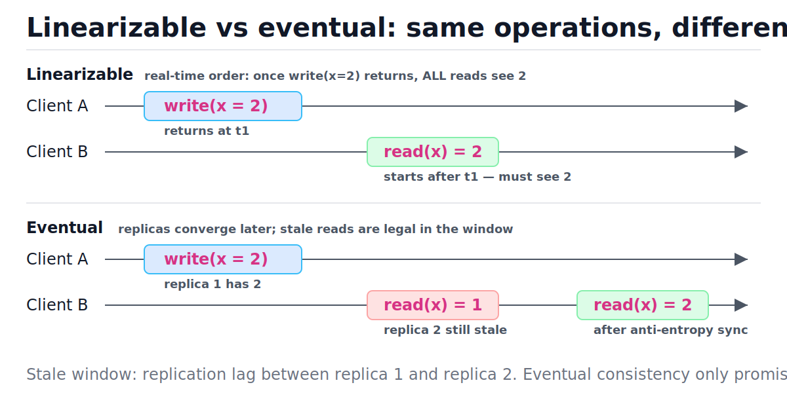
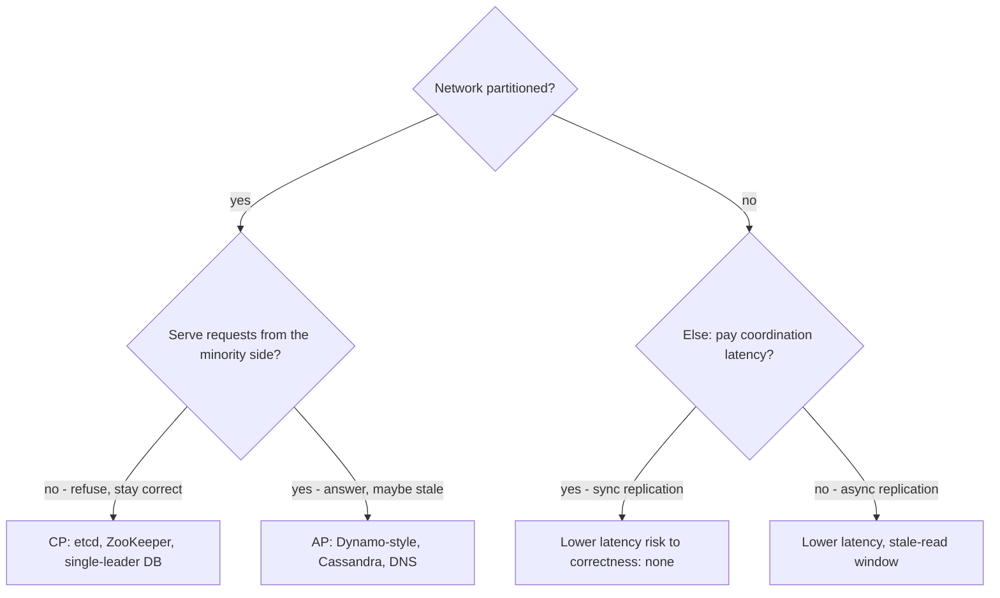
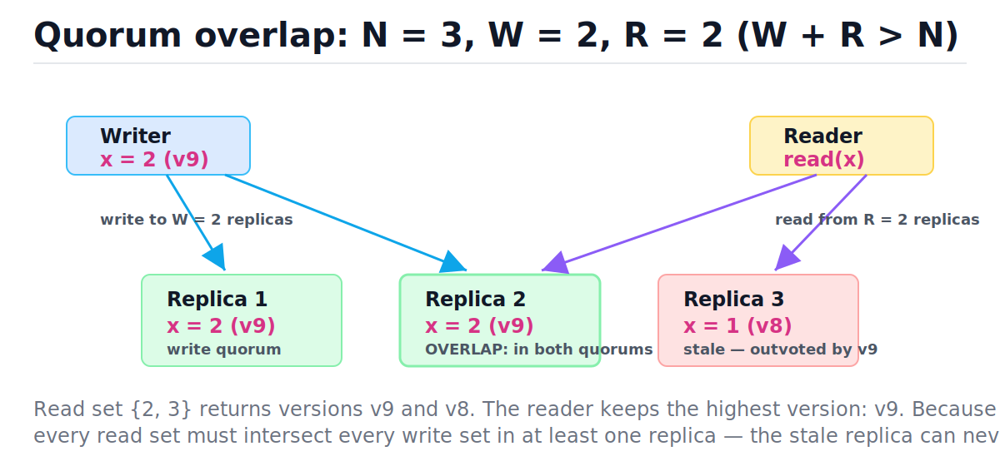

# Consistency Models, CAP, and Quorums

[toc]

> **TL;DR:** A consistency model is a contract about which values reads are allowed to return given the history of writes. CAP says only one true thing: during a network partition you must choose between serving requests (availability) and serving correct ones (consistency); PACELC adds that even without a partition you trade latency against consistency. Quorum systems (N, R, W with R + W > N) are the standard knob for buying exactly as much consistency as a feature needs.

## Vocabulary

**Consistency model**

```math
\text{model} : \text{history of operations} \rightarrow \text{set of legal read results}
```

A contract between a data store and its clients specifying which values a read may legally return, given what writes have happened and when. Stronger models permit fewer results.

**Linearizability**

```math
op_1 \text{ ends before } op_2 \text{ begins} \implies op_1 \text{ ordered before } op_2
```

The strongest single-object model: every operation appears to take effect atomically at some instant between its start and its end, in real time. Once a write returns, every subsequent read — by anyone — sees it.

**Sequential consistency**

```math
\exists \text{ one total order consistent with each client's program order}
```

All clients agree on one interleaving of operations, but that interleaving need not match wall-clock time. Weaker than linearizable: a "committed" write may be invisible briefly, as long as everyone sees the same order.

**Causal consistency**

```math
a \rightarrow b \implies \text{no client sees } b \text{ without } a
```

If operation a could have caused b (b read a's result, or the same client did a then b), everyone observes them in that order. Concurrent operations may be seen in different orders by different clients.

**Eventual consistency**

```math
\text{writes stop} \implies \lim_{t \to \infty} \text{all replicas converge}
```

The weakest useful promise: if updates cease, all replicas eventually hold the same value. Says nothing about how long "eventually" is or what reads return meanwhile.

**Quorum condition**

```math
R + W > N
```

With N replicas, writes acknowledged by W of them and reads consulting R of them: if R + W exceeds N, every read set intersects every write set, so at least one contacted replica has the latest write.

**Version vector**

```math
VV = \{ \text{replica}_i : \text{counter}_i \}
```

A per-key map from replica ID to a counter of updates accepted there. Comparing two vectors tells you whether one version descends from the other or they are concurrent siblings needing merge.

## Intuition

Think of consistency models as a staleness dial. At one end, the system behaves like a single machine with one copy of the data — slow, but reads never lie. At the other end, replicas gossip updates lazily — fast and always up, but a read may show you last week's truth. Everything in this note is about choosing a point on that dial per feature, not per database.

The figure below shows the same two clients and the same write under the two extremes. Under linearizability, Client B's read starts after Client A's write returned, so it must see the new value. Under eventual consistency, B may hit a replica the write has not reached yet.



> [!IMPORTANT]
> Consistency here means "replicas agree" — it is NOT the C in ACID, which means "transactions preserve invariants." Interviewers love this distinction. See [Transactions, ACID, and Isolation Levels](../Relational-Databases-and-Data-Modeling/06-transactions-acid-and-isolation-levels.md).

## The consistency taxonomy, with two-client examples

Each level below is defined by the read results it forbids. The same scenario runs through all four: Alice writes, Bob reads. What may Bob see?

### Linearizable — real-time ordering

The system behaves as if there is exactly one copy of the data and every operation happens atomically at a point between invocation and response. The defining test: Alice's write of `balance = 200` returns at 10:00:00.000; Bob's read begins at 10:00:00.001. A linearizable store must return 200 — wall-clock "after" means logically after. This is what etcd, ZooKeeper, and a single-leader Postgres read-from-primary give you, and what compare-and-swap and leader election require.

### Sequential — one agreed order, not real-time

Everyone observes one global interleaving consistent with each client's own program order, but that interleaving may lag reality. Two-client example: Alice writes x=1 then x=2; Bob writes y=1 then y=2. Sequential consistency lets readers see (x=2, y=1) or (x=1, y=2) — any single merge of the two programs — but never x=2 before x=1. Unlike linearizability, Bob's read that starts after Alice's write returns may still see the old value, as long as no one ever sees orders that disagree.

### Causal — effects never precede causes

Causal consistency tracks the happens-before relation: writes you read, and your own earlier writes, must be visible before anything you do next. The canonical example: Alice posts "I lost my cat" and then comments "Found him!". Carol replies to the comment "Great news!". Causality chains post → comment → reply, so no reader may see "Great news!" without "Found him!" without the post. Concurrent writes (Alice and Bob posting independently) may appear in either order — that is the price that makes causal consistency achievable with availability during partitions.

### Eventual — convergence, eventually

The store only promises that if writes stop, replicas converge. Two-client example: Alice updates her avatar; Bob refreshes and sees the old avatar for 30 seconds, then the new one. No ordering, no recency, no read-your-writes — just convergence. DNS is the classic example: a changed record propagates as TTLs expire. See [DNS, Load Balancers, and CDNs](./03-dns-load-balancers-and-cdns.md).

| Model | Bob's read after Alice's write returns | Cost |
| :--- | :--- | :--- |
| Linearizable | Must see new value | Coordination on every op; highest latency; unavailable in minority partition |
| Sequential | May see old value, but all readers agree on order | Total order still needs coordination |
| Causal | Must see it only if causally related to something Bob saw | Metadata (version vectors); siblings possible |
| Eventual | Anything goes until convergence | App must tolerate staleness and reorder |

## CAP — stated correctly

CAP is routinely misquoted as "pick two of three." The correct statement (Gilbert & Lynch's proof of Brewer's conjecture): in the presence of a network **P**artition, a system must sacrifice either **C**onsistency (linearizability) or **A**vailability (every request to a non-failed node gets a response). Partition tolerance is not optional — networks partition whether you like it or not. So the only real choice, and only during a partition, is: refuse some requests (CP) or answer them possibly-stale (AP).



> [!WARNING]
> "CA system" is not a coherent category for a distributed system. A system that is consistent and available only while the network is healthy has simply not stated what it does during a partition — and the partition decides.

### PACELC — the refinement you should actually use

CAP says nothing about the 99.99% of time the network is fine. PACELC (Abadi, 2012) fixes that: if **P**artition, choose **A** or **C**; **E**lse, choose **L**atency or **C**onsistency. Synchronous replication to a remote region costs a round trip on every write; asynchronous replication returns fast but opens a stale-read / data-loss window. That else-branch trade is the one you make every day in [replication topology choices](./06-database-scaling-replication-and-sharding.md).

| System | If partition | Else | Label |
| :--- | :---: | :---: | :--- |
| DynamoDB / Cassandra (default) | A | L | PA/EL |
| etcd, ZooKeeper, Spanner | C | C | PC/EC |
| MySQL semi-sync, MongoDB (majority) | C | C-leaning | PC/EC |

## Quorums — N, R, W

Leaderless replication makes the consistency dial explicit. Each key lives on N replicas. A write succeeds when W replicas acknowledge it; a read queries R replicas and keeps the value with the highest version. The store guarantees reads see the latest acknowledged write exactly when the overlap condition holds.

```math
R + W > N \implies \text{every read quorum} \cap \text{every write quorum} \neq \varnothing
```

The proof is pigeonhole: a read set of size R and a write set of size W drawn from N nodes must share a member when R + W > N, because R + W ≤ N is the only way to make them disjoint. The figure shows the canonical N=3, W=2, R=2 case: replica 2 sits in both quorums, so its fresh version outvotes stale replica 3.



### Tuning R and W

R and W are per-request knobs in Cassandra (`ONE`, `QUORUM`, `ALL`) and Dynamo-style stores. Lowering one side makes that operation faster and more fault-tolerant, and pushes the cost to the other side.

| Config (N=3) | Guarantees latest read? | Tuned for |
| :--- | :---: | :--- |
| W=3, R=1 | Yes (1+3 > 3) | Read-heavy: cheap reads, writes block on every replica |
| W=2, R=2 | Yes (2+2 > 3) | Balanced; survives 1 node down for both ops |
| W=1, R=3 | Yes (3+1 > 3) | Write-heavy ingest: fast writes, expensive reads |
| W=1, R=1 | No (1+1 ≤ 3) | Max speed/availability; eventual only |

> [!TIP]
> Even with R + W > N, latency improves: the coordinator sends to all N and returns after the fastest W (or R) respond. You pay the quorum, not the slowest replica — this is why tail latency of quorum systems beats sync-all replication.

### A quorum-overlap checker in Python

This small model demonstrates which (N, R, W) configurations guarantee reading the latest write. Each replica stores a (version, value) pair; writes update W replicas, reads take the max version across R replicas. We adversarially pick the worst write set and read set: if they can be disjoint, the guarantee fails.

```python
from itertools import combinations
from typing import List, Tuple


def overlap_guaranteed(n: int, r: int, w: int) -> bool:
    """True iff every R-subset intersects every W-subset of N replicas."""
    return r + w > n


def worst_case_read(n: int, r: int, w: int) -> Tuple[int, str]:
    """Simulate the adversarial schedule: write lands on one W-set,
    read hits the R-set sharing as few nodes as possible."""
    replicas: List[Tuple[int, str]] = [(1, "old")] * n  # (version, value)
    write_set = set(range(w))                  # write v2 to replicas 0..w-1
    for i in write_set:
        replicas[i] = (2, "new")
    read_set = set(range(n - 1, n - 1 - r, -1))  # read from the tail end
    return max(replicas[i] for i in read_set)    # keep highest version


# R + W > N: the read provably sees the new write.
assert overlap_guaranteed(3, 2, 2)
assert worst_case_read(3, 2, 2) == (2, "new")
assert overlap_guaranteed(3, 1, 3) and worst_case_read(3, 1, 3) == (2, "new")
assert overlap_guaranteed(3, 3, 1) and worst_case_read(3, 3, 1) == (2, "new")

# R + W <= N: the adversary can hand you a stale read.
assert not overlap_guaranteed(3, 1, 1)
assert worst_case_read(3, 1, 1) == (1, "old")
assert not overlap_guaranteed(5, 2, 3)
assert worst_case_read(5, 2, 3) == (1, "old")

# Exhaustive check of the pigeonhole argument for N=5.
n = 5
for w in range(1, n + 1):
    for r in range(1, n + 1):
        always_overlaps = all(
            set(ws) & set(rs)
            for ws in combinations(range(n), w)
            for rs in combinations(range(n), r)
        )
        assert always_overlaps == (r + w > n), (n, r, w)

print("all quorum assertions passed")
```

Step-by-step trace of `worst_case_read(3, 1, 1)` versus `worst_case_read(3, 2, 2)`:

| Step | Replica state (v, value) ×3 | R-set queried | Decision |
| :--- | :--- | :--- | :--- |
| init | (1,old) (1,old) (1,old) | — | baseline version 1 everywhere |
| write W=1 | (2,new) (1,old) (1,old) | — | ack after replica 0 only |
| read R=1 | (2,new) (1,old) (1,old) | {2} | returns (1, old) — **stale**, sets disjoint |
| write W=2 | (2,new) (2,new) (1,old) | — | ack after replicas 0,1 |
| read R=2 | (2,new) (2,new) (1,old) | {1, 2} | max((2,new),(1,old)) = (2, new) — overlap at replica 1 |

> [!CAUTION]
> R + W > N does not make a leaderless store linearizable. Sloppy quorums, concurrent writes resolved by last-write-wins with skewed clocks, and partially-failed writes (acked by < W but persisted on some nodes) all produce executions that violate linearizability even with overlapping quorums. DDIA ch. 9 walks through the counterexamples.

### Sloppy quorums and hinted handoff

When some of a key's N home replicas are unreachable, a strict quorum store rejects the write (choosing C). A sloppy quorum instead writes to W *reachable* nodes, even ones outside the home set — choosing A. The substitute node stores the write with a *hint* ("this belongs to replica 3") and hands it off when the home node returns: hinted handoff. The catch: during the outage, read and write quorums can be on entirely different machines, so R + W > N no longer guarantees overlap. Dynamo runs sloppy quorums by default; Cassandra makes it optional.

## Repairing divergence

Replicas drift: dropped messages, sloppy quorums, nodes restored from old state. Two complementary mechanisms drive convergence — one opportunistic and read-triggered, one a background sweep.

### Read repair

When a quorum read returns mixed versions (v9 from two replicas, v8 from one), the coordinator already knows who is stale. It writes v9 back to the stale replica before (or just after) answering the client. Free piggybacked repair — but only for keys that get read. Cold keys stay divergent forever under read repair alone.

### Anti-entropy

A background process periodically compares replica contents and copies missing versions across. Comparing whole datasets is too expensive, so Dynamo-style stores exchange Merkle trees — hash trees over key ranges — and recurse only into subtrees whose root hashes differ, making the comparison cost proportional to the divergence, not the data size. Cassandra exposes this as `nodetool repair`.

### Version vectors in one paragraph

How does a replica know v9 supersedes v8 rather than conflicting with it? Each key carries a version vector: a map from replica ID to a counter, like `{A: 3, B: 1}`. When replica A accepts a write it increments its own slot. Vector X *descends from* Y if every counter in X ≥ the matching counter in Y — then X simply replaces Y. If each vector is bigger in some slot (`{A: 3, B: 1}` vs `{A: 2, B: 2}`), the writes were concurrent: the store keeps both as siblings and the application (or a CRDT merge rule) reconciles them — the famous Dynamo shopping-cart merge that occasionally resurrects a deleted item.

## Client-centric guarantees

Whole-system models are often overkill; what users actually notice are session-level promises. These can be implemented cheaply on top of an eventually consistent store, usually with sticky routing or version tokens.

- **Read-your-writes** — after you update your own profile, your next page load shows it. Implement by pinning a user's reads to the leader (or any replica with version ≥ their last write token) for a window after they write.
- **Monotonic reads** — you never see time go backward: once you've seen v9, no later read returns v8. Implement by routing each session to the same replica, or by carrying the highest version seen and rejecting older answers.

> [!NOTE]
> Most "the database is broken" bug reports against async replicas are really missing read-your-writes: the user wrote to the leader and immediately read from a lagging follower. Session stickiness fixes the perception without paying for linearizability.

## In production

The dial is per-feature, not per-database. A real product mixes consistency levels in one request path: the bank balance read goes `QUORUM`, the avatar URL goes `ONE`, the like counter is fire-and-forget. The decision table below is the shape interviewers want.

| Feature | Stale read cost | Choice | Mechanism |
| :--- | :--- | :--- | :--- |
| Likes / view counter | None — off by a few is invisible | Eventual | W=1, async fan-out, CRDT counter |
| Shopping cart | Annoying; never lose items | Eventual + merge | Sloppy quorum, version vectors, union merge |
| Social feed / comments | Confusing if reply precedes post | Causal | Causal metadata or feed ordering by happens-before |
| Your own profile edit | "My save didn't work" support ticket | Read-your-writes | Sticky session / leader read after write |
| Inventory decrement | Oversell | Linearizable per key | Single-leader row lock or CAS |
| Bank balance / payments | Money wrong | Linearizable + transactions | CP store, consensus, see [distributed locks and leader election](./11-distributed-locks-leader-election-and-time.md) |

Other production realities:

- **Replication lag is measured, not assumed.** Track follower lag in ms and version distance; alert before the stale window exceeds what features were designed for. See [Reliability and Observability](./12-reliability-and-observability.md).
- **Failure mode of CP systems**: minority partition → writes refused → error budget burns. Failure mode of AP systems: silent staleness and sibling explosions → data bugs weeks later. Pick which incident class you prefer per feature.
- **Quorums hide in leader-based systems too**: Raft commits on a majority — that is W = ⌈(N+1)/2⌉ with leader reads, the same pigeonhole math.

## Real-world example

Scenario: your product has a profile service on a 3-replica leaderless store. Avatars can be eventual, but the "change email" flow must be read-your-writes or users file bugs. Model both policies and prove which one survives a lagging replica.

```python
import itertools
from typing import Dict, List, Optional, Tuple

Versioned = Tuple[int, str]  # (version, value)


class LeaderlessStore:
    """Toy 3-replica store with per-request R/W consistency levels."""

    def __init__(self, n: int = 3) -> None:
        self.replicas: List[Dict[str, Versioned]] = [{} for _ in range(n)]
        self.n = n
        self._version = itertools.count(1)

    def write(self, key: str, value: str, w: int, partitioned: Optional[set] = None) -> int:
        """Write to the first w reachable replicas; return the version token."""
        down = partitioned or set()
        targets = [i for i in range(self.n) if i not in down][:w]
        if len(targets) < w:
            raise RuntimeError("not enough replicas for W")  # CP behavior
        v = next(self._version)
        for i in targets:
            self.replicas[i][key] = (v, value)
        return v

    def read(self, key: str, r: int, min_version: int = 0) -> Optional[str]:
        """Read r replicas, keep highest version; honor a session token."""
        answers = [
            self.replicas[i].get(key, (0, None)) for i in range(self.n)
        ]
        answers.sort(reverse=True)        # adversarial: could be any r of them
        worst_r = answers[-r:]            # take the r STALEST replicas
        version, value = max(worst_r)
        if version < min_version:         # read-your-writes: retry wider
            version, value = max(answers[: self.n])
        return value


store = LeaderlessStore(n=3)

# Eventual avatar: W=1, R=1. Fast, but the worst-case read is stale.
store.write("avatar", "cat.png", w=3)            # seed everywhere
store.write("avatar", "dog.png", w=1)            # quick update, one replica
assert store.read("avatar", r=1) == "cat.png"    # stale read is LEGAL here

# Email change: quorum write + session token gives read-your-writes.
token = store.write("email", "new@example.com", w=2)
assert store.read("email", r=2, min_version=token) == "new@example.com"

# CP behavior under partition: refuse the write rather than go sloppy.
try:
    store.write("email", "x@example.com", w=2, partitioned={1, 2})
    raise AssertionError("should have refused")
except RuntimeError:
    pass  # correct: chose consistency over availability

print("real-world example assertions passed")
```

## When to use / when NOT to use

Strong consistency (linearizable / CP):

- Use for: money movement, inventory, uniqueness (usernames), locks, leader election, anything with a compare-and-swap.
- Avoid for: high-fanout read paths, cross-region hot paths (every op pays a WAN round trip), features that must work during partitions.

Eventual / tunable quorums (AP):

- Use for: counters, feeds, caches, carts, telemetry, anything where the merge rule is easy and staleness is invisible.
- Avoid for: invariants ("balance ≥ 0"), anything where two concurrent writes cannot be merged meaningfully, flows users immediately re-read (without adding read-your-writes).

## Common mistakes

- **"CAP means pick two of three"** — partitions are not optional; the only choice is C vs A, and only while a partition is happening. PACELC covers the rest of the time.
- **"Eventual consistency means reads are usually fresh"** — it promises convergence only after writes stop; it bounds nothing about the staleness window. Measure your lag.
- **"R + W > N makes the store linearizable"** — it guarantees read-set/write-set overlap, not linearizability; sloppy quorums, LWW clock skew, and partial writes all break it.
- **"Quorum = majority"** — majority is one choice; W=1, R=N is also a valid quorum. The condition is overlap, not majority.
- **"The C in CAP is the C in ACID"** — CAP's C is linearizability (replica agreement); ACID's C is invariant preservation inside a transaction.
- **"Hinted handoff repairs everything"** — hints can be lost (node dies before handoff); you still need anti-entropy as the backstop.
- **"Causal consistency orders everything"** — it only orders causally related ops; concurrent writes still appear in different orders to different readers.

## Interview questions and answers

**1. State CAP correctly and explain why "CA" is not a real option.**
**Answer:** CAP says that when a network partition happens, you must give up either linearizable consistency or availability — you can't have a node answer requests it can't coordinate about and still guarantee fresh data. Partition tolerance isn't a feature you opt out of; networks fail. So "CA" just means "I haven't decided what happens during a partition," and the partition will decide for you.

**2. What does PACELC add over CAP?**
**Answer:** CAP only speaks about behavior during partitions, which are rare. PACELC adds the else-branch: when there's no partition, you still trade latency against consistency — synchronous replication is consistent but every write pays the replication round trip; async is fast but opens a stale window. That else trade-off is the one you make daily, so it's the more useful framing.

**3. With N=3, what do W=3/R=1 and W=1/R=3 each optimize for?**
**Answer:** Both satisfy R + W > N, so both guarantee reading the latest acknowledged write. W=3/R=1 makes reads dirt cheap and is great for read-heavy data, but a single dead replica blocks all writes. W=1/R=3 flips it: writes are fast and survive failures, reads must reach everyone. You pick based on the read/write ratio and which side can tolerate unavailability.

**4. Explain the comment-before-post anomaly and which model fixes it.**
**Answer:** With eventual consistency, a reply can replicate faster than the post it answers, so a reader sees "Great news!" with no post above it. Causal consistency fixes it: the reply causally depends on the post — the replier read it first — so the system must not make the reply visible to anyone who can't yet see the post. Concurrent unrelated posts can still appear in any order, which is what keeps causal cheap enough to stay available.

**5. A user saves their profile, refreshes, and sees the old value. What happened and how do you fix it?**
**Answer:** Classic missing read-your-writes: the write went to the leader, the read hit an async follower that hadn't replicated yet. Fixes, cheapest first: route that user's reads to the leader for a short window after a write, or hand the client a version token from the write and have reads wait for or route to a replica that has caught up to that version. You don't need linearizability for everyone — just session stickiness for the writer.

**6. What is a sloppy quorum and what guarantee does it break?**
**Answer:** When home replicas are down, a sloppy quorum accepts the write on W reachable substitute nodes and hands it off later — hinted handoff. It keeps writes available during partitions, but R + W > N no longer guarantees overlap, because the read quorum may consult only home nodes while the write lives on substitutes. So you traded the latest-read guarantee for availability, which is exactly Dynamo's design intent.

**7. How do read repair and anti-entropy differ, and why do you need both?**
**Answer:** Read repair is opportunistic: a quorum read that sees mixed versions writes the newest one back to stale replicas — free, but only touches keys that get read. Anti-entropy is the background sweep: replicas compare Merkle trees over key ranges and sync only differing subtrees, so cold keys converge too. Read repair handles the hot set cheaply; anti-entropy is the backstop for everything else and for lost hints.

**8. How does a store decide whether two versions of a key conflict?**
**Answer:** Version vectors. Each replica increments its own counter slot when it accepts a write. If one vector dominates the other in every slot, it's a strict descendant and replaces it. If each is ahead somewhere, the writes were concurrent, and the store keeps both as siblings for the app to merge — like Dynamo's cart union. Last-write-wins by timestamp is the lazy alternative and silently drops one of the concurrent writes.

**9. Design choice: likes counter vs bank balance — justify different consistency levels.**
**Answer:** The likes counter has no invariant and merges trivially — increments commute — so eventual with W=1 and a CRDT-style counter is correct and fast; nobody can observe "wrongness." The bank balance has an invariant (no overdraft) and decrements don't commute with a floor, so it needs linearizable read-modify-write — a single leader with row locking or CAS, accepting unavailability during partitions over corrupting money. Consistency is a per-feature dial, not a database-wide setting.

## Practice path

1. Re-derive the pigeonhole proof of R + W > N on paper for N=5; list every disjoint (R, W) pair.
2. Run the quorum checker above; extend it to model node failures (mark a replica down and see which configs still serve reads and writes).
3. Take the four taxonomy levels and, for each, write one read result it permits that the next-stronger level forbids.
4. Trace the comment/post example with version vectors: assign vectors to post, comment, and a concurrent unrelated post; decide dominance vs siblings.
5. Pick three features of an app you use daily and fill in the decision table row for each: stale-read cost, model, mechanism.
6. Read DDIA chapter 9's linearizability section and write down the sloppy-quorum counterexample from memory.

## Copyable takeaways

- A consistency model is a contract on legal read results; linearizable → sequential → causal → eventual is a strictness ladder, each dropping a guarantee for availability or latency.
- CAP, stated correctly: during a partition, choose consistency or availability. Not pick-two. PACELC adds the everyday trade: else, latency vs consistency.
- Quorum rule: R + W > N guarantees read/write set overlap by pigeonhole. Tune W=N/R=1 for read-heavy, W=1/R=N for write-heavy, W=R=2 (N=3) for balance.
- Overlap ≠ linearizability: sloppy quorums, LWW under clock skew, and partial writes still produce stale or lost reads.
- Sloppy quorum + hinted handoff buys write availability during failures at the cost of the overlap guarantee.
- Read repair fixes hot keys on the read path; anti-entropy (Merkle trees) is the background backstop for cold keys.
- Version vectors detect concurrency: dominance → replace; incomparable → siblings → app-level merge.
- Read-your-writes and monotonic reads are cheap session guarantees that fix most user-visible staleness without paying for linearizability.
- Choose consistency per feature: counters eventual, carts merged, feeds causal, profiles read-your-writes, money linearizable.

## Sources

- DeCandia et al., "Dynamo: Amazon's Highly Available Key-value Store," SOSP 2007 — sloppy quorums, hinted handoff, version vectors, Merkle anti-entropy.
- Gilbert & Lynch, "Brewer's Conjecture and the Feasibility of Consistent, Available, Partition-Tolerant Web Services," ACM SIGACT News 2002 — the CAP proof.
- Abadi, "Consistency Tradeoffs in Modern Distributed Database System Design," IEEE Computer 2012 — PACELC.
- Kleppmann, *Designing Data-Intensive Applications*, ch. 5 (replication, quorums, read repair) and ch. 9 (linearizability, causality).
- Herlihy & Wing, "Linearizability: A Correctness Condition for Concurrent Objects," TOPLAS 1990.
- Lamport, "Time, Clocks, and the Ordering of Events in a Distributed System," CACM 1978 — happens-before.

## Related

- [Database Scaling, Replication, and Sharding](./06-database-scaling-replication-and-sharding.md)
- [Distributed Locks, Leader Election, and Time](./11-distributed-locks-leader-election-and-time.md)
- [Caching Strategies](./05-caching-strategies.md)
- [Transactions, ACID, and Isolation Levels](../Relational-Databases-and-Data-Modeling/06-transactions-acid-and-isolation-levels.md)
- [Replication, Failover, and Connection Pooling](../Relational-Databases-and-Data-Modeling/08-replication-failover-and-connection-pooling.md)
- [Reliability and Observability](./12-reliability-and-observability.md)
