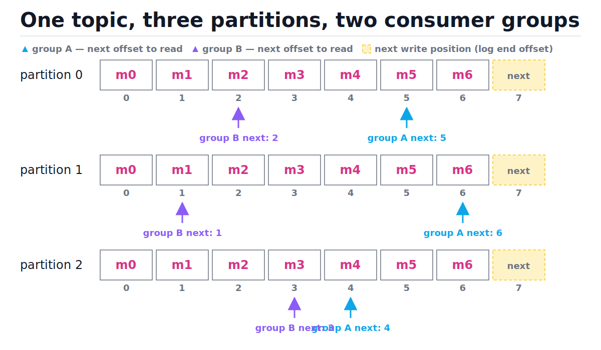
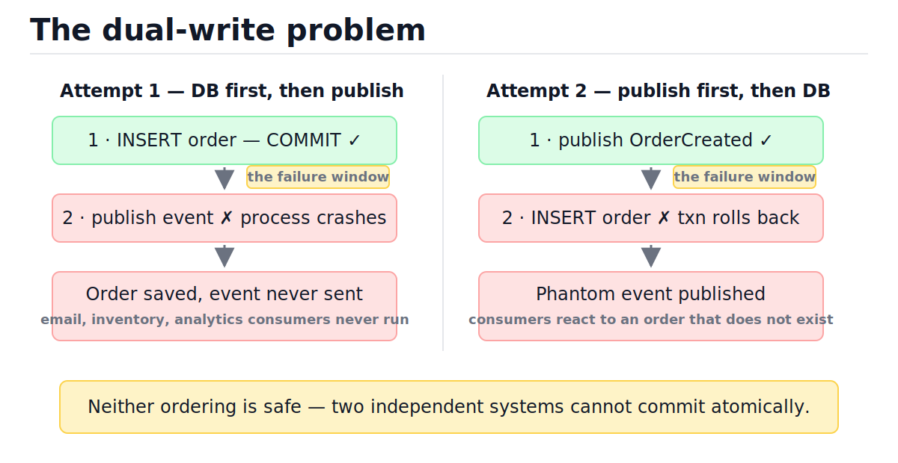
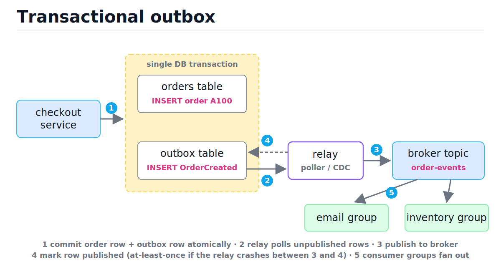

# Message Queues and Event-Driven Architecture

[toc]

> **TL;DR:** A queue decouples producers from consumers in time: the producer commits work and moves on, the consumer processes it at its own pace, and the broker absorbs bursts and survives crashes. The two broker models — work queue (RabbitMQ-style, per-message ack) and partitioned log (Kafka-style, offsets and consumer groups) — make different ordering and replay promises. "Exactly-once" is marketing; the production answer is at-least-once delivery plus idempotent consumers, and the dual-write problem is fixed with a transactional outbox.

## Vocabulary

**Message / event**

```math
m = (\text{key}, \text{payload}, \text{headers}, \text{timestamp})
```

The unit a producer hands to the broker. A *command* tells one consumer to do something ("send this email"); an *event* states a fact ("order 42 was created") that any number of consumers may react to.

**Broker**

```math
\text{producer} \rightarrow \text{broker} \rightarrow \text{consumer}
```

The middlebox that stores messages durably between produce and consume. RabbitMQ, Kafka, SQS, Pub/Sub, Redis Streams are all brokers with different storage and delivery models.

**Partition**

```math
p = \text{hash}(\text{key}) \bmod P
```

One append-only sub-log of a topic. Ordering is guaranteed only *within* a partition, so all events that must stay ordered (e.g., one user's actions) need the same key. P partitions cap consumer parallelism at P.

**Offset**

```math
\text{lag} = \text{log end offset} - \text{committed offset}
```

A consumer group's cursor into a partition: a single integer per (group, partition). Committing the offset *is* the ack. Lag is the canonical health metric.

**Consumer group**

```math
\text{partitions per worker} = \lceil P / W \rceil
```

A set of W workers that share one cursor set and split the partitions among themselves. Two different groups each get every message — that is fan-out.

**Delivery semantics**

```math
\Pr[\text{delivered}] \cdot \mathbb{E}[\text{copies}] : \quad \text{at-most-once} \le 1, \quad \text{at-least-once} \ge 1
```

The contract about duplicates and loss. At-most-once may drop, at-least-once may duplicate. Exactly-once across arbitrary systems does not exist; *effectively-once* = at-least-once + idempotent processing.

**Dead-letter queue (DLQ)**

```math
\text{retries}(m) > N \Rightarrow m \rightarrow \text{DLQ}
```

A side queue for messages that keep failing (poison pills), so one bad message cannot block or crash-loop the consumer forever.

**Backpressure**

```math
\lambda_{\text{in}} > \mu_{\text{out}} \Rightarrow \text{queue length} \rightarrow \infty
```

What happens when producers outrun consumers. Unbounded queues hide the problem until memory or disk dies; bounded queues force a decision (block, shed, or scale) at enqueue time.

## Intuition

Think of a queue as a buffer between two machines that run at different speeds and fail at different times. Without it, a checkout request must synchronously call the email service, the inventory service, and the analytics pipeline — and is only as fast and as available as the slowest of them. With a queue, checkout writes one event and returns; everything downstream catches up asynchronously. The queue buys you four things: burst absorption, failure isolation, safe retries, and fan-out to consumers you have not invented yet.

The picture below is the partitioned-log model, the one worth internalizing first. Each partition is just an array on disk; each consumer *group* keeps its own integer cursor per partition. Notice that group A and group B point at different cells of the same data — the broker never deletes a message just because one group read it.



> [!IMPORTANT]
> The consumer does not "take" a message out of a log-based broker. It reads at an offset and later commits that offset. Replay is therefore free: reset the offset and reprocess history. This is the single biggest mental-model difference from a classic work queue, where an acked message is gone.

## How it works

### The two broker models

A *work queue* broker (RabbitMQ, SQS) tracks each message individually: deliver to one available worker, wait for an ack, redeliver on timeout, delete on ack. A *partitioned log* broker (Kafka, Redis Streams, Kinesis) tracks almost nothing per message: it appends to a file and lets each consumer group manage one cursor. The per-message model is great for job distribution with per-job retry; the log model is great for event streams, fan-out, replay, and very high throughput (sequential disk I/O, batched fetches).

| Dimension | Work queue (RabbitMQ, SQS) | Partitioned log (Kafka) |
| :--- | :--- | :--- |
| Unit of state | per-message ack/visibility | one offset per (group, partition) |
| After consume | message deleted | message retained until TTL/compaction |
| Replay | no (message is gone) | yes — reset offset |
| Ordering | per queue, broken by retries | strict within a partition |
| Fan-out | extra exchanges/copies per consumer | free — add a consumer group |
| Parallelism | unbounded workers per queue | capped at partition count P |
| Per-job retry/delay | natural (redelivery, delay queues) | awkward (blocks the partition) |
| Best at | task distribution, RPC-ish jobs | event streams, pipelines, audit |

> [!TIP]
> Default heuristic: "do this work once" → work queue; "this happened, anyone may care" → log. Many systems run both: SQS for background jobs, Kafka for the event backbone.

### Producing: keys, partitions, ordering

The producer picks a partition, usually hash(key) mod P. Everything about ordering follows from this one line: two events with the same key land in the same partition in send order; events with different keys have *no* ordering relationship at all. Choosing the key is a design decision — `user_id` if a user's events must be ordered, `order_id` for an order's lifecycle.

```python
import hashlib
from typing import List

def pick_partition(key: str, num_partitions: int) -> int:
    """Stable key -> partition mapping, O(1)."""
    digest = hashlib.sha256(key.encode()).digest()
    return int.from_bytes(digest[:8], "big") % num_partitions

P = 6
# Same key always hits the same partition -> per-key ordering holds.
assert pick_partition("user:1001", P) == pick_partition("user:1001", P)

# Keys spread across partitions (load balance), O(n) to check n keys.
hits: List[int] = [pick_partition(f"user:{i}", P) for i in range(1000)]
assert len(set(hits)) == P  # every partition gets traffic
```

> [!WARNING]
> Changing the partition count changes hash(key) mod P for almost every key, which silently breaks per-key ordering during the transition. Size partitions generously up front; treat repartitioning as a migration, not a config tweak.

### Consuming: groups, offsets, lag

Each worker in a group is assigned a disjoint subset of partitions, reads batches, processes them, and periodically commits its offset. If a worker dies, the group rebalances and its partitions move to survivors — which then re-read from the last *committed* offset. That gap between "processed" and "committed" is exactly where duplicates come from.

Trace one partition with two workers and a crash. Committed offset starts at 0; messages m0..m4 are in the partition.

| Step | Worker | Action | Committed offset | Decision |
| :--- | :--- | :--- | :---: | :--- |
| 1 | W1 | reads m0, m1; processes both | 0 | batch fetch, O(1) per read |
| 2 | W1 | commits offset 2 | 2 | ack = cursor write |
| 3 | W1 | reads m2; processes it | 2 | not yet committed |
| 4 | W1 | **crashes** | 2 | m2's work already happened |
| 5 | W2 | rebalance; takes partition, reads from 2 | 2 | resumes at last commit |
| 6 | W2 | processes m2 **again**, then m3, m4 | 2 → 5 | duplicate of m2 → at-least-once |

This trace *is* at-least-once delivery: nothing was lost, m2 was processed twice. Committing *before* processing flips it to at-most-once: the crash at step 4 would lose m2 instead.

### Delivery semantics, honestly

At-most-once: ack first, process second; loses work on crash; acceptable only for data you can afford to drop (metrics samples, presence pings). At-least-once: process first, ack second; duplicates on crash or redelivery timeout; the production default. "Exactly-once" as a broker checkbox covers narrow scopes (e.g., Kafka transactions cover Kafka-to-Kafka); the moment your consumer touches an external system — a database, an email API, Stripe — you are back to at-least-once and must make the *effect* idempotent.

| Semantics | Loss | Duplicates | How | Use when |
| :--- | :---: | :---: | :--- | :--- |
| At-most-once | yes | no | ack before processing | droppable telemetry |
| At-least-once | no | yes | ack after processing | almost everything |
| Effectively-once | no | no *effect* | at-least-once + idempotent consumer | money, inventory, anything stateful |

### Idempotent consumer (the exactly-once you can actually build)

The fix for duplicates is to make redelivery harmless: give every message a stable ID, record processed IDs transactionally with the side effect, and skip IDs you have seen. The dedup store must share a transaction with the effect — checking a Redis set and then writing the database in two steps just recreates the dual-write problem one level down. Here is a runnable version using SQLite, where the `processed_messages` insert and the balance update commit atomically.

```python
import sqlite3
from typing import Dict

def make_db() -> sqlite3.Connection:
    db = sqlite3.connect(":memory:")
    db.execute("CREATE TABLE balances (account TEXT PRIMARY KEY, cents INTEGER)")
    db.execute("CREATE TABLE processed_messages (msg_id TEXT PRIMARY KEY)")
    db.execute("INSERT INTO balances VALUES ('alice', 0)")
    db.commit()
    return db

def handle_deposit(db: sqlite3.Connection, msg: Dict[str, str]) -> bool:
    """Apply a deposit event effectively-once. Returns True if applied,
    False if recognized as a duplicate. O(1) via PK lookups."""
    try:
        with db:  # one transaction: dedup insert + effect commit together
            db.execute("INSERT INTO processed_messages VALUES (?)", (msg["id"],))
            db.execute(
                "UPDATE balances SET cents = cents + ? WHERE account = ?",
                (int(msg["amount"]), msg["account"]),
            )
        return True
    except sqlite3.IntegrityError:  # PK violation -> already processed
        return False

db = make_db()
event = {"id": "evt-001", "account": "alice", "amount": "500"}

assert handle_deposit(db, event) is True          # first delivery applies
assert handle_deposit(db, event) is False         # redelivery is a no-op
assert handle_deposit(db, dict(event)) is False   # even from another worker

(balance,) = db.execute(
    "SELECT cents FROM balances WHERE account='alice'"
).fetchone()
assert balance == 500  # exactly one effect despite three deliveries
```

> [!IMPORTANT]
> Idempotency lives in the same transaction as the side effect, or it is theater. If the effect is an external API call, use the provider's idempotency key (Stripe's `Idempotency-Key` header) instead — push the dedup to whoever owns the state.

### Poison pills and dead-letter queues

A poison pill is a message that fails deterministically — malformed JSON, a payload that triggers a bug. Under at-least-once it is redelivered forever; in a log-based broker it can park the whole partition behind it. The standard fix: retry N times with backoff, then move the message to a dead-letter queue and advance. Humans inspect the DLQ; an alert on DLQ depth > 0 is one of the highest-signal alarms a queue system has.

```python
from typing import Callable, Dict, List, Tuple

def consume_with_dlq(
    messages: List[dict],
    handler: Callable[[dict], None],
    max_retries: int = 3,
) -> Tuple[List[dict], List[dict]]:
    """Process messages; after max_retries failures, dead-letter and move on."""
    done: List[dict] = []
    dlq: List[dict] = []
    attempts: Dict[str, int] = {}
    pending = list(messages)
    while pending:
        msg = pending.pop(0)
        try:
            handler(msg)
            done.append(msg)
        except Exception:
            attempts[msg["id"]] = attempts.get(msg["id"], 0) + 1
            if attempts[msg["id"]] >= max_retries:
                dlq.append(msg)          # park it, keep the lane moving
            else:
                pending.append(msg)      # redeliver (real systems: with backoff)
    return done, dlq

def handler(msg: dict) -> None:
    if msg["payload"] == "BAD":
        raise ValueError("poison pill")

msgs = [{"id": "a", "payload": "ok"},
        {"id": "b", "payload": "BAD"},
        {"id": "c", "payload": "ok"}]
done, dlq = consume_with_dlq(msgs, handler)

assert [m["id"] for m in done] == ["a", "c"]   # healthy messages flowed
assert [m["id"] for m in dlq] == ["b"]         # pill parked, not retried forever
```

### Backpressure: bounded queues and consumer lag

Queues do not create capacity; they only move the wait. If arrivals λ exceed service rate μ for long enough, the backlog grows without bound and end-to-end latency grows with it — the queue just hides the overload until disk fills or the SLA dies. Two defenses: bound the queue so producers feel the pressure immediately (block, shed, or fail fast — see [rate limiting and load shedding](./10-rate-limiting-and-load-shedding.md)), and alert on *consumer lag*, the messages-behind metric, rather than on CPU.

```python
import queue

q: "queue.Queue[int]" = queue.Queue(maxsize=2)  # bounded: backpressure built in
q.put(1)
q.put(2)
try:
    q.put(3, block=False)   # full -> producer is told NOW, not at 3 a.m.
    overflowed = False
except queue.Full:
    overflowed = True
assert overflowed
assert q.qsize() == 2
```

> [!CAUTION]
> An unbounded queue converts an overload incident into a data-loss incident: lag quietly climbs for hours, then the broker hits retention limits or disk pressure and starts deleting unread data. Alert on lag growth rate (derivative), not just absolute lag.

### The dual-write problem

The most common event-driven bug: a service must update its database *and* publish an event, but those are two systems with no shared transaction. Whatever order you pick, a crash between the two writes leaves them disagreeing — DB updated but no event (consumers never react), or event published but DB write failed (consumers react to a phantom). The figure shows both interleavings; neither ordering is safe, and retries cannot fix it because the service that knew about the work is dead.



### The transactional outbox (the fix)

Make the event part of the database transaction. Write the business row *and* an `outbox` row in one ACID commit — a single system, so it is atomic. A separate relay (a poller, or change-data-capture like Debezium tailing the WAL) reads unsent outbox rows, publishes them to the broker, and marks them sent after the broker acks. A crash at any point leaves the outbox row in place and the relay retries — you get at-least-once publish, which your idempotent consumers already handle. Walk the numbered steps in the figure.



```python
import json
import sqlite3
from typing import List, Tuple

db = sqlite3.connect(":memory:")
db.execute("CREATE TABLE orders (id TEXT PRIMARY KEY, total_cents INTEGER)")
db.execute("""CREATE TABLE outbox (
    seq INTEGER PRIMARY KEY AUTOINCREMENT,
    event_type TEXT, payload TEXT, sent INTEGER DEFAULT 0)""")

def create_order(order_id: str, total_cents: int) -> None:
    with db:  # ONE transaction: order row + outbox row, atomic
        db.execute("INSERT INTO orders VALUES (?, ?)", (order_id, total_cents))
        db.execute(
            "INSERT INTO outbox (event_type, payload) VALUES (?, ?)",
            ("OrderCreated", json.dumps({"order_id": order_id})),
        )

published: List[Tuple[str, str]] = []  # stands in for the broker

def relay_once() -> int:
    """Poll unsent rows, publish, mark sent. At-least-once: a crash between
    publish and UPDATE re-publishes — consumers dedupe."""
    rows = db.execute(
        "SELECT seq, event_type, payload FROM outbox WHERE sent = 0 ORDER BY seq"
    ).fetchall()
    for seq, etype, payload in rows:
        published.append((etype, payload))          # broker.publish(...)
        with db:
            db.execute("UPDATE outbox SET sent = 1 WHERE seq = ?", (seq,))
    return len(rows)

create_order("ord-42", 1999)
assert relay_once() == 1
assert published == [("OrderCreated", '{"order_id": "ord-42"}')]
assert relay_once() == 0  # idempotent relay pass: nothing left to send
```

> [!NOTE]
> The polling relay shown here is the simple form. Production systems often use CDC (Debezium reading the PostgreSQL WAL) instead of polling — same pattern, lower latency, no `SELECT ... WHERE sent = 0` load on the primary.

## Complexity

Broker operations are cheap by design; the costs that matter in production are batch sizes, fsync policy, and rebalance pauses, not Big-O. Still, every operation above has a precise cost, and the dedup-store growth is the one that bites.

| Operation | Best | Average | Worst | Space |
| :--- | :---: | :---: | :---: | :--- |
| `pick_partition` (hash key) | O(1) | O(1) | O(1) | O(1) |
| Append to log (produce) | O(1) amortized | O(1) | O(1) + fsync | O(m) total log |
| Read at offset (consume) | O(1) | O(1) | O(1) | O(batch) |
| Commit offset | O(1) | O(1) | O(1) | O(groups × P) |
| Idempotency check (PK lookup) | O(1) | O(log n) B-tree | O(log n) | O(n) processed IDs |
| `consume_with_dlq` (n msgs, ≤ r retries) | O(n) | O(n·r) | O(n·r) | O(n) |
| Outbox relay pass (k unsent) | O(k) | O(k) | O(k) | O(k) |
| Group rebalance | O(P) | O(P) | O(P) + stop-the-world | O(P) |

The end-to-end latency of a queued message is queueing-theory, not data-structures. For a single-server queue with utilization ρ = λ/μ, the M/M/1 expected wait is:

```math
\mathbb{E}[T] = \frac{1}{\mu - \lambda} = \frac{1}{\mu(1 - \rho)}
```

Why this matters: wait time blows up *hyperbolically* as ρ → 1. At 50% utilization a consumer that takes 10 ms per message gives ~20 ms total latency; at 90% it is ~100 ms; at 99% it is ~1 s. This is why consumer lag is the alarm metric — lag growth means ρ ≥ 1 and the expectation above has already diverged. The same math is derived in [back-of-the-envelope estimation](./02-back-of-the-envelope-estimation.md).

## In production

The clean model above meets disk, networks, and rebalances in production. Kafka's speed comes from mechanical sympathy: appends are sequential writes into the OS page cache, consumers read with `sendfile` zero-copy, and `acks=all` only means "replicated to the in-sync replicas," with actual fsync governed separately — so durability is a *replication* property, not a single-disk property. Tail latency is dominated by batching settings (`linger.ms`, `batch.size`) on the produce side and `max.poll.records` versus processing time on the consume side.

The real failure modes to know:

- **Rebalance storms.** A consumer that exceeds `max.poll.interval.ms` (slow handler, GC pause) is kicked from the group, triggering a rebalance that pauses the whole group; it rejoins, triggering another. Symptom: lag sawtooth with no throughput. Fix: smaller poll batches or move slow work out of the poll loop.
- **Hot partitions.** One celebrity key (or a null key with sticky partitioning misconfigured) sends 30% of traffic to one partition; that partition's consumer pegs while others idle. Adding workers beyond P does nothing — parallelism is capped at the partition count.
- **Retention versus lag.** A consumer down for longer than the topic's retention window loses data silently: the broker deleted segments the group never read. Alert when lag-in-time approaches retention.
- **Ordering broken by retries.** Producer retries can reorder two in-flight batches unless idempotent producing is on (`enable.idempotence=true`, the default in modern Kafka clients); on the consumer side, any per-message retry-later mechanism reorders by construction.
- **Visibility-timeout duplicates (SQS).** A handler that takes longer than the visibility timeout gets its message redelivered to another worker *while still running* — two concurrent executions of the same message. Idempotency, again.

> [!TIP]
> Dashboard minimum for any queue: consumer lag per (group, partition), lag growth rate, DLQ depth, redelivery rate, oldest-unacked age, and broker disk headroom. Lag growth rate and DLQ depth are the two that page.

The outbox relay has its own production reality: it must be a singleton or use `SELECT ... FOR UPDATE SKIP LOCKED` (PostgreSQL syntax — not available in SQLite) so multiple relay instances do not double-publish more than necessary, and the outbox table needs pruning of sent rows or it becomes the biggest table in the database. CDC-based relays (Debezium) sidestep the polling load but inherit replication-slot management — an abandoned slot prevents WAL cleanup and can fill the primary's disk. See [replication, failover, and connection pooling](../Relational-Databases-and-Data-Modeling/08-replication-failover-and-connection-pooling.md).

## Real-world example

Scenario: an e-commerce checkout. The synchronous path must stay fast — validate, charge, commit the order, return 200. Everything else (confirmation email, inventory decrement, analytics) is event-driven: checkout writes one outbox row; consumers in separate groups each see every `OrderCreated` event. The end-to-end pipeline below wires together the outbox, the broker, and two idempotent consumer groups, and proves a redelivery causes no double-effect.

```python
import json
import sqlite3
from typing import List, Tuple

# --- service database with outbox -----------------------------------------
svc = sqlite3.connect(":memory:")
svc.execute("CREATE TABLE orders (id TEXT PRIMARY KEY, cents INTEGER)")
svc.execute("""CREATE TABLE outbox (
    seq INTEGER PRIMARY KEY AUTOINCREMENT, payload TEXT, sent INTEGER DEFAULT 0)""")

def checkout(order_id: str, cents: int) -> None:
    with svc:  # atomic: order + event intent
        svc.execute("INSERT INTO orders VALUES (?, ?)", (order_id, cents))
        svc.execute("INSERT INTO outbox (payload) VALUES (?)",
                    (json.dumps({"id": "evt-" + order_id, "order": order_id}),))

# --- broker: a log both groups read at their own offset --------------------
log: List[str] = []
offsets = {"email": 0, "inventory": 0}

def relay() -> None:
    for seq, payload in svc.execute(
            "SELECT seq, payload FROM outbox WHERE sent=0 ORDER BY seq"):
        log.append(payload)
        with svc:
            svc.execute("UPDATE outbox SET sent=1 WHERE seq=?", (seq,))

# --- idempotent consumers ---------------------------------------------------
emails_sent: List[str] = []
seen_email_ids = set()
stock = {"sku-1": 10}
seen_inv_ids = set()

def run_group(group: str) -> None:
    while offsets[group] < len(log):
        evt = json.loads(log[offsets[group]])
        if group == "email" and evt["id"] not in seen_email_ids:
            seen_email_ids.add(evt["id"])
            emails_sent.append(evt["order"])
        if group == "inventory" and evt["id"] not in seen_inv_ids:
            seen_inv_ids.add(evt["id"])
            stock["sku-1"] -= 1
        offsets[group] += 1  # commit

checkout("ord-1", 4999)
relay()
run_group("email")
run_group("inventory")
assert emails_sent == ["ord-1"] and stock["sku-1"] == 9

# Simulate a crash-before-commit: inventory group replays the event.
offsets["inventory"] = 0
run_group("inventory")
assert stock["sku-1"] == 9          # idempotency: no double-decrement
assert emails_sent == ["ord-1"]     # email group unaffected — independent cursor
```

Every consumer here is O(1) per event; the dedup sets grow O(n) with events processed, which is why real systems use a TTL'd table or rely on per-key version checks instead of an ever-growing set.

## When to use / When NOT to use

Reach for a queue when the caller does not need the result to respond: notifications, indexing, thumbnails, webhooks, analytics, anything fan-out, and any producer/consumer speed mismatch. The log model additionally earns its keep when multiple teams consume the same facts or when replay (rebuild a projection, backfill a new consumer) is valuable.

Do **not** put a queue in a synchronous request-response path. If the user is waiting for the answer — auth check, price quote, search query — a queue adds a network hop, broker latency, and a polling-or-callback contraption to simulate the synchronous call you should have made. Other anti-fits: workflows needing strict global ordering across keys (a log only orders within a partition), tiny systems where a `cron` job or a database table-as-queue (`FOR UPDATE SKIP LOCKED`) is operationally simpler, and using the broker as a database (querying "current state" from a queue means you wanted a table).

> [!WARNING]
> "Add Kafka" is not an availability strategy for reads. A queue makes *writes* resilient to downstream outages; it does nothing for a request that needs an answer now. Match the tool to the dependency direction.

## Common mistakes

- **"The broker guarantees exactly-once, so I don't need idempotency"** — broker exactly-once covers broker-internal scopes; the moment your handler touches a DB or external API, redelivery duplicates the *effect* unless you dedupe transactionally.
- **"Kafka preserves ordering"** — only within one partition. Different keys, different partitions, no ordering. And changing the partition count reshuffles keys.
- **"I'll publish the event right after the DB commit"** — that is the dual-write bug. A crash between the two writes loses the event forever. Use the outbox.
- **"Unbounded queues protect us from overload"** — they defer overload into a bigger incident: lag grows silently until retention deletes unread data or disk fills.
- **"More consumers = more throughput"** — only up to the partition count. Worker P+1 in a group sits idle.
- **"Retry forever; it'll succeed eventually"** — deterministic failures (poison pills) never succeed and can block the partition. Cap retries, dead-letter, alert.
- **"Acking early is fine, the handler almost never crashes"** — ack-before-process is at-most-once by definition; "almost never" times millions of messages is "regularly."
- **"We'll dedupe with a Redis SET check, then write the DB"** — check-then-act across two systems is a new dual-write. The dedup record must commit with the effect.

## Interview questions and answers

**1. Why add a message queue between two services at all?**
**Answer:** Four reasons: absorb bursts so a traffic spike becomes consumer lag instead of dropped requests; isolate failures so a dead downstream doesn't fail the upstream write; retry safely because the message persists until acked; and fan out so new consumers can subscribe without touching the producer. The trade is added latency and eventual consistency, so it only fits work the caller isn't waiting on.

**2. Compare a work queue like RabbitMQ with a log like Kafka.**
**Answer:** RabbitMQ tracks each message: deliver to one worker, ack, delete — great for job distribution with per-job retries, but no replay and ordering breaks under redelivery. Kafka appends to partitions and consumers track offsets: replay is free, fan-out is free, ordering holds per partition, throughput is excellent — but parallelism is capped by partition count and per-message retry is awkward. Jobs → queue; event stream multiple teams consume → log.

**3. Explain at-most-once vs at-least-once vs exactly-once.**
**Answer:** It's about where the ack sits relative to processing. Ack first: a crash loses the message — at-most-once. Process first: a crash redelivers — at-least-once, the production default. True exactly-once across arbitrary systems doesn't exist; you build *effectively-once* by accepting at-least-once delivery and making the consumer idempotent, so duplicates have no second effect.

**4. How would you implement an idempotent consumer?**
**Answer:** Every message carries a stable ID. In the same database transaction as the side effect, insert that ID into a processed-IDs table with a primary key constraint; a duplicate hits the constraint and I skip it. The key point is the same-transaction part — checking one store and writing another just recreates the dual-write problem. For external APIs, pass an idempotency key and let the provider dedupe.

**5. What is the dual-write problem and how does the outbox pattern fix it?**
**Answer:** Dual write is updating the database and publishing to the broker as two separate operations with no shared transaction — a crash between them leaves the two permanently inconsistent in either order. The outbox fixes it by writing the event into an outbox *table* in the same DB transaction as the business row — atomic because it's one system — then a relay or CDC publishes outbox rows to the broker with retries. That gives at-least-once publish, which idempotent consumers absorb.

**6. What's a poison pill and how do you handle it?**
**Answer:** A message that fails deterministically every time — bad payload, handler bug. Under at-least-once it redelivers forever, and in a log it can block the partition behind it. Handle it with capped retries plus exponential backoff, then move it to a dead-letter queue and advance the offset. Alert on DLQ depth and have humans inspect — sometimes it's one bad message, sometimes it's the first sign of a schema break.

**7. Consumer lag is growing steadily. Walk me through your diagnosis.**
**Answer:** Lag growing means arrival rate exceeds processing rate, so first I check which side changed: producer throughput spike or consumer slowdown. On the consumer side I look for rebalance loops (handlers exceeding the poll interval), one hot partition pegging one worker, or a slow downstream dependency inside the handler. Fixes in order: speed up the handler (batch its DB writes, move slow work out), add workers up to the partition count, then add partitions — knowing that reshuffles key ordering.

**8. When would you NOT introduce a queue?**
**Answer:** When the caller needs the answer in the response — auth, pricing, search. Queueing a synchronous dependency just adds a broker round-trip plus a polling or callback mechanism to fake the synchronous call. Also when global ordering across keys is required, or when the scale is small enough that a transactional table with `FOR UPDATE SKIP LOCKED` does the job with one less system to operate.

**9. How do offsets and consumer groups give you fan-out?**
**Answer:** The broker never deletes a message because someone read it; each group just keeps its own cursor per partition. So the email group and the inventory group both read every event, at independent paces, and committing one group's offset is invisible to the other. Adding a new consumer team is creating a new group and optionally rewinding its offset to replay history — no producer change at all.

## Practice path

1. Run the partitioning snippet; change P from 6 to 7 and print which of 20 user keys change partitions — feel the ordering-break risk.
2. Re-derive the at-least-once trace table by hand for the ack-before-process order and confirm it becomes at-most-once.
3. Extend `handle_deposit` with a second event type (`withdraw`) and prove with asserts that a duplicated withdraw doesn't double-debit.
4. Break the idempotent consumer on purpose: move the `processed_messages` insert outside the `with db:` block and write a test exposing the lost-dedup window.
5. Add exponential backoff and a max-age to `consume_with_dlq`; assert a pill is dead-lettered after exactly N attempts.
6. Implement the outbox relay with two concurrent relay instances over the same table and observe double-publish; then reason through how `SKIP LOCKED` (PostgreSQL) would reduce it.
7. Compute M/M/1 wait times for ρ = 0.5, 0.9, 0.99 with μ = 100 msg/s and plot lag growth for λ = 110 — internalize why lag growth rate pages.
8. Design exercise: take the news-feed fan-out in [case study: news feed and chat](./15-case-study-news-feed-and-chat.md) and decide partition keys, group layout, and DLQ policy.

## Copyable takeaways

- A queue buys burst absorption, failure isolation, safe retries, and fan-out — at the price of latency and eventual consistency. Never on the synchronous path.
- Work queue = per-message ack, message gone after consume. Log = offsets per consumer group, replay free, ordering per partition only, parallelism capped at P.
- At-least-once is the production default. Exactly-once = at-least-once + idempotent consumer, with the dedup record committed in the *same transaction* as the effect.
- Poison pills: capped retries → dead-letter queue → alert. Never retry forever.
- Backpressure: bound the queue, alert on consumer lag *growth rate*; M/M/1 wait 1/(μ−λ) diverges as utilization → 1.
- Dual write (DB + broker, two ops) is always broken under crashes. Transactional outbox: event row commits with the business row; a relay/CDC publishes at-least-once.
- More workers than partitions do nothing; changing partition count reshuffles key ordering.

## Sources

- Kleppmann, *Designing Data-Intensive Applications*, ch. 11 (Stream Processing) — log-based brokers, delivery semantics, dual writes and CDC.
- Kafka official documentation — design section (log, consumer groups, semantics): https://kafka.apache.org/documentation/#design
- AWS Builders' Library, "Avoiding insurmountable queue backlogs": https://aws.amazon.com/builders-library/avoiding-insurmountable-queue-backlogs/
- Microservices.io, "Pattern: Transactional outbox": https://microservices.io/patterns/data/transactional-outbox.html
- Debezium documentation (CDC, outbox event router): https://debezium.io/documentation/
- RabbitMQ documentation — reliability and acknowledgements: https://www.rabbitmq.com/docs/reliability

## Related

- [Consistency models, CAP, and quorums](./07-consistency-models-cap-and-quorums.md) — the eventual consistency a queue introduces.
- [Rate limiting and load shedding](./10-rate-limiting-and-load-shedding.md) — what bounded queues do at the front door.
- [Transactions, ACID, and isolation levels](../Relational-Databases-and-Data-Modeling/06-transactions-acid-and-isolation-levels.md) — why the outbox commit is atomic.
- [Replication, failover, and connection pooling](../Relational-Databases-and-Data-Modeling/08-replication-failover-and-connection-pooling.md) — CDC and WAL mechanics behind log-based relays.
- [Stacks and queues](../Data-Structures-and-Algorithms/04-stacks-and-queues.md) — the FIFO structure underneath it all.
- [Case study: news feed and chat](./15-case-study-news-feed-and-chat.md) — fan-out via queues in a full design.
