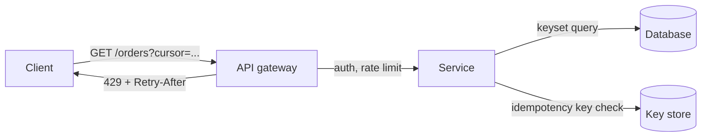
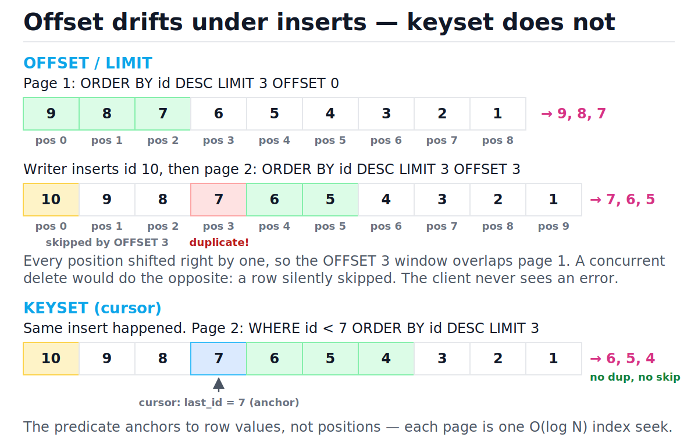
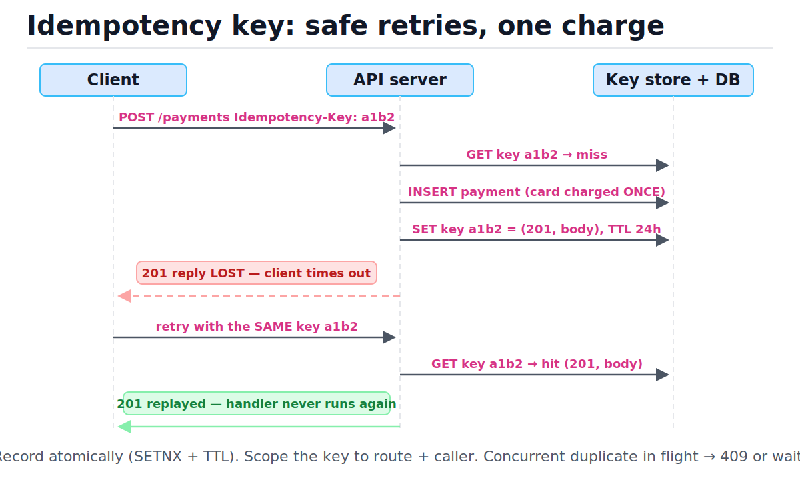

# API Design

[toc]

> **TL;DR:** An API is a contract you cannot break once clients depend on it, so design it for evolution: plural-noun resources, correct status codes, keyset pagination instead of offset, idempotency keys on every unsafe write, and additive-only changes. Choose REST for public CRUD, gRPC for internal service-to-service and streaming, GraphQL when many client shapes hit one aggregation layer.

## Vocabulary

**Resource**

```math
\text{URI} \rightarrow \text{noun},\quad \text{HTTP verb} \rightarrow \text{action}
```

The thing a URL names. The path identifies *what*; the HTTP method says *what to do to it*. `GET /orders/42`, never `GET /getOrder?id=42`.

**Safe method**

```math
\text{GET}(s) \Rightarrow s' = s
```

A method that never changes server state: GET, HEAD, OPTIONS. Caches and crawlers rely on this guarantee.

**Idempotent method**

```math
f(f(x)) = f(x)
```

A method where repeating the request leaves the same final state as doing it once: PUT, DELETE, GET. POST is not idempotent by default — that is what idempotency keys fix.

**Offset pagination**

```math
\text{cost per page} = O(\text{offset} + \text{limit})
```

`LIMIT k OFFSET n` — the database walks and discards the first n rows before returning k. Deep pages get slower and drift under concurrent writes.

**Keyset (cursor) pagination**

```math
\text{cost per page} = O(\log n + \text{limit})
```

`WHERE sort_key < last_seen LIMIT k` — one index seek to the cursor position, then read k rows. Constant work per page regardless of depth.

**Idempotency key**

```math
\text{key} \rightarrow (\text{status}, \text{body}),\ \text{TTL} \approx 24\text{h}
```

A client-generated unique token sent with an unsafe request. The server stores the first response under the key and replays it on retries, so a network timeout never causes a double charge.

**Backpressure headers**

```math
\text{Retry-After} = \Delta t \text{ seconds}
```

`429 Too Many Requests` plus `Retry-After` and `RateLimit-*` headers tell well-behaved clients exactly when to come back instead of hammering the server.

## Intuition

Think of an API as a filing cabinet, not a vending machine of verbs. URLs name folders and documents (nouns); the HTTP method is your hand: GET reads, PUT replaces, DELETE removes, POST adds a new document. Once you commit to that grammar, every endpoint becomes guessable and every middlebox (cache, proxy, gateway) knows what is safe to retry or cache without reading your docs.

The hardest part of API design is not the happy path — it is the contract under concurrency, retries, and time. Pagination must survive rows being inserted mid-scroll. Writes must survive a client retrying after a timeout. The schema must survive version N clients talking to version N+3 servers. Everything below is about making those three things true.



## How it works

### Resources and verbs

Paths are plural nouns; verbs live in the HTTP method. Nest one level deep at most — `GET /users/7/orders` is fine, three levels deep is a smell because it hard-codes a hierarchy your data model will outgrow. The rare action that genuinely is not CRUD (cancel, retry, search) becomes a sub-resource POST: `POST /orders/42/cancellation`.

```text
GET    /orders            list orders
POST   /orders            create an order
GET    /orders/42         fetch one
PUT    /orders/42         full replace
PATCH  /orders/42         partial update
DELETE /orders/42         delete
POST   /orders/42/cancellation   non-CRUD action as sub-resource
```

> [!WARNING]
> `GET /orders/delete?id=42` is a real production incident pattern: a prefetching browser extension or link-preview bot follows the GET and deletes data. State changes must never ride on safe methods.

### The status codes that matter

You do not need all 60+ codes — you need about ten, used consistently. The client branches on these, so picking 200-with-error-body instead of a real 4xx breaks every generic retry and monitoring layer between you and the caller.

| Code | Meaning | When |
| :--- | :--- | :--- |
| 200 | OK | Successful GET/PUT/PATCH with a body |
| 201 | Created | Successful POST; include `Location` header |
| 204 | No Content | Successful DELETE or body-less update |
| 400 | Bad Request | Malformed input — client must change the request |
| 401 | Unauthorized | Missing/invalid credentials |
| 403 | Forbidden | Authenticated but not allowed |
| 404 | Not Found | Resource absent (also use for hiding existence) |
| 409 | Conflict | Version conflict, duplicate unique key |
| 422 | Unprocessable | Syntactically valid, semantically wrong |
| 429 | Too Many Requests | Rate limited — send `Retry-After` |
| 500 | Internal error | Server bug — safe default for unexpected failure |
| 503 | Unavailable | Overload/maintenance — retryable, send `Retry-After` |

> [!IMPORTANT]
> 4xx means "the client must change something before retrying"; 5xx means "retry later may succeed." Automated retry policies key off this split — misclassifying a validation error as 500 makes clients retry forever.

### Pagination: offset vs keyset

This is the load-bearing section. `LIMIT 20 OFFSET 100000` forces the database to walk and throw away 100,000 rows — O(offset + limit) per page, so page latency grows linearly with depth. Worse, offsets are positions, not values: if a row is inserted before your offset between two page fetches, every position shifts and page 2 re-serves a row you already saw (or skips one on delete). Keyset pagination instead remembers the *value* of the last row's sort key and asks for rows beyond it: one index seek, O(log n + limit), and immune to drift.

Look at the figure: the amber insert shifts every offset position, producing the red duplicate on page 2; the keyset query below it continues from `id < 85` and is untouched.



The demo below shows the drift concretely, then implements keyset pagination with an opaque cursor. The cursor base64-encodes the sort key so clients treat it as a token, and the composite `(created_at, id)` key breaks ties so equal timestamps never skip rows.

```python
import base64
import json
import sqlite3
from typing import Optional

conn = sqlite3.connect(":memory:")
conn.execute("CREATE TABLE orders (id INTEGER PRIMARY KEY, created_at TEXT)")
for i in range(1, 10):  # ids 1..9
    conn.execute("INSERT INTO orders VALUES (?, ?)", (i, f"2026-06-{i:02d}"))

# --- offset drift demo: newest first, 3 per page ---
page1 = [r[0] for r in conn.execute(
    "SELECT id FROM orders ORDER BY id DESC LIMIT 3 OFFSET 0")]
assert page1 == [9, 8, 7]

conn.execute("INSERT INTO orders VALUES (10, '2026-06-10')")  # concurrent insert

page2_offset = [r[0] for r in conn.execute(
    "SELECT id FROM orders ORDER BY id DESC LIMIT 3 OFFSET 3")]
assert page2_offset == [7, 6, 5]      # id 7 served AGAIN: drift
assert page1[-1] in page2_offset      # duplicate across pages

# --- keyset pagination: stable under the same insert ---
def encode_cursor(last_id: int) -> str:
    return base64.urlsafe_b64encode(json.dumps({"id": last_id}).encode()).decode()

def decode_cursor(cursor: str) -> int:
    return json.loads(base64.urlsafe_b64decode(cursor.encode()))["id"]

def list_orders(cursor: Optional[str], limit: int = 3) -> dict:
    if cursor is None:
        rows = conn.execute(
            "SELECT id FROM orders ORDER BY id DESC LIMIT ?", (limit,)).fetchall()
    else:
        rows = conn.execute(
            "SELECT id FROM orders WHERE id < ? ORDER BY id DESC LIMIT ?",
            (decode_cursor(cursor), limit)).fetchall()
    ids = [r[0] for r in rows]
    next_cursor = encode_cursor(ids[-1]) if len(ids) == limit else None
    return {"ids": ids, "next_cursor": next_cursor}

p1 = list_orders(None)                # client fetched page 1 BEFORE the insert
p1 = {"ids": [9, 8, 7], "next_cursor": encode_cursor(7)}
p2 = list_orders(p1["next_cursor"])   # fetched AFTER the insert
assert p2["ids"] == [6, 5, 4]         # no duplicate, no skip
assert 7 not in p2["ids"]
p3 = list_orders(p2["next_cursor"])
assert p3["ids"] == [3, 2, 1]
assert list_orders(p3["next_cursor"])["next_cursor"] is None
print("pagination demo: all asserts passed")
```

| Step | Action | Offset result | Keyset result | Decision |
| :--- | :--- | :--- | :--- | :--- |
| 1 | Fetch page 1 (limit 3) | ids 9, 8, 7 | ids 9, 8, 7; cursor=7 | identical so far |
| 2 | Concurrent INSERT id=10 | positions all shift right | cursor value unaffected | drift begins |
| 3 | Fetch page 2 | OFFSET 3 → ids 7, 6, 5 (7 duplicated) | WHERE id < 7 → ids 6, 5, 4 | keyset correct |
| 4 | Deep page (offset 10⁶) | walks 10⁶ rows: O(offset) | one index seek: O(log n) | keyset wins again |

> [!TIP]
> Production idiom: return `next_cursor` in the body (or an RFC 8288 `Link: <...>; rel="next"` header) and document the cursor as opaque. Clients that parse cursors will break when you change the encoding — opacity is the contract. Offset is still fine for small, admin-only, rarely-written tables where "jump to page 47" is a real requirement.

### Filtering and sorting conventions

Filters and sort orders are query parameters on the collection, never new endpoints. Keep the grammar small and predictable: exact match as `field=value`, ranges with suffix operators, multi-field sort as a comma list with `-` for descending. Whatever you pick, every sort field must be backed by an index or keyset pagination cannot use it.

```text
GET /orders?status=shipped&created_after=2026-01-01
GET /orders?sort=-created_at,id          # newest first, id tiebreak
GET /orders?fields=id,status,total      # sparse fieldsets to cut payload
```

### Idempotency and retries

GET/PUT/DELETE are naturally retry-safe; POST is not — retrying a `POST /payments` after a timeout can charge a card twice, because the client cannot tell "request lost" from "response lost." The fix: the client generates a UUID, sends it as `Idempotency-Key`, and the server atomically records the key before executing, then stores the response under it. A retry with the same key replays the stored response instead of re-executing. Stripe's API popularized this exact design.

| Verb | Safe | Idempotent | Retry policy |
| :--- | :---: | :---: | :--- |
| GET / HEAD | yes | yes | retry freely |
| PUT | no | yes | retry freely |
| DELETE | no | yes | retry freely |
| PATCH | no | no* | safe only if the patch is absolute, not relative |
| POST | no | no | retry **only** with an idempotency key |

Trace the figure: attempt 1 misses the key store, executes, and records the response; the retry hits the store and replays the same `201` — the card is charged exactly once.



The middleware sketch below is runnable. The critical detail is the atomic insert-or-fail (`INSERT ... ON CONFLICT`-style) claiming the key *before* the handler runs, which also closes the race where two retries arrive concurrently.

```python
import json
import sqlite3
from typing import Callable

kv = sqlite3.connect(":memory:")
kv.execute("""CREATE TABLE idem (
    key TEXT PRIMARY KEY, status INTEGER, body TEXT)""")

charges_executed = []

def handler(payload: dict) -> tuple:
    """The real business logic: charges the card."""
    charges_executed.append(payload["amount"])
    return 201, {"payment_id": "pay_7", "amount": payload["amount"]}

def with_idempotency(key: str, payload: dict,
                     fn: Callable[[dict], tuple]) -> tuple:
    # 1. Try to claim the key atomically. status NULL marks "in flight".
    try:
        kv.execute("INSERT INTO idem (key) VALUES (?)", (key,))
    except sqlite3.IntegrityError:
        row = kv.execute(
            "SELECT status, body FROM idem WHERE key = ?", (key,)).fetchone()
        if row[0] is None:
            return 409, {"error": "request with this key still in flight"}
        return row[0], json.loads(row[1])          # replay stored response
    # 2. First claimer executes and records the result.
    status, body = fn(payload)
    kv.execute("UPDATE idem SET status = ?, body = ? WHERE key = ?",
               (status, json.dumps(body), key))
    return status, body

r1 = with_idempotency("K1", {"amount": 500}, handler)
r2 = with_idempotency("K1", {"amount": 500}, handler)   # timeout retry
assert r1 == (201, {"payment_id": "pay_7", "amount": 500})
assert r2 == r1                       # identical replayed response
assert charges_executed == [500]      # charged exactly ONCE
r3 = with_idempotency("K2", {"amount": 900}, handler)   # new key = new charge
assert charges_executed == [500, 900]
assert r3[0] == 201
print("idempotency demo: all asserts passed")
```

> [!CAUTION]
> Store keys with a TTL (24h is the common choice) and scope them per user/API key — a global namespace lets one tenant replay another's responses. And record the *request hash* alongside the key so a reused key with a different body returns 422 instead of silently replaying the wrong response.

### Versioning

You have three real options. URL versioning (`/v2/orders`) is visible, cache-friendly, and trivially routable — it is the pragmatic default for public APIs. Header versioning (`Accept: application/vnd.api+json; version=2`) keeps URLs stable but hides the version from logs, curl users, and caches. The third option is the one that matters most: **additive-only evolution** — never remove or rename a field, never change a type, only add optional fields — which postpones v2 for years.

| Strategy | Example | Pros | Cons |
| :--- | :--- | :--- | :--- |
| URL path | `/v2/orders` | Visible, cacheable, easy routing | "Big bang" migrations, URL churn |
| Header | `Accept: ...;version=2` | Clean URLs | Invisible in logs/browsers, cache keys need `Vary` |
| Additive-only | add `total_cents`, keep `total` | No client breakage, no migration | Schema accretes; needs discipline + deprecation policy |

> [!IMPORTANT]
> Recommendation: design for additive-only evolution from day one (clients must ignore unknown fields — enforce this in client SDK tests), and keep a coarse `/v1` in the URL as an escape hatch you hope never to use. Breaking changes get a documented deprecation window with `Deprecation` and `Sunset` headers, not a surprise.

### Realtime: long polling vs SSE vs WebSockets

Plain request/response cannot push. Three escalating options: long polling holds the request open until data arrives (works everywhere, costs a held connection per client and a reconnect per message); Server-Sent Events stream server→client over one HTTP connection with built-in auto-reconnect and `Last-Event-ID` resume; WebSockets upgrade to a full-duplex TCP-framed channel for bidirectional chat-class traffic.

| | Long polling | SSE | WebSockets |
| :--- | :--- | :--- | :--- |
| Direction | server→client (emulated) | server→client | bidirectional |
| Transport | plain HTTP | plain HTTP (`text/event-stream`) | HTTP upgrade → own framing |
| Proxy/LB friendliness | best | good (HTTP/2 fixes the 6-conn limit) | needs sticky/upgrade-aware LBs |
| Reconnect/resume | manual | built-in (`Last-Event-ID`) | manual |
| Use when | legacy clients, infrequent events | feeds, notifications, LLM token streams | chat, games, collaborative editing |

> [!TIP]
> Default to SSE for one-way streams — it is the simplest thing that scales and is what most LLM APIs use for token streaming. Reach for WebSockets only when the *client* must also push at high frequency.

### REST vs gRPC vs GraphQL

These solve different problems; "which is best" is the wrong question. REST over JSON is the lingua franca for public APIs: human-readable, cacheable by every CDN, debuggable with curl. gRPC is for **internal service-to-service** calls: protobuf contracts are compiled and type-checked in every language, binary encoding is roughly 5–10× smaller than JSON, HTTP/2 multiplexing plus four streaming modes (unary, server-, client-, bidirectional-streaming) make it the default inside a microservice mesh. GraphQL is a **client-shaped aggregation layer**: one endpoint, the client declares exactly the fields it needs, killing over-fetch and the N-round-trip problem for screen-shaped data — at the cost of server-side query-cost analysis, caching pain, and a resolver N+1 problem you must engineer around.

| | REST | gRPC | GraphQL |
| :--- | :--- | :--- | :--- |
| Contract | OpenAPI (optional) | protobuf (enforced, codegen) | SDL schema (enforced) |
| Encoding | JSON (text) | protobuf (binary) | JSON (text) |
| Transport | HTTP/1.1 or 2 | HTTP/2 required | HTTP POST (usually) |
| Streaming | SSE bolt-on | first-class, 4 modes | subscriptions (WebSocket bolt-on) |
| HTTP caching | excellent | none (POST-like semantics) | poor (one URL) |
| Browser support | native | needs grpc-web proxy | native |
| Best at | public CRUD APIs | internal microservices, streaming | mobile/web BFF aggregation |

> [!NOTE]
> Honest production pattern: REST at the public edge, gRPC between services, GraphQL only if you have many client types hammering many backend services and a team to own the gateway. Adding GraphQL to a two-service backend is over-engineering.

### Rate-limit headers and Retry-After

When you shed load, tell the client *how to behave*: respond `429` with `Retry-After: <seconds>` and the draft-standard `RateLimit-Limit` / `RateLimit-Remaining` / `RateLimit-Reset` headers so well-built clients back off precisely instead of retry-storming you. `503 + Retry-After` is the same contract for overload that is not per-client. The algorithms behind the headers (token bucket, sliding window) live in [Rate Limiting and Load Shedding](./10-rate-limiting-and-load-shedding.md).

```text
HTTP/1.1 429 Too Many Requests
Retry-After: 30
RateLimit-Limit: 100
RateLimit-Remaining: 0
RateLimit-Reset: 30
```

## Complexity

Every cost in this note traces back to pagination and the key store. The table covers each operation shown above; n is total rows, k is page size.

| Operation | Best | Average | Worst | Space |
| :--- | :---: | :---: | :---: | :---: |
| Offset page fetch (offset m) | O(k) at m=0 | O(m + k) | O(n) at last page | O(k) |
| Keyset page fetch (indexed) | O(log n + k) | O(log n + k) | O(log n + k) | O(k) |
| Full scroll, offset, n/k pages | — | O(n²/k) | O(n²/k) | O(k) |
| Full scroll, keyset | — | O(n) | O(n) | O(k) |
| Idempotency key lookup (hash/PK) | O(1) | O(1) | O(log n) (B-tree PK) | O(keys) |
| Cursor encode/decode (base64) | O(c) | O(c) | O(c) | O(c) |

The painful bound is the full offset scroll. Each page p costs the skip plus the read, and summing over all n/k pages:

```math
\sum_{p=0}^{n/k - 1} (pk + k) = k \cdot \frac{(n/k)(n/k-1)}{2} + n = O\!\left(\frac{n^2}{k}\right)
```

Walking a 10-million-row table 100 rows at a time costs on the order of 5 × 10¹¹ row visits with offset, versus 10⁷ with keyset. That is why every export/sync/scraper endpoint must be keyset: the database does the quadratic work even though each individual response looks like "just 100 rows." Keyset replaces the O(p·k) skip with one O(log n) B-tree descent (see [Indexes and Query Performance](../Relational-Databases-and-Data-Modeling/05-indexes-and-query-performance.md)).

## In production

The contract is only half the job; the other half is what happens at the edge. Realities that bite:

- **Timeouts compose.** A client 10s timeout in front of a server doing 12s of work guarantees retries of in-flight requests — which is why idempotency keys are not optional for payments-class POSTs. Set server deadline < client timeout, and propagate deadlines (gRPC does this natively).
- **Keyset needs the index.** `WHERE (created_at, id) < (?, ?) ORDER BY created_at DESC, id DESC` is only O(log n) with a composite index matching the sort. SQLite and PostgreSQL support row-value comparison; emulate with `(a < x) OR (a = x AND b < y)` elsewhere — note that the row-value form is what lets the planner do a single range seek.
- **Idempotency store placement.** Redis with TTL is the common choice; it must be the *same* store across all replicas of the service, and the claim must be atomic (`SET key NX`). A per-process dict silently fails the moment you run two pods.
- **Pagination tokens leak schema.** Sign or encrypt cursors if the sort key is sensitive (e.g., internal sequence numbers reveal volume). Base64 is encoding, not security.
- **Gateways own the cross-cutting parts.** Auth, rate limiting, request IDs, and `Retry-After` emission belong in the gateway/ingress layer (see [Ingress, Gateway API and Service Mesh](../Infrastructure-DevOps/Kubernetes/6-ingress-gateway-api-and-service-mesh.md)), not copy-pasted into every service.
- **Caching is a status-code contract.** Only safe methods get cached; `Cache-Control` semantics are RFC 7234. A POST-everything API (or GraphQL) forfeits the entire CDN tier described in [DNS, Load Balancers and CDNs](./03-dns-load-balancers-and-cdns.md).

> [!WARNING]
> gRPC's HTTP/2 multiplexing breaks naive L4 load balancing: one long-lived connection pins all requests to one backend. Use an L7/gRPC-aware balancer or client-side load balancing, or one hot pod melts while nine idle.

## Real-world example

You run an e-commerce orders API. A partner integrates a nightly sync that scrolls all orders, and their retry logic re-sends failed `POST /refunds`. The design below survives both: keyset scroll for the sync, idempotency keys for the refunds — combined into one tiny in-process "API" you can run.

```python
import base64
import json
import sqlite3
from typing import Callable, Optional, Tuple

db = sqlite3.connect(":memory:")
db.execute("CREATE TABLE orders (id INTEGER PRIMARY KEY, total INTEGER)")
db.execute("CREATE TABLE refunds (order_id INTEGER, amount INTEGER)")
db.execute("CREATE TABLE idem (key TEXT PRIMARY KEY, status INTEGER, body TEXT)")
db.executemany("INSERT INTO orders VALUES (?, ?)",
               [(i, i * 100) for i in range(1, 8)])

def get_orders(cursor: Optional[str], limit: int = 3) -> Tuple[int, dict]:
    """GET /orders?cursor=...&limit=...  — keyset, newest first."""
    if limit > 100:
        return 400, {"error": "limit must be <= 100"}
    if cursor is None:
        rows = db.execute("SELECT id, total FROM orders "
                          "ORDER BY id DESC LIMIT ?", (limit,)).fetchall()
    else:
        last = json.loads(base64.urlsafe_b64decode(cursor))["id"]
        rows = db.execute("SELECT id, total FROM orders WHERE id < ? "
                          "ORDER BY id DESC LIMIT ?", (last, limit)).fetchall()
    nxt = None
    if len(rows) == limit:
        nxt = base64.urlsafe_b64encode(
            json.dumps({"id": rows[-1][0]}).encode()).decode()
    return 200, {"data": [{"id": r[0], "total": r[1]} for r in rows],
                 "next_cursor": nxt}

def post_refund(idem_key: str, order_id: int,
                amount: int) -> Tuple[int, dict]:
    """POST /refunds with Idempotency-Key — at-most-once execution."""
    try:
        db.execute("INSERT INTO idem (key) VALUES (?)", (idem_key,))
    except sqlite3.IntegrityError:
        row = db.execute("SELECT status, body FROM idem WHERE key = ?",
                         (idem_key,)).fetchone()
        return row[0], json.loads(row[1])
    db.execute("INSERT INTO refunds VALUES (?, ?)", (order_id, amount))
    status, body = 201, {"refunded": amount, "order_id": order_id}
    db.execute("UPDATE idem SET status = ?, body = ? WHERE key = ?",
               (status, json.dumps(body), idem_key))
    return status, body

# Partner's nightly sync: scroll everything, 3 per page.
seen, cur = [], None
while True:
    status, page = get_orders(cur)
    assert status == 200
    seen.extend(o["id"] for o in page["data"])
    cur = page["next_cursor"]
    if cur is None:
        break
assert seen == [7, 6, 5, 4, 3, 2, 1]          # complete, ordered, no dupes
assert get_orders(None, limit=500)[0] == 400  # limit cap enforced

# Partner's flaky refund: sent 3 times, executed once.
for _ in range(3):
    status, body = post_refund("refund-abc", order_id=7, amount=700)
    assert (status, body) == (201, {"refunded": 700, "order_id": 7})
assert db.execute("SELECT COUNT(*) FROM refunds").fetchone()[0] == 1
print("real-world example: all asserts passed")
```

## When to use / When NOT to use

Choosing the API style and the pagination/versioning machinery is a fit decision, not a fashion one. Quick rules:

- **Keyset pagination** — any list that grows unboundedly or is scrolled deep (feeds, exports, sync). **Not** for small admin tables where random page jumps matter.
- **Offset pagination** — internal dashboards over thousands (not millions) of rows with a "page 12 of 40" UI. **Not** for anything a machine scrolls end-to-end.
- **Idempotency keys** — every POST with side effects worth money or duplication pain. **Not** needed for naturally idempotent PUT/DELETE.
- **gRPC** — internal east-west traffic, polyglot teams, streaming. **Not** for public browser-facing APIs without a grpc-web proxy budget.
- **GraphQL** — many client shapes over many services with a dedicated platform team. **Not** as the first API of a small backend.
- **WebSockets** — true bidirectional realtime. **Not** when SSE one-way push suffices.

## Common mistakes

- **"Verbs in URLs are fine if documented"** — they break caching, retry semantics, and every engineer's intuition; the method *is* the verb.
- **"Offset pagination is correct, just slow"** — it is also *wrong* under concurrent writes: inserts and deletes shift positions, producing duplicates and skips between pages, as the demo proves.
- **"POST retries are the client's problem"** — the client cannot distinguish lost-request from lost-response; only a server-side idempotency key makes retries safe.
- **"We'll add /v2 when we need breaking changes"** — by then you have a years-long dual-maintenance window; additive-only evolution avoids ever needing it.
- **"200 with `{\"error\": ...}` is simpler"** — it blinds every cache, retry policy, alert, and SDK between you and the user. Status codes are the machine-readable channel.
- **"Cursors are just offsets in base64"** — if the token still encodes a position rather than a sort-key value, you kept all of offset's drift and cost and only added obfuscation.
- **"DELETE returning 404 on retry breaks idempotency"** — idempotency is about server *state*, not response equality; the row being gone both times is the idempotent outcome (returning 204 on both is a fine convention too).

## Interview questions and answers

**1. Why does offset pagination return duplicate rows under concurrent inserts?**
**Answer:** Offset addresses rows by position, and positions are not stable. If page 1 returns positions 0–2 and someone inserts a row that sorts before position 3, every old row shifts right by one, so page 2 at offset 3 starts on the row you already served. Keyset fixes it by addressing rows by value — "give me rows after the last value I saw" — and values don't move when other rows are inserted.

**2. What's the cost difference between offset and keyset for deep pages?**
**Answer:** Offset is O(offset + limit) per page because the engine must materialize and discard the skipped rows; the last page of an n-row table costs O(n), and a full scroll is O(n²/k). Keyset is O(log n + limit) per page — one index seek to the cursor value, then a sequential read — so a full scroll is O(n).

**3. How do idempotency keys make POST safe to retry?**
**Answer:** The client attaches a unique key to the request. The server atomically claims the key before executing — insert-or-fail on a unique constraint — runs the handler once, and stores the response under the key. Any retry with the same key finds the record and replays the stored response without re-executing. The atomic claim also handles two concurrent retries: one wins, the other either waits or gets a 409 while it's in flight.

**4. PUT is idempotent and POST isn't — why, exactly?**
**Answer:** PUT carries the complete target state: applying "set resource to X" twice leaves the same state as once. POST means "create a subordinate" or "do this action," so applying it twice creates two resources or runs the action twice. Idempotency is a property of the *state transition*, not the response — that's also why DELETE returning 404 on the second call is still idempotent.

**5. URL versioning vs header versioning vs additive evolution — what do you recommend?**
**Answer:** Additive-only evolution as the primary strategy: only add optional fields, never remove or retype, and require clients to ignore unknown fields. Keep a coarse `/v1` in the path as an escape hatch because it's visible in logs and trivially routable. Header versioning I'd avoid for public APIs — it's invisible to curl, logs, and caches unless you get `Vary` exactly right.

**6. When would you pick gRPC over REST, and what breaks when you do?**
**Answer:** Internal service-to-service traffic: protobuf gives compile-time contracts and codegen in every language, binary encoding cuts payloads several-fold, and HTTP/2 gives multiplexing plus native streaming in four modes. What breaks: browsers can't speak it directly (you need grpc-web or a gateway), HTTP caching is gone, and L4 load balancers pin all requests to one backend over the single long-lived connection, so you need L7 or client-side balancing.

**7. Long polling vs SSE vs WebSockets for a notifications feed?**
**Answer:** SSE. It's one-way server-to-client, which matches notifications; it runs over plain HTTP so every proxy and LB handles it; and it has built-in reconnect with Last-Event-ID so missed events can be resumed. WebSockets buy bidirectionality the feed doesn't need at the cost of upgrade-aware infrastructure; long polling is the fallback for clients that can't hold a stream.

**8. A client gets a 429. What should the response contain and what should the client do?**
**Answer:** The response should carry Retry-After with a seconds value, plus RateLimit-Limit/Remaining/Reset so the client can pace itself proactively. The client should sleep at least Retry-After, then retry with exponential backoff and jitter — jitter matters because synchronized retries from many clients create a thundering herd exactly when the server is weakest.

**9. How do you design a cursor so you can change the implementation later?**
**Answer:** Make it opaque: serialize the sort-key values (e.g., last created_at plus id for tiebreak) to JSON, base64 it, and document it as a token with a bounded lifetime. Clients must never parse it. If the sort key is sensitive, sign or encrypt it. Opacity means you can switch from (created_at, id) to a snapshot token or a search-engine scroll ID without any client changing code.

## Practice path

1. Run the pagination demo, then change the sort to `(created_at, id)` composite and rewrite the keyset WHERE clause with the row-value form `(created_at, id) < (?, ?)` — verify SQLite accepts it and asserts still pass.
2. Break the idempotency middleware on purpose: replace the atomic INSERT-claim with check-then-insert and write a threaded test that double-charges. Then fix it again.
3. Add request-hash validation to the idempotency store so the same key with a different body returns 422; assert it.
4. Design the full resource model (paths, verbs, status codes) for a library-loans API on paper, then check every endpoint against the safe/idempotent table.
5. Write a `.proto` file for the orders service and generate Python stubs; compare the payload size of one order in protobuf vs JSON.
6. Sketch the [URL shortener case study](./14-case-study-url-shortener.md) API end-to-end applying everything here: keyset listing, idempotent creation, 429 headers.

## Copyable takeaways

- Paths are plural nouns; the HTTP method is the verb. Non-CRUD actions become sub-resource POSTs.
- 4xx = client must change the request; 5xx = retry later may work. Never 200-with-error-body.
- Offset pagination is O(offset) per page **and** drifts under concurrent writes; keyset is O(log n) per page and stable. Default to keyset with an opaque base64 cursor and a composite tiebreak key.
- POST + retry = duplicate side effects unless the server enforces idempotency keys with an atomic claim and a 24h TTL store shared across replicas.
- Version by adding, never removing; clients must ignore unknown fields. Keep `/v1` as an escape hatch you plan never to use.
- SSE for one-way push, WebSockets only for true bidirectional traffic, long polling as the compatibility fallback.
- REST at the public edge, gRPC inside the mesh, GraphQL only with a real aggregation problem and a team to own it.
- Every 429/503 carries `Retry-After`; every client backs off with jitter.

## Sources

- Fielding, R. — *Architectural Styles and the Design of Network-based Software Architectures* (REST dissertation, 2000), chapter 5.
- RFC 9110 — HTTP Semantics (methods, safe/idempotent definitions, status codes).
- RFC 7234 — HTTP Caching.
- RFC 8288 — Web Linking (`Link` header pagination).
- draft-ietf-httpapi-ratelimit-headers — RateLimit header fields for HTTP.
- Stripe API documentation — Idempotent Requests (idempotency-key design).
- Markus Winand — *Use the Index, Luke*, "Paging Through Results" (keyset pagination).
- gRPC documentation — grpc.io: core concepts, streaming RPC types.
- GraphQL specification — spec.graphql.org.
- Kleppmann, M. — *Designing Data-Intensive Applications*, ch. 4 (encoding, schema evolution and compatibility).

## Related

- [Rate Limiting and Load Shedding](./10-rate-limiting-and-load-shedding.md) — the algorithms behind 429 and Retry-After.
- [Caching Strategies](./05-caching-strategies.md) — why safe methods and status codes decide what CDNs can cache.
- [DNS, Load Balancers and CDNs](./03-dns-load-balancers-and-cdns.md) — the edge tier the API contract feeds.
- [Indexes and Query Performance](../Relational-Databases-and-Data-Modeling/05-indexes-and-query-performance.md) — the B-tree seek that makes keyset O(log n).
- [TCP and UDP](../Computer-Networking/5-tcp-and-udp.md) — the transport reality under HTTP/2 and WebSockets.
- [Application Layer](../Computer-Networking/6-application-layer.md) — HTTP fundamentals beneath everything here.
