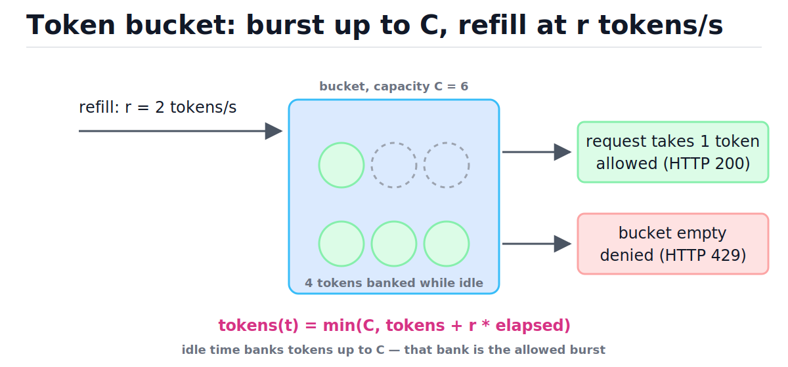
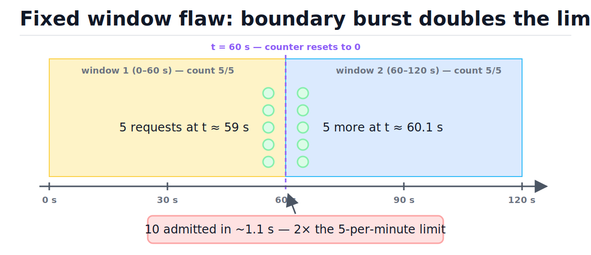
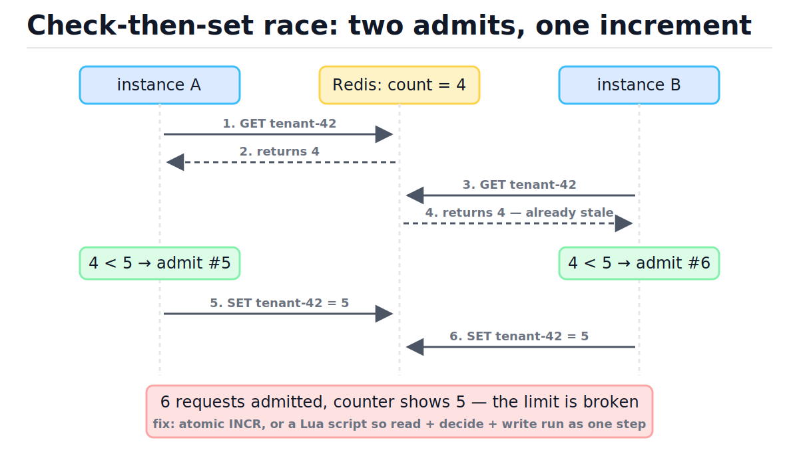
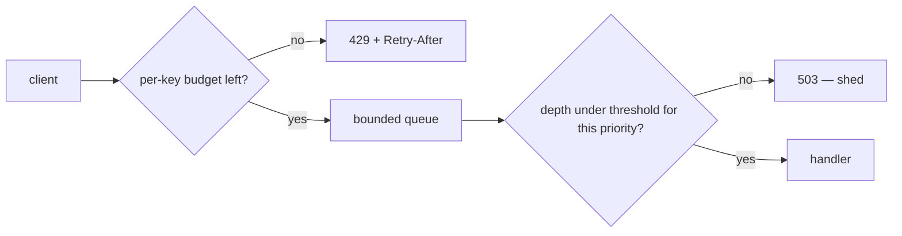

# Rate Limiting and Load Shedding

[toc]

> **TL;DR:** Rate limiting decides per caller whether a request fits an agreed budget and rejects the excess with a cheap 429 before it costs CPU, connections, or database time — token bucket is the default algorithm. Load shedding is the emergency sibling: when the server is already saturated, it drops low-priority work by queue depth so high-priority work keeps its latency. Both return explicit, cheap failures (429/503 plus `Retry-After`) so well-behaved clients back off instead of retry-storming.

## Vocabulary

These ten terms carry the whole note. Each limiter algorithm is really just a tiny data structure — a few numbers per caller plus an update rule. Keep the symbols straight: C is always burst capacity, r the sustained rate, W the window length, L the request limit per window.

**Rate limiting**

```math
\text{allow}(k, t) \iff \text{usage}(k, t) < \text{limit}(k)
```

A per-caller admission policy. Each key k (user, API key, IP) gets a budget; requests beyond it are rejected with an explicit error rather than served slowly.

**Token bucket**

```math
\text{tokens}(t) = \min\!\big(C,\; \text{tokens}(t_0) + r \cdot (t - t_0)\big)
```

A counter that refills at rate r up to capacity C; each request spends tokens. Idle time banks credit, so short bursts up to C pass while the long-run rate stays at most r.

**Leaky bucket**

```math
\text{outflow rate} \le r, \qquad \text{queue length} \le B
```

Requests enter a bounded queue drained at a constant rate r. Output is perfectly smooth; bursts wait in the queue or get dropped when it is full.

**Fixed window counter**

```math
w = \lfloor t / W \rfloor
```

One integer counter per key per window index w, reset to zero whenever the index changes. The cheapest possible state — but the counter forgets all history at every boundary.

**Sliding window log**

```math
\big|\{\, t_i : t - W < t_i \le t \,\}\big| < L
```

Store every request timestamp and count those inside the trailing window. Exact by construction, O(L) memory per key.

**Sliding window counter**

```math
\hat{N}(t) = N_{\text{prev}} \cdot \Big(1 - \frac{t \bmod W}{W}\Big) + N_{\text{curr}}
```

Two fixed-window counters blended by how far into the current window we are. Approximates the sliding log with O(1) memory, assuming the previous window's requests were evenly spread.

**Burst capacity**

```math
C
```

The maximum number of requests a key can fire instantly after sitting idle. In a token bucket it is the bucket size; it is the knob product teams actually negotiate with customers.

**Load shedding**

```math
\text{admit} \iff \frac{\text{queue depth}}{\text{max depth}} < \theta(\text{priority})
```

Dropping work the server has already accepted, lowest priority first, when a saturation signal (queue depth, latency) crosses a threshold. Global and reactive — unlike per-key rate limits, which are local and contractual.

**Backpressure**

```math
\lambda > \mu \;\Rightarrow\; \text{queue grows without bound}
```

When arrival rate λ exceeds service rate μ, queues grow and latency explodes. Backpressure is any mechanism — bounded queues, 429/503 responses, TCP flow control — that pushes the excess back to the sender instead of buffering it forever.

**Exponential backoff with jitter**

```math
\text{sleep} \sim U\!\big(0,\; \min(\text{cap},\; \text{base} \cdot 2^{\text{attempt}})\big)
```

The client half of the contract: wait exponentially longer after each rejection, randomized so a crowd of rejected clients does not retry in lockstep.

## Intuition

Think of a club with a bouncer and a fire marshal. The bouncer (rate limiter) checks your wristband at the door: you paid for 100 entries per hour, you get 100 — whether the club is empty or packed. The fire marshal (load shedder) does not care who you are: when the room is at capacity nobody else gets in, and if it gets dangerous, low-priority guests are walked out first. One enforces fairness per caller; the other protects the building.

The token bucket is the bouncer's tally. In the figure, watch two things: the refill arrow adds r tokens per second but never past capacity C, and every admitted request removes a token. Idle time banks tokens — that bank is exactly the burst a caller is allowed. The only thing that produces a 429 is an empty bucket.



## How it works

All five algorithm families answer one question — "has key k exceeded its budget at time t?" — with different memory/accuracy trade-offs. Every implementation below takes an injected `now` callable so the tests control time deterministically; in production you pass `time.monotonic`. All of them decide in O(1) per request except the sliding log's eviction sweep.

### Token bucket — the default answer

The production trick is *lazy refill*: no background thread tops up buckets. On each request you compute how much time elapsed since the last touch, credit `elapsed × r` tokens (capped at C), then try to spend. State per key is two floats — token count and last-touch timestamp. Bursts up to C pass instantly; the sustained rate can never exceed r.

```python
import time
from typing import Callable


class FakeClock:
    """Deterministic stand-in for time.monotonic in tests."""

    def __init__(self) -> None:
        self.t = 0.0

    def __call__(self) -> float:
        return self.t

    def advance(self, dt: float) -> None:
        self.t += dt


class TokenBucket:
    def __init__(self, capacity: float, refill_rate: float,
                 now: Callable[[], float] = time.monotonic) -> None:
        self.capacity = capacity
        self.refill_rate = refill_rate
        self.now = now
        self.tokens = capacity          # start full: cold keys may burst
        self.last = now()

    def allow(self, cost: float = 1.0) -> bool:
        t = self.now()
        self.tokens = min(self.capacity,
                          self.tokens + (t - self.last) * self.refill_rate)
        self.last = t
        if self.tokens >= cost:
            self.tokens -= cost
            return True
        return False


clock = FakeClock()
tb = TokenBucket(capacity=3.0, refill_rate=1.0, now=clock)

assert [tb.allow() for _ in range(4)] == [True, True, True, False]  # burst of C, then deny
clock.advance(1.5)
assert tb.allow() is True       # 1.5 tokens refilled
assert tb.allow() is False      # only 0.5 left — half a token short
clock.advance(100.0)
assert [tb.allow() for _ in range(4)] == [True, True, True, False]  # refill caps at C
```

The trace below follows those asserts step by step (capacity 3, refill 1 token/s). Note step 5: the 1.5 s gap banked 1.5 tokens, not "one request slot" — token buckets are continuous.

| Step | t (s) | Tokens before | Cost | Tokens after | Decision |
| :---: | ---: | ---: | ---: | ---: | :--- |
| 1 | 0.0 | 3.0 | 1 | 2.0 | allow |
| 2 | 0.0 | 2.0 | 1 | 1.0 | allow |
| 3 | 0.0 | 1.0 | 1 | 0.0 | allow |
| 4 | 0.0 | 0.0 | 1 | 0.0 | deny — bucket empty |
| 5 | 1.5 | 1.5 | 1 | 0.5 | allow — refill banked 1.5 |
| 6 | 1.5 | 0.5 | 1 | 0.5 | deny — half a token short |

> [!TIP]
> Token bucket is the default answer in interviews and in production (AWS API throttling, Stripe's limiter, nginx-adjacent gateways). The `cost` parameter is the bonus feature: one bucket per key, but a search request costs 5 tokens and a checkout costs 10 — cost classes without extra state.

### Leaky bucket — smooth the output

Where the token bucket *polices* (excess is rejected but admitted traffic keeps its shape), the leaky bucket *shapes*: requests join a bounded queue that drains at exactly r per second, so downstream sees perfectly even spacing of 1/r seconds. You can implement it without a real queue using virtual scheduling — track the time the next request would be serviced; the backlog is that time minus now, measured in service slots. This is the same idea as nginx `limit_req`, which is documented as a leaky bucket with a `burst` queue.

```python
class LeakyBucket:
    """Virtual-queue leaky bucket: admits if the backlog fits, drains at a fixed rate."""

    def __init__(self, rate: float, queue_size: int,
                 now: Callable[[], float] = time.monotonic) -> None:
        self.interval = 1.0 / rate       # seconds between departures
        self.queue_size = queue_size
        self.now = now
        self.next_free = 0.0             # virtual time the next admit would depart

    def allow(self) -> bool:
        t = self.now()
        start = max(t, self.next_free)
        backlog = (start - t) / self.interval   # requests already waiting
        if backlog >= self.queue_size:
            return False
        self.next_free = start + self.interval  # departures are exactly 1/r apart
        return True


clock = FakeClock()
lb = LeakyBucket(rate=1.0, queue_size=3, now=clock)

assert [lb.allow() for _ in range(4)] == [True, True, True, False]  # queue holds 3
clock.advance(1.0)               # one slot drained
assert lb.allow() is True
assert lb.allow() is False       # queue full again
```

### Fixed window counter — cheap but gameable

Bucket time into windows of length W (minute, hour) and keep one counter per key per window; reset on rollover. It maps directly onto a Redis `INCR` plus `EXPIRE`, which is why it is everywhere. The flaw: the counter has amnesia at each boundary. The figure shows the exploit — a caller fires L requests at the end of window 1 and L more at the start of window 2, landing 2L requests in a couple of seconds under an "L per W" limit.



```python
class FixedWindow:
    def __init__(self, limit: int, window: float,
                 now: Callable[[], float] = time.monotonic) -> None:
        self.limit = limit
        self.window = window
        self.now = now
        self.window_id = -1
        self.count = 0

    def allow(self) -> bool:
        wid = int(self.now() // self.window)
        if wid != self.window_id:                 # rollover: total amnesia
            self.window_id = wid
            self.count = 0
        if self.count < self.limit:
            self.count += 1
            return True
        return False


clock = FakeClock()
clock.advance(59.0)
fw = FixedWindow(limit=5, window=60.0, now=clock)

assert sum(fw.allow() for _ in range(5)) == 5    # 5 allowed at t = 59.0
assert fw.allow() is False
clock.advance(1.1)                                # t = 60.1 -> new window
assert sum(fw.allow() for _ in range(5)) == 5    # 5 MORE allowed 1.1 s later
# Net effect: 10 requests in 1.1 s under a "5 per 60 s" limit.
```

> [!WARNING]
> The boundary burst is not theoretical — scrapers deliberately time request volleys around the window reset. Worst case is 2L requests inside a span barely longer than the burst itself. If the limit exists to protect a database, fixed window gives you half the protection you think you configured.

### Sliding window log — exact, memory-heavy

Keep a deque of timestamps per key. On each request, evict everything older than t − W, then admit if fewer than L remain. There is no boundary to game because the window slides continuously with t. The price is memory proportional to the limit itself, per key — fine for "5 password attempts per hour", ruinous for "10k requests per minute" across millions of keys.

```python
from collections import deque
from typing import Deque


class SlidingWindowLog:
    def __init__(self, limit: int, window: float,
                 now: Callable[[], float] = time.monotonic) -> None:
        self.limit = limit
        self.window = window
        self.now = now
        self.log: Deque[float] = deque()

    def allow(self) -> bool:
        t = self.now()
        while self.log and self.log[0] <= t - self.window:
            self.log.popleft()                    # evict expired stamps
        if len(self.log) < self.limit:
            self.log.append(t)
            return True
        return False


clock = FakeClock()
clock.advance(59.0)
swl = SlidingWindowLog(limit=5, window=60.0, now=clock)

assert sum(swl.allow() for _ in range(5)) == 5
clock.advance(1.1)                                # t = 60.1
assert sum(swl.allow() for _ in range(5)) == 0   # exact: the 5 hits are still in-window
clock.advance(59.0)                               # t = 120.1, old stamps expired
assert swl.allow() is True
```

### Sliding window counter — the interpolation compromise

Keep just two fixed-window counters — previous and current — and estimate the trailing-window count by assuming the previous window's traffic was uniform. Early in the current window most of the previous count still "weighs in", so the boundary burst is blocked; the weight decays linearly to zero by the window's end. This is Cloudflare's production scheme: O(1) memory with accuracy close enough that they measured only a tiny fraction of requests wrongly allowed or denied.

```math
\hat{N}(t) = N_{\text{prev}} \cdot \Big(1 - \frac{t \bmod W}{W}\Big) + N_{\text{curr}}
```

```python
class SlidingWindowCounter:
    def __init__(self, limit: int, window: float,
                 now: Callable[[], float] = time.monotonic) -> None:
        self.limit = limit
        self.window = window
        self.now = now
        self.curr_id = 0
        self.curr = 0
        self.prev = 0

    def allow(self) -> bool:
        t = self.now()
        wid = int(t // self.window)
        if wid != self.curr_id:
            self.prev = self.curr if wid == self.curr_id + 1 else 0
            self.curr_id = wid
            self.curr = 0
        frac = (t % self.window) / self.window
        estimate = self.prev * (1.0 - frac) + self.curr
        if estimate < self.limit:
            self.curr += 1
            return True
        return False


clock = FakeClock()
clock.advance(59.0)
swc = SlidingWindowCounter(limit=5, window=60.0, now=clock)

assert sum(swc.allow() for _ in range(5)) == 5
clock.advance(1.1)                                # t = 60.1: prev=5, weight ~0.998
assert sum(swc.allow() for _ in range(5)) == 1   # estimate 4.99 admits one, then blocks
```

### Choosing among the five

Pick by what you are protecting and how much state you can afford per key. The table is the whole decision in one screen; when in doubt, token bucket.

| Algorithm | Bursts? | Smooths output? | Accuracy | State per key | Typical use |
| :--- | :--- | :---: | :--- | :--- | :--- |
| Token bucket | yes, up to C | no | exact long-run rate | 2 floats | the default; API quotas with burst |
| Leaky bucket | no — queued or dropped | yes, exactly r | exact | 1 float | traffic shaping before a fragile backend |
| Fixed window | yes — 2L at boundaries | no | weak at boundaries | 1 int + window id | quick Redis `INCR` limiter |
| Sliding window log | no | no | exact | O(L) timestamps | low-volume, strict (logins, OTP) |
| Sliding window counter | slightly (estimate) | no | approximate, no boundary hole | 2 ints + window id | high-scale edge limiting |

### What to key limits on

A limit is only as good as its key. Authenticated traffic should be keyed on user id or API key — that is what maps to a contract and a bill. Unauthenticated traffic forces you down to IP, which is the weakest key: carrier-grade NAT (CGNAT) puts thousands of innocent users behind one IPv4 address, so an aggressive per-IP limit punishes a whole apartment block for one scraper, while a botnet trivially spreads load across thousands of IPs and never trips it. Layer keys instead of choosing one.

| Key | Catches | Fails when |
| :--- | :--- | :--- |
| user id | logged-in abuse, runaway scripts | endpoint is pre-auth (login, signup) |
| API key / tenant | B2B quota tiers, billing enforcement | key is leaked or shared across services |
| IP address | pre-auth scraping, credential stuffing | CGNAT (false positives), botnets (false negatives) |
| (key, endpoint class) | expensive endpoints draining a shared budget | costs are never measured, just guessed |

> [!NOTE]
> Endpoint cost classes are the most underused key dimension. `GET /status` and `POST /reports/generate` should never share a flat count — either give them separate limits or, cleaner, one token bucket where the report costs 50 tokens. Derive costs from measured p99 CPU/DB time, not vibes.

## Complexity

Every limiter here decides in constant time; the differences are in worst-case eviction and in per-key memory, which is what actually hurts at millions of keys. Space is per key — multiply by the number of distinct keys K to size the fleet.

| Operation | Time best | Time amortized | Time worst | Space per key |
| :--- | :---: | :---: | :---: | :---: |
| `TokenBucket.allow` | O(1) | O(1) | O(1) | O(1) — 2 floats |
| `LeakyBucket.allow` | O(1) | O(1) | O(1) | O(1) — 1 float |
| `FixedWindow.allow` | O(1) | O(1) | O(1) | O(1) — int + id |
| `SlidingWindowLog.allow` | O(1) | O(1) | O(L) eviction sweep | O(L) |
| `SlidingWindowCounter.allow` | O(1) | O(1) | O(1) | O(1) — 2 ints + id |
| `LoadShedder.admit` | O(1) | O(1) | O(1) | O(1) global |
| Redis Lua limiter call | O(1) + 1 RTT | O(1) + 1 RTT | O(1) + 1 RTT | O(1) in Redis |

The sliding log's worst case looks bad but amortizes away: each timestamp is appended exactly once and evicted at most once, so n requests do at most 2n deque operations.

```math
\underbrace{n \text{ appends}}_{\text{one per request}} \;+\; \underbrace{\le n \text{ evictions}}_{\text{each stamp popped once}} \;=\; O(n) \text{ total} \;\Rightarrow\; O(1) \text{ amortized}
```

Memory is the real bound. At K keys and L stamps of b bytes each, the log needs K·L·b bytes:

```math
M_{\text{log}} = K \cdot L \cdot b = 10^{7} \times 10^{3} \times 8\,\text{B} = 80\,\text{GB}
```

Ten million users at 1,000 requests/minute is 80 GB of timestamps; the sliding window counter holds the same keys in roughly K × tens of bytes — a few hundred MB. That three-orders-of-magnitude gap is why the interpolation compromise wins at scale, and why "exact" limiters are reserved for small-L cases like login attempts.

## In production

A single-process limiter dies with horizontal scaling: 10 app instances each allowing 100 req/min means the real limit is 1,000. Production limiters share state — and shared state brings races, latency, and failure modes that the algorithm zoo above never had to face.

### The distributed problem: check-then-set races

The naive shared-counter protocol is read the count, compare to the limit, write count+1. Between one instance's read and its write, another instance can read the same stale value — both decide "under the limit", both admit. The code below forces the interleaving deterministically; the figure shows the same race as a timeline.

```python
store = {"tenant-42": 4}
LIMIT = 5


def check_then_set(read_value: int, key: str) -> bool:
    """BROKEN: decides on a stale read, then blindly overwrites."""
    if read_value < LIMIT:
        store[key] = read_value + 1
        return True
    return False


read_a = store["tenant-42"]                    # instance A reads 4
read_b = store["tenant-42"]                    # instance B reads 4 (A hasn't written yet)
assert check_then_set(read_a, "tenant-42")     # A admits request #5
assert check_then_set(read_b, "tenant-42")     # B ALSO admits -> request #6 slips through
assert store["tenant-42"] == 5                 # counter says 5, but 6 were admitted
```



### Atomic counters: Redis and Lua

The fix is making read + decide + write a single atomic step on the shared store. For fixed windows, Redis `INCR` alone is atomic — increment first, then compare the returned value. For token buckets the update rule is too rich for one command, so you ship the whole rule as a Lua script: Redis executes scripts single-threaded and atomically, so no other command interleaves. This is the standard production pattern (Stripe described exactly this design).

```lua
-- KEYS[1] = bucket key
-- ARGV: 1=capacity, 2=refill_rate, 3=now_seconds, 4=cost
local capacity = tonumber(ARGV[1])
local rate     = tonumber(ARGV[2])
local now      = tonumber(ARGV[3])
local cost     = tonumber(ARGV[4])

local tokens = tonumber(redis.call('HGET', KEYS[1], 'tokens') or capacity)
local last   = tonumber(redis.call('HGET', KEYS[1], 'last') or now)

tokens = math.min(capacity, tokens + (now - last) * rate)
local allowed = 0
if tokens >= cost then
  tokens = tokens - cost
  allowed = 1
end
redis.call('HSET', KEYS[1], 'tokens', tokens, 'last', now)
redis.call('EXPIRE', KEYS[1], 120)   -- idle keys evict themselves
return allowed
```

> [!IMPORTANT]
> Atomicity is the load-bearing property of any distributed limiter. `GET` then `SET` is always wrong under concurrency; use `INCR`, a Lua script, or a compare-and-set loop. Also decide the failure policy up front: if Redis is down, fail open (admit everything, protect availability) or fail closed (deny everything, protect the backend) — most public APIs fail open and alarm loudly.

### The local-allowance hybrid

One Redis round-trip per request adds latency to every call and makes Redis itself the next bottleneck. The hybrid: each app instance keeps a local in-memory token bucket and periodically syncs with the central store — claim an allowance of, say, 1/Nth of the global budget locally, burn it with zero network cost, and refresh asynchronously. You trade exactness (the global limit can briefly overshoot by the sum of unsynced local allowances) for an RTT-free hot path. Most gateways at scale land here.

### What to return: 429, Retry-After, X-RateLimit-*

A rejected request should be cheap for you and informative for the client. RFC 6585 defines `429 Too Many Requests` for per-client limits; send `Retry-After` (RFC 7231 defines it for 503 and 3xx, and the field is conventionally honored on 429 too) so clients know when to come back instead of guessing. The `X-RateLimit-*` trio is a de facto convention (GitHub, Stripe-style APIs); an IETF draft (`draft-ietf-httpapi-ratelimit-headers`) is standardizing unprefixed `RateLimit-*` names.

```text
HTTP/1.1 429 Too Many Requests
Retry-After: 7
X-RateLimit-Limit: 100
X-RateLimit-Remaining: 0
X-RateLimit-Reset: 1765500007
Content-Type: application/json

{"error": "rate_limited", "retry_after_seconds": 7}
```

> [!NOTE]
> 429 means "*you* exceeded *your* budget — slow down"; 503 means "*I* am overloaded — not your fault". Keep the distinction: clients should back off harder and longer on 503, and your dashboards should alarm on 503 rates but treat 429s as business as usual.

### Load shedding: drop the right work first

Rate limits are contracts negotiated in calm weather; load shedding is what saves you when the contracts were not enough — a retry storm, a cache wipe, a viral event. The standard trigger is queue depth (it leads latency: by Little's law the wait is roughly depth/μ), and the standard policy is priority tiers: shed background work early, paid traffic late, health checks never. Admission is checked after the rate limiter, at the queue:



```python
class LoadShedder:
    """Admit by priority as the queue fills: background sheds first, critical last."""

    THRESHOLDS = {0: 1.00, 1: 0.75, 2: 0.50}   # priority -> max utilization admitted

    def __init__(self, max_depth: int) -> None:
        self.max_depth = max_depth

    def admit(self, priority: int, queue_depth: int) -> bool:
        utilization = queue_depth / self.max_depth
        return utilization < self.THRESHOLDS[priority]


shedder = LoadShedder(max_depth=100)
assert shedder.admit(priority=2, queue_depth=40)          # calm: background admitted
assert not shedder.admit(priority=2, queue_depth=60)      # 60% full: shed background
assert shedder.admit(priority=1, queue_depth=60)          # normal still fine
assert not shedder.admit(priority=1, queue_depth=80)      # 80%: shed normal too
assert shedder.admit(priority=0, queue_depth=99)          # critical until truly full
assert not shedder.admit(priority=0, queue_depth=100)
```

Static thresholds need a chosen `max_depth`, and the right value drifts with hardware and request mix. *Adaptive concurrency* removes the guess: treat the concurrency limit like TCP treats its congestion window — additively increase it while latency stays near the historical minimum, multiplicatively cut it when latency gradients show queueing (Netflix's `concurrency-limits` library is the reference implementation). The server then sheds whatever exceeds a limit it discovered empirically, rather than one a human guessed last quarter.

### Client side: exponential backoff with jitter

Servers can only reject; clients decide whether the rejection becomes a recovery or a retry storm. The contract: honor `Retry-After` when present, otherwise back off exponentially *with jitter* — randomizing each wait over the full interval so a thousand clients rejected together do not return together. AWS's analysis showed full jitter strictly dominates plain exponential backoff for both completion time and total calls. The deeper failure pattern (retry amplification across layers) belongs to [Reliability and Observability](./12-reliability-and-observability.md).

```python
import random


def backoff_delay(attempt: int, base: float = 0.1, cap: float = 10.0) -> float:
    """Full jitter: sleep uniformly in [0, min(cap, base * 2^attempt))."""
    return random.uniform(0.0, min(cap, base * (2 ** attempt)))


for attempt in range(8):
    d = backoff_delay(attempt)
    assert 0.0 <= d <= min(10.0, 0.1 * 2 ** attempt)
```

> [!CAUTION]
> Retries without jitter are synchronized re-attacks: every rejected client sleeps the same 2^k seconds and returns in the same instant, re-spiking the exact overload that rejected them. This turns a 30-second incident into an hours-long oscillation. Jitter is not optional.

## Real-world example

You run the API gateway for an e-commerce platform. Three endpoint classes hit the same backend pool: product reads (cheap), search (5× a read in DB time), checkout (10×, touches payments). Each API key gets one token bucket; endpoints draw different token costs from it, so a tenant hammering search exhausts its own budget without needing a separate limit per endpoint.

```python
COSTS = {"GET /products": 1.0, "GET /search": 5.0, "POST /checkout": 10.0}


class ApiGatewayLimiter:
    """One token bucket per API key; endpoints draw cost-weighted tokens."""

    def __init__(self, capacity: float, refill_rate: float,
                 now: Callable[[], float] = time.monotonic) -> None:
        self.capacity = capacity
        self.refill_rate = refill_rate
        self.now = now
        self.buckets: dict[str, TokenBucket] = {}

    def allow(self, api_key: str, endpoint: str) -> bool:
        bucket = self.buckets.get(api_key)
        if bucket is None:
            bucket = TokenBucket(self.capacity, self.refill_rate, self.now)
            self.buckets[api_key] = bucket
        return bucket.allow(COSTS[endpoint])


clock = FakeClock()
gw = ApiGatewayLimiter(capacity=20.0, refill_rate=2.0, now=clock)

assert gw.allow("key-A", "POST /checkout")        # 20 -> 10 tokens
assert gw.allow("key-A", "POST /checkout")        # 10 -> 0
assert not gw.allow("key-A", "GET /products")     # empty: even a cheap read is denied
assert gw.allow("key-B", "GET /search")           # other tenants unaffected

clock.advance(5.0)                                # 5 s * 2 tokens/s = 10 tokens back
assert gw.allow("key-A", "POST /checkout")
assert not gw.allow("key-A", "POST /checkout")    # sustained checkout rate is bounded
```

In the real deployment the `buckets` dict becomes Redis hashes updated by the Lua script above, the gateway adds the `X-RateLimit-*` headers from the script's return values, and a `LoadShedder` sits behind the limiter watching the backend queue — because a thousand tenants each politely inside their budget can still add up to more than the database survives.

## When to use / When NOT to use

Rate limiting and load shedding are complements, not substitutes — one is proactive and per-caller, the other reactive and global. Use this split to decide which problem you actually have.

- **Rate limit when** callers are identifiable and budgets are contractual: public APIs, per-tenant fairness, login/OTP brute-force defense, protecting a fixed-capacity dependency (DB connections, third-party API quotas).
- **Shed load when** aggregate demand exceeds capacity regardless of per-caller behavior: retry storms, failover doubling traffic on survivors, cache stampedes, viral spikes.
- **Don't rate limit** internal traffic you control end-to-end as your first move — fix the caller or use backpressure via bounded queues; a limit hides the bug.
- **Don't shed** work that is cheaper to finish than to retry (almost-done requests), and never shed the control plane: health checks, deploys, and metrics must bypass the shedder or you go blind exactly when you need eyes.

## Common mistakes

- **"Fixed window is fine, it's what Redis INCR gives me"** — it admits 2× the limit around every boundary; spend two more integers and use the sliding window counter.
- **"I'll read the counter, check, then write it back"** — check-then-set races under concurrency admit unbounded overage; use `INCR` or a Lua script so the decision is atomic.
- **"Limit by IP, it's universal"** — CGNAT makes one IP equal thousands of users (false positives) and botnets make thousands of IPs equal one attacker (false negatives); key on identity whenever you have it.
- **"429 on everything when we're overloaded"** — overload is your fault, not the caller's; return 503 with `Retry-After` so clients apply the right (harder) backoff and your alerts fire on the right signal.
- **"Retry after a fixed 1 s, three times"** — synchronized retries triple the spike that caused the rejections; exponential backoff with full jitter, capped, honoring `Retry-After`.
- **"Shed randomly, it's fair"** — random drop kills a paying checkout to save a batch export; shed by priority tier, lowest first, and exempt health checks.
- **"The limiter store is down, deny everything to be safe"** — failing closed turns a cache outage into a full API outage; most public APIs should fail open and alarm.

## Interview questions and answers

These come up constantly in system design rounds — rate limiter design is a classic standalone question, and load shedding appears inside every "design X at scale" follow-up about overload.

**Q1. Which rate-limiting algorithm would you pick by default, and why?**
**Answer:** Token bucket. It's O(1) time and two floats per key, it allows the bursts real clients actually produce while bounding the sustained rate at r, and the cost parameter handles expensive endpoints for free. I'd reach for something else only with a specific reason — leaky bucket if downstream needs perfectly smooth input, sliding window counter if the product spec is literally "N per window" at huge key cardinality.

**Q2. Token bucket vs leaky bucket — what's the actual difference?**
**Answer:** Token bucket polices, leaky bucket shapes. Token bucket admits a burst of up to C instantly and rejects the rest; the admitted traffic keeps its bursty shape. Leaky bucket queues arrivals and releases them at exactly r per second, so the output is smooth but bursts pay a queueing delay. Same long-run rate, opposite treatment of bursts.

**Q3. What's wrong with a fixed window counter, and what's the cheap fix?**
**Answer:** The counter resets to zero at every boundary, so a caller can fire L requests just before the reset and L just after — 2L in a couple of seconds. The cheap fix is the sliding window counter: keep the previous window's count and weight it by the fraction of the previous window still inside the trailing window. Same O(1) state, boundary hole closed, at the cost of assuming uniform arrivals in the previous window.

**Q4. How do you enforce one limit across 50 gateway instances?**
**Answer:** Centralize the counter in Redis and make the update atomic — `INCR` for windows, a Lua script for token buckets, because get-check-set races and over-admits. If the Redis round-trip per request is too expensive, go hybrid: each instance claims a local allowance from the global budget and burns it in memory, syncing asynchronously. You accept brief overshoot bounded by the outstanding allowances in exchange for an RTT-free hot path. And I'd state the failure policy: Redis down means fail open plus alarms for a public API.

**Q5. What exactly should the API return when it limits someone?**
**Answer:** 429 with a `Retry-After` header and the rate-limit headers — limit, remaining, reset — so well-behaved clients can pace themselves instead of polling. Keep the rejection path as cheap as possible: it must cost almost nothing to say no, otherwise rejections themselves become the load. And 429 only for per-client budget violations; overload gets 503.

**Q6. When does rate limiting fail to protect you, and what takes over?**
**Answer:** When every caller is individually within budget but the sum exceeds capacity — failover doubles traffic on survivors, or a cache wipe multiplies DB load. Rate limits are static contracts; the dynamic defense is load shedding: watch queue depth or latency, and when it crosses a threshold, drop the lowest-priority work first and return 503 for the rest. Rate limiting is the bouncer, shedding is the fire marshal.

**Q7. What key would you rate limit on for a public login endpoint?**
**Answer:** Layered keys, because login is pre-auth so there's no user identity to trust yet. Per-IP with a generous limit as the outer layer — generous because CGNAT puts thousands of users behind one address. Per-account-being-targeted with a strict limit (say five attempts) to stop credential stuffing on a single account, ideally with an exact sliding window log since L is tiny. Optionally device fingerprint as a third signal. Single-key answers are wrong in both directions at once.

**Q8. A client library gets a 429. Walk me through the correct retry behavior.**
**Answer:** First, honor `Retry-After` if it's present — the server told you the answer. Otherwise exponential backoff with full jitter: sleep uniform-random in zero to min(cap, base·2^attempt), so the retry wave decorrelates. Cap the attempts and the total time, and make sure retries only wrap idempotent operations. Without jitter, every rejected client comes back in the same instant and re-creates the spike — that's the retry-storm failure mode.

## Practice path

1. Implement `TokenBucket` from memory with an injected clock; write asserts for burst-of-C, partial refill, and the capacity cap before peeking at this note.
2. Reproduce the boundary burst: write the `FixedWindow` test that admits 10 under a 5/min limit, then swap in `SlidingWindowCounter` and watch the same test admit 6.
3. Implement `SlidingWindowLog` and verify it agrees exactly with a brute-force count over random arrival sequences.
4. Write the check-then-set race as two interleaved readers (as above), then fix it with a single `incr_and_check` function and prove the overage disappears.
5. Port the token bucket to the Redis Lua script; test it from Python against a local Redis with two concurrent processes hammering one key.
6. Add a `LoadShedder` in front of a toy queue; drive synthetic load past capacity and chart admitted-by-priority vs queue depth.
7. Size a limiter for 10M keys at 1k req/min each using the memory derivation in [Complexity](#complexity); decide log vs counter and defend it with the numbers — estimation drills live in [Back-of-the-envelope estimation](./02-back-of-the-envelope-estimation.md).

## Copyable takeaways

- Token bucket is the default: O(1), two floats per key, bursts up to C, sustained rate r, and a cost parameter that prices endpoints differently from one budget.
- Lazy refill — credit `elapsed × r` on access, cap at C — means no background threads, ever.
- Fixed window admits 2L around boundaries; sliding window counter closes the hole with the same O(1) state via linear interpolation.
- Sliding window log is exact but costs K·L·b memory — reserve it for small limits like login attempts.
- Distributed limiting demands atomic read-decide-write: Redis `INCR` or Lua, never GET-then-SET; choose fail-open vs fail-closed before the outage.
- Return 429 + `Retry-After` + rate-limit headers for budget violations; 503 for overload — they trigger different client behavior.
- Load shedding is the global, reactive complement: trigger on queue depth, shed lowest priority first, never shed health checks.
- Clients must back off exponentially with full jitter; synchronized retries re-create the spike that rejected them.

## Sources

- Stripe Engineering — "Scaling your API with rate limiters": https://stripe.com/blog/rate-limiters
- Cloudflare — "How we built rate limiting capable of scaling to millions of domains" (sliding window counter): https://blog.cloudflare.com/counting-things-a-lot-of-different-things/
- Google SRE Book, Ch. 21 "Handling Overload" and Ch. 22 "Addressing Cascading Failures": https://sre.google/sre-book/handling-overload/
- AWS Builders' Library — "Using load shedding to avoid overload": https://aws.amazon.com/builders-library/using-load-shedding-to-avoid-overload/
- AWS Architecture Blog — "Exponential Backoff and Jitter": https://aws.amazon.com/blogs/architecture/exponential-backoff-and-jitter/
- RFC 6585 — Additional HTTP Status Codes (defines 429): https://www.rfc-editor.org/rfc/rfc6585
- RFC 7231 §7.1.3 — Retry-After: https://www.rfc-editor.org/rfc/rfc7231
- IETF httpapi draft — RateLimit header fields for HTTP: https://datatracker.ietf.org/doc/draft-ietf-httpapi-ratelimit-headers/
- Redis docs — scripting with Lua (atomic execution): https://redis.io/docs/latest/develop/interact/programmability/eval-intro/
- Netflix — concurrency-limits (adaptive concurrency): https://github.com/Netflix/concurrency-limits
- nginx docs — `ngx_http_limit_req_module` (leaky bucket): https://nginx.org/en/docs/http/ngx_http_limit_req_module.html

## Related

- [API design](./09-api-design.md) — where 429s, headers, and idempotent retries meet the public contract.
- [Reliability and observability](./12-reliability-and-observability.md) — retry amplification, timeouts, and the metrics that detect overload.
- [Back-of-the-envelope estimation](./02-back-of-the-envelope-estimation.md) — sizing limiter state and Redis throughput before you build.
- [Caching strategies](./05-caching-strategies.md) — cache stampedes are a classic load-shedding trigger.
- [Message queues and event-driven architecture](./08-message-queues-and-event-driven-architecture.md) — bounded queues as backpressure instead of synchronous rejection.
- [Stacks and queues](../Data-Structures-and-Algorithms/04-stacks-and-queues.md) — the deque underneath the sliding window log.
