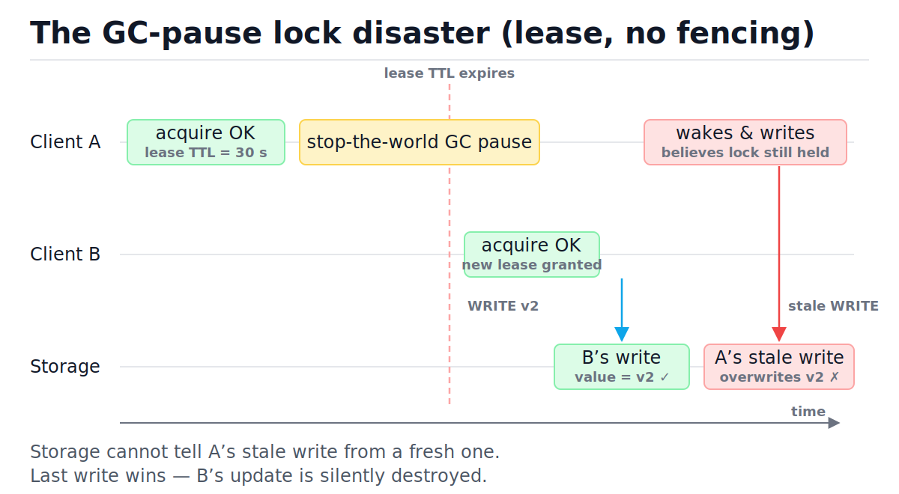
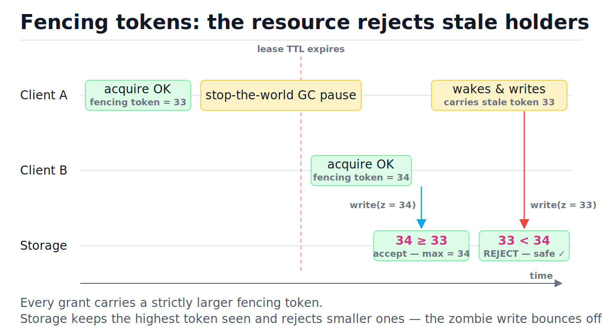
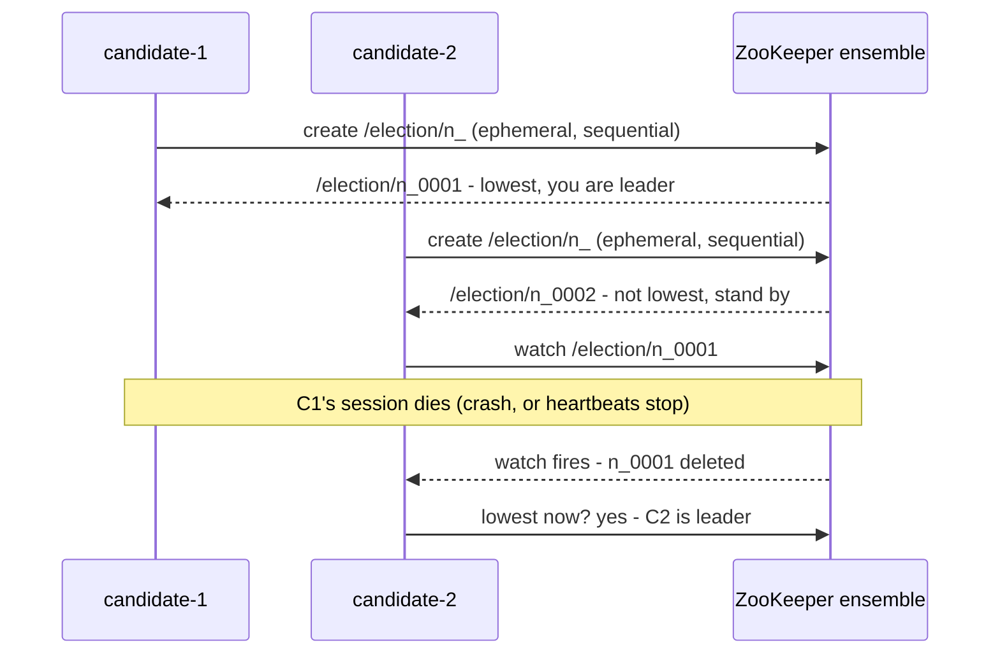
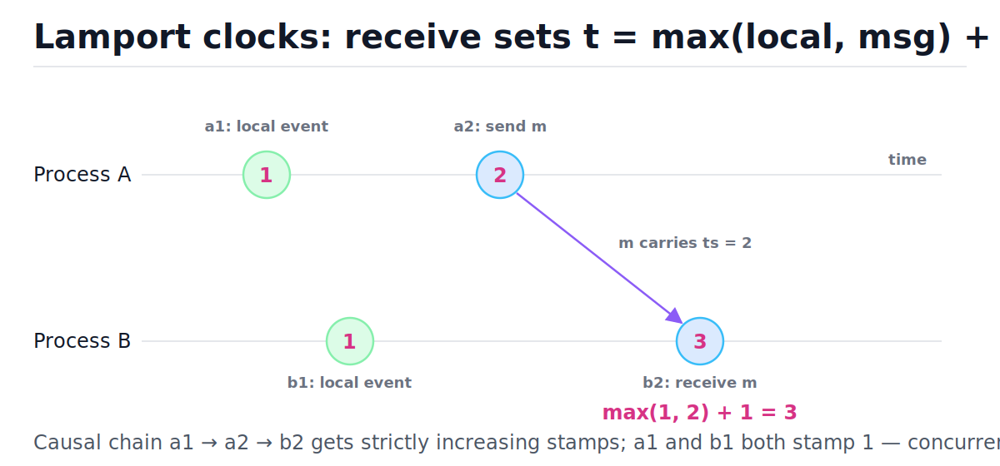

# Distributed Locks, Leader Election, and Time

[toc]

> **TL;DR:** A distributed lock backed only by a TTL is a probability, not a guarantee — a GC pause or VM stall can outlive the lease, and the resource ends up with two writers. The real fix is a fencing token checked by the protected resource itself, and the deeper fix is designing the lock away with idempotency and partition-by-key. Never order events across machines by wall-clock timestamps; use monotonic clocks for durations and logical clocks for causality.

## Vocabulary

These terms carry the whole note. Each gets its canonical symbol or rule, then a one-paragraph definition. Internalize the fencing-token and quorum entries first — they are the two load-bearing ideas.

**Distributed lock**

```math
\forall t:\ |\text{holders}(t)| \le 1
```

Mutual exclusion across processes that share no memory. The invariant — at most one holder at any instant — is exactly what asynchronous networks and pausing processes make impossible to guarantee from the lock service alone.

**Lease**

```math
\text{lock valid during } [\,t_{\text{grant}},\ t_{\text{grant}} + \text{TTL}\,)
```

A lock with an expiry time. The TTL exists so a crashed holder cannot deadlock the system forever. The cost: a *slow* holder is indistinguishable from a dead one.

**Fencing token**

```math
z_{k+1} > z_k
```

A monotonically increasing number handed out with every lock grant. The protected resource stores the highest token it has seen and rejects any request carrying a smaller one. This is what turns a lease from "probably exclusive" into "safe even when exclusivity fails".

**Compare-and-swap (CAS)**

```math
\text{CAS}(x, e, v):\ x \leftarrow v \iff x = e
```

Atomic conditional update: write the new value only if the current value equals the expected one. etcd transactions and ZooKeeper versioned writes are CAS; it is the primitive under every lock and election recipe.

**Ephemeral node**

```math
\text{lifetime}(\text{node}) = \text{lifetime}(\text{session})
```

A ZooKeeper znode (or etcd key bound to a lease) that the coordination service deletes automatically when the creating client's session dies. Sessions are kept alive by heartbeats, so "holder crashed" converts into "node disappeared" without anyone polling.

**Watch**

```math
\text{state change} \Rightarrow \text{one-shot notification}
```

A subscription on a key or node: the coordination service pushes a notification when it changes or disappears. Watches replace polling and let the next-in-line candidate react to a leader's death immediately.

**Leader election**

```math
\text{choose } \ell \in N \text{ such that all writes route through } \ell
```

Picking a single node to act as the writer/coordinator. It is a long-held distributed lock with the same failure modes: the old leader can keep believing it is leader after losing the role.

**Quorum (majority)**

```math
|Q| = \left\lceil \tfrac{n+1}{2} \right\rceil
```

The minimum group size for a decision among n nodes such that any two decision groups must share a member. Majority overlap is the entire trick behind consensus surviving partitions.

**Term**

```math
T_1 < T_2 < T_3 < \dots
```

Raft's monotonically increasing epoch number. Every leader is the leader *of a term*; a message from an old term is ignored. Terms are fencing tokens applied to leadership itself.

**Clock skew**

```math
\delta_{ij}(t) = C_i(t) - C_j(t)
```

The instantaneous difference between two machines' wall clocks. NTP keeps it small on a good day (milliseconds) but never zero, and a misconfigured node can be off by minutes.

**Monotonic clock**

```math
t_2 > t_1 \Rightarrow M(t_2) \ge M(t_1)
```

A clock that never goes backwards and is unaffected by NTP steps. Meaningless as an absolute time, perfect for measuring local durations (`time.monotonic()` in Python).

**Lamport clock**

```math
C_{\text{recv}} = \max(C_{\text{local}},\ C_{\text{msg}}) + 1
```

A per-process counter: increment on every local event, attach to every message, and on receive jump above the message's stamp. It gives every event a number consistent with causality.

**Happened-before**

```math
a \rightarrow b
```

Lamport's partial order: a precedes b on the same process, or a is the send of a message b receives, or transitively both. Events not ordered by it are *concurrent* — neither caused the other.

**Idempotency**

```math
f(f(x)) = f(x)
```

Applying an operation twice has the same effect as once. If your operations are idempotent, duplicate execution stops being a correctness problem — and most locks exist only to prevent duplicate execution.

## Intuition

Coordination is the most expensive thing a distributed system does: every "who goes first?" question costs round trips, and every answer can be stale by the time it arrives. A lock is a promise about the *future* ("nobody else will touch this until I'm done"), issued by a service that cannot see whether you are alive, paused, or partitioned. The figure below is the canonical failure: the lock service keeps its promise perfectly, and the system still corrupts data — because the *holder's own process* stalled past its lease.



The takeaway to hold onto: the lock client cannot fix this, because the client is the thing that froze. Safety has to move to the resource being protected. That is fencing — and when even fencing is too much machinery, the answer is to design the lock away entirely.

## How it works

### The naive Redis lock — and the GC pause that breaks it

The standard single-instance Redis lock is one atomic command: set a key only if it does not exist, with a TTL so a crashed holder cannot deadlock everyone. Acquisition and release are O(1). It is a fine *efficiency* lock — it prevents most duplicate work — but it cannot be a *correctness* lock, because the lease can expire while the holder still believes it owns it.

```bash
# acquire: set-if-not-exists with a 30 s TTL, atomic in one command
redis-cli SET lock:report client-A NX PX 30000
# release (must check ownership; in production this is a Lua script
# so the GET and DEL happen atomically)
redis-cli EVAL "if redis.call('GET', KEYS[1]) == ARGV[1] then return redis.call('DEL', KEYS[1]) else return 0 end" 1 lock:report client-A
```

Here is the disaster from the figure as a step-by-step trace. Nothing malfunctions: Redis honors the TTL, both clients follow the protocol, and the data is still corrupted.

| Step | Client A | Client B | Lock service | Decision / outcome |
| :--- | :--- | :--- | :--- | :--- |
| 1 | `SET ... NX PX 30000` → OK | idle | key held by A, TTL 30 s | A proceeds |
| 2 | computes; enters a 70 s GC pause | idle | TTL counting down | nobody notices |
| 3 | still paused | idle | TTL fires → key deleted | lock is now free |
| 4 | still paused | `SET ... NX` → OK | key held by B | B proceeds — two clients now "hold" the lock |
| 5 | still paused | writes v2, releases | key free | storage = v2 ✓ |
| 6 | wakes; believes lock still held | done | key free | A has no way to know it lost the lease |
| 7 | writes v1 (stale) | — | — | storage = v1 ✗ — B's work destroyed |

> [!WARNING]
> The TTL is mandatory (without it, a crashed holder deadlocks the system forever) and the TTL is also the hole. Any pause longer than the lease — GC, VM migration, page fault storm, a slow disk fsync, a network hiccup — produces step 6. You cannot pick a TTL that is both short enough to recover quickly and long enough that no pause ever exceeds it.

### Fencing tokens — the fix that actually works

The fix is to stop trusting the lock holder and make the *protected resource* the final arbiter. The lock service hands out a fencing token with every grant — a number that only ever increases (Redis cannot do this natively; ZooKeeper's zxid or an etcd key revision can). The resource remembers the highest token it has served and rejects anything smaller. Now the zombie writer's request fails closed, in O(1), with one integer comparison.



```python
class FencedRegister:
    """Protected resource: remembers the highest fencing token seen."""

    def __init__(self) -> None:
        self.max_token = 0
        self.value = ""

    def write(self, token: int, value: str) -> bool:
        if token < self.max_token:
            return False           # stale holder - reject the zombie write
        self.max_token = token
        self.value = value
        return True


reg = FencedRegister()
assert reg.write(33, "A's write")            # A holds token 33
assert reg.write(34, "B's write")            # lease expired; B got token 34
assert reg.write(33, "A's zombie write") is False
assert reg.value == "B's write"              # B's data survives
```

> [!IMPORTANT]
> Fencing only works if the protected resource checks the token. A lock service that issues tokens nobody validates is theater. This is also why "distributed lock over S3/some API that ignores your token" is unsalvageable as a correctness lock — if the resource can't compare tokens (or do an equivalent conditional write), no lock client can be made safe.

### Lease renewal and its limits

Long-running holders keep their lease alive with a heartbeat: renew every TTL/3 or so, and treat a failed renewal as "I lost the lock — stop working." This shrinks the unsafe window but cannot close it, for two structural reasons. First, the renewal heartbeat runs in the same process that pauses — a stop-the-world GC freezes the renewer along with the work. Second, there is always a check-then-act gap: between "my lease is valid" and the write hitting storage, any amount of time can pass.

- Renewal converts "lease expired mid-task" from common to rare. Rare is not never.
- A holder that detects a lost lease should abort, not finish — but detection itself is delayed by the same pauses.
- Only the resource-side fencing check is atomic with the write. That is why it is the fix and renewal is merely a mitigation.

### Leader election on a coordination service

Leader election is a long-held lock with a job title. Rather than build it on Redis, use a coordination service whose primitives were designed for it — ZooKeeper or etcd. What they actually provide is small and sharp: **sessions** (client liveness tracked by heartbeats), **ephemeral nodes** (keys auto-deleted when the session dies), **watches** (push notification on change), and **CAS** (versioned conditional writes). The classic herd-free recipe: every candidate creates an ephemeral *sequential* node; the lowest sequence number is leader; everyone else watches only the node immediately ahead of them, so a leader's death wakes exactly one candidate.



Two honest caveats. A "leader" is a convenience for single-writer designs — one node to serialize writes through, as in [replication](./06-database-scaling-replication-and-sharding.md) — not a safety guarantee: the GC-pause argument applies unchanged, and an old leader can act for seconds after losing its session. So leaders need fencing too (epoch numbers on their writes). And in Kubernetes, controller leader election works the same way with `Lease` objects under renewal — it explicitly tolerates brief dual-leadership, which is why controllers must be idempotent.

### Consensus at ten thousand feet

How does the coordination service itself stay consistent when its own nodes crash? Consensus. The one piece of math worth memorizing: decisions require a **majority quorum**, because any two majorities of the same n nodes must share at least one member. That overlapping member is what carries information from one decision to the next — no two conflicting decisions can both get majorities, no matter how the network partitions.

```math
|Q_1 \cap Q_2| \;\ge\; |Q_1| + |Q_2| - n \;=\; 2\left\lceil \tfrac{n+1}{2} \right\rceil - n \;\ge\; 1
```

Raft in one paragraph: time is divided into numbered **terms**; each term has at most one leader, elected by majority vote (a candidate that loses or sees a higher term steps down). All writes go through the leader, which appends them to its log and replicates to followers; an entry is **committed** once a majority has stored it, and only committed entries are applied. Because every commit and every election needs a majority, and majorities overlap, a new leader provably contains every committed entry of every earlier term. The quorum intersection above is doing all the work — the rest of the protocol detail (log matching, election restrictions) exists to make that argument airtight. See [consistency models, CAP, and quorums](./07-consistency-models-cap-and-quorums.md) for how quorum reads and writes use the same overlap idea.

### Wall clocks, monotonic clocks, and why timestamps lie

Wall clocks on different machines disagree — that is not a bug to fix but a permanent condition to design around. NTP corrects small drift by *slewing* (gently speeding/slowing the clock) and large offsets (beyond ~125 ms) by *stepping*: the clock jumps, possibly backwards. So `time.time()` on one machine is not comparable to `time.time()` on another at millisecond granularity, and is not even monotonic on the *same* machine. For local durations, use the monotonic clock, which never steps.

```python
import time

start = time.monotonic()
time.sleep(0.02)
elapsed = time.monotonic() - start

assert elapsed > 0          # monotonic clocks never run backwards
assert time.get_clock_info("monotonic").adjustable is False
assert time.get_clock_info("time").adjustable is True   # NTP can step it
```

> [!CAUTION]
> Never order events across machines by wall-clock timestamp. "Last write wins" by timestamp silently drops writes whenever skew exceeds the gap between writes — Cassandra-style LWW data loss is this exact failure, in production, regularly. If you need order, get it from a single leader's log, a logical clock, or a version/CAS check at the resource.

### Lamport logical clocks

If physical time cannot order events, count causes instead. A Lamport clock is one integer per process: increment before every local event, attach the value to every outgoing message, and on receive set the clock to max(local, message) + 1. The merge rule guarantees that if event a happened-before event b — same-process order, or a message from a to b — then C(a) < C(b). Look at the figure: the receive jumps to 3 because the message "carries" the sender's time forward.



```math
a \rightarrow b \;\Longrightarrow\; C(a) < C(b)
```

The converse is false: C(a) < C(b) does *not* imply a caused b, and two concurrent events can share a stamp. (Vector clocks fix that at O(p) space per process for p processes.) Here is the figure as runnable code:

```python
class LamportClock:
    """One logical clock per process. O(1) time and space per event."""

    def __init__(self) -> None:
        self.t = 0

    def tick(self) -> int:                 # local event
        self.t += 1
        return self.t

    def send(self) -> int:                 # stamp to attach to the message
        return self.tick()

    def recv(self, msg_t: int) -> int:     # the merge rule
        self.t = max(self.t, msg_t) + 1
        return self.t


pa, pb = LamportClock(), LamportClock()

a1 = pa.tick()       # A: local event       -> 1
a2 = pa.send()       # A: send message m    -> 2
b1 = pb.tick()       # B: local event       -> 1
b2 = pb.recv(a2)     # B: receive m         -> max(1, 2) + 1 = 3

assert (a1, a2, b1, b2) == (1, 2, 1, 3)
assert a1 < a2 < b2      # happened-before chain gets increasing stamps
assert a1 == b1          # concurrent events may share a timestamp
```

## Complexity

The cheap operations here are all O(1) integer work; the expensive ones are the network rounds that consensus forces. Keep the two costs separate in your head: fencing is nearly free at the resource, while every write through a coordination service pays a quorum round trip. n is the ensemble size, m the number of lock/election contenders, p the number of processes (for vector clocks).

| Operation | Best | Average | Worst | Space |
| :--- | :---: | :---: | :---: | :---: |
| Redis `SET NX PX` acquire / release | O(1) | O(1) | O(1) | O(1) |
| Fencing-token check at the resource | O(1) | O(1) | O(1) | O(1) per resource |
| Lease renewal (per heartbeat) | O(1) | O(1) | O(1) | O(1) |
| etcd/ZooKeeper write (one consensus commit) | O(n) msgs | O(n) msgs | O(n) msgs | O(1) amortized log per write |
| Raft leader election (one term) | O(n) msgs | O(n) msgs | O(n) per term; split votes retry | O(1) |
| ZooKeeper election recipe (m contenders) | O(1) per failover wakeup | O(1) | O(m) initial registration | O(m) znodes |
| Lamport clock tick / send / recv | O(1) | O(1) | O(1) | O(1) per process |
| Vector clock update (for contrast) | O(p) | O(p) | O(p) | O(p) per process |

The key bound is the cost of one committed write through consensus. The leader sends AppendEntries to the other n−1 nodes and needs acks from enough of them to form a majority with itself:

```math
M_{\text{commit}} = \underbrace{(n-1)}_{\text{AppendEntries}} + \underbrace{(n-1)}_{\text{acks}} = O(n),
\qquad
L_{\text{commit}} \approx \text{RTT}_{\text{median follower}} + t_{\text{fsync}}
```

Why latency tracks the *median* follower: the leader (1 vote) needs ⌈(n+1)/2⌉ − 1 more acks, so for n = 5 it waits for the 2nd-fastest of 4 followers — roughly the median, never the straggler. That is consensus's saving grace (slow nodes don't slow commits) and its floor (you can never commit faster than one round trip to half your ensemble plus a disk flush). Raft's randomized election timeouts make split votes unlikely, so elections take an expected O(1) terms — but each term is still O(n) messages.

## In production

The lock papers get debated; the operational realities below are what actually pages you. The common thread: every coordination component has a liveness/safety knob (TTLs, session timeouts, heartbeat intervals), and tuning it is choosing which incident you prefer.

- **Redlock**: Redis's multi-instance locking algorithm acquires a majority of N independent Redis nodes within a time window. Martin Kleppmann's analysis showed its safety still depends on bounded clock drift and bounded pauses — the same GC-pause hole — so treat it as an efficiency lock too.
- **etcd leases** need keep-alives at a fraction of the TTL; the client library does this on a background goroutine/thread, which a stop-the-world pause freezes along with everything else. Same story as ZooKeeper session heartbeats.
- **ZooKeeper session timeouts** are the GC-pause knob: too short and healthy-but-busy leaders flap (every flap is a leadership transfer and a thundering reconnect), too long and failover is slow. Real deployments land in the 5–40 s range and size JVM heaps to keep GC pauses under it.
- **NTP behavior matters**: offsets under ~125 ms are slewed at a bounded rate; larger offsets *step* the clock, possibly backwards. Leap seconds are handled by big providers via *smearing* — spreading the extra second over many hours — precisely so clocks never step.
- **Google's Chubby** (the lock service behind GFS/Bigtable) found most clients used it for coarse-grained locks and naming, held for hours/days — and the paper recommends exactly that. Fine-grained, hot-path locking through a consensus service is an anti-pattern; see also [rate limiting](./10-rate-limiting-and-load-shedding.md) for shedding contention instead.
- **Spanner's TrueTime** is the exception that proves the rule: Google bounds clock uncertainty with GPS+atomic clocks and *waits out* the uncertainty interval before committing. If you don't have their hardware, you don't have their timestamps.

> [!NOTE]
> The Kleppmann–antirez Redlock debate (2016) is the best short course on this topic: Kleppmann's "How to do distributed locking" makes the fencing argument; antirez's "Is Redlock safe?" responds. Read both — the disagreement is precisely about whether you can bound pauses and clock drift in practice.

## Real-world example

Three replicas of a billing service all run the same nightly cron. Exactly one should generate and commit the invoice batch; the others should stand down. The lease-based lock picks a winner, and the invoice store enforces fencing so a paused zombie replica cannot double-commit. This is the full pattern from this note in ~50 lines, simulating the GC-pause timeline end to end.

```python
import itertools
from typing import Optional


class LockService:
    """Grants leases with monotonically increasing fencing tokens."""

    def __init__(self) -> None:
        self._tokens = itertools.count(start=1)
        self._holder: Optional[str] = None

    def try_acquire(self, client: str) -> Optional[int]:
        """Return a fencing token, or None if the lock is held."""
        if self._holder is not None:
            return None
        self._holder = client
        return next(self._tokens)

    def lease_expired(self) -> None:
        """TTL fired without a renewal (holder paused or dead)."""
        self._holder = None


class InvoiceStore:
    """The protected resource. It enforces fencing itself."""

    def __init__(self) -> None:
        self.max_token = 0
        self.batches: list = []

    def commit_batch(self, token: int, batch_id: str) -> bool:
        if token < self.max_token:
            return False            # zombie writer: reject
        self.max_token = token
        self.batches.append((token, batch_id))
        return True


svc = LockService()
store = InvoiceStore()

# replica-1 wins the lock and starts the nightly run
t1 = svc.try_acquire("replica-1")
assert t1 == 1

# replica-2 tries while the lock is held: told no, stands down
assert svc.try_acquire("replica-2") is None

# replica-1 stalls (GC pause / VM freeze); its lease expires un-renewed
svc.lease_expired()

# replica-2 retries, wins, and finishes the batch
t2 = svc.try_acquire("replica-2")
assert t2 == 2 and t2 > t1               # tokens only ever grow
assert store.commit_batch(t2, "2026-06-11-invoices")

# replica-1 wakes and tries to commit with its stale token
assert store.commit_batch(t1, "2026-06-11-invoices") is False
assert store.batches == [(2, "2026-06-11-invoices")]   # exactly one commit
```

> [!TIP]
> The production-grade version of this often needs no lock at all: make `commit_batch` idempotent on `batch_id` (a unique constraint on the batch date) and let every replica race. Duplicates become no-ops, the lock service disappears from the critical path, and there is one less thing to page you. Prefer idempotency and partition-by-key over locks wherever possible.

## When to use / when NOT to use

Locks buy convenience, not safety — safety lives in the resource. Use that to sort situations quickly. The decision is rarely "which lock library" and usually "do I need a lock at all".

**Reach for a distributed lock / leader election when:**

- One node should do periodic work (cron, compaction, report generation) and duplicates are merely wasteful — an *efficiency* lock.
- You want single-writer simplicity: one leader serializing writes to a partition, as in primary-based [replication](./06-database-scaling-replication-and-sharding.md).
- You can enforce fencing at the resource (conditional writes, version checks, unique constraints) — then the lock is safe convenience on top.
- The lock is coarse-grained: held for minutes-to-hours, acquired rarely (the Chubby lesson).

**Avoid it when:**

- Correctness depends on the lock alone and the resource cannot check tokens — no client-side cleverness fixes this.
- The lock sits on a hot path. A consensus round trip per operation caps throughput and adds a dependency that can take down everything at once.
- Idempotency keys, unique constraints, or CAS at the data layer ([transactions and isolation](../Relational-Databases-and-Data-Modeling/06-transactions-acid-and-isolation-levels.md)) solve it — they are local, atomic with the write, and have no TTL to tune.
- Partitioning removes contention: if each key has exactly one owner (consistent hashing, one consumer per [queue partition](./08-message-queues-and-event-driven-architecture.md)), there is nothing to lock.

## Common mistakes

- **"The TTL guarantees mutual exclusion"** — the TTL guarantees the *lock service* moves on; it says nothing about the old holder, which may still be mid-write. Exclusivity ends at the lease boundary, but the holder's side effects don't.
- **"Redis is single-threaded, so SETNX locks are safe"** — Redis's atomicity makes *acquisition* race-free; the unsafety lives in the holder's pause between acquiring and writing, which no lock service can see.
- **"I'll renew the lease, so I'm safe"** — renewal runs in the same process that pauses. It shrinks the window; only resource-side fencing closes it.
- **"I'll compare timestamps to find the latest write"** — clock skew means "latest timestamp" and "happened last" are different claims. LWW by wall clock silently discards concurrent writes.
- **"`time.time()` is fine for measuring durations"** — it can step backwards under NTP correction, yielding negative or wildly wrong durations. Use `time.monotonic()` for any elapsed-time math.
- **"Leader election means there is exactly one leader"** — there is at most one *committed* leader per term, but an old leader can keep acting for seconds before noticing. Design for brief dual-leadership: epoch-fence the leader's writes.
- **"C(a) < C(b) means a happened before b"** — Lamport clocks only guarantee the forward direction (a → b implies C(a) < C(b)). The converse fails; concurrent events can have any relative stamps.

## Interview questions and answers

These come up constantly in system design rounds — usually as a follow-up trap after you say "I'll use a distributed lock". Practice the fencing answer until it is reflexive.

**1. Why is a Redis `SET NX PX` lock unsafe even if Redis itself never fails?**

**Answer:** Because the failure is on the client. The holder can pause — GC, VM stall, page faults — past its TTL. Redis correctly expires the lease and grants it to someone else, but the old holder wakes up not knowing it lost the lock and finishes its write. Now two writers have touched the resource. The lock service behaved perfectly; the guarantee still broke.

**2. What is a fencing token, and which component checks it?**

**Answer:** A number the lock service hands out with every grant, strictly increasing across grants. The *protected resource* — the database, the storage layer — stores the highest token it has seen and rejects writes carrying a smaller one. The check has to live at the resource because that's the only place the comparison is atomic with the write; the client can't be trusted because the client is the thing that pauses.

**3. Why must a quorum be a majority? What breaks with exactly half?**

**Answer:** Any two majorities of n nodes must intersect — sizes add to more than n, so they share at least one member, and that member carries history from one decision to the next. With exactly half, two disjoint halves can each "decide" during a partition: split brain, two leaders, divergent logs. The overlap is the entire safety argument.

**4. Give me Raft leader election in sixty seconds.**

**Answer:** Time is split into numbered terms. A follower that stops hearing leader heartbeats becomes a candidate, increments the term, and requests votes; a majority makes it leader for that term. Writes go leader → followers, and an entry commits once a majority stores it. Because elections and commits both need majorities, and majorities overlap, any new leader is guaranteed to hold every committed entry. Randomized election timeouts keep candidates from perpetually splitting the vote.

**5. Two services log wall-clock timestamps. Can I merge the logs by timestamp to get causal order?**

**Answer:** No. The clocks skew by milliseconds on a good day, and NTP can step a clock backwards, so "earlier timestamp" doesn't imply "happened first" across machines. If I need causal order I attach Lamport or vector clock stamps to the messages, or trace IDs that record the actual call relationships. Timestamps in merged logs are for humans, not for ordering arguments.

**6. When is `time.time()` correct and when is `time.monotonic()` correct?**

**Answer:** `time.time()` is for "what date/time is it" — talking to humans, expiring certificates, anything that must agree with calendars. `time.monotonic()` is for "how long did this take" — timeouts, latency measurement, rate limiting — because it never steps backwards. The rule: differences of `time.time()` are bugs waiting for an NTP correction.

**7. What do ZooKeeper ephemeral nodes give you that a plain TTL key doesn't?**

**Answer:** Liveness tied to the session, not to a fixed countdown. The client heartbeats continuously, so a healthy slow client keeps its node alive indefinitely instead of guessing a TTL up front, and a dead client's node vanishes within one session timeout — plus watches push that event to the next candidate immediately. The caveat: a GC pause still stops the heartbeats, so it has the same fundamental hole as a lease, just with better ergonomics.

**8. When is a distributed lock the wrong tool entirely?**

**Answer:** Whenever I can make the operation idempotent or give the data a single owner. A unique constraint or CAS at the database is atomic with the write and never expires; partitioning by key gives each item one writer with no coordination at all. I reach for a lock when duplicates are merely expensive, and I keep it off the hot path. If correctness is at stake, the enforcement must live in the resource anyway — at which point the lock is just an optimization.

## Practice path

Do these in order; each drill builds on the previous one's mental model.

1. Run the `FencedRegister` block. Add a case where the *same* holder writes twice with one token — confirm the `<` (not `≤`) comparison allows it, and explain why that's correct.
2. Extend `LamportClock` to three processes; build a chain A → B → C and assert the stamps strictly increase along it. Then construct two concurrent events with *unequal* stamps to prove the converse fails.
3. Turn the trace table into a simulation: model the GC pause as a skipped turn, run it against a non-fenced store (assert corruption happens) and the fenced store (assert it doesn't).
4. Install etcd locally; run `etcdctl lease grant 15`, attach a key with `etcdctl put --lease=...`, kill the keep-alive, and watch the key vanish. Time it.
5. Read Kleppmann's locking post, then antirez's rebuttal. Write five bullets stating which claims each side actually disputes.
6. Find one distributed lock in a system you know. Design its removal via an idempotency key or unique constraint, and list what could then be deleted.

## Copyable takeaways

- A TTL lease is an *efficiency* lock: it prevents most duplicate work and guarantees nothing. Any pause longer than the lease creates two holders.
- Fencing tokens are the correctness fix: monotonically increasing grant numbers, validated *by the protected resource*, atomic with the write, O(1).
- Lease renewal shrinks the unsafe window and cannot close it — the renewer pauses with the rest of the process.
- ZooKeeper/etcd provide sessions, ephemeral nodes, watches, and CAS. Leader election is a long-held lock built on these — and old leaders need fencing (terms/epochs) too.
- Majority quorums work because any two majorities overlap in at least one node. One consensus commit costs O(n) messages and one round trip to the median follower plus an fsync.
- Wall clocks skew and step; never order cross-machine events by timestamp. Use `time.monotonic()` for durations and Lamport/vector clocks for causality.
- a → b implies C(a) < C(b); the converse is false. Equal Lamport stamps mean concurrent.
- The best lock is no lock: idempotency keys, unique constraints, CAS, and partition-by-key remove coordination instead of performing it correctly.

## Sources

- Lamport (1978), "Time, Clocks, and the Ordering of Events in a Distributed System," CACM 21(7) — https://lamport.azurewebsites.net/pubs/time-clocks.pdf
- Ongaro & Ousterhout (2014), "In Search of an Understandable Consensus Algorithm" (Raft) — https://raft.github.io/raft.pdf
- Kleppmann (2016), "How to do distributed locking" — https://martin.kleppmann.com/2016/02/08/how-to-do-distributed-locking.html
- Sanfilippo (2016), "Is Redlock safe?" — http://antirez.com/news/101
- Kleppmann, *Designing Data-Intensive Applications*, ch. 8 "The Trouble with Distributed Systems" and ch. 9 "Consistency and Consensus"
- Redis docs, "Distributed Locks with Redis" — https://redis.io/docs/latest/develop/use/patterns/distributed-locks/
- etcd docs (KV, Lease, Election APIs) — https://etcd.io/docs/
- Apache ZooKeeper recipes (locks, leader election) — https://zookeeper.apache.org/doc/current/recipes.html
- Burrows (2006), "The Chubby Lock Service for Loosely-Coupled Distributed Systems," OSDI
- Google SRE Book, ch. 23 "Managing Critical State" — https://sre.google/sre-book/managing-critical-state/
- Python docs, `time` module (monotonic vs wall clocks; PEP 418) — https://docs.python.org/3/library/time.html

## Related

Closest neighbors in this vault — quorums and replication are the two sections this note leans on hardest.

- [Consistency Models, CAP, and Quorums](./07-consistency-models-cap-and-quorums.md)
- [Database Scaling: Replication and Sharding](./06-database-scaling-replication-and-sharding.md)
- [Message Queues and Event-Driven Architecture](./08-message-queues-and-event-driven-architecture.md)
- [Reliability and Observability](./12-reliability-and-observability.md)
- [Transactions, ACID, and Isolation Levels](../Relational-Databases-and-Data-Modeling/06-transactions-acid-and-isolation-levels.md)
- [The GIL, Threads, Multiprocessing](../Programming-Languages/Python/8-the-gil-threads-multiprocessing.md)
