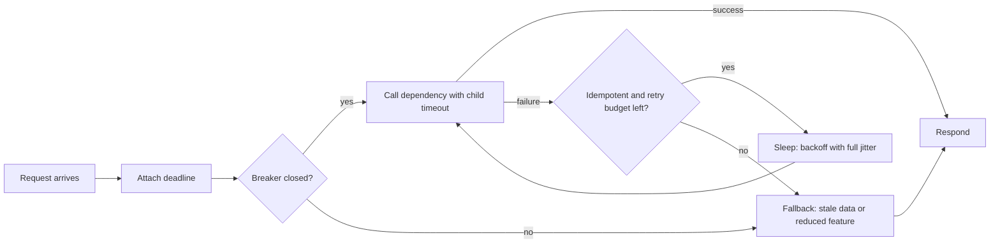
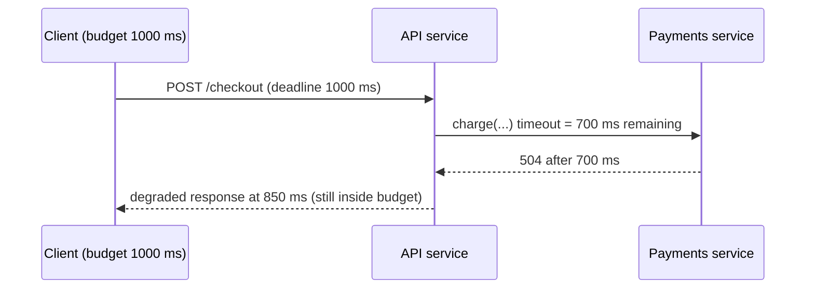
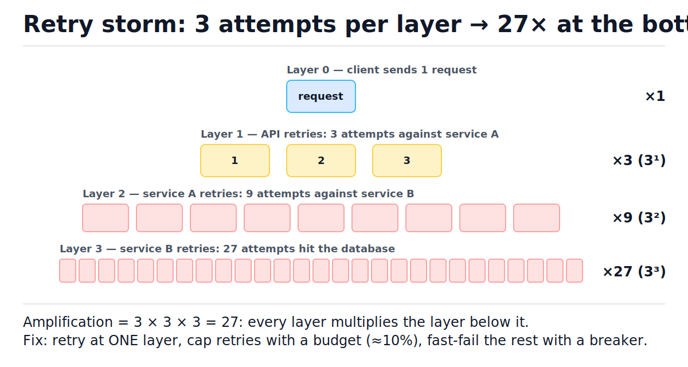
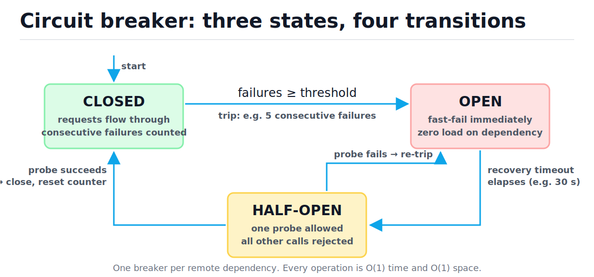
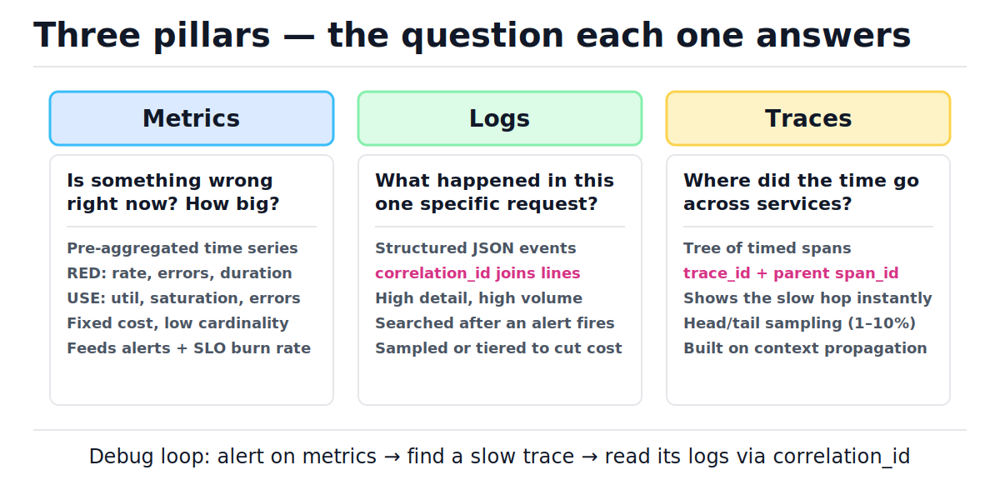

# Reliability and Observability

[toc]

> **TL;DR:** Reliable systems assume every dependency will fail, and they contain the damage with deadlines, jittered retries, circuit breakers, bulkheads, and planned degradation tiers. Observability — metrics, structured logs, and distributed traces — is how you prove the system is meeting its SLO and find the broken piece in minutes instead of hours. The error budget derived from the SLO is the contract that decides whether the team ships features or stops to fix reliability.

## Vocabulary

**Service level indicator (SLI)**

```math
\text{SLI} = \frac{\text{good events}}{\text{valid events}}
```

A measured ratio of good events to valid events over a window — e.g. "fraction of HTTP requests that return non-5xx in under 300 ms". An SLI is a measurement, not a goal.

**Service level objective (SLO)**

```math
\text{SLO}: \quad \text{SLI} \ge 99.9\% \text{ over a rolling 30 days}
```

The internal target the team commits to for an SLI. The SLO drives alerting, the error budget, and release decisions.

**Service level agreement (SLA)**

```math
\text{SLA threshold} < \text{SLO target}
```

The external, contractual promise to customers, with financial penalties (credits) when violated. The SLA is always looser than the SLO so the team breaches its own target before it breaches the contract.

**Error budget**

```math
B = (1 - \text{SLO}) \times \text{window}
```

The amount of allowed badness. A 99.9% monthly SLO leaves a budget of about 43.8 minutes of full downtime (or the equivalent in partial errors) per month.

**Burn rate**

```math
\text{burn} = \frac{\text{observed error rate}}{1 - \text{SLO}}
```

How fast the budget is being consumed relative to plan. Burn rate 1 means the budget lasts exactly the window; burn rate 14.4 sustained for 1 hour eats about 2% of a 30-day budget.

**Deadline (timeout)**

```math
t_{\text{child}} \le t_{\text{parent}} - t_{\text{overhead}}
```

The maximum time a caller will wait for a remote call. Each hop hands the next hop only the budget that remains, minus its own overhead.

**Idempotent operation**

```math
f(f(x)) = f(x)
```

An operation that produces the same final state whether applied once or many times. Only idempotent operations may be blindly retried.

**Exponential backoff with full jitter**

```math
d_i \sim \text{Uniform}\bigl(0,\ \min(c,\ b \cdot 2^{i})\bigr)
```

The wait before retry attempt i: a random draw from zero up to a capped, exponentially growing window. The randomness desynchronizes clients so they do not retry in lockstep.

**Retry budget**

```math
\text{retries} \le \beta \times \text{requests}, \qquad \beta \approx 0.1
```

A cap on retries as a fraction of total requests. It bounds retry amplification system-wide regardless of per-call retry settings.

**Circuit breaker**

```math
\text{closed} \xrightarrow{\text{failures} \ge k} \text{open} \xrightarrow{\text{timeout}} \text{half-open} \to \{\text{closed}, \text{open}\}
```

A per-dependency state machine that stops calling a failing dependency entirely, then probes it occasionally until it recovers.

**Bulkhead**

```math
\text{pool}_i \cap \text{pool}_j = \varnothing
```

Isolated resource pools (threads, connections, semaphore slots) per dependency, so one slow dependency cannot exhaust the resources every other code path needs.

**RED method**

```math
(\text{Rate},\ \text{Errors},\ \text{Duration})
```

The three metrics to record for every service endpoint: request rate, error rate, and latency distribution. Answers "is the service healthy from the caller's point of view?"

**USE method**

```math
(\text{Utilization},\ \text{Saturation},\ \text{Errors})
```

The three metrics to record for every resource (CPU, disk, connection pool, queue). Answers "is a resource about to become the bottleneck?"

**Span**

```math
\text{span} = (\text{trace\_id},\ \text{span\_id},\ \text{parent\_id},\ t_{\text{start}},\ t_{\text{end}})
```

One timed operation inside a distributed trace. Spans form a tree per request: the trace shows where the wall-clock time went across services.

## Intuition

Treat every remote call as a thing that *will* time out, error, or hang — the only question is what your service does when it happens. The reliable answer is a fixed pipeline: attach a deadline, check the circuit breaker, call with a child timeout, retry only if the operation is idempotent and the retry budget allows it, and fall back to degraded output instead of an error page. Observability is the mirror image: it is how you find out, fast, which of those mechanisms fired and why.



## Designing for failure: SLI, SLO, SLA

Reliability work starts with a number, not a pattern. You pick an SLI that reflects user happiness, set an SLO target for it, and let the gap between 100% and the SLO — the error budget — fund both planned changes and unplanned failures. Everything else in this note (timeouts, retries, breakers) exists to keep the SLI above the SLO.

### The availability table

Each extra "nine" cuts allowed downtime by 10× and roughly multiplies engineering cost by the same factor. Memorize the 30-day column — it comes up in every capacity and design review. The numbers below use the average Gregorian month of 30.44 days (43,830 minutes).

| Availability | Downtime / month | Downtime / year | What it implies |
| :--- | ---: | ---: | :--- |
| 99% ("two nines") | 7.31 h | 3.65 days | manual recovery is fine |
| 99.9% | 43.8 min | 8.77 h | typical internal-service SLO |
| 99.95% | 21.9 min | 4.38 h | common public SaaS SLA |
| 99.99% | 4.38 min | 52.6 min | automated failover required; humans are too slow |
| 99.999% | 26.3 s | 5.26 min | multi-region, zero human in the loop |

The arithmetic is one line, and worth verifying once yourself:

```python
MINUTES_PER_MONTH = 365.25 * 24 * 60 / 12      # 43,830: average Gregorian month


def downtime_per_month_minutes(slo_percent: float) -> float:
    """Allowed downtime per month for a given availability target. O(1)."""
    return MINUTES_PER_MONTH * (1.0 - slo_percent / 100.0)


assert round(downtime_per_month_minutes(99.0), 1) == 438.3        # ~7.3 hours
assert round(downtime_per_month_minutes(99.9), 1) == 43.8
assert round(downtime_per_month_minutes(99.99), 2) == 4.38
assert round(downtime_per_month_minutes(99.999) * 60, 1) == 26.3  # in seconds
```

> [!NOTE]
> The SLA is a *business* document, not an engineering target. Engineering aims at the SLO; the SLA sits below it as a buffer. If your SLA says 99.9%, your SLO is probably 99.95% — breaching the SLO pages an engineer, breaching the SLA writes refund checks.

### Error budgets: the release-velocity contract

The error budget reframes reliability as a spendable resource shared by feature work and failures. A 99.9% SLO over 30 days grants about 43.8 minutes of downtime-equivalent; deploys, migrations, and incidents all draw from the same account. The contract: while budget remains, ship as fast as you like; when it is exhausted, feature releases freeze and the team works only on reliability until the window rolls over. This removes the developers-versus-SRE argument — the number decides.

Alerting works off burn rate rather than raw error counts, because a fixed error threshold is either too noisy at low traffic or too slow at high traffic:

```math
\text{burn} = \frac{\text{observed error rate}}{1 - \text{SLO}}
\qquad
\text{e.g. } \frac{1.44\%}{0.1\%} = 14.4 \Rightarrow \text{2\% of the 30-day budget gone in 1 hour}
```

The Google SRE Workbook's standard policy: page on a fast burn (14.4× over 1 h) and ticket on a slow burn (1× over 3 days), each confirmed by a shorter secondary window to cut false alarms.

## How it works

The mechanisms below compose into the pipeline from the Intuition diagram. Each one is O(1) per call; their value is in what they prevent, not what they compute. Order matters: deadlines bound everything, retries operate inside the deadline, the breaker sits in front of retries, and bulkheads cap concurrency around the whole thing.

### Timeouts: every remote call gets a deadline

A missing timeout is an unbounded queue of waiting callers — the default in most HTTP and DB clients is "wait forever", which converts a slow dependency into thread exhaustion in *your* service. Timeouts are derived, not invented: the entry point owns a total budget (say 1 s for checkout), and each hop passes downstream only what remains, minus its own overhead. gRPC propagates this automatically as a deadline; with plain HTTP you forward it in a header.

```python
import time
from typing import Callable


class Deadline:
    """Remaining-time budget for one request as it fans out. All ops O(1)."""

    def __init__(self, budget_s: float, clock: Callable[[], float] = time.monotonic):
        self._clock = clock
        self._expires_at = clock() + budget_s

    def remaining(self) -> float:
        return max(0.0, self._expires_at - self._clock())

    def child_timeout(self, overhead_s: float = 0.05) -> float:
        """Timeout to hand the next hop: what's left, minus our own overhead."""
        return max(0.0, self.remaining() - overhead_s)


now = [0.0]                                   # fake clock for deterministic tests
d = Deadline(1.0, clock=lambda: now[0])
assert abs(d.child_timeout() - 0.95) < 1e-9   # 1.0 s budget minus 50 ms overhead
now[0] = 0.7                                  # 700 ms already spent upstream
assert abs(d.child_timeout() - 0.25) < 1e-9   # the next hop gets only what's left
now[0] = 2.0
assert d.remaining() == 0.0                   # budget gone: fail now, don't call
```



> [!IMPORTANT]
> A child's timeout must always be shorter than its parent's remaining budget. If the child is allowed to wait longer than the parent, the parent gives up first, retries, and now two copies of the same work are running — the seed of a retry storm.

Set the actual values from the dependency's measured p99 plus headroom, then check the chain still fits inside the entry budget. A timeout below p99 means you cancel ~1% of *healthy* requests.

### Retries: idempotent only, backoff with full jitter

A retry is a bet that the failure was transient (packet loss, a single bad replica, a GC pause). The bet is only safe when the operation is idempotent — reads, PUT-style upserts, or writes carrying an idempotency key. Two more rules make retries safe at scale: wait with exponential backoff *plus jitter* so clients don't synchronize, and cap total retries with a budget so they can't multiply an outage.

```python
import random
from typing import Optional


def backoff_full_jitter(
    attempt: int,
    base_s: float = 0.1,
    cap_s: float = 10.0,
    rng: Optional[random.Random] = None,
) -> float:
    """Sleep before retry number `attempt` (0-indexed). O(1) time."""
    rng = rng or random.Random()
    window = min(cap_s, base_s * (2 ** attempt))
    return rng.uniform(0.0, window)


class RetryBudget:
    """Allow retries only while they stay under a fixed fraction of requests."""

    def __init__(self, ratio: float = 0.1):
        self.ratio = ratio
        self.requests = 0
        self.retries = 0

    def record_request(self) -> None:
        self.requests += 1

    def can_retry(self) -> bool:
        return self.retries < self.ratio * self.requests

    def record_retry(self) -> None:
        self.retries += 1


rng = random.Random(42)
samples = [backoff_full_jitter(a, rng=rng) for a in range(8)]
for attempt, s in enumerate(samples):
    assert 0.0 <= s <= min(10.0, 0.1 * 2 ** attempt)   # always inside the window
assert min(10.0, 0.1 * 2 ** 7) == 10.0                 # cap kicks in at attempt 7

budget = RetryBudget(ratio=0.1)
for _ in range(100):
    budget.record_request()
allowed = 0
while budget.can_retry():
    budget.record_retry()
    allowed += 1
assert allowed == 10        # at most 10% of 100 requests may be retries
```

The seeded run above produces this schedule — note the window doubling and the sample landing anywhere inside it:

| Step (attempt) | Window max (s) | Sampled sleep (s) | Decision |
| :---: | ---: | ---: | :--- |
| 0 | 0.100 | 0.064 | retry after short, randomized wait |
| 1 | 0.200 | 0.005 | jitter can draw near zero — that is the point |
| 2 | 0.400 | 0.110 | window doubled, draw stayed small |
| 3 | 0.800 | 0.179 | still uncorrelated with other clients |
| 7 | 10.000 | 0.869 | window capped at 10 s |

Why jitter matters: with plain exponential backoff, every client that failed at time T retries at T+1, T+2, T+4 — synchronized waves that re-overload the recovering dependency. Full jitter spreads each wave uniformly across its window.

Now the failure mode retries create. If every layer of a call chain retries independently, attempts multiply per layer. The figure below shows one client request becoming 27 database attempts: each of three layers makes up to 3 attempts, and each attempt at one layer fans out into 3 at the next.



```math
\text{attempts at depth } L = r^{L}
\qquad
r = 3,\ L = 3: \quad 3 \times 3 \times 3 = 27\times \text{ load on the deepest service}
```

> [!CAUTION]
> Never blind-retry a non-idempotent write. A payment `charge()` that timed out may have *succeeded* — the response was lost, not the work. Retrying double-charges the customer. Fix it with an idempotency key: the client sends a unique key per logical operation and the server deduplicates on it.

> [!TIP]
> Full jitter — `sleep = rand(0, min(cap, base · 2^attempt))` — is the production default; AWS's analysis (Marc Brooker, 2015) showed it finishes contended workloads with the fewest total calls versus plain or partial jitter. Also honor explicit backpressure: a 429 or 503 with `Retry-After` means *stop*, not "retry harder".

### Circuit breakers: the three-state machine

Retries handle one flaky call; circuit breakers handle a dependency that is *down*. After a threshold of consecutive failures the breaker opens and every call fast-fails locally — zero added load on the dependency, zero threads parked in timeouts, and your latency stays flat while it recovers. After a recovery timeout, the breaker lets exactly one probe through (half-open); success closes the circuit, failure re-opens it. Study the figure: three states, four transitions, nothing else.



```python
import time
from typing import Callable

CLOSED, OPEN, HALF_OPEN = "closed", "open", "half_open"


class CircuitBreaker:
    """Per-dependency three-state breaker. Every method is O(1)."""

    def __init__(
        self,
        failure_threshold: int = 5,
        recovery_timeout_s: float = 30.0,
        clock: Callable[[], float] = time.monotonic,
    ):
        self.failure_threshold = failure_threshold
        self.recovery_timeout_s = recovery_timeout_s
        self.clock = clock
        self.state = CLOSED
        self.failures = 0
        self.opened_at = 0.0

    def allow_request(self) -> bool:
        if self.state == CLOSED:
            return True
        if self.state == OPEN and self.clock() - self.opened_at >= self.recovery_timeout_s:
            self.state = HALF_OPEN
            return True                  # exactly one probe gets through
        return False                     # OPEN before timeout, or probe in flight

    def record_success(self) -> None:
        self.failures = 0
        self.state = CLOSED

    def record_failure(self) -> None:
        if self.state == HALF_OPEN:      # the probe failed: straight back to open
            self._trip()
            return
        self.failures += 1
        if self.failures >= self.failure_threshold:
            self._trip()

    def _trip(self) -> None:
        self.state = OPEN
        self.failures = 0
        self.opened_at = self.clock()


now = [0.0]
cb = CircuitBreaker(failure_threshold=3, recovery_timeout_s=30.0, clock=lambda: now[0])

assert cb.state == CLOSED and cb.allow_request()
for _ in range(3):
    cb.record_failure()
assert cb.state == OPEN
assert not cb.allow_request()            # fast-fail: no load on the dependency

now[0] = 30.0                            # recovery timeout elapses
assert cb.allow_request()                # exactly one probe allowed
assert cb.state == HALF_OPEN
assert not cb.allow_request()            # a second concurrent probe is rejected

cb.record_failure()                      # probe failed -> re-trip
assert cb.state == OPEN

now[0] = 60.0
assert cb.allow_request()                # next probe window
cb.record_success()
assert cb.state == CLOSED and cb.allow_request()
```

Step-by-step trace of that exact run:

| Step | Event (fake clock) | failures | State after | allow_request? |
| :---: | :--- | :---: | :--- | :--- |
| 1 | call fails (t=0) | 1 | closed | yes |
| 2 | call fails | 2 | closed | yes |
| 3 | call fails — threshold hit | 0 | **open**, opened_at=0 | no |
| 4 | call attempted at t=10 | 0 | open | no — fast-fail, dependency untouched |
| 5 | call attempted at t=30 | 0 | **half-open** | yes — single probe |
| 6 | probe fails | 0 | **open**, opened_at=30 | no |
| 7 | call attempted at t=60 | 0 | **half-open** | yes — next probe |
| 8 | probe succeeds | 0 | **closed** | yes — normal traffic resumes |

Production breakers refine this skeleton: trip on a failure *rate* over a sliding window instead of a consecutive count, allow N probes in half-open, and emit a metric on every state change so dashboards show which dependency is open.

### Bulkheads: isolate the blast radius

A breaker protects you from a dead dependency; a bulkhead protects you from a *slow* one. If all handlers share one thread pool and one connection pool, a dependency that takes 30 s to answer parks every worker, and unrelated endpoints die with it. The fix is naval architecture: separate, fixed-size pools per dependency, so flooding one compartment cannot sink the ship. A semaphore is the minimal implementation.

```python
import threading


class Bulkhead:
    """Cap concurrent calls to one dependency. acquire/release are O(1)."""

    def __init__(self, max_concurrent: int):
        self._sem = threading.BoundedSemaphore(max_concurrent)

    def try_acquire(self) -> bool:
        return self._sem.acquire(blocking=False)   # full pool -> reject, don't queue

    def release(self) -> None:
        self._sem.release()


bh = Bulkhead(max_concurrent=2)
assert bh.try_acquire() and bh.try_acquire()   # two slots for the payments pool
assert not bh.try_acquire()                    # third caller rejected instantly
bh.release()
assert bh.try_acquire()                        # freed slot is reusable
```

Size each pool from Little's law: concurrency = arrival rate × call duration. A dependency called 100 times/s at p99 = 200 ms needs about 20 slots plus headroom; give it 30, not 300.

### Graceful degradation: planned quality tiers

Degradation is a product decision made in advance, not an exception handler written during the incident. Decide per feature what the cheaper version is, wire it behind the breaker/fallback path, and *test it regularly* — an unexercised fallback is a second outage waiting. The standard ladder has four rungs.

| Tier | Trigger | User sees | Example |
| :---: | :--- | :--- | :--- |
| 0 — full service | healthy | everything | live, personalized recommendations |
| 1 — serve stale | dependency slow or erroring | slightly old data | cached feed; stale-while-revalidate |
| 2 — drop features | error budget burning fast | core flow only | checkout works, recommendations hidden |
| 3 — static fallback | hard outage | canned response | static page; writes queued for replay |

Tier 1 leans on caching (see [Caching strategies](./05-caching-strategies.md)); tier 3's "queue writes for replay" leans on durable queues (see [Message queues and event-driven architecture](./08-message-queues-and-event-driven-architecture.md)).

## Observability: metrics, logs, traces

You cannot operate what you cannot see. The three pillars are not redundant copies of the same data — each answers a different question at a different cost, and the debugging workflow chains them in a fixed order: a metric alert tells you *that* something is wrong, a trace tells you *where*, and the logs for that correlation ID tell you *why*. The figure summarizes the division of labor.



### Metrics: RED for services, USE for resources

Metrics are pre-aggregated time series: cheap to store, cheap to query, and the only pillar you can afford to alert on. Two checklists cover almost everything. RED instruments every *service* from its callers' perspective; USE instruments every *resource* that can saturate.

| Method | Applies to | Signals | Question answered |
| :--- | :--- | :--- | :--- |
| RED | every service / endpoint | Rate, Errors, Duration (latency histogram) | "Is the service healthy as seen by callers?" |
| USE | every resource (CPU, disk, pool, queue) | Utilization, Saturation, Errors | "Which resource is about to be the bottleneck?" |

Record Duration as a histogram, never an average: an average hides the p99, and your SLO is defined on a percentile. Saturation (queue depth, pool wait time) is the leading indicator — utilization tells you a resource is busy, saturation tells you work is *waiting*.

### Structured logs and correlation IDs

A log line is an event; its value is being findable. Two rules: emit JSON (machine-parseable fields, not prose), and stamp every line with the correlation ID minted at the edge so one request's story can be reassembled across services with a single query. In Python, `contextvars` carries the ID through both threads and asyncio tasks without threading it through every function signature.

```python
import json
import time
import uuid
from contextvars import ContextVar

correlation_id: ContextVar[str] = ContextVar("correlation_id", default="")


def start_request() -> str:
    """Mint (or accept from an inbound header) the request's correlation ID."""
    cid = uuid.uuid4().hex
    correlation_id.set(cid)
    return cid


def log_event(operation: str, status: str, duration_ms: float, **fields: object) -> str:
    record = {
        "ts": time.time(),
        "correlation_id": correlation_id.get(),
        "operation": operation,
        "status": status,
        "duration_ms": duration_ms,
    }
    record.update(fields)
    return json.dumps(record)


cid = start_request()
line = log_event("charge_card", "error", 412.0, retry_attempt=2)
parsed = json.loads(line)
assert parsed["correlation_id"] == cid       # same ID on every line of the request
assert parsed["retry_attempt"] == 2          # structured fields, queryable as-is
```

Log state transitions and decisions (breaker opened, retry scheduled, fallback served), not per-iteration noise. Never log secrets, tokens, or raw PII.

### Distributed tracing: spans

A trace is a tree of spans sharing one trace ID; each span records a service, an operation, a parent, and start/end timestamps. Context (trace ID + parent span ID) propagates in request headers — W3C `traceparent` is the standard, OpenTelemetry the standard SDK. Traces answer the question metrics and logs cannot: across five services, *which hop* spent the time?

| Span | Service | Parent | Start (ms) | Duration (ms) |
| :--- | :--- | :---: | ---: | ---: |
| POST /checkout | api | — | 0 | 980 |
| charge | payments | POST /checkout | 40 | 870 |
| SELECT account | payments-db | charge | 60 | 12 |
| call card processor | payments | charge | 90 | 800 |

Reading the table: the 980 ms request spent 800 ms inside the external card-processor call — the database (12 ms) is innocent. That conclusion took one glance; with logs alone it takes an hour of timestamp archaeology. Tracing every request is too expensive at volume, so production systems sample — head sampling (decide at the edge, e.g. 1–10%) or tail sampling (keep only slow/error traces).

## Health checks

Health checks are how orchestrators and load balancers decide where traffic goes, which makes a wrong health check a traffic-engineering bug. There are three distinct checks with three distinct consumers, and conflating them causes outages. Kubernetes wires the first two as liveness and readiness probes — see [Kubernetes observability and production operations](../Infrastructure-DevOps/Kubernetes/12-observability-and-production-operations.md).

| Check | Question | Consumer | On failure |
| :--- | :--- | :--- | :--- |
| Liveness | Is this process wedged beyond recovery? | orchestrator (kubelet) | restart the container |
| Readiness | Can this instance serve right now? | load balancer / Service | remove from rotation, keep running |
| Deep | Are my dependencies healthy end-to-end? | dashboards, on-call humans | page someone — never auto-route on it |

> [!WARNING]
> The deep-health-check trap: if the load balancer consumes a check that pings the shared database, then a database blip makes *every* instance report unhealthy *simultaneously*. The LB empties the entire pool and a 5% degradation becomes a 100% outage. Deep checks inform humans; only shallow, instance-local checks should gate traffic.

Liveness checks must be dumb on purpose — "the event loop responds" — because the remedy is a restart, and restarting every pod because a *dependency* is down is a self-inflicted cascading failure.

## Complexity and cost

Every mechanism here is constant-time per call; what varies is the *systemic* cost when it is missing or misconfigured. The table prices both. The one bound worth deriving is retry amplification, because it is the difference between a blip and a metastable outage.

| Mechanism | Time per call | Space | Worst-case systemic cost if wrong |
| :--- | :--- | :--- | :--- |
| Deadline propagation | O(1) | O(1) per request | missing: unbounded thread/connection parking |
| Backoff w/ full jitter | O(1) compute; wait grows O(2^i), capped | O(1) | no jitter: synchronized retry waves |
| Naive nested retries | O(1) locally | O(1) | O(r^L) load amplification across L layers |
| Retry budget | O(1) | O(1) counters | uncapped: storm sustains the outage |
| Circuit breaker | O(1) all ops | O(1) per dependency | none: every caller rides the full timeout |
| Bulkhead (semaphore) | O(1) acquire | O(k) slots | shared pool: one slow dep starves all endpoints |
| Structured log line | O(F) fields | O(F) | unstructured: grep archaeology at 3 a.m. |
| Trace | O(S) spans per request | O(S) | unsampled: storage bill; missing: no cross-service view |
| Shallow health check | O(1) | O(1) | — |
| Deep health check | O(D) dependency calls | O(1) | gating traffic on it: cascading pool eviction |

The amplification bound: with r attempts per layer, each attempt at depth i fans out into r attempts at depth i+1, so attempts multiply layer by layer.

```math
A(L) = \underbrace{r \cdot r \cdots r}_{L \text{ layers}} = r^{L}
\qquad\qquad
A_{\text{budget}}(L) \le (1 + \beta)^{L} \quad\text{e.g. } (1.1)^{3} \approx 1.33
```

That is why the fix is structural, not parametric: lowering r from 3 to 2 still leaves exponential growth (2³ = 8×), while a retry *budget* of β = 10% turns the base of the exponent into 1.1 — effectively linear for realistic depths. Retry at one layer, budget the rest.

## In production

The patterns above fail in characteristic ways at scale, and most large outages are reliability mechanisms misfiring rather than the original fault. These are the modes worth recognizing on sight.

- **Metastable failure** — the trigger ends but the system stays down: retries and queued work keep the load above capacity, so recovery never gets a foothold (Bronson et al., HotOS 2021). The exit is load shedding — drop work until goodput returns — see [Rate limiting and load shedding](./10-rate-limiting-and-load-shedding.md).
- **Thundering herd** — caches expire together, cron jobs fire together, clients reconnect together after a deploy. Jitter every timer, TTL, and reconnect, not just retries.
- **Timeout inversion** — a child timeout longer than the parent's quietly guarantees duplicated work under load. Audit the chain end to end whenever a new hop is added.
- **Cardinality explosion** — one `user_id` label on a Prometheus counter mints a time series per user and takes down the monitoring system during the incident it was meant to observe. Metric labels must be low-cardinality by construction; per-user detail belongs in logs and traces.
- **Alert fatigue** — alerts on causes (CPU, single-pod restarts) page constantly and get muted; the SLO-based fix is paging only on symptoms users feel, i.e. error-budget burn rate.

> [!TIP]
> Alert on burn rate with two windows (e.g. 14.4× over 1 h confirmed by 5 min, 1× over 3 days confirmed by 6 h). Fast burns page, slow burns ticket, and a one-minute blip on a 30-day SLO wakes nobody. This is the Google SRE Workbook's recommended starting policy.

## Real-world example

A checkout service calls a payment gateway that has just started timing out on every request. With breaker + fallback, the first three failures trip the circuit; from then on checkout responds instantly with a "order accepted, charging shortly" degraded page (the charge is queued for async retry), and the gateway gets probed once per recovery window until it heals. The simulation below scripts the gateway's behavior and asserts the whole arc — it reuses `CircuitBreaker` from above.

```python
from typing import List


class FlakyPayments:
    """Scripted dependency: fails the first 5 calls, then recovers."""

    def __init__(self, outcomes: List[bool]):
        self.outcomes = outcomes
        self.calls = 0

    def charge(self, order_id: str) -> bool:
        ok = self.outcomes[min(self.calls, len(self.outcomes) - 1)]
        self.calls += 1
        if not ok:
            raise TimeoutError("payment gateway timed out: " + order_id)
        return True


def checkout(order_id: str, payments: FlakyPayments, breaker: CircuitBreaker) -> str:
    if not breaker.allow_request():
        return "degraded"                # fast-fail -> queue charge, show fallback
    try:
        payments.charge(order_id)
    except TimeoutError:
        breaker.record_failure()
        return "degraded"
    breaker.record_success()
    return "charged"


now = [0.0]
breaker = CircuitBreaker(failure_threshold=3, recovery_timeout_s=30.0,
                         clock=lambda: now[0])
payments = FlakyPayments([False] * 5 + [True] * 10)

results = [checkout("order-" + str(i), payments, breaker) for i in range(3)]
assert results == ["degraded"] * 3 and breaker.state == OPEN   # tripped at 3

assert checkout("order-3", payments, breaker) == "degraded"    # circuit open...
assert payments.calls == 3            # ...so the gateway saw ZERO extra traffic

now[0] = 31.0                                                  # probe window 1
assert checkout("order-4", payments, breaker) == "degraded"    # probe fails
assert breaker.state == OPEN

now[0] = 62.0                                                  # probe window 2
assert checkout("order-5", payments, breaker) == "degraded"    # still failing

now[0] = 93.0                                                  # gateway recovered
assert checkout("order-6", payments, breaker) == "charged"
assert breaker.state == CLOSED                                 # back to normal
```

The load-shaping result is the headline: during the outage the gateway received exactly 3 real calls plus 1 probe per 30-second window, instead of the full checkout traffic times its retry multiplier. Users got a degraded-but-working page the whole time, and the SLI never saw a 5xx.

## When to use / when NOT to use

These mechanisms are not free — each adds configuration that can itself be wrong. Apply them where the failure math says they pay.

- **Retries** — use for transient faults on idempotent operations with jitter and a budget. Do NOT use for non-idempotent writes without an idempotency key, and never retry into explicit backpressure (429/503): the dependency is telling you it is overloaded.
- **Circuit breakers** — use in front of every remote dependency that has a viable fallback (stale cache, queue, reduced feature). Do NOT bother for in-process calls, or where fast-failing equals failing — a breaker with no fallback just makes the error message faster.
- **Bulkheads** — use when one process talks to multiple dependencies with different latency profiles. Do NOT over-partition a small pool into slivers too tiny to absorb normal bursts.
- **Deep health checks** — use for dashboards and human diagnosis. Do NOT wire them into load-balancer routing or liveness restarts.
- **Error budgets** — use when the organization will actually honor the release freeze. Do NOT bother publishing an SLO nobody enforces; it becomes decoration.

## Common mistakes

- **"More nines are always better"** — each nine roughly 10×es the cost and constrains every dependency below you (your service cannot be more available than the things it synchronously depends on). Pick the cheapest SLO users will tolerate.
- **"Retries improve reliability"** — they improve *transient-blip* reliability and actively worsen overload. Unbudgeted retries are the fuel of metastable failures.
- **"Set the timeout to 2× the average latency"** — averages hide the tail; a timeout near p50 cancels healthy requests constantly. Derive from the caller's budget and the dependency's p99.
- **"The SLA is our engineering target"** — the SLA is the floor with money attached; the SLO sits above it so engineering breaches first and cheaply.
- **"Liveness should check the database"** — then a DB blip restarts every pod in the fleet at once, on top of the DB outage. Liveness checks the process, nothing else.
- **"We log everything, so we're observable"** — logs alone can't alert cheaply (that's metrics) or localize cross-service latency (that's traces). Pillars answer different questions.
- **"The breaker is open, the dependency must still be down"** — half-open exists precisely because "down" is a hypothesis to re-test, cheaply, with one probe instead of full traffic.

## Interview questions and answers

The interviewer setup, then how I'd answer out loud.

**1. What's the difference between an SLI, an SLO, and an SLA?**
**Answer:** The SLI is the measurement — say, the fraction of requests under 300 ms without a 5xx. The SLO is our internal target for that measurement, like 99.9% over 30 days; it drives alerts and the error budget. The SLA is the external contract with penalties, and it's deliberately looser than the SLO so we breach our own target before we owe customers money.

**2. Your service has a 99.9% monthly SLO. How much downtime is that, and what's the error budget for?**
**Answer:** About 43.8 minutes a month. The budget is a spending account shared by everything risky — deploys, migrations, incidents. While there's budget left we ship fast; when it's gone we freeze features and do reliability work until the window rolls. It turns the ship-versus-stabilize argument into arithmetic.

**3. How do you set timeouts across a chain of services?**
**Answer:** Top-down from the entry budget, not bottom-up from gut feeling. The edge owns, say, one second; each hop passes the remaining budget minus its own overhead, so children always time out before parents. Then I sanity-check each hop's slice against that dependency's p99 — if the slice is below p99 I'm canceling healthy work, and the budget or the chain has to change.

**4. When is it safe to retry, and how do you prevent retry storms?**
**Answer:** Retry only idempotent operations — reads, or writes with an idempotency key — and only on transient errors, never on 429s or business failures. Backoff exponentially with full jitter so clients desynchronize. Then cap globally: retries at one layer of the stack only, plus a retry budget around 10% of requests. Without that, three layers of three attempts is 27× load on the bottom service — exponential in depth.

**5. Walk me through a circuit breaker's states.**
**Answer:** Closed is normal: traffic flows, failures count. At a threshold it trips open: every call fast-fails locally so the dependency gets zero load and we serve a fallback. After a recovery timeout it goes half-open and lets exactly one probe through — success closes it and resets the counter, failure re-opens it. The point is converting a hanging dependency into an instant, cheap local decision.

**6. RED versus USE — when do you use each?**
**Answer:** RED — rate, errors, duration — is for services, measured from the caller's perspective, and it's what SLOs are written against. USE — utilization, saturation, errors — is for resources like CPU, connection pools, and queues, and it's where I look for the *cause* once RED says something's wrong. Saturation is the early-warning signal: it means work is queueing, not just that the resource is busy.

**7. Liveness versus readiness, and why are deep health checks dangerous?**
**Answer:** Liveness asks "is this process wedged?" and the remedy is a restart, so it must check only the process itself. Readiness asks "can I serve right now?" and the remedy is removal from the load balancer. The deep-check danger: if routing depends on a check that pings a shared database, a DB blip fails every instance's check simultaneously, the LB drains the whole pool, and a partial degradation becomes a total outage. Deep checks belong on dashboards.

**8. p99 latency tripled across a five-service chain. How do you find the culprit?**
**Answer:** Distributed tracing, directly — pull slow traces from the alert window and read the span tree; the hop that grew is visually obvious. Then I pivot to that service's USE metrics to find the saturated resource, and to its logs filtered by the trace's correlation IDs for the why. Metrics told me *that*, the trace told me *where*, logs tell me *why* — that's the standard loop.

## Practice path

1. Recompute the availability table by hand for 99%, 99.9%, 99.95%, and 99.99% — per month and per year — then check against the Python above.
2. Reimplement `backoff_full_jitter` from memory; print the windows for attempts 0–7 and confirm the cap engages at attempt 7.
3. Reimplement the circuit breaker from the state diagram alone, then write tests for all four transitions before looking at the version here.
4. Take a three-hop chain with a 1 s edge budget and 50 ms per-hop overhead; assign every timeout, then verify no child can outlive its parent.
5. Add correlation-ID JSON logging to a toy web service and reconstruct one request's full story with a single grep.
6. Write the SLO, error budget, and two-window burn-rate alerts for the [URL shortener case study](./14-case-study-url-shortener.md).
7. Run a local OpenTelemetry collector, trace a two-service toy app, and find the slowest span without reading any logs.

## Copyable takeaways

- SLI is the measurement, SLO the internal target, SLA the looser external contract. Error budget = (1 − SLO) × window; 99.9%/month ≈ 43.8 min.
- Burn rate = observed error rate ÷ (1 − SLO). Page on fast burn (14.4× / 1 h), ticket on slow burn (1× / 3 days).
- Every remote call gets a timeout derived from the caller's budget; children must die before parents.
- Retry only idempotent ops, with full jitter and a ~10% retry budget; nested naive retries amplify load by r^L (3 layers × 3 attempts = 27×).
- Circuit breaker: closed → open at the failure threshold → half-open probe after the recovery timeout → closed on success. Everything O(1).
- Bulkheads give each dependency its own bounded pool; size from Little's law (rate × duration).
- Degrade in planned tiers: stale → fewer features → static fallback. Test the fallbacks.
- Metrics (RED/USE) say *that*, traces say *where*, logs with correlation IDs say *why* — alert only on metrics, and only on symptoms.
- Liveness restarts the process, readiness gates traffic, deep checks inform humans — never let a shared-dependency check drain the load-balancer pool.

## Sources

- Google SRE Book — ch. 3 "Embracing Risk", ch. 4 "Service Level Objectives", ch. 21 "Handling Overload", ch. 22 "Addressing Cascading Failures": https://sre.google/sre-book/table-of-contents/
- Google SRE Workbook — "Alerting on SLOs" (burn-rate policies): https://sre.google/workbook/alerting-on-slos/
- Marc Brooker, "Exponential Backoff And Jitter", AWS Architecture Blog (2015): https://aws.amazon.com/blogs/architecture/exponential-backoff-and-jitter/
- AWS Builders Library — "Timeouts, retries, and backoff with jitter" and "Implementing health checks": https://aws.amazon.com/builders-library/
- Michael T. Nygard, *Release It!* (2nd ed., 2018) — circuit breaker and bulkhead patterns.
- Sigelman et al., "Dapper, a Large-Scale Distributed Systems Tracing Infrastructure", Google Technical Report (2010): https://research.google/pubs/pub36356/
- Brendan Gregg, "The USE Method": https://www.brendangregg.com/usemethod.html
- Tom Wilkie, "The RED Method: How to Instrument Your Services" (2017): https://grafana.com/blog/2018/08/02/the-red-method-how-to-instrument-your-services/
- Bronson et al., "Metastable Failures in Distributed Systems", HotOS (2021): https://sigops.org/s/conferences/hotos/2021/papers/hotos21-s11-bronson.pdf

## Related

- [Rate limiting and load shedding](./10-rate-limiting-and-load-shedding.md) — the overload-side complement: shedding is how you escape metastable failure.
- [Caching strategies](./05-caching-strategies.md) — serve-stale is degradation tier 1.
- [Message queues and event-driven architecture](./08-message-queues-and-event-driven-architecture.md) — durable queues back the "accept now, process later" fallback.
- [Scaling fundamentals](./04-scaling-fundamentals.md) — capacity headroom is the zeroth reliability mechanism.
- [Kubernetes observability and production operations](../Infrastructure-DevOps/Kubernetes/12-observability-and-production-operations.md) — liveness/readiness probes and cluster-level monitoring in practice.
- [TCP and UDP](../Computer-Networking/5-tcp-and-udp.md) — transport-layer timeouts and retransmission, the OS-level cousins of these patterns.
