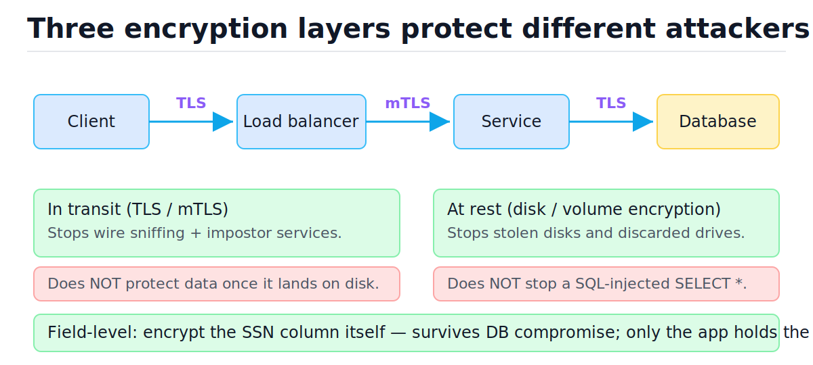
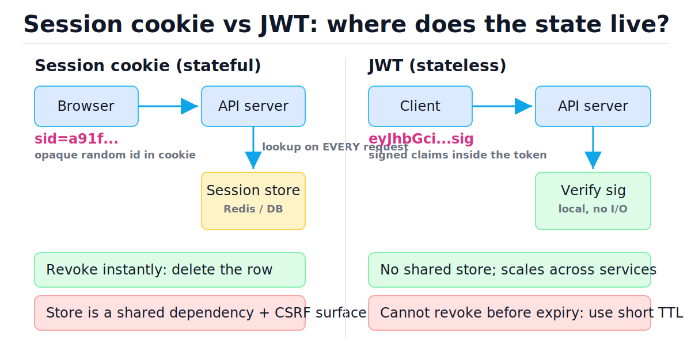
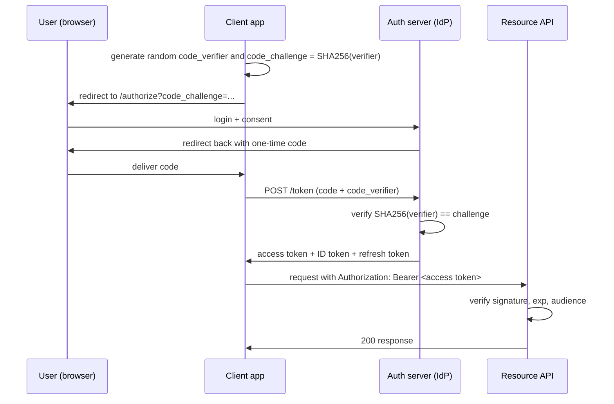

# Security in System Design

[toc]

> **TL;DR:** Security is an architectural property, not a feature you bolt on before launch. The core decisions — how users prove identity (authn), how the system decides what they may touch (authz), where session state lives, how secrets and passwords are stored, and what is encrypted where — must be made when you draw the boxes, because retrofitting them means redesigning the boxes.

## Vocabulary

**Authentication (authn)**

```math
\text{authn}: \text{credentials} \rightarrow \text{identity}
```

Proving *who* a caller is. Password + MFA, an OIDC ID token, an mTLS client certificate. Happens once per session.

**Authorization (authz)**

```math
\text{authz}: (\text{identity}, \text{action}, \text{resource}) \rightarrow \{\text{allow}, \text{deny}\}
```

Deciding *what* an authenticated identity may do to a *specific* resource. Happens on every request, per object — not per endpoint.

**Session cookie**

```math
\text{cookie} = \text{sid} \;\; (\text{opaque, random, } \geq 128 \text{ bits entropy})
```

An opaque random identifier the browser sends automatically; the server looks up the real state (user id, roles, expiry) in a session store. Stateful, instantly revocable.

**JWT (JSON Web Token)**

```math
\text{JWT} = \text{base64url}(\text{header}) \,\|\, \text{base64url}(\text{claims}) \,\|\, \text{sign}_{k}(\text{header} \,\|\, \text{claims})
```

A self-contained signed token: the claims (user id, roles, expiry `exp`) travel inside it. Any service holding the verification key can validate it locally — no store lookup, but also no early revocation.

**Refresh token**

A long-lived, server-tracked credential exchanged for fresh short-lived access tokens. It restores revocability to a JWT architecture: kill the refresh token and the user is out within one access-token TTL.

**PKCE (Proof Key for Code Exchange)**

```math
\text{code\_challenge} = \text{base64url}(\text{SHA256}(\text{code\_verifier}))
```

An OAuth2 extension (RFC 7636) that binds the authorization code to the client that requested it, so an intercepted code is useless without the original random `code_verifier`.

**Key-stretching hash (bcrypt / scrypt / Argon2 / PBKDF2 class)**

```math
h = H^{(c)}(\text{password} \,\|\, \text{salt}), \quad c \approx 10^5 \ldots 10^6
```

A deliberately slow, salted, one-way function for password storage. The iteration count c is the knob: each doubling doubles the attacker's brute-force cost.

**IDOR (Insecure Direct Object Reference)**

Authorizing the endpoint ("user is logged in") but not the object ("user owns invoice 4821"). The attacker just increments the id.

**SSRF (Server-Side Request Forgery)**

Tricking your server into making HTTP requests on the attacker's behalf — typically at internal/metadata endpoints the attacker can't reach directly.

**Least privilege**

Every identity — human or service — gets the minimum permissions needed for its job, nothing more. Bounds the blast radius of any single compromise.

## Intuition

Think of security as concentric, independent walls — *defense in depth*. Authentication is the gate; authorization is the guard checking your badge against each door; encryption is the assumption that any single wall will eventually fail. Each layer must hold on its own, because each one defends against a *different* attacker: TLS stops the network sniffer, disk encryption stops the dumpster diver, field-level encryption stops the attacker who already owns your database.

The figure below shows where each encryption layer sits on a request path and — more importantly — what each one does **not** protect.



> [!IMPORTANT]
> "Encrypted at rest" does nothing against application-level attacks. A SQL injection runs *through* the app, which transparently decrypts everything. Each layer answers one threat; never let a checkbox on one layer excuse a missing layer.

## How it works

### Authentication vs authorization

These are different questions answered at different times, and conflating them is the root of most access-control bugs. Authn runs once at the edge (login, token verification); authz runs on every request, against the *specific resource* being touched. A clean design centralizes authn (one gateway or middleware) and pushes authz checks down next to the data they protect.

| Question | Mechanism | Frequency | Failure mode if skipped |
| :--- | :--- | :--- | :--- |
| Who are you? | Password+MFA, OIDC, mTLS cert | Once per session | Anonymous access |
| May *you* do *this* to *that*? | RBAC/ABAC check per object | Every request | IDOR, privilege escalation |

### Sessions vs JWTs — where state lives

The fundamental trade is *where the session state lives*. Server-side sessions keep state in a store (Redis, DB) keyed by an opaque cookie: revocation is a row delete, but every request pays a store lookup (O(1) hash lookup, but a network hop and a shared dependency). JWTs move the state into a signed token: verification is a local signature check (microseconds, no I/O), but you cannot un-sign a token — revocation before `exp` is impossible without reintroducing server state.



| Dimension | Server-side session | JWT |
| :--- | :--- | :--- |
| State location | Session store (Redis/DB) | Inside the token |
| Per-request cost | Network hop to store | Local signature verify |
| Instant revocation | Yes — delete the row | No — wait for `exp` |
| Horizontal scaling | Needs shared store | Free — any node verifies |
| Cross-service authn | Awkward (share the store) | Natural (share the public key) |
| CSRF exposure | Yes (cookie auto-sent) — need SameSite + tokens | No, if sent as `Authorization` header |
| XSS theft risk | Lower with `HttpOnly` cookie | Higher if stored in localStorage |
| Token size | ~32 bytes | 500–2000 bytes, sent every request |
| Best for | Monolith / single web app | Microservices, mobile, third-party APIs |

The industry-standard compromise: **short-lived access JWT (5–15 min) plus a server-tracked refresh token with rotation**. You get stateless verification on the hot path and bounded-time revocation through the refresh token.

> [!TIP]
> Refresh-token *rotation*: every refresh issues a new refresh token and invalidates the old one. If a stolen refresh token is replayed after the legitimate client already rotated, the server sees the reuse and revokes the whole family. This is the OAuth2 BCP recommendation for public clients.

### OAuth2 + OIDC: authorization code flow with PKCE

OAuth2 is a *delegation* protocol — "let app X act on my behalf at service Y" — and OIDC is the thin identity layer on top that adds a signed ID token, turning it into a login protocol. The authorization code flow with PKCE is the modern default for every client type: the user authenticates at the authorization server, the client receives a one-time code, and exchanges it (plus the PKCE verifier) for tokens over a back channel.



Which flow for which client:

| Client type | Flow | Why |
| :--- | :--- | :--- |
| Server-rendered web app | Auth code + PKCE (+ client secret) | Back channel can hold a secret |
| SPA / mobile app | Auth code + PKCE, no secret | Public client — can't keep secrets; PKCE replaces the secret |
| Service-to-service (no user) | Client credentials | No human in the loop |
| CLI / smart TV | Device authorization flow | No browser on the device |
| ~~Anything~~ | ~~Implicit flow / password grant~~ | Deprecated by OAuth 2.0 Security BCP |

### Password storage: slow, salted, one-way

Never store passwords reversibly, and never use a fast hash (MD5, SHA-256 alone) — GPUs compute billions of SHA-256 per second. Use a *key-stretching* function: Argon2id (preferred), bcrypt, scrypt, or PBKDF2, each with a unique random salt per user so identical passwords hash differently and rainbow tables die. The example below uses `hashlib.pbkdf2_hmac` from the standard library (same class of construction; in production prefer Argon2id via `argon2-cffi`).

```python
import hashlib
import hmac
import os
from typing import Tuple

ITERATIONS = 600_000  # OWASP 2023 floor for PBKDF2-HMAC-SHA256

def hash_password(password: str) -> Tuple[bytes, bytes]:
    salt = os.urandom(16)  # unique per user
    digest = hashlib.pbkdf2_hmac(
        "sha256", password.encode(), salt, ITERATIONS
    )
    return salt, digest

def verify_password(password: str, salt: bytes, stored: bytes) -> bool:
    candidate = hashlib.pbkdf2_hmac(
        "sha256", password.encode(), salt, ITERATIONS
    )
    # constant-time compare: defeats timing side channels
    return hmac.compare_digest(candidate, stored)

salt, stored = hash_password("correct horse battery staple")
assert verify_password("correct horse battery staple", salt, stored)
assert not verify_password("Tr0ub4dor&3", salt, stored)

# same password, different user -> different salt -> different hash
salt2, stored2 = hash_password("correct horse battery staple")
assert stored != stored2
```

A login flow with these pieces, traced step by step:

| Step | State | Decision |
| :--- | :--- | :--- |
| 1. POST /login | rate-limit counter for IP+username | Over limit? → 429, stop |
| 2. Fetch user row | salt + stored hash loaded | User missing? → still run a dummy hash (no timing oracle) |
| 3. PBKDF2 candidate | ~100 ms of deliberate work | Mismatch? → increment lockout counter, generic error |
| 4. `compare_digest` | constant-time equality | Match → reset counters |
| 5. Issue tokens | access JWT (10 min) + refresh token (rotated, stored) | Set cookie `HttpOnly; Secure; SameSite=Lax` |

### SQL injection: the parameterization contrast

Injection happens when user input is concatenated into the *code* channel instead of being passed in the *data* channel. The fix is structural, not sanitization: parameterized queries keep the query plan fixed and ship values separately, so `' OR '1'='1` is just an odd-looking string. This is runnable — note the vulnerable version returns every row.

```python
import sqlite3

conn = sqlite3.connect(":memory:")
conn.execute("CREATE TABLE users (id INTEGER PRIMARY KEY, name TEXT, secret TEXT)")
conn.execute("INSERT INTO users VALUES (1, 'alice', 's3cr3t'), (2, 'bob', 'hunter2')")

attacker_input = "nobody' OR '1'='1"

# VULNERABLE: input concatenated into the SQL text
vulnerable = "SELECT * FROM users WHERE name = '%s'" % attacker_input
leaked = conn.execute(vulnerable).fetchall()
assert len(leaked) == 2  # entire table leaked

# SAFE: parameterized — input stays in the data channel
safe = conn.execute(
    "SELECT * FROM users WHERE name = ?", (attacker_input,)
).fetchall()
assert leaked != safe
assert len(safe) == 0  # no user literally named "nobody' OR '1'='1"
```

> [!CAUTION]
> ORMs do not make you immune — `Model.objects.raw("... %s" % x)` and string-built `WHERE` fragments reintroduce injection. The rule is absolute: user input never appears in the SQL string, only in the parameter tuple. PostgreSQL uses `%s` placeholders via psycopg; SQLite uses `?` — same principle.

### IDOR: authorize the object, not the endpoint

The classic bug: `GET /invoices/4821` checks that the caller is logged in, then serves invoice 4821 to anyone. Authorization must compare the authenticated identity against the *owner of the specific row*. Bake the check into the data-access layer so it cannot be forgotten per-endpoint.

```python
import sqlite3
from typing import Optional, Tuple

conn = sqlite3.connect(":memory:")
conn.execute("CREATE TABLE invoices (id INTEGER PRIMARY KEY, owner_id INTEGER, total REAL)")
conn.execute("INSERT INTO invoices VALUES (4821, 7, 99.50), (4822, 8, 12.00)")

def get_invoice_idor(invoice_id: int) -> Optional[Tuple]:
    # BUG: no ownership check — any authenticated user reads any invoice
    return conn.execute(
        "SELECT * FROM invoices WHERE id = ?", (invoice_id,)
    ).fetchone()

def get_invoice(invoice_id: int, caller_user_id: int) -> Optional[Tuple]:
    # ownership enforced in the query itself — O(1) extra cost on an indexed lookup
    return conn.execute(
        "SELECT * FROM invoices WHERE id = ? AND owner_id = ?",
        (invoice_id, caller_user_id),
    ).fetchone()

assert get_invoice_idor(4821) is not None        # user 8 reads user 7's invoice
assert get_invoice(4821, 8) is None               # fixed: denied
assert get_invoice(4821, 7) is not None           # owner still works
```

### SSRF: when your server fetches URLs

Any feature that fetches a user-supplied URL — webhooks, link previews, image import — lets an attacker aim *your server* at targets only it can reach: `169.254.169.254` (cloud metadata, often holding IAM credentials), `localhost` admin ports, internal services. Defend with an **allowlist** of destinations where possible; otherwise resolve DNS first, reject private/link-local IPs, and re-check after redirects (DNS rebinding).

```python
import ipaddress
import socket
from urllib.parse import urlparse

def is_safe_webhook_url(url: str) -> bool:
    parsed = urlparse(url)
    if parsed.scheme != "https" or not parsed.hostname:
        return False
    try:
        infos = socket.getaddrinfo(parsed.hostname, None)
    except socket.gaierror:
        return False
    for info in infos:
        ip = ipaddress.ip_address(info[4][0])
        if ip.is_private or ip.is_loopback or ip.is_link_local or ip.is_reserved:
            return False
    return True

assert not is_safe_webhook_url("http://example.com/hook")          # not https
assert not is_safe_webhook_url("https://169.254.169.254/latest/")  # metadata endpoint
assert not is_safe_webhook_url("https://127.0.0.1:8080/admin")     # loopback
```

> [!WARNING]
> Checking the URL string is not enough — `https://evil.com` can resolve to `10.0.0.5`, or resolve safely once and rebind on the second lookup. Production-grade defense pins the resolved IP for the actual connection and re-validates every redirect hop; the strongest version routes all egress through a proxy with an explicit allowlist.

### Rate limiting and lockout as auth defenses

Credential stuffing and brute force are throughput problems: an attacker who can try 1000 passwords per second will eventually win; one limited to 5 per 15 minutes per account will not. Layer the limits: per-IP (cheap, evaded by botnets), per-account (catches distributed attacks), and global anomaly detection. Prefer escalating delays or CAPTCHA over hard lockout — hard lockout hands attackers a denial-of-service button against your users. The token-bucket and sliding-window mechanics live in [Rate Limiting and Load Shedding](./10-rate-limiting-and-load-shedding.md).

### Secrets management and least privilege

Secrets — DB passwords, API keys, signing keys — never live in code, container images, or environment files checked into git. They live in a secrets manager (KMS-backed vault class: AWS Secrets Manager, HashiCorp Vault, GCP Secret Manager) that provides access control, audit logs, and **rotation** — because the question is never *if* a key leaks but *when*, and rotation bounds the exposure window. Pair this with least privilege between services: the thumbnail service gets read-only access to the images bucket, not an account-wide admin role, so its compromise cannot become everyone's compromise.

> [!NOTE]
> Service-to-service traffic gets TLS too — "internal network" is not a trust boundary (assume the attacker is already inside; this is the zero-trust premise). mTLS adds mutual identity: each service presents a certificate, so the payments service cryptographically knows it is talking to the real orders service. Service meshes automate the certificate issuance and rotation — see [Ingress, Gateway API, and Service Mesh](../Infrastructure-DevOps/Kubernetes/6-ingress-gateway-api-and-service-mesh.md).

## Complexity

Security mechanisms sit on the hot path of every request, so their costs matter. The deliberate slowness of password hashing is the one place where "slower is better" — and it runs only at login, not per request.

| Operation | Time | Space | Notes |
| :--- | :--- | :--- | :--- |
| Session store lookup | O(1) hash lookup + 1 network RTT | O(active sessions) on server | RTT (~0.5 ms intra-DC) dominates |
| JWT signature verify (HMAC) | O(L) in token length L, no I/O | O(1) | Microseconds, CPU-only |
| JWT verify (RSA/ECDSA) | O(1) per token (~50–500 µs) | O(1) | Asymmetric: services need only the public key |
| PBKDF2 / bcrypt / Argon2 | O(c) — c iterations, tuned to ~100 ms | Argon2: O(m) memory by design | Deliberately slow; login-only |
| Parameterized query | Same plan as static SQL | O(1) extra | Parameterization is free |
| Per-object authz check | O(1) extra predicate on indexed lookup | O(1) | `AND owner_id = ?` rides the same index |
| TLS handshake | 1 RTT (TLS 1.3), ~0 with resumption | Session tickets | Bulk crypto (AES-GCM) ~GB/s with AES-NI |
| Token-bucket rate check | O(1) | O(active keys) | One Redis op or local counter |

The key bound is the attacker's brute-force cost against stolen password hashes. With c hash iterations, N candidate passwords, and a rig computing R raw hashes per second:

```math
T_{\text{crack}} = \frac{N \cdot c}{R}
```

Concretely: a GPU rig at R = 10¹⁰ SHA-256/s tests a 10⁸-word dictionary against an *unstretched* hash in 0.01 s per user. At c = 6×10⁵ iterations the same dictionary costs 6×10⁴ seconds — about 17 hours *per user*, and the per-user salt forces that full cost for every account separately. Key stretching doesn't change the asymptotics; it moves the constant by six orders of magnitude, which is the entire point.

## In production

Production security is mostly about assuming partial failure and bounding blast radius. Real systems get breached at the seams: a leaked staging credential that also worked in prod, a JWT library that accepted `alg: none`, an internal admin panel exposed because "the VPC is private," a webhook fetcher that happily read instance metadata and exfiltrated IAM keys.

- **Terminate TLS thoughtfully.** Edge termination at the load balancer is common, but traffic LB→service must be re-encrypted; plaintext on the "internal" network fails most compliance regimes and the zero-trust premise. See [DNS, Load Balancers, and CDNs](./03-dns-load-balancers-and-cdns.md).
- **Key rotation is a design requirement.** JWT verification must support multiple active keys (a `kid` header selecting from a JWKS set) or you cannot rotate the signing key without a global logout.
- **Audit logs are a security control.** Log authn events, authz denials, and admin actions with immutable, append-only storage — detection and forensics depend on them. Ties into [Reliability and Observability](./12-reliability-and-observability.md).
- **Defense in depth on data:** encryption in transit (TLS 1.2+ everywhere), at rest (volume/database-level, KMS-managed keys), and field-level for crown jewels (SSNs, payment tokens) so even a full DB dump yields ciphertext.
- **Secrets rotate automatically.** Short-lived credentials (cloud IAM roles, Vault dynamic DB credentials with 1-hour TTLs) beat long-lived static keys: a leaked credential that expires in an hour is an incident; one that lives for years is a breach.

> [!IMPORTANT]
> Never log secrets, tokens, passwords, or session ids. Logs replicate to more places than your database does — log aggregators, dashboards, developer laptops — and each copy is a breach surface with weaker access controls.

## Real-world example

Design the auth slice of an e-commerce API: login issues a short-lived access JWT plus a rotating refresh token; every order read is authorized per object. The runnable model below uses HMAC signing via the standard library to show the *mechanics* (production uses a vetted library like PyJWT and a KMS-held key).

```python
import base64
import hashlib
import hmac
import json
import os
import time
from typing import Dict, Optional

SIGNING_KEY = os.urandom(32)            # production: KMS / vault, rotated via kid
ACCESS_TTL = 600                        # 10 minutes — bounds revocation lag
refresh_store: Dict[str, dict] = {}     # server-side: this is what makes revocation work

def _b64(raw: bytes) -> str:
    return base64.urlsafe_b64encode(raw).rstrip(b"=").decode()

def issue_access_token(user_id: int, now: Optional[float] = None) -> str:
    now = time.time() if now is None else now
    claims = {"sub": user_id, "exp": now + ACCESS_TTL, "iat": now}
    body = _b64(json.dumps(claims).encode())
    sig = _b64(hmac.new(SIGNING_KEY, body.encode(), hashlib.sha256).digest())
    return body + "." + sig

def verify_access_token(token: str, now: Optional[float] = None) -> Optional[dict]:
    now = time.time() if now is None else now
    try:
        body, sig = token.split(".")
    except ValueError:
        return None
    expected = _b64(hmac.new(SIGNING_KEY, body.encode(), hashlib.sha256).digest())
    if not hmac.compare_digest(sig, expected):       # constant-time
        return None
    claims = json.loads(base64.urlsafe_b64decode(body + "=="))
    if claims["exp"] < now:                           # expiry is mandatory
        return None
    return claims

def issue_refresh_token(user_id: int) -> str:
    tok = _b64(os.urandom(32))
    refresh_store[tok] = {"sub": user_id, "rotated": False}
    return tok

def rotate_refresh_token(old: str) -> Optional[str]:
    rec = refresh_store.get(old)
    if rec is None:
        return None
    if rec["rotated"]:
        # reuse of a rotated token => theft signal: revoke the whole family
        refresh_store.clear()
        return None
    rec["rotated"] = True
    return issue_refresh_token(rec["sub"])

# happy path
access = issue_access_token(user_id=7)
claims = verify_access_token(access)
assert claims is not None and claims["sub"] == 7

# tampering fails closed
assert verify_access_token(access[:-2] + "xx") is None

# expiry fails closed
old = issue_access_token(user_id=7, now=time.time() - 9999)
assert verify_access_token(old) is None

# refresh rotation + reuse detection
r1 = issue_refresh_token(7)
r2 = rotate_refresh_token(r1)
assert r2 is not None
assert rotate_refresh_token(r1) is None   # replayed old token -> family revoked
assert rotate_refresh_token(r2) is None   # family is gone
```

Every behavior asserts what production must guarantee: bad signature fails closed, expired token fails closed, and refresh-token replay nukes the token family. The per-object authz pattern from the IDOR section guards the `GET /orders/{id}` endpoint.

## When to use / When NOT to use

Choosing the auth architecture is a fit-to-shape decision, not a fashion one. Match the mechanism to the client population and the revocation requirement.

- **Server-side sessions** — use for a single web app with a monolith or small service count; you get free instant revocation and the simplest mental model. Avoid when many independent services must each verify identity.
- **JWT + refresh rotation** — use for microservices, mobile, and public APIs where stateless verification at every node pays off. Avoid raw long-lived JWTs anywhere; a 24-hour access token is an unrevocable 24-hour breach.
- **OAuth2/OIDC** — use whenever a third party logs users in or you delegate access across organizations. Do NOT build it for a single first-party app with no delegation need — a session cookie is simpler and safer than a hand-rolled OAuth server.
- **mTLS** — use for service-to-service identity inside a mesh that automates certs. Avoid hand-managing certificates across dozens of services without automation; expired-cert outages will dwarf the threat you mitigated.
- **Field-level encryption** — use for regulated crown jewels (PII, payment data). Don't field-encrypt everything: you lose indexing, range queries, and `LIKE` on those columns.

## Common mistakes

- **"We hash with SHA-256, so passwords are safe"** — fast hashes are crackable at billions/sec on GPUs. Use Argon2id/bcrypt/scrypt/PBKDF2 with a per-user salt and a tuned work factor.
- **"JWTs are more secure than sessions"** — they're not more secure, they're *stateless*. They trade instant revocation for verification locality. Security depends on TTL, storage location, and key handling.
- **"The endpoint requires login, so it's authorized"** — that's authentication. IDOR lives exactly in this gap; authorize per object, in the query.
- **"We escape user input before building the SQL string"** — escaping is a losing arms race. Parameterize; input never enters the code channel.
- **"Internal services don't need TLS — it's a private network"** — flat internal networks are the standard lateral-movement path. Zero trust: encrypt and authenticate service-to-service.
- **"We validated the webhook URL isn't an internal IP"** — string checks lose to DNS tricks and redirects. Resolve, pin, re-check redirects, or proxy all egress through an allowlist.
- **"Lock the account after 3 failures"** — hard lockout is a DoS gift. Escalating delays, CAPTCHA, and per-IP+per-account rate limits degrade attackers without bricking users.
- **"We'll add security review before launch"** — authn/authz placement, token model, and secrets flow are architecture. A pre-launch review can flag them but can't cheaply fix them.

## Interview questions and answers

A short setup, then how I'd actually say the answer out loud.

1. **Sessions or JWTs for our new product?**
   **Answer:** I'd start with what shape the system is. Single web app, few services — server-side sessions: instant revocation, `HttpOnly` cookie, dead simple. Many services or mobile clients — short-lived JWT, 10-ish minutes, plus a server-tracked rotating refresh token. That's the standard compromise: stateless verification on the hot path, revocation bounded to one access-token TTL via the refresh token.

2. **How do you revoke a JWT?**
   **Answer:** Strictly, you can't — it's valid until `exp`. So you bound the damage: short TTL, and put revocability in the refresh token, which *is* server state. For hard requirements like "lock this account now," you keep a small denylist of revoked subjects checked on each request — which everyone should admit is quietly reintroducing a session store for the cases that matter.

3. **Why PKCE, and who needs it?**
   **Answer:** PKCE binds the authorization code to the client that started the flow. The client invents a random verifier, sends its SHA-256 hash up front, and must present the original verifier at token exchange. An attacker who intercepts the code — say via a mobile redirect URI hijack — can't redeem it. Per the OAuth security BCP, everyone uses it now, confidential clients included; it's cheap insurance.

4. **Walk me through storing passwords correctly.**
   **Answer:** Never reversible, never a fast hash. Argon2id or bcrypt with a unique random salt per user and a work factor tuned to roughly 100 ms. Salt kills rainbow tables and forces per-account cracking; the work factor moves attacker cost by orders of magnitude. Compare with a constant-time function, run a dummy hash when the username doesn't exist so timing doesn't leak account existence, and rate-limit the endpoint.

5. **What's IDOR and how do you prevent it structurally?**
   **Answer:** Insecure direct object reference — checking that the caller is logged in but not that they own object 4821, so attackers just increment ids. Structural fix: ownership goes into the data-access layer itself, like `WHERE id = ? AND owner_id = ?`, so no endpoint can forget the check. Random UUIDs help opacity but are not authorization.

6. **A feature fetches user-provided webhook URLs. Risks?**
   **Answer:** SSRF — my server becomes the attacker's proxy into the internal network, classically the cloud metadata endpoint at 169.254.169.254, which can leak IAM credentials. Defense: allowlist destinations if at all possible; otherwise resolve DNS, reject private and link-local ranges, pin the resolved IP for the actual connection, and re-validate every redirect. Strongest: force all egress through a filtering proxy, and use IMDSv2 so metadata needs a session token.

7. **Where do encryption at rest, in transit, and field-level each earn their keep?**
   **Answer:** Different attacker each. In transit — TLS, including service-to-service — stops network interception. At rest stops physical theft, stolen snapshots, discarded disks. Neither stops an app-level attacker, because the app decrypts transparently — so for crown jewels like SSNs you add field-level encryption with the key in a KMS, so even a full database dump yields ciphertext.

8. **How do services authenticate to each other?**
   **Answer:** Two mainstream options. mTLS — each service holds a certificate, both sides verify, usually automated by a service mesh that handles issuance and rotation. Or signed service tokens from a platform identity system. Either way the principle is least privilege: scoped identity per service, so a compromised thumbnail service can read the image bucket and nothing else. "It's on the internal network" is not authentication.

9. **Where does rate limiting fit in the security story?**
   **Answer:** It turns credential attacks from a throughput game into a non-starter — brute force at five attempts per fifteen minutes per account doesn't terminate. Layer per-IP and per-account limits, since botnets evade pure per-IP, and prefer escalating delays or CAPTCHA over hard lockout, which is a DoS lever against your own users. Same machinery also shields expensive endpoints from abuse.

## Practice path

1. Run the PBKDF2 example; time `hash_password` at 100k vs 600k iterations and observe the linear cost in c.
2. Run the SQL injection contrast; then break the safe version on purpose by switching back to `%` formatting and watch the leak return.
3. Extend the IDOR example with an `admin` role that may read any invoice — keep the check inside the data-access function.
4. Implement the refresh-rotation model, then write the attack: steal `r1`, let the victim rotate, replay `r1`, and verify the family revocation fires.
5. Draw the OAuth2 auth-code+PKCE sequence from memory; annotate which leg is front channel (browser redirects) vs back channel (server POST).
6. Design exercise: add auth to the [URL shortener case study](./14-case-study-url-shortener.md) — token model, per-object authz on link stats, rate limits on creation.

## Copyable takeaways

- Authn = who you are (once); authz = may *you* touch *this object* (every request). IDOR is the gap between them.
- Sessions: O(1) store lookup, instant revocation, CSRF surface. JWTs: local verify, no revocation. Standard compromise: 5–15 min access JWT + rotating server-tracked refresh token.
- OAuth2 auth code + PKCE for every interactive client; client credentials for service-to-service; implicit and password grants are dead.
- Passwords: Argon2id/bcrypt class, per-user salt, ~100 ms work factor, constant-time compare. Attacker cost scales as N·c/R — the work factor is the whole game.
- Injection and SSRF are channel-confusion bugs: keep user input out of the code channel (parameterize) and your server's egress out of attacker control (allowlist, resolve-and-pin).
- TLS everywhere including internal hops; secrets in a KMS/vault with rotation, never in code; least privilege per service to bound blast radius.
- Encrypt in transit, at rest, and field-level for crown jewels — each layer stops a different attacker, and none substitutes for another.

## Sources

- RFC 6749 — The OAuth 2.0 Authorization Framework: https://www.rfc-editor.org/rfc/rfc6749
- RFC 7636 — Proof Key for Code Exchange (PKCE): https://www.rfc-editor.org/rfc/rfc7636
- RFC 9700 — Best Current Practice for OAuth 2.0 Security: https://www.rfc-editor.org/rfc/rfc9700
- RFC 7519 — JSON Web Token (JWT): https://www.rfc-editor.org/rfc/rfc7519
- OWASP Top 10 (2021): https://owasp.org/Top10/
- OWASP Password Storage Cheat Sheet: https://cheatsheetseries.owasp.org/cheatsheets/Password_Storage_Cheat_Sheet.html
- OWASP SSRF Prevention Cheat Sheet: https://cheatsheetseries.owasp.org/cheatsheets/Server_Side_Request_Forgery_Prevention_Cheat_Sheet.html
- `hashlib.pbkdf2_hmac` — https://docs.python.org/3/library/hashlib.html#hashlib.pbkdf2_hmac
- Google SRE Workbook, security and reliability themes: https://sre.google/books/
- Kleppmann, *Designing Data-Intensive Applications*, ch. 8 (trust and faults in distributed systems)

## Related

- [Rate Limiting and Load Shedding](./10-rate-limiting-and-load-shedding.md)
- [API Design](./09-api-design.md)
- [Reliability and Observability](./12-reliability-and-observability.md)
- [DNS, Load Balancers, and CDNs](./03-dns-load-balancers-and-cdns.md)
- [Network Security](../Computer-Networking/9-network-security.md)
- [Ingress, Gateway API, and Service Mesh](../Infrastructure-DevOps/Kubernetes/6-ingress-gateway-api-and-service-mesh.md)
