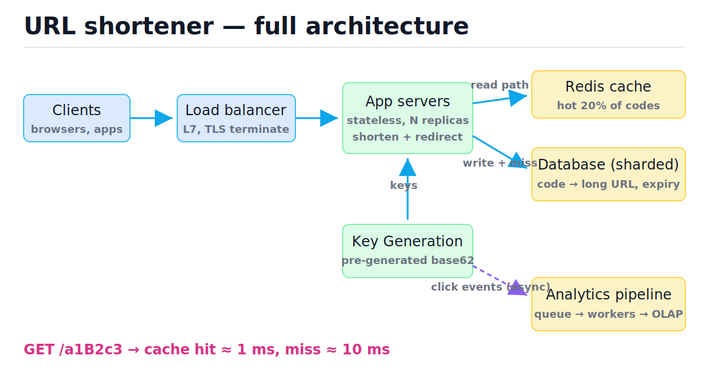
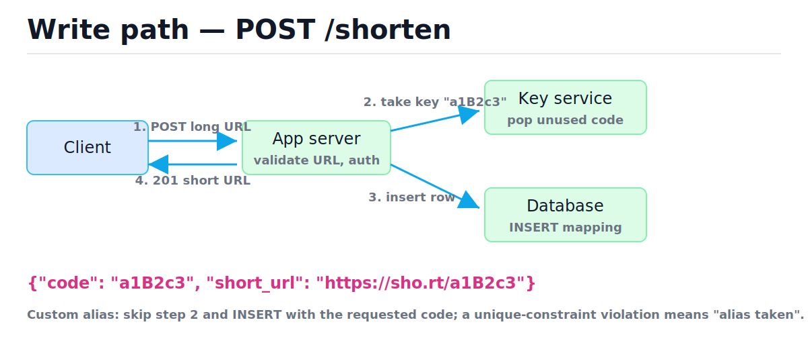
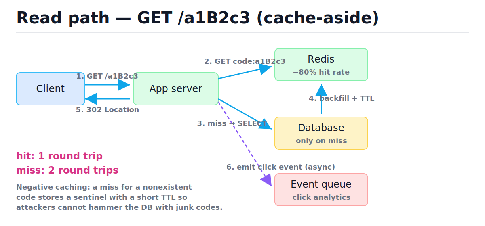

# Case Study: URL Shortener

[toc]

> **TL;DR:** A URL shortener is the canonical system-design warm-up: tiny API surface, brutal read-to-write skew, and one genuinely interesting problem — generating short, unique, unguessable codes. This note walks the full four-phase framework from [How to Approach System Design](./01-how-to-approach-system-design.md): requirements, estimation, high-level design, then deep dives into key generation, caching, and the analytics pipeline.

## Vocabulary

**Short code**

```math
c \in \{0\text{-}9, a\text{-}z, A\text{-}Z\}^{7}
```

The 7-character base62 string that identifies one long URL. 62⁷ ≈ 3.5 trillion combinations — far more than any realistic write volume needs.

**Base62 encoding**

```math
n = \sum_{i=0}^{k-1} d_i \cdot 62^{i}, \quad d_i \in [0, 61]
```

A positional number system over digits, lowercase, and uppercase letters. It turns an integer ID into a short, URL-safe string and back, losslessly, in O(log₆₂ n) time.

**Read:write ratio**

```math
\frac{\text{redirects/s}}{\text{shortens/s}} \approx 100 : 1
```

The skew that drives the whole design. A 100:1 ratio means the read path deserves a cache and the write path can stay simple.

**Cache-aside (lazy loading)**

```math
\text{hit rate} = \frac{\text{hits}}{\text{hits} + \text{misses}}
```

The pattern where the app checks the cache first, falls through to the database on miss, and backfills the cache itself. Covered in depth in [Caching Strategies](./05-caching-strategies.md).

**Negative caching**

```math
\text{cache}[c] = \varnothing \;\text{with}\; \text{TTL} \approx 60\text{s}
```

Caching the *absence* of a key. Without it, requests for nonexistent codes always miss the cache and hammer the database.

**Key Generation Service (KGS)**

```math
\text{pool} = \{c_1, c_2, \dots\}, \quad \text{take}() \to c_i \;\text{(exactly once)}
```

A service that pre-generates random unused codes offline and hands them out atomically. It trades a small extra component for zero collisions on the hot write path.

## Intuition

Think of the system as a giant distributed hash table with a public face: key = short code, value = long URL. Writes insert one entry; reads look one up and answer with an HTTP redirect. Everything else — cache, shards, queues — exists to make that lookup fast at scale and to keep the analytics out of the latency budget. The figure below shows every component we will justify piece by piece.



> [!IMPORTANT]
> The single most important design fact is the 100:1 read:write skew. State it out loud in an interview; every later decision (cache, replicas, 301 vs 302) traces back to it.

## How it works

We walk the four phases in order, exactly as [note 01](./01-how-to-approach-system-design.md) prescribes: requirements → estimation → high-level design → deep dives. The method is the lesson; the shortener is just the vehicle.

### Phase 1 — Requirements

Functional requirements are short, so nail them precisely; vague requirements produce vague designs. Non-functional requirements are where the real constraints hide.

Functional:

- **Shorten**: given a long URL, return a short one.
- **Redirect**: given a short URL, send the browser to the long one.
- **Custom alias**: user may request `sho.rt/my-launch` if free.
- **Expiry**: optional TTL per link; expired links return 410.
- **Click analytics**: per-link counts, referrers, rough geo.

Non-functional:

- **Read:write ratio** ≈ 100:1 — read-optimized system.
- **Redirect latency budget**: p99 < 50 ms server-side (the redirect sits in front of *someone else's* page load).
- **No dead links**: a shortened URL must keep working — high availability beats strong consistency here (see [Consistency Models, CAP, and Quorums](./07-consistency-models-cap-and-quorums.md)).
- Codes should not be trivially enumerable (privacy/scraping).

### Phase 2 — Back-of-the-envelope estimation

Estimation turns "big" into numbers you can buy hardware for. Use round numbers and the techniques from [Back-of-the-Envelope Estimation](./02-back-of-the-envelope-estimation.md). Assume 100 M new URLs per month.

```math
\text{writes/s} = \frac{100 \times 10^{6}}{30 \times 86{,}400} \approx \frac{10^{8}}{2.6 \times 10^{6}} \approx 40 \;\text{writes/s}
```

```math
\text{reads/s} = 100 \times 40 = 4{,}000 \;\text{reads/s} \quad (\text{peak} \approx 2\text{–}5\times \approx 10\text{–}20\text{k/s})
```

Storage: each row ≈ 500 bytes (long URL dominates; assume average 200 bytes plus indexes and overhead).

```math
\text{10-year storage} = 100\,\text{M/mo} \times 120 \,\text{mo} \times 500\,\text{B} = 1.2 \times 10^{10} \times 500\,\text{B} = 6\,\text{TB}
```

Cache for the hot 20% of *recent* links — assume the last 3 months of links absorb most traffic:

```math
\text{cache} = 0.2 \times (3 \times 10^{8}) \times 500\,\text{B} = 30\,\text{GB}
```

| Quantity | Value | Implication |
| :--- | ---: | :--- |
| Writes/s | ~40 | One primary DB handles this trivially |
| Reads/s (peak) | ~10–20 k | Needs cache + read replicas |
| 10-yr storage | ~6 TB | Fits a few shards; sharding is for QPS, not size |
| Cache size | ~30 GB | One or two Redis nodes |

> [!TIP]
> 6 TB over ten years is *small*. Say so. Interviewers reward candidates who notice the data fits on one machine and that scaling pressure comes from read QPS and availability, not volume.

### Phase 3 — API design

Two endpoints, REST-shaped, following [API Design](./09-api-design.md). Keep the write endpoint authenticated and rate-limited; keep the read endpoint anonymous and fast.

```text
POST /api/v1/urls
  body: { "long_url": "https://...", "custom_alias": null, "expires_at": null }
  201 → { "code": "a1B2c3d", "short_url": "https://sho.rt/a1B2c3d" }
  409 → custom alias already taken
  422 → invalid URL

GET /{code}
  302 → Location: <long_url>
  404 → unknown code
  410 → expired
```

**301 vs 302 — the analytics tradeoff.** A 301 (Moved Permanently) lets browsers and intermediate caches (see [DNS, Load Balancers, and CDNs](./03-dns-load-balancers-and-cdns.md)) cache the redirect: subsequent clicks never reach your servers. Great for latency and load — fatal for analytics, because you stop seeing the clicks, and you can never change or expire the mapping for that browser. A 302/307 forces every click through you. Since click analytics is a functional requirement, use **302**, and recover the lost caching with Redis on your side instead of the client's.

> [!WARNING]
> Shipping 301 "because it's semantically correct" is a classic footgun: it works, it's fast, and three weeks later the analytics dashboard flatlines and you cannot un-cache the redirects already stored in users' browsers.

### Phase 3 — Data model

One table carries the core product; a second handles raw click events before they are aggregated. This schema runs as-is on SQLite for testing; in production you would add types like `TIMESTAMPTZ` (PostgreSQL) and a partial index on `expires_at`.

```sql
CREATE TABLE urls (
    code        TEXT PRIMARY KEY,        -- 7-char base62
    long_url    TEXT NOT NULL,
    user_id     INTEGER,
    created_at  TEXT NOT NULL,
    expires_at  TEXT,                    -- NULL = never
    is_custom   INTEGER NOT NULL DEFAULT 0
);

CREATE TABLE clicks (
    id          INTEGER PRIMARY KEY,
    code        TEXT NOT NULL,
    clicked_at  TEXT NOT NULL,
    referrer    TEXT,
    country     TEXT
);
CREATE INDEX idx_clicks_code ON clicks(code);
```

The primary key on `code` gives O(log n) B-tree lookup on the only read-path query (`SELECT long_url, expires_at FROM urls WHERE code = ?`). Indexing internals live in [Indexes and Query Performance](../Relational-Databases-and-Data-Modeling/05-indexes-and-query-performance.md).

### Phase 4 deep dive — short-code generation

This is the heart of the problem: produce a 7-character code that is unique, cheap to generate, and not sequential. Three honest options, compared.

**Option A — hash and truncate.** MD5/SHA-256 the long URL, take the first 7 base62 chars. Deterministic and stateless, but truncating to 62⁷ ≈ 3.5 × 10¹² values invites birthday-problem collisions:

```math
P(\text{collision}) \approx 1 - e^{-n^{2}/(2N)}, \quad N = 62^{7} \approx 3.5 \times 10^{12}
```

```math
n = 10^{9} \Rightarrow P \approx 1 - e^{-10^{18}/(7 \times 10^{12})} \approx 1
```

At a billion URLs collisions are *certain*, so every insert needs a check-and-retry loop — a read-modify-write race under concurrency. Workable with a unique constraint and retries, but it puts collision handling on the hot path.

**Option B — global counter + base62.** Keep an auto-increment counter, encode it. Zero collisions, trivially correct. Two problems: the counter is a single point of contention/failure (mitigate with ranged allocation per server, or a coordination service — see [Distributed Locks, Leader Election, and Time](./11-distributed-locks-leader-election-and-time.md)), and the codes are **sequential** — anyone can enumerate every link you've ever shortened, which violates the non-enumerable requirement. Bijective scrambling (multiply by a constant mod 62⁷) helps but is obscurity, not security.

**Option C — pre-generated Key Generation Service.** An offline job generates random 7-char codes, checks uniqueness once at generation time, and stores them in an `unused_keys` pool. App servers atomically take a batch (e.g., 1,000 keys) into memory and hand them out with zero DB round trips per write. No collisions on the hot path, no sequential leak. Cost: one more component, and keys taken by a server that crashes are lost — acceptable, you have 3.5 trillion.

| Option | Collisions | Enumerable | Hot-path cost | Extra infra |
| :--- | :---: | :---: | :--- | :--- |
| Hash + truncate | retry loop | no | O(1) hash + retries | none |
| Counter + base62 | none | **yes** | O(1) + counter contention | counter/ZK |
| Pre-generated KGS | none | no | O(1) in-memory pop | KGS + pool table |

**Verdict:** KGS for the main flow; custom aliases bypass it (direct INSERT, unique-constraint violation = "taken").



### Base62 encode and decode

Whatever generation scheme you pick, base62 is the conversion layer between integers and codes. Encoding is repeated divmod by 62 (O(log₆₂ n)); decoding is Horner's rule (O(k) for a k-char code). This runs and is verified.

```python
ALPHABET = "0123456789abcdefghijklmnopqrstuvwxyzABCDEFGHIJKLMNOPQRSTUVWXYZ"
BASE = 62
INDEX = {ch: i for i, ch in enumerate(ALPHABET)}


def encode62(n: int) -> str:
    """Integer -> base62 string. O(log62 n) time."""
    if n < 0:
        raise ValueError("negative")
    if n == 0:
        return ALPHABET[0]
    digits = []
    while n:
        n, rem = divmod(n, BASE)
        digits.append(ALPHABET[rem])
    return "".join(reversed(digits))


def decode62(code: str) -> int:
    """Base62 string -> integer via Horner's rule. O(k) time."""
    n = 0
    for ch in code:
        n = n * BASE + INDEX[ch]   # KeyError on invalid char = validation for free
    return n


assert encode62(0) == "0"
assert encode62(61) == "Z"
assert encode62(62) == "10"
assert encode62(125) == "21"
assert decode62(encode62(123456789)) == 123456789
assert all(decode62(encode62(n)) == n for n in range(0, 5000, 7))
# 7 chars cover 62**7 - 1; capacity check:
assert len(encode62(62**7 - 1)) == 7 and len(encode62(62**7)) == 8
```

### Phase 4 deep dive — the read path

Reads dominate, so the read path gets the engineering. Cache-aside against Redis: check cache, fall through to a read replica on miss, backfill with a TTL. Expiry is enforced at read time (compare `expires_at`, return 410, optionally delete lazily) — no scanning job needed for correctness.



Trace of two requests for the same cold code:

| Step | Request | Cache state | DB hit? | Decision |
| :--- | :--- | :--- | :---: | :--- |
| 1 | GET /a1B2c3d | miss | yes | SELECT → found; backfill cache, 302 |
| 2 | GET /a1B2c3d | **hit** | no | 302 straight from Redis (~1 ms) |
| 3 | GET /zzzzzzz | miss | yes | not found; cache sentinel `∅` TTL 60 s, 404 |
| 4 | GET /zzzzzzz | hit (sentinel) | **no** | 404 from cache — DB shielded |

A runnable cache-aside model with negative caching:

```python
import sqlite3
from typing import Optional

NEG = "__MISS__"  # sentinel for negative caching


class Shortener:
    def __init__(self) -> None:
        self.db = sqlite3.connect(":memory:")
        self.db.execute(
            "CREATE TABLE urls (code TEXT PRIMARY KEY, long_url TEXT NOT NULL)"
        )
        self.cache: dict = {}        # stand-in for Redis (real one has TTLs)
        self.db_reads = 0

    def shorten(self, code: str, long_url: str) -> None:
        # KGS guarantees `code` unique; custom alias relies on the PK constraint.
        self.db.execute("INSERT INTO urls VALUES (?, ?)", (code, long_url))

    def redirect(self, code: str) -> Optional[str]:
        if code in self.cache:                       # 1. cache first
            val = self.cache[code]
            return None if val == NEG else val
        self.db_reads += 1                           # 2. miss -> DB
        row = self.db.execute(
            "SELECT long_url FROM urls WHERE code = ?", (code,)
        ).fetchone()
        self.cache[code] = row[0] if row else NEG    # 3. backfill (even misses)
        return row[0] if row else None


s = Shortener()
s.shorten("a1B2c3d", "https://example.com/launch")
assert s.redirect("a1B2c3d") == "https://example.com/launch" and s.db_reads == 1
assert s.redirect("a1B2c3d") == "https://example.com/launch" and s.db_reads == 1  # cache hit
assert s.redirect("zzzzzzz") is None and s.db_reads == 2                          # real miss
assert s.redirect("zzzzzzz") is None and s.db_reads == 2                          # negative cache
```

> [!TIP]
> Negative caching with a *short* TTL (30–60 s) is the production idiom: long enough to absorb a scraping burst, short enough that a freshly created link isn't shadowed by a stale "not found" for minutes.

### Phase 4 deep dive — scaling each tier and the bottleneck

Walk the tiers in request order and ask "what breaks first?" (the method from [Scaling Fundamentals](./04-scaling-fundamentals.md)). App servers are stateless — scale horizontally behind the load balancer. Redis at 30 GB and 20 k GET/s is comfortably one primary + replica. The database sees ~40 writes/s (trivial) and only cache-*miss* reads, roughly 20% of 20 k = 4 k reads/s — handled by 2–3 read replicas (see [Database Scaling: Replication and Sharding](../Relational-Databases-and-Data-Modeling/08-replication-failover-and-connection-pooling.md) and [note 06](./06-database-scaling-replication-and-sharding.md)).

The honest bottleneck at this scale is **none of the data tiers** — it is the *clicks* table, growing at 4 k rows/s ≈ 345 M rows/day if written synchronously. That is the deep-dive a principal picks: move analytics off the request path entirely (next section). If traffic grew 100×, shard `urls` by hash of `code` — the key is the shard key, every read is single-shard, no cross-shard queries exist. That is the easiest sharding story in all of system design; say so.

## In production

The textbook design above redirects correctly. The sections below are what separate "passes the interview" from "runs at a company" — the additions a principal engineer makes unprompted.

**Analytics as an async event pipeline.** Never write a click row synchronously inside the redirect handler; it couples your 50 ms latency budget to analytics-DB health. Emit a fire-and-forget event (code, timestamp, referrer, coarse geo) to a queue — Kafka or Kinesis — and let consumers aggregate into an OLAP store. At-least-once delivery plus idempotent aggregation is fine: nobody sues over a click counted twice. Full pattern in [Message Queues and Event-Driven Architecture](./08-message-queues-and-event-driven-architecture.md); the warehouse side is [OLAP and Dimensional Modeling](../Relational-Databases-and-Data-Modeling/10-olap-and-dimensional-modeling.md).

**Abuse prevention.** A URL shortener is a free phishing-link laundromat — this is the number-one operational reality. Mitigations: check submitted URLs against Google Safe Browsing at write time *and* periodically re-scan (pages turn malicious after shortening); rate-limit `POST /shorten` per user/IP ([Rate Limiting and Load Shedding](./10-rate-limiting-and-load-shedding.md)); show an interstitial warning page for low-reputation destinations; forbid shortening your own domain (redirect loops). See [Security in System Design](./13-security-in-system-design.md).

**Link-rot policy.** "No dead links" is a *policy*, not just uptime. Decide explicitly: links without `expires_at` live forever (storage is cheap — 6 TB/decade); expired links return 410 Gone, not 404, so clients can distinguish "never existed" from "retired"; never recycle codes — a recycled code silently rebinds old documents, emails, and printed QR codes to a new destination.

> [!CAUTION]
> Never reuse expired short codes. The code may be printed on physical media or embedded in archived emails; rebinding it is a silent integrity failure and a phishing vector (attacker waits for a popular code to expire, then claims it).

> [!NOTE]
> Hot-key skew is real: one viral link can be >1% of all traffic. Redis handles a single hot key at this QPS, but per-app-server in-process caching of the top-N codes (a few KB) removes even that, at the cost of up-to-TTL staleness — harmless for an immutable mapping.

## Complexity

Every operation in this system reduces to a hash or B-tree lookup plus constant-size network hops, which is why the design is dominated by latency budgets rather than algorithmic cost. n = total stored URLs, k = code length (7).

| Operation | Best | Average | Worst | Space |
| :--- | :---: | :---: | :---: | :---: |
| `encode62(n)` | O(1) | O(log₆₂ n) | O(log₆₂ n) | O(log₆₂ n) |
| `decode62(code)` | O(k) | O(k) | O(k) | O(1) |
| Redirect, cache hit | O(1) | O(1) | O(1) | — |
| Redirect, cache miss (B-tree PK) | O(log n) | O(log n) | O(log n) | — |
| Shorten via KGS (in-memory pop) | O(1) | O(1) | O(1) amortized | O(batch) |
| Shorten via hash+truncate | O(1) | O(1) | O(r) retries | O(1) |
| Hash-collision check (unique index) | O(log n) | O(log n) | O(log n) | O(n) index |

The key derivation is the expected retry count for hash-and-truncate. With n existing codes out of N = 62⁷ slots, an insert collides with probability n/N, and retries are geometric:

```math
E[\text{tries}] = \frac{1}{1 - n/N} \quad\Rightarrow\quad n = 10^{9},\; N = 3.5 \times 10^{12} \;\Rightarrow\; E \approx 1.0003
```

So per-insert retries stay near 1 even at a billion URLs — the birthday bound says *some* collision is certain across all inserts, but each individual insert almost never retries. The real argument against Option A is not asymptotic cost; it is the concurrency complexity of the retry loop versus KGS's O(1) pop. For B-tree lookup costs in pages rather than comparisons, see [Relational Database Internals](../Relational-Databases-and-Data-Modeling/07-relational-database-internals.md); for the notation itself, [Big-O Notation](../Data-Structures-and-Algorithms/01-big-o-notation-and-complexity-analysis.md).

## Real-world example

End-to-end mini-implementation: KGS pool, shorten with custom-alias conflict detection, expiry returning a distinct status, and the redirect path. Runs on Python 3.9 with stdlib only.

```python
import sqlite3
import time
from typing import Optional, Tuple

ALPHABET = "0123456789abcdefghijklmnopqrstuvwxyzABCDEFGHIJKLMNOPQRSTUVWXYZ"


def encode62(n: int) -> str:
    if n == 0:
        return ALPHABET[0]
    out = []
    while n:
        n, r = divmod(n, 62)
        out.append(ALPHABET[r])
    return "".join(reversed(out))


class KGS:
    """Pre-generated key pool. Real one persists keys and marks them taken."""

    def __init__(self, start: int = 62**6) -> None:  # >= 62**6 forces 7 chars
        self._next = start

    def take(self) -> str:
        code = encode62(self._next)   # demo: sequential; prod: random pre-gen
        self._next += 1
        return code


class UrlService:
    GONE = "GONE"

    def __init__(self) -> None:
        self.db = sqlite3.connect(":memory:")
        self.db.execute(
            "CREATE TABLE urls (code TEXT PRIMARY KEY, long_url TEXT NOT NULL,"
            " expires_at REAL)"
        )
        self.kgs = KGS()

    def shorten(self, long_url: str, alias: Optional[str] = None,
                ttl_s: Optional[float] = None) -> str:
        code = alias if alias is not None else self.kgs.take()
        exp = time.time() + ttl_s if ttl_s is not None else None
        try:
            self.db.execute("INSERT INTO urls VALUES (?, ?, ?)",
                            (code, long_url, exp))
        except sqlite3.IntegrityError:
            raise ValueError("alias taken: " + code)
        return code

    def resolve(self, code: str) -> Tuple[int, Optional[str]]:
        row = self.db.execute(
            "SELECT long_url, expires_at FROM urls WHERE code = ?", (code,)
        ).fetchone()
        if row is None:
            return 404, None
        if row[1] is not None and row[1] < time.time():
            return 410, None          # expired: Gone, never recycled
        return 302, row[0]


svc = UrlService()
code = svc.shorten("https://example.com/very/long/path?q=1")
assert len(code) == 7
assert svc.resolve(code) == (302, "https://example.com/very/long/path?q=1")

assert svc.shorten("https://example.com/launch", alias="launch24") == "launch24"
try:
    svc.shorten("https://evil.example/", alias="launch24")
    raise AssertionError("expected conflict")
except ValueError:
    pass

dead = svc.shorten("https://example.com/flash-sale", ttl_s=-1)  # already expired
assert svc.resolve(dead) == (410, None)
assert svc.resolve("nope999") == (404, None)
```

## When to use / When NOT to use

This case study generalizes: the same shape (tiny key → value lookup, extreme read skew) covers paste-bins, file-share links, and deep-link routers. Knowing when each piece is justified matters more than memorizing the diagram.

- **Use KGS** when codes must be non-enumerable and write volume justifies a component; **skip it** for an internal tool — counter + base62 + a scramble is fine.
- **Use 302** when you need analytics or mutable/expirable mappings; **use 301** only for truly permanent vanity domains where losing click data is acceptable.
- **Use cache-aside Redis** at >1 k reads/s; **don't** add a cache at 10 reads/s — a single PostgreSQL with the PK index serves that from buffer pool memory anyway.
- **Don't shard** until a single primary + replicas actually saturates; the estimation showed one box holds a decade of data.

## Common mistakes

- **"Use a UUID as the short code"** — a UUID is 36 characters; the entire point is *short*. Base62 over a 64-bit space gives 7–11 chars.
- **"301 is correct because the mapping is permanent"** — it kills analytics and freezes the mapping in every client cache forever; 302 is the deliberate choice here.
- **"Hash the URL so the same URL always gets the same code"** — sounds like a feature, but per-user links, expiry, and analytics all require distinct codes for the same destination. Determinism is usually an anti-requirement.
- **"Check if the random code exists, then insert"** — check-then-insert is a race. Rely on the unique constraint and handle the violation, or use KGS.
- **"Shard early because trillions of combinations"** — keyspace size ≠ data size. 62⁷ combinations, but you store only what users create: ~6 TB/decade.
- **"Delete expired rows with a cron scan"** — enforce expiry at read time (lazy); a background sweeper is an optimization for storage, not correctness.
- **"Count clicks with UPDATE ... SET count = count + 1 on redirect"** — a synchronous hot-row update serializes your hottest links; emit events to a queue instead.

## Interview questions and answers

These are the follow-ups interviewers actually ask once the basic design is on the board. Answer in the spoken register below.

**1. Why 7 characters and not 6?**
**Answer:** Capacity math. 62⁶ is about 57 billion, 62⁷ is about 3.5 trillion. At 100 million new URLs a month that's 1.2 billion a year — six characters survive about 45 years on paper, but I want the keyspace sparse so random codes rarely collide and aren't guessable; seven characters keeps occupancy under a fraction of a percent for decades.

**2. 301 or 302, and why?**
**Answer:** 302. A 301 gets cached by the browser and CDNs, so repeat clicks never hit my servers — that's free performance but it destroys click analytics, which is a stated requirement, and it makes the mapping effectively immutable in clients I don't control. I take the traffic on purpose and make it cheap with Redis.

**3. How do you guarantee uniqueness under concurrent writes?**
**Answer:** I don't check-then-insert — that's a race. Either the database's unique constraint is the arbiter and I retry on violation, or, my preference, a key generation service pre-generates unique codes offline and servers atomically take batches, so the hot path has zero uniqueness work at all.

**4. The database dies mid-write — what does the user see?**
**Answer:** The POST fails and they retry; that's fine, writes are 40 a second and not latency-sensitive. The thing I actually protect is the read path: redirects keep working off Redis and read replicas even if the primary is down, because the requirement is "no dead links," which is an availability requirement, not a consistency one.

**5. One link goes viral — 50 k requests a second for a single code. What breaks?**
**Answer:** Nothing in the database — it's one cached key. The pressure points are the single Redis shard owning that key and the analytics queue. Redis serves hundreds of thousands of GETs a second per node, so it likely holds; if not, I add a tiny in-process cache of top-N codes in each app server, since the mapping is immutable and staleness is harmless. The click events are already async, so the queue absorbs the burst.

**6. How would you shard the urls table if you had to?**
**Answer:** Hash of the short code as the shard key. Every read carries the code, so every lookup is single-shard, there are no cross-shard joins, and the hash distributes uniformly. It's the easiest sharding case there is — the harder question is operational: resharding, which consistent hashing or pre-split virtual shards handles.

**7. How do you stop the service being used for phishing?**
**Answer:** Three layers: scan destinations against a blocklist like Safe Browsing at write time, re-scan periodically because pages turn malicious after shortening, and rate-limit shorten per account and IP. For grey-area destinations, an interstitial "you are leaving sho.rt" page shifts the click decision to the user.

**8. Where does the click counter live?**
**Answer:** Nowhere on the request path. The redirect handler emits a fire-and-forget event to Kafka and answers immediately; consumers aggregate into an OLAP store, maybe minute-bucketed counters. At-least-once plus idempotent or approximately-correct aggregation is acceptable — analytics tolerates a duplicate click, redirect latency doesn't tolerate a synchronous insert.

**9. A customer's link expired and they want the same code back. Do you recycle it?**
**Answer:** Re-activating *their own* code for them is fine — it's the same mapping owner. What I never do is release expired codes into the general pool, because codes live on in printed QR codes and old emails, and rebinding one to a stranger is a silent redirect of someone else's audience — an integrity failure and a phishing vector.

## Practice path

1. Implement `encode62`/`decode62` from memory; verify round trips and that 62⁷−1 encodes to 7 chars.
2. Write the two-table schema in SQLite and the exact redirect `SELECT`; run `EXPLAIN QUERY PLAN` to confirm the PK index is used.
3. Re-derive all four estimation numbers (writes/s, reads/s, 10-yr storage, cache size) on paper in under 5 minutes.
4. Build the cache-aside `Shortener` class with negative caching; assert the DB-read counter behaves on hit/miss/negative-hit.
5. Argue 301 vs 302 out loud for 90 seconds, covering caching, analytics, and mutability.
6. Mock-interview the whole problem in 35 minutes using the four phases; then redo it changing one requirement (analytics dropped → 301 design; codes must be 5 chars → collision math changes).
7. Extend the design: links editable after creation. Trace which decisions break (client caching, in-process caches, immutability assumptions).

## Copyable takeaways

- State the 100:1 read:write skew first; it justifies the cache, the replicas, and the simple write path.
- 62⁷ ≈ 3.5 × 10¹²; 7 base62 chars cover decades; 6 TB per decade — sharding pressure is QPS, never volume here.
- Code generation: hash+truncate (collision retries), counter+base62 (enumerable, contended), KGS (preferred: O(1), collision-free, non-sequential).
- 302 over 301 because analytics is a requirement; recover the lost client caching with server-side Redis.
- Cache-aside + negative caching with short TTL shields the DB from both hot links and junk-code scans.
- Analytics is an async event pipeline — never a synchronous row write or counter UPDATE on the redirect path.
- Never recycle expired codes; expiry is enforced lazily at read time with 410.
- Principal-level extras: abuse scanning at write time and on re-scan, rate limits on shorten, explicit link-rot policy.

## Sources

- Kleppmann, *Designing Data-Intensive Applications* — ch. 1 (load parameters, read/write skew), ch. 6 (partitioning by key hash), ch. 11 (event streams for analytics).
- RFC 9110, *HTTP Semantics* — §15.4 redirect status codes (301, 302, 307, 410): https://www.rfc-editor.org/rfc/rfc9110
- RFC 9111, *HTTP Caching* — why permanent redirects are heuristically cacheable: https://www.rfc-editor.org/rfc/rfc9111
- Redis documentation — client-side caching and key eviction: https://redis.io/docs/latest/develop/
- SQLite documentation — `CREATE TABLE`, rowid and PRIMARY KEY behavior: https://sqlite.org/lang_createtable.html
- Google Safe Browsing APIs (abuse scanning): https://developers.google.com/safe-browsing

## Related

- [How to Approach System Design](./01-how-to-approach-system-design.md) — the four-phase framework this note instantiates.
- [Back-of-the-Envelope Estimation](./02-back-of-the-envelope-estimation.md) — the estimation techniques used in Phase 2.
- [Caching Strategies](./05-caching-strategies.md) — cache-aside, TTLs, and eviction in depth.
- [Message Queues and Event-Driven Architecture](./08-message-queues-and-event-driven-architecture.md) — the analytics pipeline pattern.
- [Rate Limiting and Load Shedding](./10-rate-limiting-and-load-shedding.md) — protecting the shorten endpoint.
- [Case Study: News Feed and Chat](./15-case-study-news-feed-and-chat.md) — the next case study, with fan-out instead of key-value lookup.
