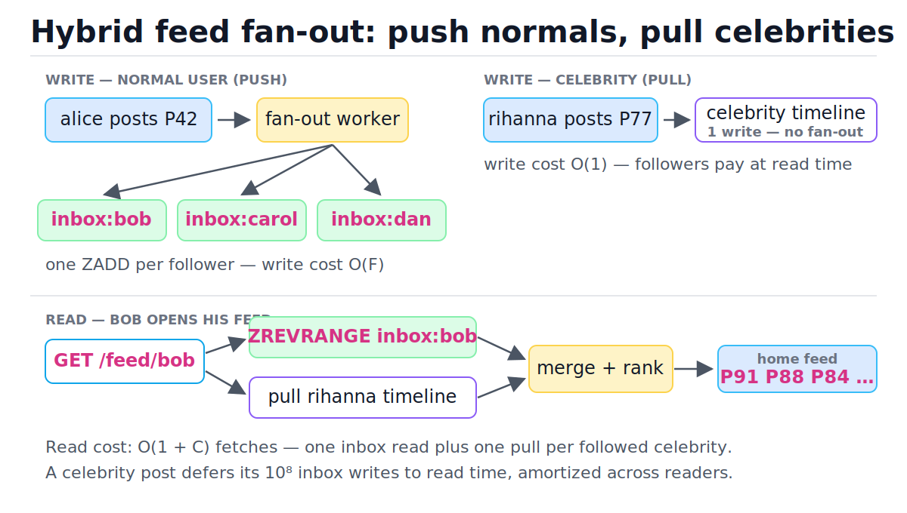
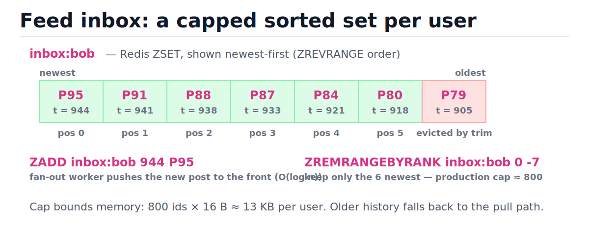
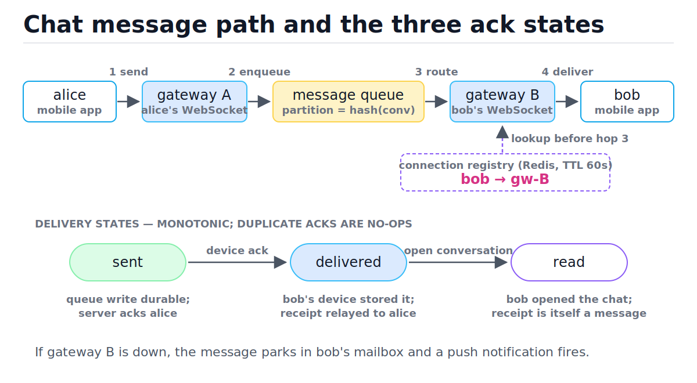

# Case Study: News Feed and Chat

[toc]

> **TL;DR:** A news feed and a chat system are both fan-out problems with opposite read/write balances. The feed is read-heavy, so production systems precompute per-user inboxes on write (push) and fall back to compute-on-read (pull) only for celebrities whose follower counts make push explode. Chat is write-then-deliver: a stateful WebSocket gateway layer, a conversation-partitioned queue, per-conversation sequence numbers for ordering, and a monotonic sent → delivered → read ack state machine.

## Vocabulary

**Fan-out**

```math
W_{\text{total}} = W_{\text{posts}} \times \bar{F}
```

The act of multiplying one event into N downstream copies — one post becomes F inbox entries, one group message becomes G deliveries. The cost is the event rate times the average fan-out factor F̄.

**Fan-out on write (push)**

```math
\text{cost}_{\text{write}} = O(F), \quad \text{cost}_{\text{read}} = O(k)
```

Precompute every follower's feed inbox at post time. Writes are expensive (one insert per follower), reads are cheap (fetch one precomputed list of k items).

**Fan-out on read (pull)**

```math
\text{cost}_{\text{write}} = O(1), \quad \text{cost}_{\text{read}} = O(N_{\text{followees}} \cdot k)
```

Store each post once; when a user opens the app, fetch recent posts from everyone they follow and merge. Writes are cheap, reads are expensive and slow for users following many accounts.

**Feed inbox**

```math
\text{inbox}_u = \{(\text{post\_id}, \text{score} = t_{\text{post}})\}
```

A per-user materialized list of post ids, sorted by time, typically a Redis sorted set capped at a few hundred entries. It is a cache of "what u should see", not the source of truth.

**Celebrity problem**

```math
F = 10^8 \Rightarrow 10^8 \text{ inbox writes per post}
```

When one author's follower count F is so large that push fan-out for a single post produces an unaffordable write storm. The hybrid fix: skip push for these authors and pull their posts at read time.

**Connection registry**

```math
\text{user\_id} \rightarrow \text{gateway\_id}
```

A shared lookup table (usually Redis) recording which stateful gateway currently holds each user's WebSocket, so any backend node can route a message to the right gateway.

**Per-conversation sequence number**

```math
\text{seq}_{c} \in \{1, 2, 3, \dots\} \text{ assigned by the partition owner of } c
```

A monotonically increasing counter per conversation c, assigned by a single writer (the queue partition that owns c). It defines message order; wall-clock timestamps do not, because clocks skew.

**Delivery state**

```math
\text{sent} \prec \text{delivered} \prec \text{read}
```

A monotonic per-message, per-recipient state machine. `sent` = server durably stored it; `delivered` = recipient device acked receipt; `read` = recipient opened the conversation.

**Presence**

```math
\text{online}(u) \iff \text{heartbeat received within TTL}
```

A best-effort "is this user online" signal implemented as a TTL'd key refreshed by client heartbeats. Expiry, not an explicit disconnect, is what marks a user offline.

## Intuition

Both systems answer the same question — "one event happened; N people must see it" — but the economics differ. A feed is read about 100× more often than it is written, so you pay at write time to make reads cheap. A chat message has exactly one (or a few) recipients and must arrive *now*, so the problem shifts from amortizing fan-out to maintaining live connections and delivery guarantees. Study the figure below first: the top half is the push path for normal users, the right side is the pull path for celebrities, and the bottom is the read-time merge.



> [!IMPORTANT]
> Neither pure push nor pure pull survives production at scale. Push dies on celebrity writes; pull dies on read latency for users following thousands of accounts. Every large feed (Twitter/X, Instagram) runs the hybrid.

## How it works — news feed

The feed has three moving parts: a write path that decides push vs pull per author, an inbox store holding precomputed feeds, and a read path that merges and ranks. We walk each.

### Pull: compute on read

The naive design stores each post exactly once in a posts table. When Bob opens the app, the feed service fetches the most recent posts from each of Bob's followees and merges them by time. It is always fresh and trivially correct, and write cost is O(1).

```sql
-- One query per feed load: fetch and merge at read time.
SELECT p.post_id, p.author_id, p.created_at
FROM posts p
JOIN follows f ON f.followee_id = p.author_id
WHERE f.follower_id = 42
ORDER BY p.created_at DESC
LIMIT 50;
```

The problem is the read cost. If Bob follows 1,000 accounts, this is a 1,000-way index merge on every app open — at p99, on a sharded posts table, that is a scatter-gather across shards (see [database sharding](./06-database-scaling-replication-and-sharding.md)). Read latency grows with followee count, and the read path is the hot path.

### Push: fan-out on write

Invert the cost. When Alice posts, a fan-out worker looks up her follower list and inserts the post id into each follower's inbox. Reads become a single fetch of a precomputed list — O(k) for a page of k items, independent of how many accounts the reader follows.

```text
on_post(alice, P42):
    followers = follow_graph.followers(alice)       # F ids
    for each f in followers:                        # O(F) writes
        ZADD inbox:{f} <timestamp> P42
        ZREMRANGEBYRANK inbox:{f} 0 -801            # cap at 800
```

The write amplification is the catch. Here is the celebrity math:

```math
\underbrace{10^8 \text{ followers}}_{F} \times \underbrace{1 \text{ post}}_{} = 10^8 \text{ inbox writes.}
\quad \text{At } 10^6 \text{ writes/s, one post takes } \frac{10^8}{10^6} = 100 \text{ s of cluster time.}
```

One Rihanna post monopolizes the fan-out fleet for minutes, delays every normal user's fan-out behind it in the queue, and writes 10⁸ entries most of which are never read (most followers are inactive). Multiply by a celebrity posting 10 times a day and pure push is dead.

> [!WARNING]
> The fan-out worker must be asynchronous (a queue consumer, see [message queues](./08-message-queues-and-event-driven-architecture.md)) — never fan out inline in the POST request. Inline fan-out makes post latency proportional to follower count, and a 2,000-follower user would wait on 2,000 Redis writes before seeing "posted".

### Hybrid: push for normals, pull for celebrities

Production systems pick per author. Authors below a follower threshold (say 10⁴–10⁵) get push. Authors above it get no fan-out at all: their posts land only in their own timeline. At read time, the feed service fetches the reader's precomputed inbox, *also* pulls the latest posts from the few celebrities the reader follows (almost everyone follows fewer than a handful), merges, and ranks.

| Step | Reader state | Decision |
| :--- | :--- | :--- |
| 1 | Bob opens app; inbox has [P95, P91, P88, ...] | Fetch inbox: one `ZREVRANGE`, O(log n + k) |
| 2 | Bob follows 2 celebrities (rihanna, ronaldo) | Pull each celebrity timeline: 2 cheap point reads |
| 3 | 50 inbox posts + 6 celebrity posts in hand | Merge by timestamp: O((k + c) log 2) with a 2-way merge |
| 4 | 56 candidate posts | Hand to ranking stage; return top 50 |

The celebrity read cost is bounded because the number of celebrities any one user follows is small, even though each celebrity's follower count is enormous. The 10⁸ writes are deferred and amortized: only followers who actually open the app pay, and each pays O(1).

### Inbox storage: capped sorted sets in Redis

The inbox is a cache, so it lives in RAM and is bounded. The standard shape is one Redis sorted set per user, scored by post timestamp, capped around 800 entries; readers paging past the cap fall back to the pull path. The figure shows one inbox after a fan-out write plus trim.



```text
ZADD inbox:bob 1718100944 P95        # O(log n) insert, scored by time
ZREVRANGE inbox:bob 0 49             # O(log n + 50) read page 1
ZREMRANGEBYRANK inbox:bob 0 -801     # trim to newest 800
```

> [!TIP]
> Store post *ids* in the inbox, never post bodies. Bodies are hydrated from a post cache at read time. This keeps inboxes ~13 KB per user (800 × 16 B), makes edits/deletes cheap (fix one row, not 10⁶ copies), and lets the post cache dedupe across all inboxes.

### Ranking as a separate stage

Fan-out decides *candidate retrieval*: which ~few hundred posts a user might see. Ranking decides *order*: a separate service scores the candidates (recency, affinity, engagement prediction) and sorts. Keeping these stages separate matters architecturally — retrieval is a storage problem with strict latency budgets; ranking is a compute/ML problem you can iterate on independently. The inbox stays time-ordered; ranking reorders at read time.

## How it works — chat

Chat flips the constraints: tiny fan-out (1 recipient, or G group members), but hard requirements on latency, ordering, and delivery tracking. The defining architectural feature is that the edge layer is *stateful*.

### The stateful gateway layer

HTTP request/response cannot push a message to a phone; the server has no way to initiate. So chat clients hold a long-lived WebSocket (an upgraded TCP connection — see [TCP](../Computer-Networking/5-tcp-and-udp.md) and the [application layer](../Computer-Networking/6-application-layer.md)) to a *gateway* server. That makes gateways stateful in a way normal web tiers are not: Bob's connection lives in the memory of exactly one gateway process.

Two consequences:

1. **Load-balancer stickiness.** A WebSocket is one TCP connection, so an L4 load balancer naturally keeps it on one gateway for its lifetime. The problem is *re*connection and routing: when the chat service has a message for Bob, it cannot send it to a random gateway behind the LB — it must reach the specific one holding Bob's socket.
2. **The user-to-gateway registry.** On connect, the gateway writes `user:bob → gw-7` into a shared registry (Redis, TTL-refreshed). Any backend node looks up the registry to route. On disconnect or crash, the entry expires and Bob is treated as offline until he reconnects.

> [!CAUTION]
> Gateway crash = thousands of simultaneous dropped connections = a reconnect storm against the remaining gateways and the auth service. Clients must reconnect with jittered exponential backoff, and gateways need connection-rate limiting (see [rate limiting and load shedding](./10-rate-limiting-and-load-shedding.md)), or one crash cascades into a fleet-wide outage.

### Message flow, end to end

Trace one message from Alice to Bob in the figure: send to gateway A, persist + enqueue in the conversation's partition, registry lookup, route to gateway B, push down Bob's socket. The bottom lane is the ack state machine the rest of this section builds.



| Step | Where the message is | Decision |
| :--- | :--- | :--- |
| 1 | Alice's device → gateway A over her WebSocket | Gateway authenticates frame, forwards to chat service |
| 2 | Chat service: assign `seq`, persist to mailbox store, enqueue | Durable now → ack `sent` back to Alice (single check) |
| 3 | Queue consumer: registry lookup `bob → ?` | Found `gw-B` → route there; not found → Bob is offline, skip to push notification |
| 4 | Gateway B pushes frame down Bob's socket | Await device ack with timeout |
| 5 | Bob's device persists locally, sends ack | Server marks `delivered`, relays receipt to Alice (double check) |
| 6 | Bob opens the conversation | Client sends read receipt → `read` (blue checks); the receipt is itself a tiny message flowing the reverse path |

### Ordering: sequence numbers, not timestamps

Two messages sent milliseconds apart from two devices must render in the same order on every participant's screen, forever. Sender timestamps cannot guarantee this: device clocks skew by seconds and even server clocks drift — the same reason distributed locks can't trust wall clocks (see [distributed locks, leader election, and time](./11-distributed-locks-leader-election-and-time.md)). The fix is a single writer per conversation: partition the message queue by `conversation_id`, so exactly one partition owner assigns `seq = 1, 2, 3, …` for that conversation. Clients sort by `seq`, detect gaps (`got 7 after 5` → fetch 6), and dedupe retries by `(conversation_id, seq)`.

```math
\text{order}(m_1, m_2) := \text{seq}(m_1) < \text{seq}(m_2), \qquad \text{never } t_{\text{client}}(m_1) < t_{\text{client}}(m_2)
```

> [!IMPORTANT]
> Ordering is per-conversation, not global. A global sequencer would serialize every message in the system through one counter — an unscalable single writer. Partitioning by conversation gives each chat a cheap local total order, which is all users can observe anyway.

### Offline delivery and push notifications

If the registry lookup finds no gateway for Bob, the message is already safe — step 2 persisted it to Bob's server-side mailbox before any delivery attempt. The chat service then fires a push notification through APNs/FCM ("Alice: hey"). On reconnect, Bob's client sends its last-seen `seq` per conversation and the server replays everything newer. Delivery state stays `sent` until the real device ack arrives — a push notification is best-effort and is *not* proof of delivery.

### Group chat: bounded fan-out

A group message is the feed problem in miniature: one send, G deliveries. The difference is that G is bounded by product policy (WhatsApp historically capped groups in the hundreds, ~1,024 today) precisely so push fan-out stays affordable. The message is stored once per conversation; fan-out happens at the delivery layer (G registry lookups + G gateway pushes), and delivery state becomes a per-recipient map — "delivered to 3 of 8". Past a few thousand members, products quietly switch the data model from "group chat" to "channel/broadcast", i.e., back to feed-style pull.

### Presence: heartbeat plus TTL

"Online" is a soft signal, so it is built on expiry rather than explicit state changes. Each client heartbeats every ~30 s over its WebSocket; the gateway refreshes `presence:bob` in Redis with a TTL of ~60 s. Crash, network drop, battery death — all converge on the same outcome: the key expires and Bob shows offline within a minute, with no cleanup code path needed.

```text
every 30s, client → gateway: PING
gateway → redis: SET presence:bob "gw-B" EX 60     # refresh TTL
is_online(bob) := EXISTS presence:bob              # O(1)
```

> [!NOTE]
> Presence *reads* fan out worse than messages: rendering Bob's 500-contact list needs 500 presence checks, and every status flip would notify 500 watchers. Production systems batch (one MGET per screen), debounce flips, and only push live presence updates for conversations currently on screen.

## Complexity

Every operation above, with n = inbox size (~800), k = page size (~50), F = author's follower count, N = reader's followee count, C = celebrities followed (~5), G = group size.

| Operation | Best | Average | Worst | Space |
| :--- | :---: | :---: | :---: | :---: |
| Pull feed read (merge N followee timelines) | O(k) | O(N·k) | O(N·k log N) | O(N·k) |
| Push fan-out per post | O(F log n) | O(F log n) | O(F log n) | O(F) inbox entries |
| Hybrid feed read (inbox + C pulls + merge) | O(log n + k) | O(log n + k + C·k) | O((k + C·k) log C) | O(k + C·k) |
| Inbox insert (`ZADD`) + trim | O(log n) | O(log n) | O(log n + evicted) | O(n) per user |
| Inbox page read (`ZREVRANGE`) | O(log n + k) | O(log n + k) | O(log n + k) | O(k) |
| Chat send (persist + seq + route) | O(1) | O(1) | O(1) + retry | O(1) per message |
| Registry lookup / presence check | O(1) | O(1) | O(1) | O(active users) |
| Group send | O(G) | O(G) | O(G) | O(G) delivery states |
| Reconnect replay (gap fill from seq s) | O(1) | O(missed) | O(missed) | O(missed) |

The key bound is the hybrid's read cost versus pure pull. With N followees, C of them celebrities (C ≪ N):

```math
\text{pull read} = O(N \cdot k) \quad \xrightarrow{\text{hybrid}} \quad
\underbrace{O(\log n + k)}_{\text{one inbox fetch}} + \underbrace{O(C \cdot k)}_{\text{celebrity pulls}}
\approx O(k) \text{ since } C \le 5 \text{ for almost all users}
```

Why it works: the hybrid replaces a per-read cost proportional to *followees* (unbounded, user-controlled, often 10³) with one proportional to *celebrities followed* (tiny by distribution). Meanwhile write cost is capped at threshold × posts, because authors above the threshold do zero fan-out. Each side of the cost is bounded by the side of the graph that is naturally small.

## In production

The clean diagrams above hide where these systems actually hurt. The feed inbox tier is a RAM budget problem: 500 M users × 13 KB ≈ 6.5 TB of Redis, sharded by user id, and a single fan-out worker bug that forgets the trim turns it into an OOM cascade. Fan-out queues need per-author concurrency limits so a burst from one author can't starve the queue (head-of-line blocking). Inbox writes are fire-and-forget into a cache — if a `ZADD` is lost, the post is still in the source-of-truth store and the pull fallback covers it, which is why inboxes can be Redis and not a database.

On the chat side, the gateway fleet is the operational center of gravity. Each gateway holds ~100 k–1 M sockets (file descriptors and per-connection buffers are the limits, not CPU), so deploys must drain: stop accepting, push a `reconnect` frame, let clients migrate with jitter, then kill the process. The registry must have a TTL *shorter* than your tolerance for routing to a dead gateway; routing failures fall back to mailbox + push notification, so the failure mode is "message arrives 5 s late via APNs," not "message lost." Delivery is at-least-once end to end — the device-side dedupe on `(conversation_id, seq)` is what makes it look exactly-once to users. And both systems live or die on the observability basics: fan-out queue lag, inbox hit rate, gateway connection churn, and ack-latency histograms (see [reliability and observability](./12-reliability-and-observability.md)).

> [!TIP]
> Estimate before designing (the [back-of-the-envelope](./02-back-of-the-envelope-estimation.md) habit): 500 M DAU × 2 feed loads/day ≈ 12 k feed reads/s average, ~35 k peak; 100 M posts/day × 200 avg followers = 2 × 10¹⁰ inbox writes/day ≈ 230 k writes/s. The write number is why fan-out workers are a fleet, not a thread.

## Real-world example: fan-out cost simulator

The cheapest way to internalize push vs pull vs hybrid is to price them. This simulator models a day of traffic on a small social graph and counts storage operations for each strategy — the same arithmetic you would do on a whiteboard, executable. The asserts pin the crossover behavior: push wins on read cost, pull wins on celebrity write cost, hybrid takes the best of both.

```python
from typing import Dict, List, Tuple

CELEB_THRESHOLD = 10_000  # followers above this -> pull path


def pull_costs(posts: List[Tuple[str, int]], reads: List[Tuple[str, int]],
               followers: Dict[str, int]) -> Tuple[int, int]:
    """Fan-out on read: O(1) per write, O(followees) fetches per read."""
    write_ops = len(posts)                              # store each post once
    read_ops = sum(n_followees for _, n_followees in reads)
    return write_ops, read_ops


def push_costs(posts: List[Tuple[str, int]], reads: List[Tuple[str, int]],
               followers: Dict[str, int]) -> Tuple[int, int]:
    """Fan-out on write: O(F) inbox inserts per post, O(1) fetch per read."""
    write_ops = sum(followers[author] for author, _ in posts)
    read_ops = len(reads)                               # one inbox fetch each
    return write_ops, read_ops


def hybrid_costs(posts: List[Tuple[str, int]], reads: List[Tuple[str, int]],
                 followers: Dict[str, int]) -> Tuple[int, int]:
    """Push for normal authors, pull celebrities at read time."""
    write_ops = sum(followers[a] if followers[a] <= CELEB_THRESHOLD else 1
                    for a, _ in posts)
    read_ops = sum(1 + n_celebs for _, n_celebs in reads)
    return write_ops, read_ops


# One simulated day: 3 normal posts, 1 celebrity post, 1M feed reads.
followers = {"alice": 2_000, "bob": 500, "carol": 8_000,
             "rihanna": 100_000_000}
posts = [("alice", 0), ("bob", 0), ("carol", 0), ("rihanna", 0)]
# reads: (user, followee_count) for pull; (user, celebs_followed) for hybrid
reads_pull = [("u", 1_000)] * 1_000_000     # avg user follows 1,000 accounts
reads_hyb = [("u", 2)] * 1_000_000          # but only ~2 celebrities

pull_w, pull_r = pull_costs(posts, reads_pull, followers)
push_w, push_r = push_costs(posts, reads_pull, followers)
hyb_w, hyb_r = hybrid_costs(posts, reads_hyb, followers)

# Pull: trivial writes, brutal reads.
assert pull_w == 4
assert pull_r == 1_000_000_000              # 10^9 timeline fetches/day

# Push: trivial reads, but rihanna alone forces 10^8 inbox writes.
assert push_w == 100_000_000 + 2_000 + 500 + 8_000
assert push_r == 1_000_000

# Hybrid: rihanna's post costs 1 write; reads cost 1 inbox + 2 celeb pulls.
assert hyb_w == 2_000 + 500 + 8_000 + 1     # 10,501 writes total
assert hyb_r == 3_000_000

# The pitch in two inequalities:
assert hyb_w < push_w // 9_000              # ~10^4x fewer writes than push
assert hyb_r < pull_r // 300                # ~300x fewer reads than pull
print(f"pull  w={pull_w:>12,} r={pull_r:>13,}")
print(f"push  w={push_w:>12,} r={push_r:>13,}")
print(f"hybrid w={hyb_w:>11,} r={hyb_r:>13,}")
```

And a minimal model of chat ordering and ack state, showing why the per-conversation sequencer and monotonic state machine are both small amounts of code:

```python
from typing import Dict, Tuple

STATES = {"sent": 0, "delivered": 1, "read": 2}


class Conversation:
    """Single-writer sequencer: the partition owner for one conversation."""

    def __init__(self) -> None:
        self.next_seq = 1
        self.state: Dict[Tuple[int, str], str] = {}  # (seq, recipient) -> state

    def send(self, recipient: str) -> int:
        seq = self.next_seq
        self.next_seq += 1
        self.state[(seq, recipient)] = "sent"        # durable before any ack
        return seq

    def ack(self, seq: int, recipient: str, new: str) -> str:
        cur = self.state[(seq, recipient)]
        if STATES[new] > STATES[cur]:                # monotonic: never regress
            self.state[(seq, recipient)] = new
        return self.state[(seq, recipient)]


conv = Conversation()
s1 = conv.send("bob")
s2 = conv.send("bob")
assert (s1, s2) == (1, 2)                 # order from the sequencer, not clocks

assert conv.ack(s1, "bob", "delivered") == "delivered"
assert conv.ack(s1, "bob", "read") == "read"
# Late/duplicate 'delivered' ack arrives after 'read': must NOT regress.
assert conv.ack(s1, "bob", "delivered") == "read"
# s2 still undelivered: bob's device hasn't acked it.
assert conv.state[(s2, "bob")] == "sent"
```

## When to use / When NOT to use

These two case studies are templates; knowing when each pattern applies is the transferable skill.

- **Push (fan-out on write)** — read-heavy timelines, bounded fan-out, freshness-tolerant by seconds. Use when reads outnumber writes ~100:1 and the biggest fan-out factor is affordable.
- **Pull (fan-out on read)** — write-heavy or rarely-read data, unbounded fan-out, strict freshness. Use for search results, analytics dashboards, and the celebrity arm of a hybrid.
- **Hybrid** — any social feed at scale; the threshold knob is yours to tune.
- **WebSocket gateways** — when the server must initiate (chat, live notifications, collaborative editing, multiplayer). Do **not** reach for WebSockets when polling every 30–60 s is acceptable (badge counts, dashboards) — stateful connection fleets cost real operational effort.
- **Per-entity sequence numbers** — whenever a stream needs a stable order that users can observe. Do **not** use timestamps for ordering anything users compare side-by-side.

## Common mistakes

- **"Push is just better because reads are O(1)"** — push trades read cost for write amplification; a single 10⁸-follower author breaks it. Cost both sides before choosing.
- **"Fan out synchronously in the post request"** — post latency becomes proportional to follower count. Fan-out is always an async queue consumer.
- **"Store post bodies in inboxes"** — multiplies storage by average fan-out and makes edits/deletes touch millions of copies. Store ids; hydrate from a post cache.
- **"Order chat messages by timestamp"** — client clocks skew by seconds, servers by milliseconds; interleaved messages flip order across devices. Use per-conversation sequence numbers from a single writer.
- **"A push notification means the message was delivered"** — APNs/FCM are best-effort. Only the device's explicit ack moves state to `delivered`.
- **"The LB will handle gateway routing"** — the LB picks a gateway at *connect* time; backend-initiated delivery needs the user→gateway registry. These are different routing problems.
- **"Mark users offline on disconnect events"** — crashes and dead radios never send disconnect. Presence must be TTL-expiry based; explicit disconnects are just an optimization.
- **"Group chat scales like 1:1 chat"** — every send is O(G) deliveries and O(G) ack states. Group size caps are an architectural decision, not a product whim.

## Interview questions and answers

The feed/chat pair is the most common system-design interview, because it tests fan-out reasoning, stateful services, and ordering in one sitting.

1. **Design a news feed. Push or pull?** **Answer:** I'd start by stating the read/write ratio — feeds are read-heavy, maybe 100:1 — which argues for push: precompute per-user inboxes at write time so reads are one cheap fetch. Then I'd immediately raise the celebrity problem: a 100M-follower author makes one post cost 10⁸ inbox writes, so pure push dies. Production answer is hybrid — push for authors under a follower threshold, pull celebrities at read time, merge the two lists when the user opens the app.

2. **Walk me through the celebrity math.** **Answer:** Say the threshold question is one post from a 100M-follower account. Push means 10⁸ inbox inserts; at a million writes per second of cluster capacity that's 100 seconds of the whole fleet for one post — and most of those inboxes belong to inactive users who'll never read it. Pull defers the cost: only the followers who actually open the app pay, and each pays a couple of point reads. The work is amortized across readers instead of paid up front.

3. **Where does ranking fit in your feed design?** **Answer:** As a separate stage after retrieval. Fan-out and inboxes solve candidate retrieval — get ~500 plausible posts cheaply. Ranking is a scoring service that reorders those candidates with ML features. Keeping them separate means the storage tier has a stable contract while the ranking team iterates weekly without touching fan-out.

4. **Why are chat gateways stateful, and what does that cost you?** **Answer:** A WebSocket is a long-lived TCP connection that lives in one process's memory — that's what lets the server push. The costs: you need a user-to-gateway registry so backends can route to the right box, deploys have to drain connections instead of just rolling, and a gateway crash drops every socket on it at once, so clients need jittered backoff to avoid a reconnect storm.

5. **How do you guarantee message ordering in a conversation?** **Answer:** Per-conversation sequence numbers from a single writer — I partition the message queue by conversation id, so one partition owner assigns seq 1, 2, 3 for that conversation. Clients sort by seq, detect gaps, and dedupe retries by (conversation, seq). I explicitly would not use timestamps: device clocks skew by seconds, and even servers drift, so two messages sent close together would render in different orders on different phones.

6. **What exactly do the one, two, and blue check marks mean?** **Answer:** They're a monotonic state machine per message per recipient. One check, `sent`: the server durably stored the message — recipient may be offline. Two checks, `delivered`: the recipient's device acked actual receipt. Blue, `read`: they opened the conversation, and that read receipt is itself a tiny message flowing back. The transitions only go forward — a late duplicate `delivered` ack after `read` is a no-op.

7. **The recipient is offline. What happens to the message?** **Answer:** Nothing special has to happen, because the message was persisted to a server-side mailbox before any delivery attempt — durability isn't conditional on the recipient being reachable. The registry lookup fails, so we fire a push notification through APNs/FCM as a best-effort wake-up. On reconnect the client reports its last-seen seq per conversation and the server replays the gap. State stays `sent` until the device truly acks.

8. **How would you build presence for 500M users?** **Answer:** Heartbeat plus TTL. Clients ping over their existing WebSocket every 30 seconds; the gateway refreshes a Redis key with a 60-second TTL. Crashes, dead radios, and clean disconnects all converge on key expiry — no cleanup path needed. The trap is the read side: a 500-contact list is 500 lookups, and a popular user's status flip could notify thousands of watchers, so I'd batch reads per screen and only push live updates for visible conversations.

9. **You've designed both. What's the unifying idea?** **Answer:** Both are fan-out problems with opposite balances. The feed has huge fan-out and relaxed latency, so the design is about *when* to multiply the event — write time, read time, or a hybrid split by author size. Chat has tiny fan-out but hard latency and ordering needs, so the design is about *connection state and delivery guarantees* — gateways, registries, sequence numbers, ack states. Same question, "N people must see one event," answered from opposite ends of the read/write spectrum.

## Practice path

1. Re-derive the celebrity math from scratch: pick F = 10⁸, a cluster write budget, and compute fan-out time per post. Then compute the hybrid's read overhead for a user following 3 celebrities.
2. Run the cost simulator above; change `CELEB_THRESHOLD` to 1,000 and to 10⁶ and explain how each shift moves cost between the write and read columns.
3. Sketch the full hybrid feed on paper without looking: write path, inbox tier, read-time merge, ranking stage. Compare against the first figure.
4. Extend the `Conversation` class: add `replay(last_seen_seq)` returning all newer messages, and a gap-detection check on the client side. Assert both.
5. Design group-chat delivery state: change the state map to per-recipient and write the "delivered to k of G" aggregation. Decide what `read` means for a group.
6. Whiteboard the gateway-crash timeline: what the client does, what the registry shows at each second, where a message sent mid-crash ends up. Verify it's never lost.
7. Do the estimation drill: 500 M DAU, 100 M posts/day, 200 average followers — compute inbox writes/s, Redis RAM for inboxes, and gateway count at 500 k sockets each.

## Copyable takeaways

- Feed and chat are the same problem — one event, N viewers — at opposite read/write balances; cost both sides before picking push or pull.
- Pure push dies on celebrity write amplification (10⁸ writes/post); pure pull dies on read latency (O(followees) per load). Production runs the hybrid split by author follower count.
- Feed inboxes are capped Redis sorted sets of post *ids* (~800 entries, ~13 KB/user); they're caches — the posts store remains the source of truth and the pull path is the fallback.
- Fan-out is always async; ranking is always a separate stage after retrieval.
- Chat gateways are stateful: WebSocket per user, user→gateway registry in Redis with TTL, drain-on-deploy, jittered reconnect backoff.
- Order chat by per-conversation sequence numbers from a single partition owner — never by timestamps.
- Delivery state (sent → delivered → read) is monotonic per message per recipient; persist before delivering, so offline recipients cost nothing extra.
- Presence = heartbeat + TTL expiry; group chat = bounded fan-out with a deliberate size cap.

## Sources

- Kleppmann, *Designing Data-Intensive Applications*, Ch. 1 (the Twitter timeline push/pull example) and Ch. 11 (stream processing, ordering).
- Twitter Engineering, "Timelines at Scale" (Raffi Krikorian, QCon 2012) — the canonical hybrid fan-out talk.
- RFC 6455 — The WebSocket Protocol.
- Redis documentation: sorted set command complexity (`ZADD`, `ZREVRANGE`, `ZREMRANGEBYRANK`) — redis.io/docs/latest/commands/.
- WhatsApp Engineering / Erlang talks on million-connection gateways (Rick Reed, "Scaling to Millions of Simultaneous Connections," Erlang Factory 2012).
- Facebook Engineering, "Iris" (messaging queue ordering) and TAO (social graph reads).

## Related

- [How to approach system design](./01-how-to-approach-system-design.md) — the framework this case study instantiates.
- [Back-of-the-envelope estimation](./02-back-of-the-envelope-estimation.md) — the fan-out math drill.
- [Caching strategies](./05-caching-strategies.md) — the feed inbox is a materialized cache.
- [Database scaling, replication, and sharding](./06-database-scaling-replication-and-sharding.md) — partitioning by conversation id.
- [Message queues and event-driven architecture](./08-message-queues-and-event-driven-architecture.md) — async fan-out workers and partition ordering.
- [Distributed locks, leader election, and time](./11-distributed-locks-leader-election-and-time.md) — why timestamps can't order messages.
